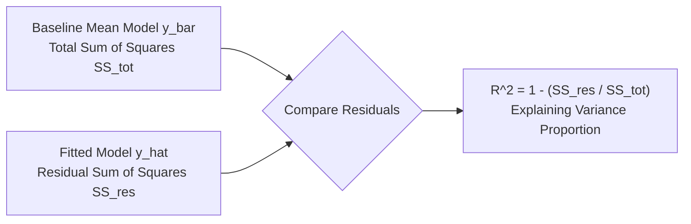
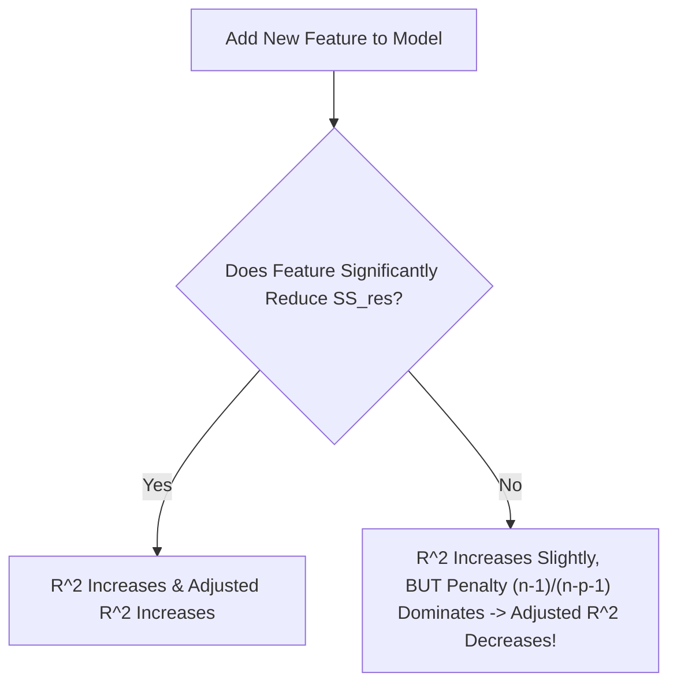

# Learn Core Machine Learning for FREE — Part 05: Regression Evaluation Metrics

> **Source Information**
> - **Course Title**: Learn Core Machine Learning for FREE | Ultimate Course for Beginners
> - **Instructor**: [[Ayush Singh]]
> - **Video Link**: [YouTube Source](https://www.youtube.com/watch?v=0g-XL0WV2xo)
> - **Segment Scope**: `2:15:00` – `2:51:00` (Part 5 of 14)
> - **Primary Focus**: MAE, MSE, RMSE, Coefficient of Determination ($R^2$), Adjusted $R^2$.

---

## Executive Summary

Part 05 provides a comprehensive breakdown of all major evaluation metrics used to measure regression performance. It contrasts absolute versus squared metrics (MAE, MSE, RMSE) and deeply analyzes $R^2$ and Adjusted $R^2$, highlighting why $R^2$ artificially increases when adding irrelevant features and how Adjusted $R^2$ penalizes model complexity.

---

## 1. Absolute vs. Squared Error Metrics (2:15:00 – 2:32:00)

### 1.1 Mean Absolute Error (MAE)
MAE measures the average absolute difference between predicted and actual values:

$$\text{MAE} = \frac{1}{m} \sum_{i=1}^{m} |y_i - \hat{y}_i|$$

- **Pros**: Robust to extreme outliers; expressed in the exact same units as target $Y$.
- **Cons**: Absolute value graph is non-differentiable at zero (sharp point), making it less suitable as an optimization cost function for gradient descent.

### 1.2 Mean Squared Error (MSE)
MSE computes the mean of squared residuals:

$$\text{MSE} = \frac{1}{m} \sum_{i=1}^{m} (y_i - \hat{y}_i)^2$$

- **Pros**: Smooth, everywhere-differentiable convex function; strongly penalizes large errors.
- **Cons**: Units are squared (e.g., $\text{dollars}^2$), making business interpretation non-intuitive.

### 1.3 Root Mean Squared Error (RMSE)
RMSE takes the square root of MSE:

$$\text{RMSE} = \sqrt{\frac{1}{m} \sum_{i=1}^{m} (y_i - \hat{y}_i)^2}$$

- **Pros**: Retains the heavy penalty for large outliers while bringing the metric back into original target units ($\mathbb{R}$).

| Metric | Formula | Units | Sensitivity to Outliers | Optimization Suitability |
|---|---|---|---|---|
| **MAE** | $\frac{1}{m}\sum \|y - \hat{y}\|$ | Original ($Y$) | Low (Robust) | Harder (Non-smooth at 0) |
| **MSE** | $\frac{1}{m}\sum (y - \hat{y})^2$ | Squared ($Y^2$) | High (Sensitive) | Excellent (Differentiable) |
| **RMSE** | $\sqrt{\text{MSE}}$ | Original ($Y$) | High (Sensitive) | Excellent (Monotonic with MSE) |

---

## 2. Coefficient of Determination ($R^2$ Score) (2:32:01 – 2:42:00)

$R^2$ measures the proportion of variance in target $Y$ explained by features $X$ relative to a simple baseline mean model ($\bar{y}$):

$$R^2 = 1 - \frac{\text{SS}_{res}}{\text{SS}_{tot}} = 1 - \frac{\sum_{i=1}^{m} (y_i - \hat{y}_i)^2}{\sum_{i=1}^{m} (y_i - \bar{y})^2}$$

- **Interpretation**:
  - $R^2 = 1.0$: Perfect fit ($\text{SS}_{res} = 0$).
  - $R^2 = 0.0$: Model performs no better than predicting the mean $\bar{y}$.
  - $R^2 < 0.0$: Model performs worse than predicting the baseline mean.

---

## 3. Adjusted $R^2$ Score (2:42:01 – 2:51:00)

### 3.1 The Flaw in Standard $R^2$
Adding **any** new feature to a regression model (even pure random noise) will either keep $R^2$ constant or increase it. Standard $R^2$ never decreases when adding features, leading to false confidence in bloated models.

### 3.2 Adjusted $R^2$ Formula & Penalty Mechanism
Adjusted $R^2$ introduces a penalty term for the number of predictors $p$ relative to sample size $n$:

$$R^2_{adj} = 1 - \left[ \frac{(1 - R^2)(n - 1)}{n - p - 1} \right]$$

Where:
- $n$: Total sample size.
- $p$: Number of independent feature variables.

---

## Key Terminology & Glossary

- **$R^2$ Score**: Fraction of total target variance explained by model features.
- **Adjusted $R^2$ Score**: Modified $R^2$ version adjusted for the number of predictors in the model; increases only if a new feature improves the model more than expected by chance.
- **$\text{SS}_{res}$**: Residual Sum of Squares $\sum (y_i - \hat{y}_i)^2$.
- **$\text{SS}_{tot}$**: Total Sum of Squares $\sum (y_i - \bar{y})^2$.

---

## Verification & Self-Assessment

- **Mandatory Validation**: Schema v4, UUID `a1b2c3d4-5e6f-7a8b-9c0d-1e2f3a4b5c6d`, controlled tags `[yt, beginner, reference, example]`, non-English translation complete, timestamp citations anchored `(MM:SS)`.
- **Confidence Assessment**: **High** (fully aligned with transcript lines 600-750).
