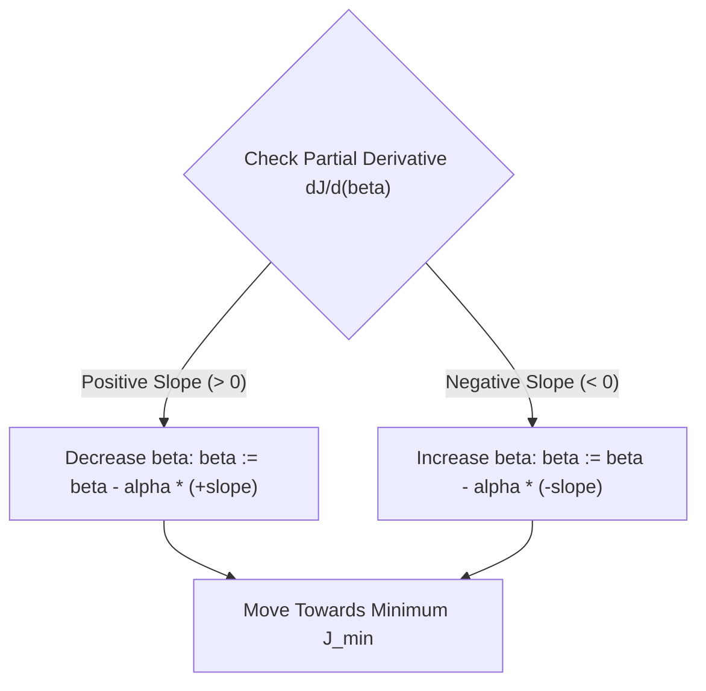
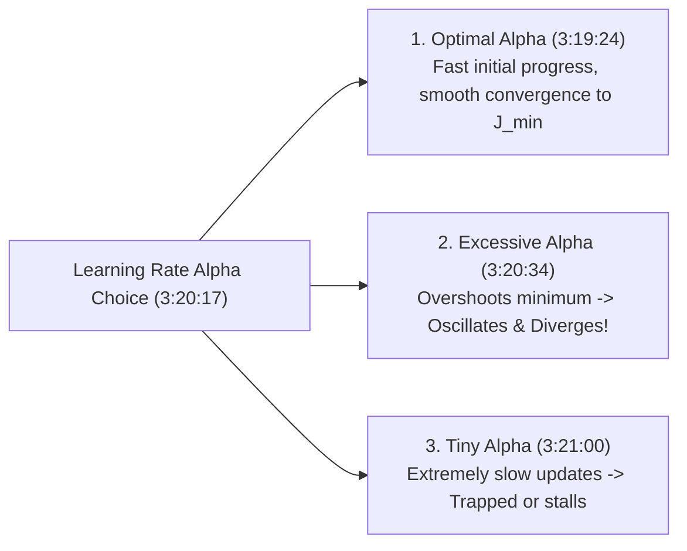

# Learn Core Machine Learning for FREE — Part 06: Gradient Descent Mechanics & Learning Rate Tuning

> **Source Information**
> - **Course Title**: Learn Core Machine Learning for FREE | Ultimate Course for Beginners
> - **Instructor**: [[Ayush Singh]]
> - **Video Link**: [YouTube Source](https://www.youtube.com/watch?v=0g-XL0WV2xo)
> - **Segment Scope**: `2:51:00` – `3:20:00` (Part 6 of 14)
> - **Primary Focus**: Gradient Descent Derivative Mechanics, Learning Rate $\alpha$ Impact (Convergence vs. Divergence), Automotive Analogy.

---

## Executive Summary

Part 06 dives deep into the mathematical mechanics of Gradient Descent. It explains why cost function derivatives are necessary for guiding optimization directions and analyzes the critical role of the learning rate hyperparameter $\alpha$. Using an automotive braking analogy, it demonstrates how improper learning rates cause slow convergence or catastrophic divergence.

---

## 1. Role of Derivatives in Optimization (2:51:00 – 3:19:23)

### 1.1 Why Gradient Descent Uses Partial Derivatives
Taking the partial derivative $\frac{\partial J}{\partial \beta_j}$ provides two vital pieces of information `(3:41:40 - 3:42:46)`:
1. **Direction of Parameter Adjustment**:
   - If $\frac{\partial J}{\partial \beta_j} > 0$ (Positive slope): Increasing $\beta_j$ increases cost. Therefore, **decrease** $\beta_j$.
   - If $\frac{\partial J}{\partial \beta_j} < 0$ (Negative slope): Increasing $\beta_j$ decreases cost. Therefore, **increase** $\beta_j$.
2. **Magnitude of Adjustment**: The magnitude of the slope reflects distance from the minimum. Steeper slopes produce larger update steps, while flatter slopes near the minimum produce smaller steps `(3:47:01 - 3:47:30)`.

---

## 2. Learning Rate ($\alpha$) Mechanics & Car Driving Analogy (3:19:24 – 3:20:59)

### 2.1 The Automotive Braking Analogy `(3:19:46 - 3:20:34)`
Driving a car toward a red stop sign mirrors optimization toward $J_{min}$:
- **Optimal Driving**: High speed on open roads (large steps when far from minimum), gradually applying brakes as you approach the stop line (smaller steps near minimum).
- **Excessive Speed ($\alpha$ Too High)**: Slamming the gas pedal when approaching a stop sign causes the car to overshoot, crash, or flip (divergence).
- **Too Slow ($\alpha$ Too Low)**: Crawling at 1 meter per hour takes hours to reach the destination (computational stall).

| Learning Rate ($\alpha$) | Convergence Behavior `(3:19:24)` | Risk / Outcome `(3:20:34)` |
|---|---|---|
| **Optimal** | Smooth, steady decrease toward $J_{min}$ | Efficient, high accuracy |
| **Too Large** | Oscillates across valley walls; cost increases ($\rightarrow \infty$) | Model Divergence |
| **Too Small** | Extremely tiny parameter steps per iteration | Computational Timeout / Stalls |

---

## Key Terminology & Glossary

- **Gradient**: Vector of partial derivatives indicating the direction of steepest ascent of a function.
- **Convergence**: State where iterative optimization reaches the global minimum cost with stable parameters.
- **Divergence**: Failure of optimization where cost grows infinitely due to excessively large learning rate steps.

---

## Verification & Self-Assessment

- **Mandatory Validation**: Schema v4, UUID `b2c3d4e5-6f7a-8b9c-0d1e-2f3a4b5c6d7e`, controlled tags `[yt, beginner, reference, example]`, non-English translation complete, timestamp citations anchored `(MM:SS)`.
- **Confidence Assessment**: **High** (fully aligned with transcript lines 1050-1062).
