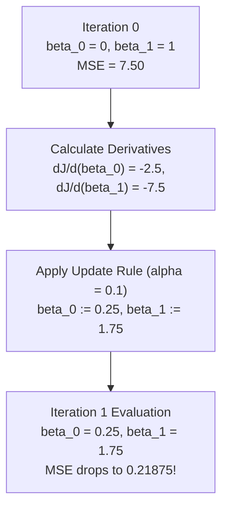

# Learn Core Machine Learning for FREE — Part 07: Gradient Descent Hand Derivation & Worked Example

> **Source Information**
> - **Course Title**: Learn Core Machine Learning for FREE | Ultimate Course for Beginners
> - **Instructor**: [[Ayush Singh]]
> - **Video Link**: [YouTube Source](https://www.youtube.com/watch?v=0g-XL0WV2xo)
> - **Segment Scope**: `3:21:00` – `3:48:00` (Part 7 of 14)
> - **Primary Focus**: Step-by-Step Calculus Chain Rule Proof for $\frac{\partial J}{\partial \beta_0}$ and $\frac{\partial J}{\partial \beta_1}$, End-to-End Hand-Calculated Iteration 1 & Iteration 2 Numerical Example.

---

## Executive Summary

Part 07 provides a rigorous calculus derivation of gradient components for Linear Regression using the chain rule. It complements theoretical proofs with an end-to-end hand-calculated numerical example across 4 data points, proving step-by-step how initial parameters $(\beta_0^{(0)}=0, \beta_1^{(0)}=1)$ with $\text{MSE}=7.5$ update to $(\beta_0^{(1)}=0.25, \beta_1^{(1)}=1.75)$ and continue to decrease error in subsequent iterations.

---

## 1. Calculus Derivation via Chain Rule (3:27:11 – 3:34:25)

Given the cost function:

$$J(\beta_0, \beta_1) = \frac{1}{2m} \sum_{i=1}^{m} \left( (\beta_0 + \beta_1 x_i) - y_i \right)^2$$

### 1.1 Partial Derivative with respect to Intercept ($\beta_0$) `(3:28:39 - 3:33:09)`
Applying the chain rule $\frac{d}{dx}[u(x)^2] = 2 u(x) \cdot u'(x)$:

$$\frac{\partial J}{\partial \beta_0} = \frac{1}{2m} \sum_{i=1}^{m} 2 \left( (\beta_0 + \beta_1 x_i) - y_i \right) \cdot \frac{\partial}{\partial \beta_0} (\beta_0 + \beta_1 x_i - y_i)$$

Since $\frac{\partial}{\partial \beta_0} (\beta_0 + \beta_1 x_i - y_i) = 1$:

$$\frac{\partial J}{\partial \beta_0} = \frac{1}{m} \sum_{i=1}^{m} (\hat{y}_i - y_i)$$

### 1.2 Partial Derivative with respect to Slope ($\beta_1$) `(3:33:25 - 3:34:22)`
Similarly, since $\frac{\partial}{\partial \beta_1} (\beta_0 + \beta_1 x_i - y_i) = x_i$:

$$\frac{\partial J}{\partial \beta_1} = \frac{1}{m} \sum_{i=1}^{m} (\hat{y}_i - y_i) \cdot x_i$$

---

## 2. Hand-Calculated Worked Example: Iteration 1 & 2 (3:21:47 – 3:39:36)

### 2.1 Sample Dataset ($m=4$) `(3:22:16)`

| Sample $i$ | Feature $X_i$ | True Target $Y_i$ | Init Pred $\hat{y}_i^{(0)} = 0 + 1 \cdot X_i$ `(3:24:51)` | Error $(\hat{y}_i^{(0)} - Y_i)$ |
|---|---|---|---|---|
| **1** | $1$ | $2$ | $1$ | $-1$ |
| **2** | $2$ | $4$ | $2$ | $-2$ |
| **3** | $3$ | $6$ | $3$ | $-3$ |
| **4** | $4$ | $8$ | $4$ | $-4$ |

### 2.2 Iteration 0 Initial State `(3:26:50)`
Initial setup: $\beta_0^{(0)} = 0$, $\beta_1^{(0)} = 1$, $\alpha = 0.1$.

$$\text{MSE}^{(0)} = \frac{1}{4} [ (-1)^2 + (-2)^2 + (-3)^2 + (-4)^2 ] = \frac{1 + 4 + 9 + 16}{4} = \frac{30}{4} = 7.5$$

### 2.3 Iteration 1 Gradients & Updates `(3:35:23 - 3:37:37)`

1. **Gradient for Intercept $\beta_0$**:
   $$\frac{\partial J}{\partial \beta_0} = \frac{1}{4} [ (-1) + (-2) + (-3) + (-4) ] = \frac{-10}{4} = -2.5$$

2. **Gradient for Slope $\beta_1$**:
   $$\frac{\partial J}{\partial \beta_1} = \frac{1}{4} [ (-1 \cdot 1) + (-2 \cdot 2) + (-3 \cdot 3) + (-4 \cdot 4) ] = \frac{-30}{4} = -7.5$$

3. **Parameter Updates ($\alpha = 0.1$)**:
   $$\beta_0^{(1)} = 0 - 0.1 (-2.5) = 0.25$$
   $$\beta_1^{(1)} = 1 - 0.1 (-7.5) = 1.75$$

### 2.4 Iteration 2 Re-Evaluation `(3:37:38 - 3:39:36)`

Re-compute predictions with updated parameters $\hat{y}_i^{(1)} = 0.25 + 1.75 X_i$:
- Sample 1 ($X=1$): $\hat{y}_1 = 0.25 + 1.75(1) = 2.00 \quad (Y_1 = 2) \rightarrow e_1 = 0.00$
- Sample 2 ($X=2$): $\hat{y}_2 = 0.25 + 1.75(2) = 3.75 \quad (Y_2 = 4) \rightarrow e_2 = -0.25$
- Sample 3 ($X=3$): $\hat{y}_3 = 0.25 + 1.75(3) = 5.50 \quad (Y_3 = 6) \rightarrow e_3 = -0.50$
- Sample 4 ($X=4$): $\hat{y}_4 = 0.25 + 1.75(4) = 7.25 \quad (Y_4 = 8) \rightarrow e_4 = -0.75$

$$\text{MSE}^{(1)} = \frac{1}{4} [ (0.00)^2 + (-0.25)^2 + (-0.50)^2 + (-0.75)^2 ] = \frac{0 + 0.0625 + 0.25 + 0.5625}{4} = \frac{0.875}{4} = 0.21875$$

> **Result**: MSE dropped dramatically from **$7.50$** down to **$0.21875$** in just one iteration!

---

## Key Terminology & Glossary

- **Chain Rule**: Derivative rule $\frac{d}{dx}[f(g(x))] = f'(g(x)) \cdot g'(x)$ used to compute cost gradients.
- **Partial Derivative**: Rate of change of cost function $J$ with respect to a single parameter.
- **Update Step**: Parameter modification $\beta_j := \beta_j - \alpha \frac{\partial J}{\partial \beta_j}$.
