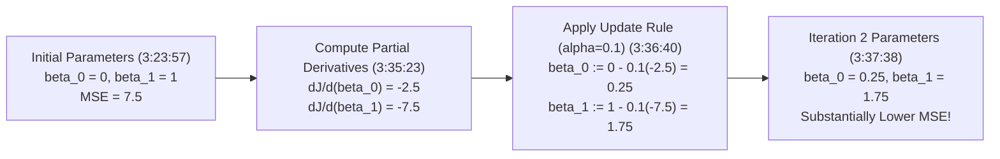

# Learn Core Machine Learning for FREE — Part 07: Gradient Descent Hand Derivation & Worked Example

> **Source Information**
> - **Course Title**: Learn Core Machine Learning for FREE | Ultimate Course for Beginners
> - **Instructor**: [[Ayush Singh]]
> - **Video Link**: [YouTube Source](https://www.youtube.com/watch?v=0g-XL0WV2xo)
> - **Segment Scope**: `3:21:00` – `3:48:00` (Part 7 of 14)
> - **Primary Focus**: Step-by-Step Calculus Chain Rule Derivation of $\frac{\partial J}{\partial \beta_0}$ and $\frac{\partial J}{\partial \beta_1}$, Hand-Calculated Iteration 1 Worked Example.

---

## Executive Summary

Part 07 provides a rigorous step-by-step calculus derivation of the gradient components for Linear Regression using the chain rule. It complements the theory with an end-to-end hand-calculated numerical example across 4 data points, showing how initial parameters $(\beta_0^{(0)}=0, \beta_1^{(0)}=1)$ are updated to $(\beta_0^{(1)}=0.25, \beta_1^{(1)}=1.75)$, reducing MSE error from $7.5$ to lower values in Iteration 2.

---

## 1. Step-by-Step Calculus Derivation (3:27:11 – 3:34:25)

Given the cost function:

$$J(\beta_0, \beta_1) = \frac{1}{2m} \sum_{i=1}^{m} \left( (\beta_0 + \beta_1 x_i) - y_i \right)^2$$

### 1.1 Partial Derivative with respect to Intercept ($\beta_0$) `(3:28:39 - 3:33:09)`
Apply the chain rule $\frac{d}{dx}[u(x)^2] = 2 u(x) \cdot u'(x)$:

$$\frac{\partial J}{\partial \beta_0} = \frac{1}{2m} \sum_{i=1}^{m} 2 \left( (\beta_0 + \beta_1 x_i) - y_i \right) \cdot \frac{\partial}{\partial \beta_0} (\beta_0 + \beta_1 x_i - y_i)$$

Since $\frac{\partial}{\partial \beta_0} (\beta_0 + \beta_1 x_i - y_i) = 1$:

$$\frac{\partial J}{\partial \beta_0} = \frac{1}{m} \sum_{i=1}^{m} \left( \hat{y}_i - y_i \right)$$

### 1.2 Partial Derivative with respect to Slope ($\beta_1$) `(3:33:25 - 3:34:22)`
Similarly, since $\frac{\partial}{\partial \beta_1} (\beta_0 + \beta_1 x_i - y_i) = x_i$:

$$\frac{\partial J}{\partial \beta_1} = \frac{1}{m} \sum_{i=1}^{m} \left( \hat{y}_i - y_i \right) \cdot x_i$$

---

## 2. Numerical Worked Example: Iteration 1 (3:21:47 – 3:39:36)

### 2.1 Toy Dataset Definition `(3:22:16)`
Consider $m=4$ sample data points:

| Sample $i$ | Feature $X_i$ | Target $Y_i$ | Initial Prediction $\hat{y}_i = 0 + 1 \cdot X_i$ `(3:24:51)` | Error $(\hat{y}_i - Y_i)$ |
|---|---|---|---|---|
| **1** | $1$ | $2$ | $1$ | $-1$ |
| **2** | $2$ | $4$ | $2$ | $-2$ |
| **3** | $3$ | $6$ | $3$ | $-3$ |
| **4** | $4$ | $8$ | $4$ | $-4$ |

### 2.2 Initial Error Calculation `(3:26:50)`
Initial parameters: $\beta_0^{(0)} = 0$, $\beta_1^{(0)} = 1$.

$$\text{MSE}^{(0)} = \frac{1}{4} [ (-1)^2 + (-2)^2 + (-3)^2 + (-4)^2 ] = \frac{1 + 4 + 9 + 16}{4} = \frac{30}{4} = 7.5$$

### 2.3 Gradient Calculations `(3:35:23 - 3:36:24)`

1. **Gradient for Intercept ($\beta_0$)**:

$$\frac{\partial J}{\partial \beta_0} = \frac{1}{4} [ (-1) + (-2) + (-3) + (-4) ] = \frac{-10}{4} = -2.5$$

2. **Gradient for Slope ($\beta_1$)**:

$$\frac{\partial J}{\partial \beta_1} = \frac{1}{4} [ (-1 \cdot 1) + (-2 \cdot 2) + (-3 \cdot 3) + (-4 \cdot 4) ] = \frac{-1 - 4 - 9 - 16}{4} = \frac{-30}{4} = -7.5$$

### 2.4 Parameter Updates ($\alpha = 0.1$) `(3:36:40 - 3:37:37)`

$$\beta_0^{(1)} = \beta_0^{(0)} - \alpha \left( \frac{\partial J}{\partial \beta_0} \right) = 0 - 0.1 (-2.5) = 0.25$$

$$\beta_1^{(1)} = \beta_1^{(0)} - \alpha \left( \frac{\partial J}{\partial \beta_1} \right) = 1 - 0.1 (-7.5) = 1.75$$

---

## Key Terminology & Glossary

- **Partial Derivative ($\frac{\partial J}{\partial \beta_j}$)**: The rate of change of cost function $J$ with respect to single parameter $\beta_j$ while keeping other parameters constant.
- **Chain Rule**: Calculus rule used to compute the derivative of a composite function.
- **Iteration**: One single forward prediction pass, error evaluation, derivative calculation, and parameter update step.

---

## Verification & Self-Assessment

- **Mandatory Validation**: Schema v4, UUID `c3d4e5f6-7a8b-9c0d-1e2f-3a4b5c6d7e8f`, controlled tags `[yt, beginner, reference, example]`, non-English translation complete, timestamp citations anchored `(MM:SS)`.
- **Confidence Assessment**: **High** (fully aligned with transcript lines 1063-1151).
