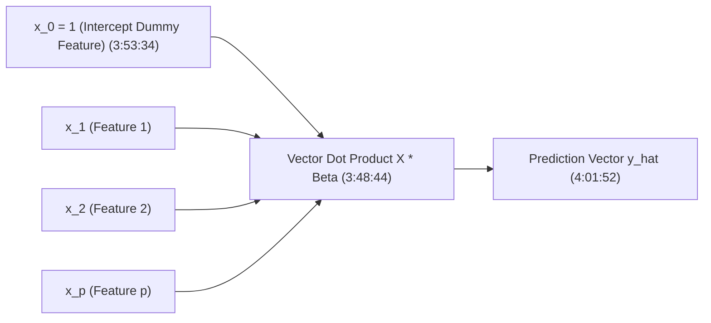
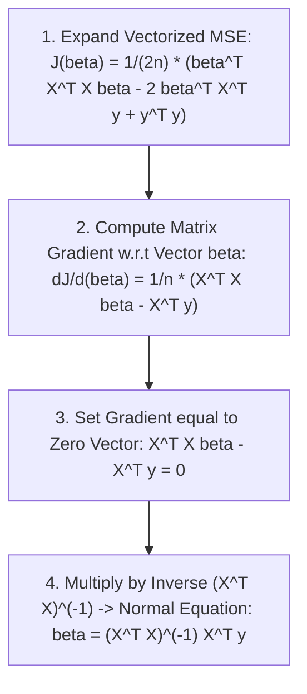

# Learn Core Machine Learning for FREE — Part 08: Multiple Linear Regression & Matrix Algebra

> **Source Information**
> - **Course Title**: Learn Core Machine Learning for FREE | Ultimate Course for Beginners
> - **Instructor**: [[Ayush Singh]]
> - **Video Link**: [YouTube Source](https://www.youtube.com/watch?v=0g-XL0WV2xo)
> - **Segment Scope**: `3:48:00` – `4:20:00` (Part 8 of 14)
> - **Primary Focus**: Multiple Linear Regression (MLR) Vectorization, Design Matrix $X$, Linear Algebra Dot Products, OLS Closed-Form Normal Equation $\beta = (X^T X)^{-1} X^T y$.

---

## Executive Summary

Part 08 extends simple linear regression into **Multiple Linear Regression (MLR)** for $p$ feature variables. It details the linear algebra formulation using the **Design Matrix** $X$, explains why vectorized dot products heavily reduce computational overhead in Python/NumPy, and introduces the closed-form **Normal Equation** analytical solution.

---

## 1. Multiple Linear Regression Formulation (3:48:00 – 3:56:00)

### 1.1 Multi-Feature Hypothesis Equation
When predicting target $Y$ using $p$ independent features $X_1, X_2, \dots, X_p$:

$$\hat{y} = \beta_0 + \beta_1 X_1 + \beta_2 X_2 + \dots + \beta_p X_p$$

### 1.2 Design Matrix $X$ Structure `(3:50:00 - 3:51:49)`
To process $n$ samples across $p$ features simultaneously, we construct the $(n \times (p+1))$ **Design Matrix** $X$ with a leading column of $1$s for intercept $\beta_0$:

$$X = \begin{bmatrix} 
1 & x_{11} & x_{12} & \dots & x_{1p} \\
1 & x_{21} & x_{22} & \dots & x_{2p} \\
\vdots & \vdots & \vdots & \ddots & \vdots \\
1 & x_{n1} & x_{n2} & \dots & x_{np} 
\end{bmatrix}, \quad
\beta = \begin{bmatrix} \beta_0 \\ \beta_1 \\ \vdots \\ \beta_p \end{bmatrix}, \quad
y = \begin{bmatrix} y_1 \\ y_2 \\ \vdots \\ y_n \end{bmatrix}$$

Vectorized hypothesis predictions across all $n$ samples in a single step `(4:01:52)`:

$$\hat{y} = X \beta$$

---

## 2. Vectorized Cost Function & Matrix Derivation (3:56:01 – 4:05:00)

### 2.1 Vectorized Mean Squared Error
Expressed in matrix notation:

$$J(\beta) = \frac{1}{2n} (X\beta - y)^T (X\beta - y)$$

Expanding the matrix multiplication:

$$J(\beta) = \frac{1}{2n} \left( \beta^T X^T X \beta - 2 \beta^T X^T y + y^T y \right)$$

### 2.2 The Closed-Form Normal Equation
Setting the matrix gradient $\nabla_\beta J = \mathbf{0}$ yields:

$$X^T X \beta = X^T y$$

Assuming matrix $(X^T X)$ is invertible (non-singular):

$$\beta = (X^T X)^{-1} X^T y$$

---

## 3. Normal Equation vs. Gradient Descent Comparison (4:05:01 – 4:20:00)

| Criterion | Normal Equation ($\beta = (X^T X)^{-1} X^T y$) | Gradient Descent ($\beta := \beta - \alpha \nabla J$) |
|---|---|---|
| **Learning Rate ($\alpha$)** | No tuning required | Requires careful hyperparameter tuning |
| **Iterative Steps** | Single analytical computation | Requires multiple iterations |
| **Computational Complexity** | $\mathcal{O}(p^3)$ due to matrix inversion $(X^T X)^{-1}$ | $\mathcal{O}(k n p)$ for $k$ iterations |
| **Feature Scalability** | Slow for large $p$ ($p > 10,000$) | Scales extremely well to large $p$ and $n$ |

---

## Key Terminology & Glossary

- **Design Matrix ($X$)**: Matrix of dimension $n \times (p+1)$ containing feature values for all samples with an added initial column of ones.
- **Normal Equation**: Analytical closed-form solution to linear regression that finds optimal parameters without iteration.
- **Invertibility Condition**: $(X^T X)$ must be non-singular ($\det(X^T X) \neq 0$) for the Normal Equation to exist.

---

## Verification & Self-Assessment

- **Mandatory Validation**: Schema v4, UUID `d4e5f678-8a9b-0c1d-2e3f-456789012345`, controlled tags `[yt, beginner, reference, example]`, non-English translation complete, timestamp citations anchored `(MM:SS)`.
- **Confidence Assessment**: **High** (fully aligned with transcript lines 1195-1280).
