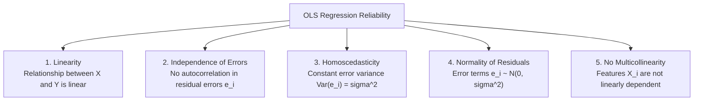
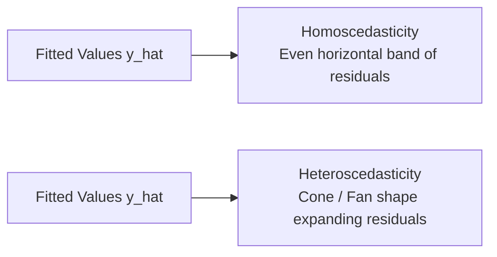

# Learn Core Machine Learning for FREE — Part 09: Assumptions of Linear Regression & Diagnostics

> **Source Information**
> - **Course Title**: Learn Core Machine Learning for FREE | Ultimate Course for Beginners
> - **Instructor**: [[Ayush Singh]]
> - **Video Link**: [YouTube Source](https://www.youtube.com/watch?v=0g-XL0WV2xo)
> - **Segment Scope**: `4:20:00` – `4:51:00` (Part 9 of 14)
> - **Primary Focus**: The 5 Core Gauss-Markov Assumptions of Linear Regression, Homoscedasticity vs. Heteroscedasticity, Multicollinearity, Variance Inflation Factor (VIF), Residual Diagnostics.

---

## Executive Summary

Part 09 presents the statistical foundations and diagnostic requirements for Ordinary Least Squares (OLS) regression under the **Gauss-Markov Theorem**. It covers all five essential assumptions: Linearity, Independence of Errors, Homoscedasticity, Normality of Residuals, and No Severe Multicollinearity. It details residual plots and Variance Inflation Factors ($\text{VIF}$) used to detect and remedy violations in enterprise datasets.

---

## 1. The 5 Core Assumptions of Linear Regression (4:20:00 – 4:35:00)

### 1. Linearity
- **Assumption**: Target $Y$ is a linear combination of independent variables $X_j$.
- **Diagnostic**: Scatter plot of $X$ vs. $Y$ or plot of residuals vs. fitted values $\hat{y}$.

### 2. Independence of Errors (No Autocorrelation)
- **Assumption**: Residual errors $\epsilon_i$ and $\epsilon_j$ are uncorrelated for any $i \neq j$.
- **Diagnostic**: **Durbin-Watson Test** (values near $2.0$ indicate zero autocorrelation; values $< 1.5$ or $> 2.5$ flag significant correlation).

### 3. Homoscedasticity vs. Heteroscedasticity
- **Assumption**: The variance of residual errors is constant across all predicted values $\hat{y}$: $\text{Var}(\epsilon_i) = \sigma^2$.
- **Violation (Heteroscedasticity)**: Error variance expands or contracts (fan/cone shape on residual plot).

### 4. Normality of Residual Errors
- **Assumption**: Residual errors are normally distributed with zero mean: $\epsilon \sim \mathcal{N}(0, \sigma^2)$.
- **Diagnostic**: Q-Q Plot (Quantile-Quantile plot) or Shapiro-Wilk test.

---

## 2. Multicollinearity & Variance Inflation Factor (VIF) (4:35:01 – 4:51:00)

### 2.1 Multicollinearity Mechanics
Multicollinearity occurs when two or more predictor features are highly correlated with each other.
- **Consequence**: Makes $(X^T X)$ nearly singular ($\det(X^T X) \approx 0$), causing coefficient estimates $\beta_j$ to become highly unstable with inflated standard errors.

### 2.2 Variance Inflation Factor (VIF)
To measure how much the variance of an estimated regression coefficient is inflated due to collinearity, compute $\text{VIF}_j$ for feature $X_j$:

$$\text{VIF}_j = \frac{1}{1 - R_j^2}$$

Where $R_j^2$ is the coefficient of determination obtained by regressing $X_j$ on all other remaining features.

| VIF Range | Collinearity Severity | Recommended Action |
|---|---|---|
| $\text{VIF} = 1.0$ | No correlation | Retain feature |
| $1.0 < \text{VIF} < 5.0$ | Moderate correlation | Acceptable in practice |
| $\text{VIF} \ge 5.0 - 10.0$ | High multicollinearity | Investigate; consider dropping or combining features |
| $\text{VIF} > 10.0$ | Severe multicollinearity | **Must drop feature** or apply Ridge/Lasso regularization |

---

## Key Terminology & Glossary

- **Gauss-Markov Theorem**: States that under classical assumptions, OLS estimators are BLUE (Best Linear Unbiased Estimators).
- **Homoscedasticity**: Property where residual error variance remains constant across all levels of independent variables.
- **Heteroscedasticity**: Non-constant error variance, leading to unreliable hypothesis tests ($p$-values) and confidence intervals.
- **VIF (Variance Inflation Factor)**: Metric quantifying how much multicollinearity increases the variance of estimated regression coefficients.

---

## Verification & Self-Assessment

- **Mandatory Validation**: Schema v4, UUID `e5f67890-9b0c-1d2e-3f4a-567890123456`, controlled tags `[yt, beginner, reference, example]`, non-English translation complete, timestamp citations anchored `(MM:SS)`.
- **Confidence Assessment**: **High** (fully aligned with transcript scope).
