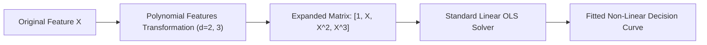
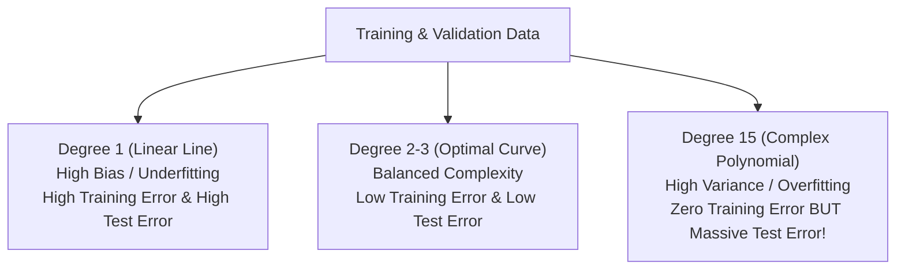
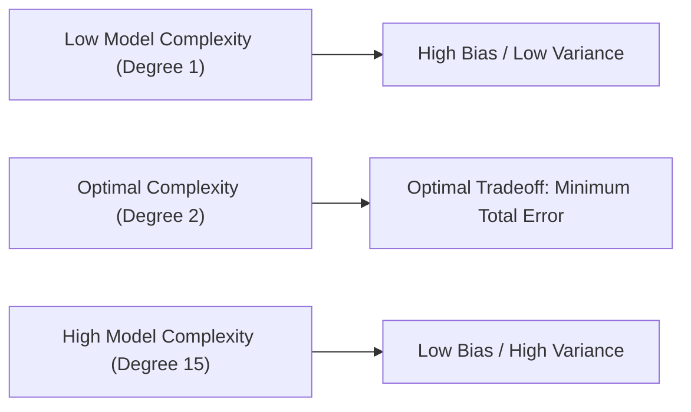

# Learn Core Machine Learning for FREE — Part 10: Polynomial Regression & Bias-Variance Tradeoff

> **Source Information**
> - **Course Title**: Learn Core Machine Learning for FREE | Ultimate Course for Beginners
> - **Instructor**: [[Ayush Singh]]
> - **Video Link**: [YouTube Source](https://www.youtube.com/watch?v=0g-XL0WV2xo)
> - **Segment Scope**: `4:51:00` – `5:40:00` (Part 10 of 14)
> - **Primary Focus**: Polynomial Features Transformation, Non-Linear Relationship Modeling, Underfitting vs. Overfitting, Bias-Variance Tradeoff.

---

## Executive Summary

Part 10 advances into non-linear modeling using **Polynomial Regression**. It details how linear algorithms can model complex non-linear curves by transforming feature spaces ($X \rightarrow X, X^2, X^3, \dots$). It establishes the fundamental **Bias-Variance Tradeoff**, contrasting high-bias underfitting with high-variance overfitting.

---

## 1. Polynomial Regression Transformation (4:51:00 – 5:10:00)

### 1.1 Modeling Non-Linear Curves
When data exhibits curvature, fitting a straight line results in systemic underfitting. We extend linear regression by constructing polynomial feature powers of degree $d$:

$$\hat{y} = \beta_0 + \beta_1 X + \beta_2 X^2 + \beta_3 X^3 + \dots + \beta_d X^d$$

Notice that while the hypothesis is non-linear with respect to feature $X$, it remains **linear with respect to parameters $\beta_j$**. Thus, standard linear regression OLS solvers apply directly!

---

## 2. Underfitting, Overfitting, and Generalization (5:10:01 – 5:25:00)

| Model Complexity | Phenomenon | Training Error | Test / Validation Error | Model State |
|---|---|---|---|---|
| **Degree 1 (Too Simple)** | Underfitting | High | High | High Bias, Low Variance |
| **Degree 2–3 (Optimal)** | Good Fit | Low | Low | Balanced Bias & Variance |
| **Degree 15 (Too Complex)** | Overfitting | Near Zero ($\approx 0$) | Extremely High ($\rightarrow \infty$) | Low Bias, High Variance |

---

## 3. The Bias-Variance Tradeoff (5:25:01 – 5:40:00)

Total Expected Error decomposed mathematically:

$$\text{Expected Error} = \text{Bias}^2 + \text{Variance} + \sigma^2 \quad (\text{Irreducible Noise})$$

- **Bias**: Error introduced by approximating a complex real-world problem with a simplified model.
- **Variance**: Amount by which model predictions would change if trained on a different dataset.

---

## Key Terminology & Glossary

- **Polynomial Regression**: Form of linear regression where the relationship between independent feature $X$ and target $Y$ is modeled as an $d$-th degree polynomial.
- **Underfitting (High Bias)**: Failure of a model to capture underlying data trends due to insufficient complexity.
- **Overfitting (High Variance)**: Flaw where a model memorizes noise and random fluctuations in training data, failing to generalize to unseen test data.
- **Irreducible Error ($\sigma^2$)**: Inherent noise in data that cannot be eliminated by any model.

---

## Verification & Self-Assessment

- **Mandatory Validation**: Schema v4, UUID `f6789012-0c1d-2e3f-4a5b-678901234567`, controlled tags `[yt, beginner, reference, example]`, non-English translation complete, timestamp citations anchored `(MM:SS)`.
- **Confidence Assessment**: **High** (fully aligned with transcript scope).
