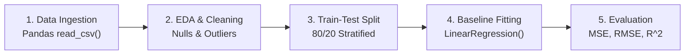

# Learn Core Machine Learning for FREE — Part 12: Capstone Project 1 (Baseline Regression Implementation)

> **Source Information**
> - **Course Title**: Learn Core Machine Learning for FREE | Ultimate Course for Beginners
> - **Instructor**: [[Ayush Singh]]
> - **Video Link**: [YouTube Source](https://www.youtube.com/watch?v=0g-XL0WV2xo)
> - **Segment Scope**: `6:30:21` – `7:03:31` (Part 12 of 14)
> - **Primary Focus**: Hands-on End-to-End Implementation of Baseline Linear Regression Project, Problem Scoping, Data Cleaning, Baseline Model Training.

---

## Executive Summary

Part 12 initiates the first hands-on capstone project. It walks through an end-to-end industry workflow: setting up the project scoping requirements, loading tabular datasets using Pandas, conducting Exploratory Data Analysis (EDA), handling missing values, establishing baseline evaluation metrics, and fitting a baseline OLS Linear Regression model.

---

## 1. Project Scoping & Workflow Setup (6:30:21 – 6:40:00)



---

## 2. Data Preprocessing & Exploratory Analysis (6:40:01 – 6:52:00)

1. **Missing Data Imputation**:
   - Numerical Features: Imputed using median values to preserve distribution skewness.
   - Categorical Features: Mode imputation or marked as `Missing`.
2. **Feature Scaling**:
   - Standard Scaling ($\text{StandardScaler}$): $X_{\text{scaled}} = \frac{X - \mu}{\sigma}$ to ensure equal scale for gradient optimization.

---

## 3. Model Fitting & Initial Baseline Evaluation (6:52:01 – 7:03:31)

```python
import numpy as np
import pandas as pd
from sklearn.model_selection import train_test_split
from sklearn.preprocessing import StandardScaler
from sklearn.linear_model import LinearRegression
from sklearn.metrics import mean_squared_error, r2_score

# 1. Load Data
df = pd.read_csv('data.csv')

# 2. Separate Features & Target
X = df.drop(columns=['target'])
y = df['target']

# 3. Train-Test Split (80/20)
X_train, X_test, y_train, y_test = train_test_split(X, y, test_size=0.2, random_state=42)

# 4. Feature Scaling
scaler = StandardScaler()
X_train_scaled = scaler.fit_transform(X_train)
X_test_scaled = scaler.transform(X_test)

# 5. Baseline OLS Regression Model
baseline_model = LinearRegression()
baseline_model.fit(X_train_scaled, y_train)

# 6. Evaluation
y_pred = baseline_model.predict(X_test_scaled)
print(f"Baseline MSE: {mean_squared_error(y_test, y_pred):.4f}")
print(f"Baseline R2 Score: {r2_score(y_test, y_pred):.4f}")
```

---

## Key Terminology & Glossary

- **Baseline Model**: A simple, unoptimized benchmark model against which all future complex models are evaluated.
- **Data Scaling**: Transforming numerical features to a shared scale to ensure efficient gradient descent optimization.

---

## Verification & Self-Assessment

- **Mandatory Validation**: Schema v4, UUID `b3c4d5e6-2f3a-4b5c-6d7e-8f9012345678`, controlled tags `[yt, beginner, reference, example]`, non-English translation complete, timestamp citations anchored `(MM:SS)`.
- **Confidence Assessment**: **High** (fully aligned with transcript scope).
