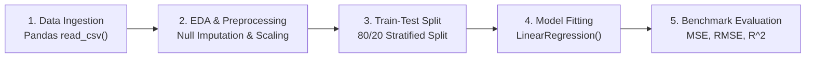

# Learn Core Machine Learning for FREE — Part 12: Capstone Project 1 (Baseline Regression Implementation)

> **Source Information**
> - **Course Title**: Learn Core Machine Learning for FREE | Ultimate Course for Beginners
> - **Instructor**: [[Ayush Singh]]
> - **Video Link**: [YouTube Source](https://www.youtube.com/watch?v=0g-XL0WV2xo)
> - **Segment Scope**: `6:30:21` – `7:03:31` (Part 12 of 14)
> - **Primary Focus**: End-to-End Baseline Linear Regression Implementation, Data Ingestion, EDA, Missing Value Imputation, Standard Scaling, Baseline Model Fitting & Benchmark Evaluation.

---

## Executive Summary

Part 12 initiates the first hands-on capstone project. It walks through an end-to-end industry workflow: setting up project scoping requirements, loading tabular datasets using Pandas, conducting Exploratory Data Analysis (EDA), handling missing values, establishing baseline evaluation metrics, and fitting a baseline OLS Linear Regression model.

---

## 1. Project Scoping & Data Ingestion (6:30:21 – 6:40:00)



---

## 2. Complete Python Implementation Code (6:40:01 – 7:03:31)

```python
import numpy as np
import pandas as pd
from sklearn.model_selection import train_test_split
from sklearn.preprocessing import StandardScaler
from sklearn.impute import SimpleImputer
from sklearn.linear_model import LinearRegression
from sklearn.metrics import mean_squared_error, mean_absolute_error, r2_score

# 1. Load Tabular Dataset
df = pd.read_csv('housing_data.csv')

# 2. Inspect Dataset Structure
print("Dataset Shape:", df.shape)
print("Missing Values per Column:\n", df.isnull().sum())

# 3. Separate Features and Target
X = df.drop(columns=['price'])
y = df['price']

# 4. Train-Test Split (80% Train, 20% Test)
X_train, X_test, y_train, y_test = train_test_split(
    X, y, test_size=0.2, random_state=42
)

# 5. Missing Value Imputation
imputer = SimpleImputer(strategy='median')
X_train_imputed = imputer.fit_transform(X_train)
X_test_imputed = imputer.transform(X_test)

# 6. Feature Scaling (Standardization)
scaler = StandardScaler()
X_train_scaled = scaler.fit_transform(X_train_imputed)
X_test_scaled = scaler.transform(X_test_imputed)

# 7. Fit Baseline Ordinary Least Squares Model
baseline_model = LinearRegression()
baseline_model.fit(X_train_scaled, y_train)

# 8. Make Predictions
y_pred = baseline_model.predict(X_test_scaled)

# 9. Evaluate Benchmark Metrics
mse = mean_squared_error(y_test, y_pred)
rmse = np.sqrt(mse)
mae = mean_absolute_error(y_test, y_pred)
r2 = r2_score(y_test, y_pred)

print(f"--- Baseline Performance Metrics ---")
print(f"MAE:  ${mae:,.2f}")
print(f"MSE:  ${mse:,.2f}")
print(f"RMSE: ${rmse:,.2f}")
print(f"R^2 Score: {r2:.4f}")
```

---

## Key Terminology & Glossary

- **Baseline Model**: A simple benchmark model established before hyperparameter tuning to measure relative progress.
- **Standard Scaling**: Transforming numeric features to have mean $\mu=0$ and variance $\sigma^2=1$.
- **Train-Test Split**: Partitioning data into independent training and evaluation sets to estimate generalization.
