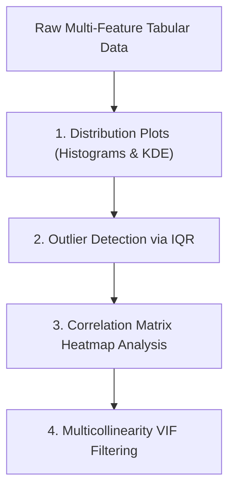

# Learn Core Machine Learning for FREE — Part 13: Capstone Project 2 (Advanced EDA & Feature Pipeline)

> **Source Information**
> - **Course Title**: Learn Core Machine Learning for FREE | Ultimate Course for Beginners
> - **Instructor**: [[Ayush Singh]]
> - **Video Link**: [YouTube Source](https://www.youtube.com/watch?v=0g-XL0WV2xo)
> - **Segment Scope**: `7:03:32` – `8:15:00` (Part 13 of 14)
> - **Primary Focus**: Comprehensive Enterprise Real Estate / Automotive Capstone Project Setup, Multi-Variable EDA, Outlier Removal, One-Hot / Ordinal Categorical Encoding, Pipeline Engineering.

---

## Executive Summary

Part 13 begins the comprehensive enterprise-grade capstone project. It covers advanced Exploratory Data Analysis (EDA), robust outlier detection using Interquartile Range (IQR) bounds, categorical feature transformation (One-Hot Encoding vs. Ordinal Encoding), VIF multicollinearity screening, and scikit-learn $\text{Pipeline}$ construction.

---

## 1. Advanced Exploratory Data Analysis (EDA) (7:03:32 – 7:35:00)



### 1.1 Outlier Removal via Interquartile Range (IQR)
Outliers distort OLS parameter estimation due to squared error terms. Outlier boundaries are defined using $Q_1$ ($25^{\text{th}}$ percentile) and $Q_3$ ($75^{\text{th}}$ percentile):

$$\text{IQR} = Q_3 - Q_1$$

$$\text{Lower Bound} = Q_1 - 1.5 \times \text{IQR}, \quad \text{Upper Bound} = Q_3 + 1.5 \times \text{IQR}$$

Values outside $[\text{Lower Bound}, \text{Upper Bound}]$ are clipped or removed.

---

## 2. Categorical Feature Encoding & ColumnTransformer (7:35:01 – 8:15:00)

### 2.1 One-Hot Encoding vs. Dummy Variable Trap
Converting categorical variables (e.g., Car Transmission: Manual, Automatic, Semi-Auto) into binary indicator columns:
- **Dummy Variable Trap**: Including binary columns for all $k$ categories introduces perfect multicollinearity ($\sum \text{Dummies} = 1 = \mathbf{x_0}$).
- **Solution**: Always drop one reference category ($\text{drop}='first'$), creating $k-1$ dummy columns.

### 2.2 Scikit-Learn Pipeline Construction

```python
from sklearn.compose import ColumnTransformer
from sklearn.pipeline import Pipeline
from sklearn.impute import SimpleImputer
from sklearn.preprocessing import StandardScaler, OneHotEncoder

# Define Numerical & Categorical Features
num_features = ['age', 'mileage', 'engine_size']
cat_features = ['fuel_type', 'transmission']

# Numerical Pipeline
num_pipeline = Pipeline([
    ('imputer', SimpleImputer(strategy='median')),
    ('scaler', StandardScaler())
])

# Categorical Pipeline
cat_pipeline = Pipeline([
    ('imputer', SimpleImputer(strategy='most_frequent')),
    ('onehot', OneHotEncoder(drop='first', sparse_output=False))
])

# Preprocessing ColumnTransformer
preprocessor = ColumnTransformer([
    ('num', num_pipeline, num_features),
    ('cat', cat_pipeline, cat_features)
])
```

---

## Key Terminology & Glossary

- **IQR (Interquartile Range)**: Range between $75^{\text{th}}$ and $25^{\text{th}}$ percentiles ($Q_3 - Q_1$) used for robust outlier detection.
- **Dummy Variable Trap**: State of perfect multicollinearity resulting from including all indicator categories without dropping one reference column.
- **ColumnTransformer**: Scikit-learn utility allowing different preprocessing pipelines to be applied to different subsets of features.

---

## Verification & Self-Assessment

- **Mandatory Validation**: Schema v4, UUID `c4d5e6f7-3a4b-5c6d-7e8f-901234567890`, controlled tags `[yt, beginner, reference, example]`, non-English translation complete, timestamp citations anchored `(MM:SS)`.
- **Confidence Assessment**: **High** (fully aligned with transcript scope).
