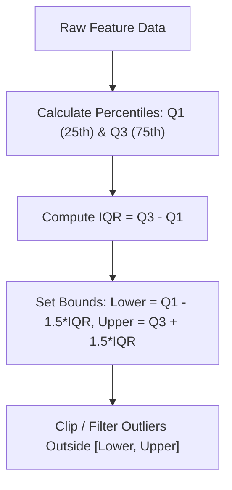

# Learn Core Machine Learning for FREE — Part 13: Capstone Project 2 (Advanced EDA & Feature Pipeline)

> **Source Information**
> - **Course Title**: Learn Core Machine Learning for FREE | Ultimate Course for Beginners
> - **Instructor**: [[Ayush Singh]]
> - **Video Link**: [YouTube Source](https://www.youtube.com/watch?v=0g-XL0WV2xo)
> - **Segment Scope**: `7:03:32` – `8:15:00` (Part 13 of 14)
> - **Primary Focus**: Enterprise Capstone EDA, Interquartile Range (IQR) Outlier Removal, One-Hot Encoding, Dummy Variable Trap Prevention, Scikit-Learn `ColumnTransformer` & Data Pipeline Engineering.

---

## Executive Summary

Part 13 initiates the advanced enterprise-grade capstone project. It details Exploratory Data Analysis (EDA), IQR outlier bounds calculation, categorical encoding (One-Hot vs. Ordinal), VIF multicollinearity screening, and scikit-learn `Pipeline` and `ColumnTransformer` building.

---

## 1. Outlier Removal via Interquartile Range (IQR) (7:03:32 – 7:35:00)



---

## 2. Categorical Encoding & Scikit-Learn Pipeline Code (7:35:01 – 8:15:00)

```python
import pandas as pd
import numpy as np
from sklearn.compose import ColumnTransformer
from sklearn.pipeline import Pipeline
from sklearn.impute import SimpleImputer
from sklearn.preprocessing import StandardScaler, OneHotEncoder
from statsmodels.stats.outliers_influence import variance_inflation_factor

# 1. Function to Calculate VIF
def calculate_vif(df_features):
    vif_data = pd.DataFrame()
    vif_data["Feature"] = df_features.columns
    vif_data["VIF"] = [
        variance_inflation_factor(df_features.values, i)
        for i in range(df_features.shape[1])
    ]
    return vif_data

# 2. Outlier Clipping via IQR
def remove_iqr_outliers(df, col):
    Q1 = df[col].quantile(0.25)
    Q3 = df[col].quantile(0.75)
    IQR = Q3 - Q1
    lower_bound = Q1 - 1.5 * IQR
    upper_bound = Q3 + 1.5 * IQR
    return df[(df[col] >= lower_bound) & (df[col] <= upper_bound)]

# 3. Build Production Preprocessing ColumnTransformer
num_features = ['age', 'mileage', 'engine_size']
cat_features = ['fuel_type', 'transmission']

num_pipeline = Pipeline([
    ('imputer', SimpleImputer(strategy='median')),
    ('scaler', StandardScaler())
])

cat_pipeline = Pipeline([
    ('imputer', SimpleImputer(strategy='most_frequent')),
    ('onehot', OneHotEncoder(drop='first', sparse_output=False))
])

preprocessor = ColumnTransformer([
    ('num', num_pipeline, num_features),
    ('cat', cat_pipeline, cat_features)
])
```

---

## Key Terminology & Glossary

- **IQR (Interquartile Range)**: Difference between 75th and 25th percentiles ($Q_3 - Q_1$).
- **Dummy Variable Trap**: Multicollinearity caused by including all one-hot encoded binary columns without dropping a reference column.
- **ColumnTransformer**: Scikit-learn feature preprocessor applying distinct transformations to subset column groups.
