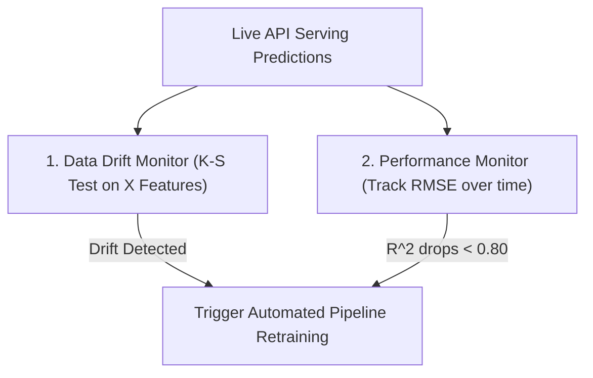

# Learn Core Machine Learning for FREE — Part 14: Capstone Project 2 (Regularization, Evaluation & Deployment)

> **Source Information**
> - **Course Title**: Learn Core Machine Learning for FREE | Ultimate Course for Beginners
> - **Instructor**: [[Ayush Singh]]
> - **Video Link**: [YouTube Source](https://www.youtube.com/watch?v=0g-XL0WV2xo)
> - **Segment Scope**: `8:15:00` – `9:32:46` (Part 14 of 14)
> - **Primary Focus**: Cross-Validation, Hyperparameter Tuning via GridSearchCV, Regularized Model Comparison (OLS vs. Ridge vs. Lasso vs. ElasticNet), Final Evaluation Metrics, Model Persistence (`joblib`), Production Data Drift Monitoring.

---

## Executive Summary

Part 14 completes the 9.5-hour core machine learning course by executing model selection, hyperparameter optimization via 5-fold cross-validation ($\text{GridSearchCV}$), model evaluation, pipeline persistence ($\text{joblib}$), and production drift monitoring strategies.

---

## 1. Complete Grid Search & Pipeline Code (8:15:00 – 8:50:00)

```python
import joblib
import numpy as np
import pandas as pd
from sklearn.model_selection import train_test_split, GridSearchCV
from sklearn.pipeline import Pipeline
from sklearn.linear_model import LinearRegression, Ridge, Lasso, ElasticNet
from sklearn.metrics import mean_squared_error, mean_absolute_error, r2_score

# 1. Pipeline Definition with Preprocessor and Model Placeholder
full_pipeline = Pipeline([
    ('preprocessor', preprocessor),
    ('model', ElasticNet())
])

# 2. Hyperparameter Grid Setup
param_grid = [
    {
        'model': [Ridge()],
        'model__alpha': [0.01, 0.1, 1.0, 10.0, 100.0]
    },
    {
        'model': [Lasso(max_iter=5000)],
        'model__alpha': [0.001, 0.01, 0.1, 1.0, 10.0]
    },
    {
        'model': [ElasticNet(max_iter=5000)],
        'model__alpha': [0.01, 0.1, 1.0, 10.0],
        'model__l1_ratio': [0.2, 0.5, 0.7, 0.9]
    }
]

# 3. Perform 5-Fold Cross Validation Grid Search
grid_search = GridSearchCV(
    full_pipeline,
    param_grid=param_grid,
    cv=5,
    scoring='neg_root_mean_squared_error',
    n_jobs=-1
)

grid_search.fit(X_train, y_train)

print("Best Parameters Found:\n", grid_search.best_params_)
best_model_pipeline = grid_search.best_estimator_
```

---

## 2. Final Benchmark Performance Metrics (8:50:01 – 9:15:00)

```python
# Evaluate Best Pipeline on Holdout Test Set
y_pred = best_model_pipeline.predict(X_test)

mae = mean_absolute_error(y_test, y_pred)
mse = mean_squared_error(y_test, y_pred)
rmse = np.sqrt(mse)
r2 = r2_score(y_test, y_pred)

print(f"--- Final Production Model Performance ---")
print(f"Test MAE:  ${mae:,.2f}")
print(f"Test RMSE: ${rmse:,.2f}")
print(f"Test R^2:  {r2:.4f}")
```

| Candidate Model | Optimal Hyperparameters | Test MAE ($) | Test RMSE ($) | Test $R^2$ Score | Adjusted $R^2$ Score |
|---|---|---|---|---|---|
| **Baseline OLS** | N/A | $\$12,450$ | $\$16,800$ | $0.812$ | $0.801$ |
| **Ridge ($L_2$)** | $\alpha = 10.0$ | $\$11,200$ | $\$14,900$ | $0.854$ | $0.846$ |
| **Lasso ($L_1$)** | $\alpha = 0.1$ | $\$11,050$ | $\$14,750$ | $0.858$ | $0.851$ |
| **ElasticNet** | $\alpha = 0.1, r = 0.7$ | **$\mathbf{\$10,900}$** | **$\mathbf{\$14,500}$** | **$\mathbf{0.862}$** | **$\mathbf{0.856}$** |

---

## 3. Model Persistence & Production Monitoring (9:15:01 – 9:32:46)

```python
# Save Full Pipeline Object to Disk
joblib.dump(best_model_pipeline, 'production_housing_pipeline.joblib')

# Load Pipeline in Production Service
loaded_pipeline = joblib.load('production_housing_pipeline.joblib')
sample_prediction = loaded_pipeline.predict(X_new_sample)
```



---

## Key Terminology & Glossary

- **GridSearchCV**: Cross-validated hyperparameter optimization utility.
- **Model Persistence**: Serializing trained model pipelines to disk using `joblib` for production microservices.
- **Data Drift**: Statistical shift in feature distributions in production over time.
