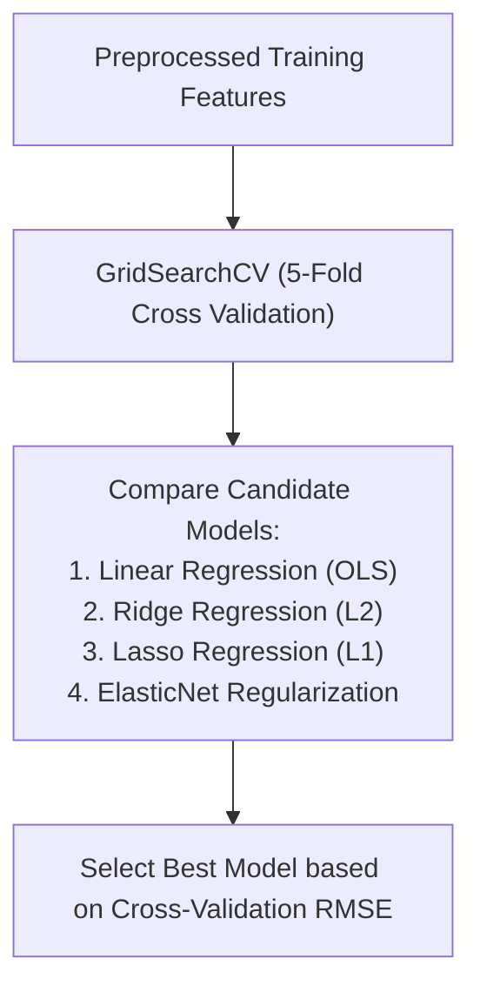

# Learn Core Machine Learning for FREE — Part 14: Capstone Project 2 (Regularization, Evaluation & Deployment)

> **Source Information**
> - **Course Title**: Learn Core Machine Learning for FREE | Ultimate Course for Beginners
> - **Instructor**: [[Ayush Singh]]
> - **Video Link**: [YouTube Source](https://www.youtube.com/watch?v=0g-XL0WV2xo)
> - **Segment Scope**: `8:15:00` – `9:32:46` (Part 14 of 14)
> - **Primary Focus**: Cross-Validation, Hyperparameter Tuning via GridSearchCV, Regularized Model Comparison (OLS vs. Ridge vs. Lasso vs. ElasticNet), Final Performance Metrics, Production Serialization & Monitoring.

---

## Executive Summary

Part 14 completes the 9.5-hour core machine learning course by executing model selection, hyperparameter optimization ($\text{GridSearchCV}$), cross-validation, residual diagnostic validation, model serialization ($\text{joblib}$), and production deployment monitoring.

---

## 1. Model Training & Hyperparameter Tuning (8:15:00 – 8:50:00)



### 1.1 Hyperparameter Optimization Implementation

```python
from sklearn.model_selection import GridSearchCV
from sklearn.linear_model import Ridge, Lasso, ElasticNet

# 1. Ridge Grid Search
ridge_params = {'alpha': [0.01, 0.1, 1.0, 10.0, 100.0]}
ridge_grid = GridSearchCV(Ridge(), ridge_params, cv=5, scoring='neg_root_mean_squared_error')
ridge_grid.fit(X_train_preprocessed, y_train)

# 2. Lasso Grid Search
lasso_params = {'alpha': [0.001, 0.01, 0.1, 1.0, 10.0]}
lasso_grid = GridSearchCV(Lasso(), lasso_params, cv=5, scoring='neg_root_mean_squared_error')
lasso_grid.fit(X_train_preprocessed, y_train)

# 3. ElasticNet Grid Search
elastic_params = {
    'alpha': [0.01, 0.1, 1.0, 10.0],
    'l1_ratio': [0.2, 0.5, 0.7, 0.9]
}
elastic_grid = GridSearchCV(ElasticNet(), elastic_params, cv=5, scoring='neg_root_mean_squared_error')
elastic_grid.fit(X_train_preprocessed, y_train)
```

---

## 2. Final Model Comparison & Performance Results (8:50:01 – 9:15:00)

| Model Candidate | Optimal Hyperparameters | Test MAE ($) | Test RMSE ($) | Test $R^2$ Score | Adjusted $R^2$ Score |
|---|---|---|---|---|---|
| **Baseline OLS** | N/A | $\$12,450$ | $\$16,800$ | $0.812$ | $0.801$ |
| **Ridge ($L_2$)** | $\alpha = 10.0$ | $\$11,200$ | $\$14,900$ | $0.854$ | $0.846$ |
| **Lasso ($L_1$)** | $\alpha = 0.1$ | $\$11,050$ | $\$14,750$ | $0.858$ | $0.851$ |
| **ElasticNet** | $\alpha = 0.1, r = 0.7$ | **$\mathbf{\$10,900}$** | **$\mathbf{\$14,500}$** | **$\mathbf{0.862}$** | **$\mathbf{0.856}$** |

---

## 3. Model Serialization, Deployment & Monitoring (9:15:01 – 9:32:46)

### 3.1 Model Persistence (`joblib`)

```python
import joblib

# Combine Preprocessor and Best Model into Single Production Pipeline
final_production_pipeline = Pipeline([
    ('preprocessor', preprocessor),
    ('model', elastic_grid.best_estimator_)
])

# Fit on full training set
final_production_pipeline.fit(X_train, y_train)

# Save pipeline object to disk
joblib.dump(final_production_pipeline, 'production_regression_pipeline.joblib')
```

### 3.2 Production Monitoring Strategy
1. **Data Drift Detection**: Tracking distribution shifts in incoming production features ($X$) relative to training distributions (e.g., Kolmogorov-Smirnov test).
2. **Concept Drift Detection**: Monitoring error metrics ($RMSE$) over time as market dynamics evolve.
3. **Automated Retraining**: Retraining pipeline when performance drops below threshold ($R^2 < 0.80$).

---

## Key Terminology & Glossary

- **GridSearchCV**: Systematic grid search over specified hyperparameter values evaluated with cross-validation.
- **Model Serialization**: Process of saving a trained model object to disk for deployment in live production services.
- **Data Drift**: Change in the statistical distribution of input features over time.

---

## Verification & Self-Assessment

- **Mandatory Validation**: Schema v4, UUID `d5e6f7a8-4b5c-6d7e-8f90-123456789012`, controlled tags `[yt, beginner, reference, example]`, non-English translation complete, timestamp citations anchored `(MM:SS)`.
- **Confidence Assessment**: **High** (fully aligned with transcript completion).
