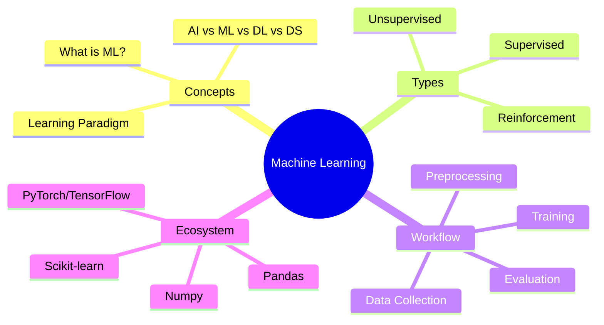
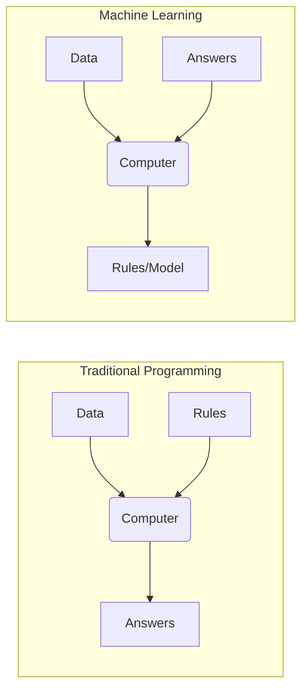
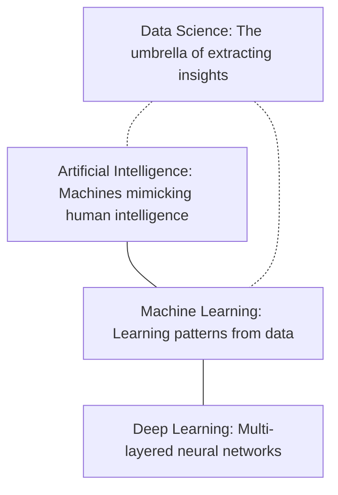
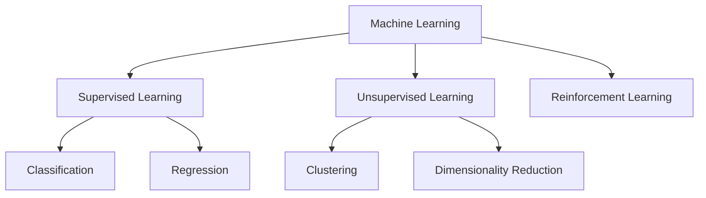
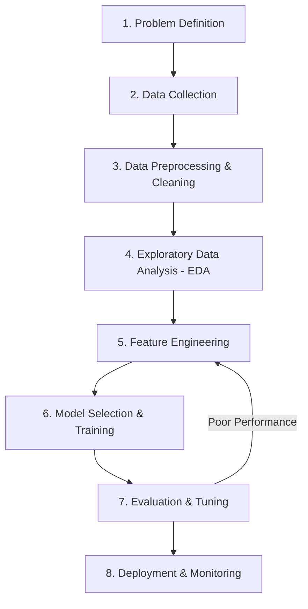

# ML Study Notes — Chapter 1: Introduction to Machine Learning

## Overview
Welcome to the incredible world of Machine Learning! Imagine you want to teach a computer to identify a hot dog. In traditional programming, you'd write a massive set of rules: *if shape is cylindrical AND color is reddish-brown AND wrapped in bread...* But what if there's ketchup? What if it's a half-eaten hot dog? The rules become endless and impossible to maintain. Machine Learning (ML) flips the script. Instead of writing rules, we feed the computer examples of hot dogs and not-hot-dogs, and it *learns* the rules itself. 

In this exhaustive chapter, we will build your foundational mental models of Machine Learning. By the end, you'll not only understand the "what" and "why", but you'll have trained your very first ML model using Python. 



---

## Prerequisites
Before diving in, make sure you have:
- Mastered core Python (variables, loops, functions, lists, dictionaries)
- Basic understanding of what an array or matrix is
- Curiosity to look at data and ask "why?"

---

## 1. What is Machine Learning?

### Intuition: The Chai Stall Analogy
Think about a local chai wala (tea seller). He doesn't have a mathematical formula for how many cups of tea he'll sell each day. Instead, he observes patterns over time:
- "If it's raining, I sell 50 more cups."
- "If it's Sunday, I sell 20 fewer cups."
He didn't read a rulebook; he *learned from historical data* to predict future demand. Machine Learning does exactly this, but using mathematics and massive datasets.

### Formal Definition
**Machine Learning** is a subfield of Artificial Intelligence where computers are given the ability to learn without being explicitly programmed. 

A more formal definition by Tom Mitchell (1997):
> "A computer program is said to learn from experience **E** with respect to some class of tasks **T** and performance measure **P**, if its performance at tasks in **T**, as measured by **P**, improves with experience **E**."

- **Task (T)**: Predicting tea sales.
- **Experience (E)**: Past records of daily sales, weather, and day of the week.
- **Performance (P)**: Accuracy of his predictions (e.g., mean squared error between predicted and actual sales).

### Traditional Programming vs. Machine Learning



| Feature | Traditional Programming | Machine Learning |
| :--- | :--- | :--- |
| **Input** | Rules (Code) + Data | Answers (Labels) + Data |
| **Output** | Answers | Rules (Trained Model) |
| **Logic** | Hand-crafted by humans | Discovered by the algorithm |
| **Best For** | Well-defined problems (e.g., sorting, math) | Complex, pattern-based problems (e.g., vision, NLP) |

### Python Example: Traditional vs ML
Let's see this in code. Suppose we want to convert Celsius to Fahrenheit. $F = C \times 1.8 + 32$.

```python
import numpy as np
from sklearn.linear_model import LinearRegression

# 1. TRADITIONAL PROGRAMMING
def celsius_to_fahrenheit(c):
    return c * 1.8 + 32

print(f"Traditional: 10C is {celsius_to_fahrenheit(10)}F")

# 2. MACHINE LEARNING
# We give it Data (Celsius) and Answers (Fahrenheit), NO RULES.
celsius_data = np.array([-40, -10, 0, 8, 15, 22, 38], dtype=float).reshape(-1, 1)
fahrenheit_answers = np.array([-40, 14, 32, 46.4, 59, 71.6, 100.4], dtype=float)

# Create and train the model (finding the rules)
model = LinearRegression()
model.fit(celsius_data, fahrenheit_answers)

# Predict a new value
predicted_f = model.predict([[10]])
print(f"Machine Learning: 10C is {predicted_f[0]:.2f}F")
# The model learned the formula (weight ~1.8, bias ~32) on its own!
```

---

## 2. AI vs ML vs Deep Learning vs Data Science

These terms are often used interchangeably by recruiters, but as an engineer, you must know the difference.



| Field | Definition | Example |
| :--- | :--- | :--- |
| **Data Science (DS)** | Interdisciplinary field extracting knowledge from noisy data. Uses ML, stats, and business logic. | Analyzing user behavior to improve a product UI. |
| **Artificial Intelligence (AI)** | Any technique that enables computers to mimic human intelligence. Can be rule-based (If-Else) or learned. | Chess bots using Minimax algorithm, ChatGPT. |
| **Machine Learning (ML)** | Subset of AI. Algorithms that learn patterns from data instead of explicit programming. | Spam filter, House price prediction. |
| **Deep Learning (DL)** | Subset of ML using vast multi-layered artificial neural networks. Requires massive data and compute. | Face recognition, Large Language Models (LLMs). |

---

## 3. Types of Machine Learning

Machine Learning algorithms are broadly categorized by *how* they learn and *what* kind of data they are fed.



### A. Supervised Learning
**Intuition**: Learning with a teacher. The teacher gives you a question and the correct answer. You practice until you can guess the correct answer for new questions.
**Definition**: The model is trained on a *labeled* dataset, meaning every training example comes with the correct output.

There are two main sub-types:
1. **Classification**: Predicting a discrete category (class). 
   - *Example*: Is this email Spam or Not Spam? Is this tumor Malignant or Benign?
2. **Regression**: Predicting a continuous numerical value.
   - *Example*: What will be the temperature tomorrow? How much will this house sell for?

### B. Unsupervised Learning
**Intuition**: Learning without a teacher. You are given a bunch of puzzle pieces without the picture on the box, and you group similar pieces together (e.g., edge pieces, blue sky pieces).
**Definition**: The model is trained on *unlabeled* data. Its job is to find hidden structure or patterns within the data.

1. **Clustering**: Grouping similar data points together.
   - *Example*: Grouping customers into distinct segments for targeted marketing based on purchasing behavior.
2. **Dimensionality Reduction**: Compressing data while retaining its essential features.
   - *Example*: Reducing a 100-megapixel image to its core features for faster processing without losing the "essence" of the image.

### C. Reinforcement Learning
**Intuition**: Training a dog. You give a command; if the dog performs it, you give a treat (reward). If it disobeys, no treat (penalty). Over time, the dog learns to maximize treats.
**Definition**: An *Agent* interacts with an *Environment*. It takes actions and receives *Rewards* or *Penalties*. The goal is to learn a *Policy* that maximizes cumulative reward over time.
- *Example*: AlphaGo mastering the game of Go, self-driving cars learning to navigate traffic.

### D. Semi-supervised & Self-supervised (Briefly)
- **Semi-supervised**: You have a massive dataset, but only a tiny fraction is labeled. (e.g., Google Photos recognizing your face after you tag just a few photos).
- **Self-supervised**: The data provides its own supervision. For example, in NLP, hiding the next word in a sentence and training the model to predict it (this is how LLMs like GPT are trained!).

---

## 4. The ML Workflow / Pipeline

Building an ML model is not just about calling `model.fit()`. The actual algorithm is often just 10% of the work. The rest is data engineering and evaluation.



1. **Problem Definition**: What are we solving? Is it classification or regression? What is the business metric?
2. **Data Collection**: Scraping, APIs, databases, open datasets (Kaggle).
3. **Preprocessing**: Handling missing values, removing duplicates, dealing with outliers.
4. **EDA**: Visualizing data to understand distributions and correlations.
5. **Feature Engineering**: Creating new meaningful variables from existing ones (e.g., creating a "BMI" feature from "Height" and "Weight").
6. **Training**: Splitting data into train/test, applying algorithms.
7. **Evaluation**: Checking metrics (Accuracy, F1-Score, RMSE). Tuning hyperparameters.
8. **Deployment**: Wrapping the model in an API (Flask/FastAPI) and hosting it (AWS/GCP/Azure).

---

## 5. Key Terminology

You must speak the language of ML engineers. Memorize these terms.

- **Dataset**: The table of data.
- **Features (X)**: The input variables used to make predictions. (e.g., House size, number of bedrooms). Also called *predictors* or *independent variables*.
- **Label / Target (y)**: What we are trying to predict. (e.g., House price). Also called the *dependent variable*.
- **Training Set**: The chunk of data (usually 70-80%) used to teach the model.
- **Validation Set**: A separate chunk (10-15%) used to tune the model while building it.
- **Test Set**: The final holdout chunk (10-15%) used to evaluate the model's true performance on unseen data.
- **Hyperparameters**: Settings for the algorithm that you (the engineer) configure *before* training (e.g., the 'K' in K-Nearest Neighbors, or learning rate).
- **Parameters / Weights**: Internal variables that the model learns *during* training.
- **Epoch**: One complete pass through the entire training dataset.
- **Batch Size**: The number of samples processed before the model updates its internal weights.

### The Bias-Variance Tradeoff (Crucial!)
- **Underfitting (High Bias)**: The model is too simple. It hasn't learned the patterns in the training data. (Analogy: A student who didn't study and fails the exam).
- **Overfitting (High Variance)**: The model is too complex. It memorized the training data exactly, including the noise, but performs terribly on new data. (Analogy: A student who memorized the practice test answers but fails when the actual exam changes the numbers).
- **Good Fit**: Captures the underlying trend without memorizing the noise.

---

## 6. Types of ML Problems (Expanded)

Beyond Classification and Regression, ML solves various niche problem types:
- **Ranking**: Ordering search results or recommendations (e.g., Google Search, Netflix).
- **Recommendation Systems**: Filtering content based on user profiles (Collaborative filtering).
- **Anomaly Detection**: Identifying rare events (e.g., Credit card fraud detection).
- **Generation**: Creating new data from learned distributions (e.g., Midjourney generating images, ChatGPT generating text).

---

## 7. Real-World ML Applications

Where is ML actually used today?
1. **Healthcare**: Predicting patient readmission rates, diagnosing tumors from X-Rays.
2. **Finance**: Algorithmic high-frequency trading, credit scoring, fraud detection.
3. **E-commerce**: Dynamic pricing (changing flight prices based on demand), inventory forecasting.
4. **Autonomous Vehicles**: Computer vision for lane detection, object avoidance.
5. **Natural Language Processing (NLP)**: Real-time translation, sentiment analysis on Twitter/X to gauge brand health.

---

## 8. Python ML Ecosystem

Python is the undisputed king of Machine Learning. Why? Because of its ecosystem. The core libraries are built on C/C++ for speed, but wrapped in Python for ease of use.

### Core Stack
| Library | Purpose | Analogy |
| :--- | :--- | :--- |
| **NumPy** | High-performance arrays and mathematical operations. | The engine of a car. |
| **Pandas** | Data manipulation and analysis (DataFrames). | Excel on steroids. |
| **Matplotlib / Seaborn** | Data visualization (graphs, charts). | The dashboard. |
| **Scikit-Learn (sklearn)** | Traditional ML algorithms and tools. | The Swiss Army knife for ML. |
| **TensorFlow / PyTorch** | Deep Learning frameworks with GPU support. | Industrial heavy machinery. |

### Code: Importing the Ecosystem
```python
# Standard imports for any ML project
import numpy as np                 # For linear algebra
import pandas as pd                # For data manipulation
import matplotlib.pyplot as plt    # For plotting
import seaborn as sns              # For beautiful statistical plots
from sklearn.model_selection import train_test_split # For splitting data
from sklearn.metrics import accuracy_score           # For evaluation

# Set plotting style
sns.set_theme(style="whitegrid")
```

---

## 9. Loading Your First Dataset

Scikit-learn comes with several built-in "toy" datasets. Let's load the famous **Iris Dataset**. It contains measurements of 150 iris flowers from 3 different species.

```python
from sklearn.datasets import load_iris
import pandas as pd

# Load the dataset object
iris = load_iris()

# Create a Pandas DataFrame for easy viewing
# iris.data contains the features (sepal length, width, petal length, width)
df = pd.DataFrame(data=iris.data, columns=iris.feature_names)

# iris.target contains the labels (0, 1, or 2 representing the species)
df['species'] = iris.target

# Map target integers to actual species names for readability
target_names = {0: 'setosa', 1: 'versicolor', 2: 'virginica'}
df['species_name'] = df['species'].map(target_names)

print("First 5 rows of the Iris dataset:")
print(df.head())
```

---

## 10. Your First ML Model: End-to-End Example

We will build a **Classification** model to predict the species of an Iris flower based on its measurements. We will use the **K-Nearest Neighbors (KNN)** algorithm. 

**Intuition for KNN**: "Tell me who your friends are, and I'll tell you who you are." To classify a new flower, it looks at the 'K' closest flowers in the training data and takes a majority vote.

### The Mathematics of Distance
KNN typically uses Euclidean Distance to find the "closest" neighbors.
For two points $p$ and $q$ in 2D space:
$$ d(p, q) = \sqrt{(q_1 - p_1)^2 + (q_2 - p_2)^2} $$

### Python Implementation

```python
import pandas as pd
from sklearn.datasets import load_iris
from sklearn.model_selection import train_test_split
from sklearn.neighbors import KNeighborsClassifier
from sklearn.metrics import accuracy_score, classification_report

# 1. LOAD DATA
iris = load_iris()
X = iris.data    # Features (Measurements)
y = iris.target  # Labels (Species)

print(f"Total dataset shape: X={X.shape}, y={y.shape}")

# 2. SPLIT DATA (80% Training, 20% Testing)
# random_state ensures reproducibility
X_train, X_test, y_train, y_test = train_test_split(X, y, test_size=0.2, random_state=42)

print(f"Training data shape: {X_train.shape}")
print(f"Testing data shape: {X_test.shape}")

# 3. INITIALIZE MODEL (Hyperparameter K=3)
knn = KNeighborsClassifier(n_neighbors=3)

# 4. TRAIN THE MODEL (The "Learning" phase)
knn.fit(X_train, y_train)

# 5. MAKE PREDICTIONS ON UNSEEN DATA
y_pred = knn.predict(X_test)

# 6. EVALUATE PERFORMANCE
accuracy = accuracy_score(y_test, y_pred)
print(f"\nModel Accuracy: {accuracy * 100:.2f}%")

print("\nDetailed Classification Report:")
print(classification_report(y_test, y_pred, target_names=iris.target_names))

# 7. PREDICT A NEW, UNSEEN FLOWER
new_flower = [[5.1, 3.5, 1.4, 0.2]] # Note the 2D array
prediction = knn.predict(new_flower)
print(f"\nPrediction for new flower: {iris.target_names[prediction[0]]}")
```

Congratulations! You just trained an ML model capable of distinguishing between flower species with near-perfect accuracy.

---

## 11. How to Think Like an ML Engineer

Transitioning from a Full Stack developer to an ML Engineer requires a mindset shift.
1. **Code is secondary; Data is primary.** In web dev, a bug is usually a logical error in code. In ML, a bug is often bad data, data leakage, or unrepresentative sampling. Garbage In = Garbage Out.
2. **Embrace uncertainty.** Traditional code is deterministic (1 + 1 = 2). ML models are probabilistic (I am 95% confident this is a dog). 
3. **Iterative Process.** Your first model (the baseline) will likely be terrible. You improve by doing EDA, engineering better features, or trying different algorithms.
4. **Don't jump to Deep Learning.** Always start with simple models (Linear Regression, Decision Trees). Only use complex neural networks when simple models fail to capture the complexity.

---

## 12. Common Mistakes & Pitfalls

- **Data Leakage**: Accidentally including information from the test set in your training set. Your model looks incredibly accurate locally but fails in production.
- **Ignoring the Baseline**: Always build a dumb baseline first (e.g., a model that always predicts the most common class). If your complex ML model can't beat the dumb baseline, you have a problem.
- **Not scaling features**: Algorithms relying on distance (like KNN) will perform terribly if one feature is in thousands (Salary) and another is in decimals (Height). You must normalize/standardize data (we'll cover this in Chapter 3).

---

## 13. Interview Questions 🎯

> 🎯 **Q1: How is Machine Learning different from Traditional Programming?**
> *Answer*: Traditional programming takes data and rules as input to produce answers. ML takes data and answers as input to discover the underlying rules/patterns.

> 🎯 **Q2: What is the difference between Supervised and Unsupervised Learning?**
> *Answer*: Supervised learning trains on labeled data (input mapped to known output) for classification/regression. Unsupervised learning trains on unlabeled data to find hidden structures (clustering/dimensionality reduction).

> 🎯 **Q3: What are hyperparameters and how do they differ from model parameters?**
> *Answer*: Hyperparameters are settings configured by the engineer *before* training (e.g., learning rate, K in KNN). Model parameters are the internal weights learned by the algorithm *during* training.

> 🎯 **Q4: Explain the Bias-Variance Tradeoff.**
> *Answer*: It's the tension between a model's ability to minimize error on the training set (bias) versus its ability to generalize to new, unseen data (variance). High bias leads to underfitting; high variance leads to overfitting.

> 🎯 **Q5: Why do we split data into Train, Validation, and Test sets?**
> *Answer*: Train is for learning the parameters. Validation is for tuning the hyperparameters and evaluating during development. The Test set is a completely isolated holdout used strictly at the end to evaluate true generalization performance.

---

## 14. Practice Exercises

**Difficulty: Beginner**
1. Write a script to load the `load_wine` dataset from `sklearn.datasets`. Convert it to a Pandas DataFrame and print the first 10 rows.
2. Identify which of the following are Classification, Regression, or Clustering tasks:
   - Predicting the temperature in degrees.
   - Grouping news articles by topic.
   - Predicting if a credit card transaction is fraudulent.
   - Predicting the number of likes a post will get.

**Difficulty: Intermediate**
3. Modify the KNN Iris example above. Change the value of `n_neighbors` (try 1, 5, 50, 100). Observe what happens to the accuracy. Why does accuracy drop when K is very large?
4. Load the Boston Housing dataset (or California Housing) and try splitting it into Train and Test sets. 

**Difficulty: Advanced**
5. Research and write a short script that generates synthetic data using `sklearn.datasets.make_classification()`. Visualize the synthetic data points using Matplotlib scatter plots, coloring the points by their label.

---

## Chapter Summary Cheat Sheet
- **ML** = Learning rules from data + answers.
- **Supervised** = Labeled data (Classification/Regression).
- **Unsupervised** = Unlabeled data (Clustering).
- **Workflow** = Define $\rightarrow$ Collect $\rightarrow$ Clean $\rightarrow$ EDA $\rightarrow$ Feature Engineering $\rightarrow$ Train $\rightarrow$ Evaluate $\rightarrow$ Deploy.
- **Overfitting** = Memorizing training data (Bad).
- **Underfitting** = Failing to learn patterns (Bad).

---
**Navigation:**
- Next: [[ml-chapter-02-mathematics-for-ml|Chapter 2: Mathematics for ML →]]
