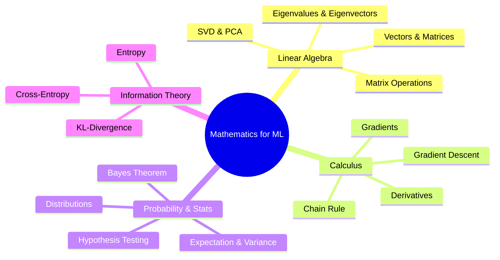
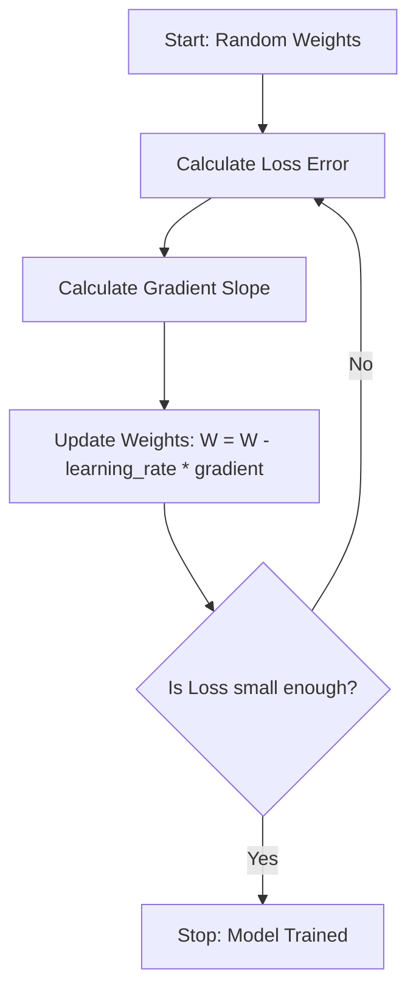

# ML Study Notes — Mathematics for Machine Learning

## 1. Overview
Welcome to Chapter 2! If ML is a car, code is the steering wheel, but **mathematics is the engine**. You don't necessarily need to know how to build the engine from scratch to drive the car (thanks to libraries like Scikit-Learn), but if it breaks down or you want to race, you *must* understand how it works under the hood. 

This chapter covers the three pillars of ML mathematics: **Linear Algebra** (how data is represented), **Calculus** (how models learn), and **Probability & Statistics** (how to handle uncertainty and make predictions).



## 2. Prerequisites
Before diving into this chapter, you should have:
- Completed Chapter 1 (Introduction to ML).
- Basic understanding of Python and its core syntax.
- Basic high school mathematics (functions, basic algebra).

---

## 3. Why Math Matters in ML
Let's build some intuition using a real-world analogy. Imagine you are opening a chai stall.

- **Linear Algebra**: You need to keep track of inventory. $3$ cups of tea, $5$ samosas, and $2$ buns. Instead of writing separate equations, you put them in a list (a vector). Linear Algebra is the language of data. When we feed a $1000 \times 1000$ pixel image into a neural network, it's just a giant grid (matrix) of numbers.
- **Calculus**: You want to maximize your profit. If you increase the price of chai by ₹2, sales might drop. Calculus helps you find the exact "sweet spot" where profit is highest. In ML, Calculus helps models *learn* by minimizing errors (loss).
- **Probability & Statistics**: You don't know exactly how many customers will come tomorrow, but you know the average over the last month. Probability helps you model this uncertainty. It's the logic of making predictions when you aren't 100% sure.

---

## 4. Linear Algebra Essentials

### 4.1 Scalars, Vectors, Matrices, and Tensors
**Intuition**: Think of a scalar as a single point, a vector as a line of points (1D array), a matrix as a spreadsheet (2D array), and a tensor as a cube or higher-dimensional spreadsheet (3D+ array).

**Definitions**:
- **Scalar**: A single number (e.g., $x = 5$). Denotes magnitude.
- **Vector**: A 1D array of numbers. Represents magnitude and direction. $\vec{v} = [1, 2, 3]$
- **Matrix**: A 2D array of numbers with rows and columns.
- **Tensor**: A generalization of matrices to N-dimensions (e.g., RGB images are 3D tensors: Height $\times$ Width $\times$ 3 color channels).

**Python Code**:
```python
import numpy as np

# Scalar
s = np.array(5)
print(f"Scalar ndim: {s.ndim}")

# Vector
v = np.array([1, 2, 3, 4])
print(f"Vector shape: {v.shape}")

# Matrix (2x3)
M = np.array([[1, 2, 3], 
              [4, 5, 6]])
print(f"Matrix shape: {M.shape}")

# Tensor (2x2x2)
T = np.array([[[1, 2], [3, 4]], 
              [[5, 6], [7, 8]]])
print(f"Tensor shape: {T.shape}")
```

### 4.2 Matrix Operations
**Addition & Multiplication**: 
Matrix addition is element-wise (they must be the same shape). 
Matrix multiplication (Dot Product) is different: you multiply rows of the first matrix by columns of the second matrix.
For $C = A \cdot B$, if $A$ is $(m \times n)$ and $B$ is $(n \times p)$, $C$ will be $(m \times p)$.

**Transpose**: Flipping a matrix over its diagonal. Rows become columns. $A^T$.
**Inverse**: The matrix equivalent of division. $A \cdot A^{-1} = I$ (Identity Matrix).

### 4.3 Dot Product and Geometric Meaning
**Math**: For vectors $\vec{a}$ and $\vec{b}$: 
$$\vec{a} \cdot \vec{b} = \sum_{i=1}^{n} a_i b_i$$
Also, $\vec{a} \cdot \vec{b} = \|\vec{a}\| \|\vec{b}\| \cos(\theta)$

**Intuition**: The dot product tells you how much two vectors "point in the same direction". If they are perpendicular, dot product is 0. If they point the same way, it's large. It's the core of calculating similarity (e.g., Cosine Similarity in NLP).

**Python Code**:
```python
a = np.array([1, 2, 3])
b = np.array([4, 5, 6])

# Dot product
dot_prod = np.dot(a, b)
print(f"Dot Product: {dot_prod}") # (1*4) + (2*5) + (3*6) = 32
```

### 4.4 Eigenvalues and Eigenvectors
**Intuition**: Imagine a rubber sheet with a grid drawn on it. If you stretch the sheet horizontally, the horizontal lines just get longer—they don't change their direction. These lines are the **eigenvectors**, and how much they stretched is the **eigenvalue**.
When a matrix transforms a vector, eigenvectors are the vectors whose direction remains unchanged.

**Math**: $A\vec{v} = \lambda\vec{v}$
Where $A$ is a square matrix, $\vec{v}$ is the eigenvector, and $\lambda$ (lambda) is the eigenvalue.

**Python Code**:
```python
A = np.array([[4, 2],
              [1, 3]])

eigenvalues, eigenvectors = np.linalg.eig(A)
print(f"Eigenvalues: {eigenvalues}")
print(f"Eigenvectors:\n{eigenvectors}")
```

### 4.5 Matrix Decomposition (SVD Basics)
**Singular Value Decomposition (SVD)** breaks any matrix into three simpler matrices: $A = U \Sigma V^T$.
- $U$: Left singular vectors.
- $\Sigma$: Diagonal matrix of singular values (importance).
- $V^T$: Right singular vectors.
**Applications in ML**: Dimensionality reduction (PCA), Recommender Systems (collaborative filtering).

---

## 5. Calculus Essentials

### 5.1 Derivatives & Partial Derivatives
**Intuition**: A derivative is just the **rate of change** or the **slope**. If you are driving a car, your position is a function of time. Your speed is the derivative of position. 
In ML, we have a "Loss Function" measuring our error. We want to know: "If I change my model's weights a tiny bit, how much does the error change?"

**Math**: 
$$ f'(x) = \lim_{\Delta x \to 0} \frac{f(x + \Delta x) - f(x)}{\Delta x} $$

**Partial Derivatives**: When a function has multiple variables $f(x, y)$, a partial derivative $\frac{\partial f}{\partial x}$ measures how $f$ changes when we wiggle $x$, while keeping $y$ completely frozen.

### 5.2 Chain Rule
**Intuition**: If changing gear (A) turns gear (B), and gear (B) turns gear (C), how does turning (A) affect (C)? You multiply the effects.
**Math**: $\frac{dz}{dx} = \frac{dz}{dy} \cdot \frac{dy}{dx}$
**Why it matters**: This is the heart of **Backpropagation** in Neural Networks! Neural nets are just nested functions: $f(g(h(x)))$. To find how the input weights affect the final loss, we use the chain rule.

### 5.3 Gradient and Gradient Descent
**Definition**: The **gradient** ($\nabla f$) is a vector containing all the partial derivatives of a function. It points in the direction of the *steepest ascent* (where the function increases most rapidly).

**Gradient Descent (The Ball Rolling Down a Hill)**:
Imagine you are blindfolded on a mountain and want to reach the bottom (minimum error). You feel the slope with your feet (gradient). You take a step in the direction *opposite* to the upward slope.
- Step size = **Learning Rate ($\alpha$)**
- Update rule: $w_{new} = w_{old} - \alpha \nabla f(w_{old})$



**Python Code: Gradient Descent from Scratch for $f(x) = x^2$**
```python
# Function: f(x) = x^2
# Derivative: f'(x) = 2x
# We want to find x that minimizes f(x) (which is x=0)

x = 10.0 # Initial guess
learning_rate = 0.1
iterations = 20

for i in range(iterations):
    gradient = 2 * x
    x = x - learning_rate * gradient
    loss = x**2
    if i % 4 == 0:
        print(f"Iteration {i}: x = {x:.4f}, loss = {loss:.4f}")
        
print(f"Final x: {x:.4f} (Very close to true minimum 0)")
```

### 5.4 Convex vs Non-Convex
- **Convex**: Shaped like a bowl. Has only one minimum (Global minimum). Gradient descent will always find it. (e.g., Linear Regression).
- **Non-Convex**: Has multiple hills and valleys (Local minima). Gradient descent might get stuck in a bad valley. (e.g., Deep Neural Networks).

---

## 6. Probability and Statistics

### 6.1 Basic Statistics (Mean, Variance, Standard Deviation)
- **Mean ($\mu$)**: The average.
- **Variance ($\sigma^2$)**: How spread out the data is. Average squared distance from the mean.
- **Standard Deviation ($\sigma$)**: Square root of variance. Back in the original units of data.

```python
data = np.array([10, 12, 23, 23, 16, 23, 21, 16])
print(f"Mean: {np.mean(data)}")
print(f"Variance: {np.var(data)}")
print(f"Standard Deviation: {np.std(data):.2f}")
```

### 6.2 The Normal (Gaussian) Distribution
**Intuition**: The famous "Bell Curve". Many things in nature follow this: heights of people, exam scores, measurement errors. It is symmetric around the mean.
**Rule of Thumb (68-95-99.7 Rule)**:
- 68% of data falls within 1 standard deviation of the mean.
- 95% falls within 2 std devs.
- 99.7% falls within 3 std devs.

### 6.3 Bayes' Theorem
**Intuition**: Updating your beliefs based on new evidence.
Imagine a spam filter. You get an email with the word "Lottery". What is the probability it's spam?
**Math**: 
$$ P(A|B) = \frac{P(B|A) P(A)}{P(B)} $$
- $P(A|B)$ (Posterior): Prob of spam given it has "Lottery".
- $P(B|A)$ (Likelihood): Prob of "Lottery" given it is a spam email.
- $P(A)$ (Prior): General probability of receiving a spam email.
- $P(B)$ (Evidence): General probability of an email containing "Lottery".

### 6.4 Maximum Likelihood Estimation (MLE)
**Intuition**: You flip a coin 10 times and get 7 heads. Is it a fair coin? MLE asks: "What parameter (probability of heads) makes our observed data (7 heads) the most likely?" Answer: 0.7. It's how many ML models find their parameters!

---

## 7. Correlation and Covariance

Both measure how two variables move together.
- **Covariance**: Unscaled. A positive number means they move together, negative means opposite. Difficult to interpret the magnitude.
- **Correlation (Pearson)**: Scaled between -1 and 1. 
  - $1$: Perfect positive linear relationship.
  - $0$: No linear relationship.
  - $-1$: Perfect negative linear relationship.

```python
import pandas as pd

# Creating a dataframe with fake data
df = pd.DataFrame({
    'Hours_Studied': [2, 4, 6, 8, 10],
    'Test_Score': [50, 60, 70, 85, 95]
})

print("Covariance Matrix:")
print(df.cov())

print("\nCorrelation Matrix:")
print(df.corr()) # Notice values are near 1.0!
```

---

## 8. Information Theory Basics
Information theory quantifies "surprise" or uncertainty.
- **Entropy ($H$)**: Measure of impurity or disorder. High entropy = very unpredictable (a fair coin). Low entropy = predictable (a two-headed coin). Used heavily in Decision Trees to decide where to split data.
  $$ H = - \sum p(x) \log_2 p(x) $$
- **Cross-Entropy**: Compares two probability distributions. Extremely common as a Loss Function in classification problems (Neural Networks, Logistic Regression). It penalizes the model heavily when it is very confident but wrong.

```python
# Entropy of a fair coin (50% Heads, 50% Tails)
p = np.array([0.5, 0.5])
entropy = -np.sum(p * np.log2(p))
print(f"Entropy of fair coin: {entropy} bit") # 1.0 bit (Max uncertainty)

# Entropy of biased coin (90% Heads, 10% Tails)
p2 = np.array([0.9, 0.1])
entropy2 = -np.sum(p2 * np.log2(p2))
print(f"Entropy of biased coin: {entropy2:.4f} bit") # 0.4690 bits (Less uncertain)
```

---

## 9. Comparison Tables

### Calculus Optimization vs Linear Algebra Solution
Sometimes math gives us two ways to solve the same problem (e.g., Linear Regression).

| Feature | Gradient Descent (Calculus) | Normal Equation (Linear Algebra) |
| :--- | :--- | :--- |
| **Speed (Small Data)** | Requires iterations | Single step, very fast |
| **Speed (Large Data)** | Fast and scalable ($O(kn)$) | Very slow matrix inversion ($O(n^3)$) |
| **Complexity** | Need to choose Learning Rate | No hyperparameters needed |
| **Versatility** | Works for almost all ML models | Only works for Linear Regression |

### Probability vs Statistics
| Probability | Statistics |
| :--- | :--- |
| Goes from Model $\rightarrow$ Data | Goes from Data $\rightarrow$ Model |
| "Given this loaded coin, what's the chance of 5 heads?" | "Given 5 heads in a row, is this coin loaded?" |
| Theoretical | Applied |

---

## 10. Common Mistakes & Pitfalls

1. **Confusing Correlation with Causation**: Just because Ice Cream sales and Shark Attacks are highly correlated doesn't mean eating ice cream causes shark attacks. The "confounding variable" is Summer heat.
2. **Learning Rate too high/low**: In gradient descent, a high LR makes the ball bounce over the valley (divergence). A low LR takes years to reach the bottom (slow convergence).
3. **Not scaling data for PCA**: PCA relies on variance (Linear Algebra). If you don't standardize your variables (Stats), a variable in "kilometers" might dwarf a variable in "meters" simply due to scale.

---

## 11. Interview Questions

> 🎯 **Q1: What is the difference between a local minimum and a global minimum, and how does it affect Gradient Descent?**
> *Answer*: A global minimum is the absolute lowest point in the entire loss landscape. A local minimum is a low point relative to its immediate surroundings, but not the lowest overall. Gradient descent can get trapped in local minima in non-convex functions (like Neural Networks), stopping the model from reaching peak performance.

> 🎯 **Q2: Explain the Chain Rule and why it is important in Deep Learning.**
> *Answer*: The chain rule is a calculus rule for differentiating compositions of functions ($f(g(x))$). It is crucial because neural networks are nested functions. Backpropagation uses the chain rule to calculate gradients backwards from the output layer to the input layer to update weights.

> 🎯 **Q3: What is the Curse of Dimensionality?**
> *Answer*: As the number of features (dimensions) increases, the volume of the space increases exponentially. Data becomes sparse, distance metrics (like Euclidean distance) lose meaning, and models overfit easily. We use techniques like PCA (SVD) to reduce dimensions.

> 🎯 **Q4: How do you check if two variables are linearly dependent?**
> *Answer*: Calculate their Pearson correlation coefficient. If it is close to 1 or -1, they have a strong linear relationship. In linear algebra terms, one vector might be a scalar multiple of another.

> 🎯 **Q5: What is a tensor?**
> *Answer*: A tensor is an N-dimensional array. A 0D tensor is a scalar, 1D is a vector, 2D is a matrix. In ML frameworks like PyTorch or TensorFlow, all data is represented as tensors (e.g., a batch of color images is a 4D tensor: Batch_Size $\times$ Channels $\times$ Height $\times$ Width).

---

## 12. Practice Exercises
1. **Easy**: Write a Python function using NumPy to compute the dot product of `[1, 5, 9]` and `[2, 4, 6]`.
2. **Medium**: Implement a simple Gradient Descent loop to find the minimum of the function $f(x) = (x - 3)^2$. Start at $x=0$, use a learning rate of $0.1$.
3. **Medium**: Given a NumPy array of heights `[160, 172, 180, 165, 175, 190, 168]`, calculate the Z-scores (standardize the array so mean=0, std=1) without using Scikit-Learn.
4. **Hard**: Use `numpy.linalg.svd` to decompose a random $4 \times 3$ matrix. Verify that $U \cdot \Sigma \cdot V^T$ reconstructs the original matrix.
5. **Hard**: Calculate the Entropy of a dataset containing 100 positive reviews and 50 negative reviews.

---

## 13. Chapter Summary
- **Linear Algebra**: The spreadsheet logic of ML. Everything is a vector or matrix. Dot products measure similarity. Eigenvectors and SVD help us find the most important directions in data.
- **Calculus**: The optimization engine. Derivatives give us the slope of the error. Gradient descent uses that slope to update weights and minimize loss. Chain rule enables backpropagation.
- **Prob & Stats**: The logic of uncertainty. Standard deviations show spread, Normal distribution models natural noise, Bayes' theorem updates beliefs, and Correlation shows relationships.

---
**Navigation:**
- Previous: [[ml-chapter-01-introduction-to-machine-learning|← Chapter 1: Introduction to ML]]
- Next: [[ml-chapter-03-data-preprocessing-and-eda|Chapter 3: Data Preprocessing →]]
