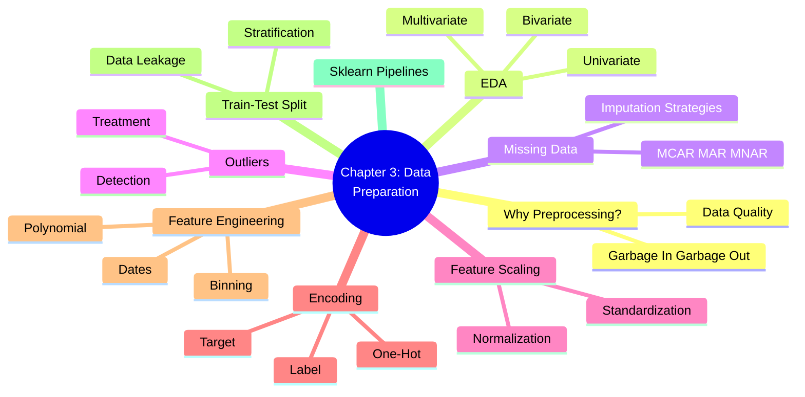
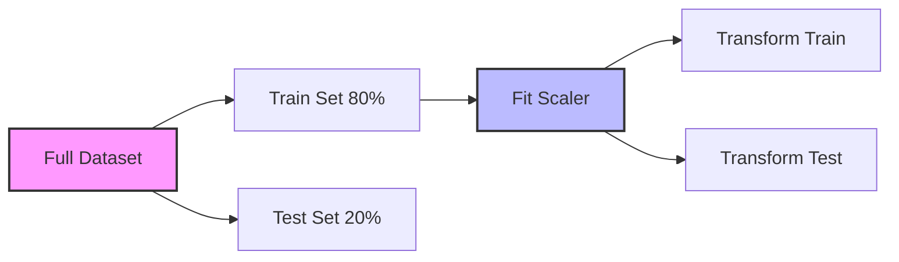

# ML Study Notes — Chapter 3: Data Preprocessing and Exploratory Data Analysis

## 1. Overview

Welcome to Chapter 3! Imagine you are making a perfect cup of chai. No matter how good your recipe is (the machine learning model), if you use spoiled milk or muddy water (bad data), your chai will be terrible. This chapter is all about **filtering the water, picking the best tea leaves, and measuring the exact amount of sugar** before you start brewing. 

In Machine Learning, we call this **Data Preprocessing** and **Exploratory Data Analysis (EDA)**. Before we feed data into any algorithm, we must understand it, clean it, and format it correctly. This step often takes 70-80% of an ML Engineer's time.



## 2. Prerequisites
Before diving into this chapter, you should be comfortable with:
- Basic Python programming
- Pandas DataFrames (`pd.read_csv`, filtering, grouping)
- Numpy arrays and basic mathematical operations
- Basic understanding of what a machine learning model does (from Chapter 1)

---

## 3. Core Concepts

### 3.1. Why Data Preprocessing Matters
**Intuition**: "Garbage in, garbage out" (GIGO). If you feed a model messy, inconsistent, or incorrect data, it will learn the wrong patterns and make bad predictions.

**Definition**: Data preprocessing is the process of transforming raw data into an understandable, clean, and usable format for machine learning algorithms.

**Impact on Models**:
- **Accuracy**: Clean data leads to more accurate models.
- **Speed**: Removing irrelevant features speeds up training.
- **Algorithm Requirements**: Some algorithms (like Linear Regression, KNN) mathematically *require* data to be scaled, or they will fail to converge or give completely wrong importance to features.

---

### 3.2. Exploratory Data Analysis (EDA)
**Intuition**: Before you buy a used car, you inspect it. You check the mileage, look for scratches, and test the engine. EDA is your inspection phase for data.

**Definition**: EDA is an approach to analyzing datasets to summarize their main characteristics, often using statistical graphics and other data visualization methods.

#### Basic Pandas Inspection
```python
import pandas as pd
import numpy as np
import matplotlib.pyplot as plt
import seaborn as sns

# Load a hypothetical dataset
df = pd.read_csv('housing_data.csv')

# 1. Quick look at the data
print(df.head())

# 2. Shape (rows, columns)
print(df.shape)

# 3. Data types and non-null counts
df.info()

# 4. Statistical summary of numerical columns
print(df.describe())
```

#### Univariate Analysis (Analyzing one variable at a time)
Looking at a single column to understand its distribution.

```python
# Histogram for a numerical variable (e.g., House Price)
plt.figure(figsize=(8, 5))
sns.histplot(df['price'], bins=30, kde=True)
plt.title('Distribution of House Prices')
plt.show()

# Value counts for a categorical variable (e.g., Neighborhood)
print(df['neighborhood'].value_counts())
sns.countplot(x='neighborhood', data=df)
plt.show()
```

#### Bivariate Analysis (Analyzing two variables together)
Looking at the relationship between the target variable and a feature, or between two features.

```python
# Scatter plot for numerical vs numerical
plt.figure(figsize=(8, 5))
sns.scatterplot(x='square_feet', y='price', data=df)
plt.title('Price vs Square Feet')
plt.show()

# Boxplot for categorical vs numerical
plt.figure(figsize=(8, 5))
sns.boxplot(x='neighborhood', y='price', data=df)
plt.title('Price by Neighborhood')
plt.show()
```

#### Multivariate Analysis
Looking at more than two variables.

```python
# Correlation Heatmap
plt.figure(figsize=(10, 8))
# Calculate correlation matrix for numeric columns
corr_matrix = df.select_dtypes(include=[np.number]).corr()
sns.heatmap(corr_matrix, annot=True, cmap='coolwarm', fmt=".2f")
plt.title('Correlation Heatmap')
plt.show()

# Pairplot (great for small datasets)
# sns.pairplot(df[['price', 'square_feet', 'num_bedrooms', 'age']])
# plt.show()
```

---

### 3.3. Handling Missing Data
**Intuition**: You are reading a book, but someone tore out a few pages. You can either throw the book away (Drop), try to guess what happened based on the previous pages (Impute), or use a bookmark that says "Page Missing" (Indicator).

#### Types of Missing Data:
1. **MCAR (Missing Completely At Random)**: The missingness has no relationship with any data. (e.g., a gust of wind blew away a survey paper).
2. **MAR (Missing At Random)**: The missingness is related to another observed variable. (e.g., Men might be less likely to fill in their weight than women, but it's random within the 'Men' group).
3. **MNAR (Missing Not At Random)**: The missingness is related to the missing value itself. (e.g., People with very high incomes might refuse to report their income).

#### Detection
```python
# Count missing values per column
print(df.isnull().sum())

# Percentage of missing values
print(df.isnull().mean() * 100)

# Optional: Visualize missing data using missingno library
# import missingno as msno
# msno.matrix(df)
```

#### Strategies
```python
from sklearn.impute import SimpleImputer, KNNImputer

# Strategy 1: Drop (Only if missing data is < 5% and MCAR)
df_dropped = df.dropna() 
# Drop columns with > 50% missing
# df.dropna(axis=1, thresh=len(df)*0.5)

# Strategy 2: Mean/Median/Mode Imputation (Simple but reduces variance)
# Mean for normally distributed, Median for skewed data, Mode for categorical
mean_imputer = SimpleImputer(strategy='mean')
df['age_imputed'] = mean_imputer.fit_transform(df[['age']])

# Strategy 3: KNN Imputation (Finds similar rows and averages their values)
# Powerful but computationally expensive
knn_imputer = KNNImputer(n_neighbors=5)
df[['age', 'income']] = knn_imputer.fit_transform(df[['age', 'income']])
```

---

### 3.4. Handling Outliers
**Intuition**: In a class of 30 students, most scored between 60 and 90 on a test. One student scored 5 (slept through it) and one scored 100 (a genius). These are outliers. If you calculate the average, they skew the result.

#### Detection
1. **Z-Score**: Assumes data is normally distributed. Anything outside -3 to +3 standard deviations is an outlier.
2. **IQR (Interquartile Range)**: Works well for skewed data.
   - $IQR = Q3 - Q1$
   - Lower Bound = $Q1 - 1.5 \times IQR$
   - Upper Bound = $Q3 + 1.5 \times IQR$

```python
# IQR Method Code
Q1 = df['price'].quantile(0.25)
Q3 = df['price'].quantile(0.75)
IQR = Q3 - Q1

lower_bound = Q1 - 1.5 * IQR
upper_bound = Q3 + 1.5 * IQR

# Find outliers
outliers = df[(df['price'] < lower_bound) | (df['price'] > upper_bound)]
print(f"Number of outliers: {len(outliers)}")
```

#### Treatment
```python
# 1. Removal (Trimming)
df_no_outliers = df[(df['price'] >= lower_bound) & (df['price'] <= upper_bound)]

# 2. Capping (Winsorization) - Cap values at the boundaries
df['price_capped'] = np.where(df['price'] > upper_bound, upper_bound,
                     np.where(df['price'] < lower_bound, lower_bound, df['price']))

# 3. Log Transformation (Compresses large values, great for right-skewed data like salary/price)
df['price_log'] = np.log1p(df['price']) # log1p handles 0 values safely
```

---

### 3.5. Feature Scaling
**Intuition**: Imagine comparing the height of a building (100 meters) and the weight of a person (70 kg). To an algorithm, 100 is bigger than 70. But they are completely different units! Distance-based algorithms (KNN, SVM, K-Means) or Gradient Descent based algorithms (Linear Regression, Neural Networks) will be biased towards features with larger numbers. Scaling brings everything to the same playing field.

**Note**: Tree-based algorithms (Decision Trees, Random Forests, XGBoost) **do not** require feature scaling!

#### Mathematical Foundation
**Standardization (Z-score normalization)**: Centers data around 0 with a standard deviation of 1.
$$ z = \frac{x - \mu}{\sigma} $$

**Normalization (Min-Max Scaling)**: Scales data to a fixed range, usually [0, 1].
$$ x_{scaled} = \frac{x - x_{min}}{x_{max} - x_{min}} $$

```python
from sklearn.preprocessing import StandardScaler, MinMaxScaler, RobustScaler

# Note: Fit on train data, transform train and test data!
data = np.array([[100, 0.001], 
                 [8,   0.05], 
                 [50,  0.005], 
                 [88,  0.07], 
                 [4,   0.1]])

# StandardScaler
std_scaler = StandardScaler()
data_std = std_scaler.fit_transform(data)

# MinMaxScaler
minmax_scaler = MinMaxScaler()
data_minmax = minmax_scaler.fit_transform(data)

# RobustScaler (Uses Median and IQR, robust to outliers!)
robust_scaler = RobustScaler()
data_robust = robust_scaler.fit_transform(data)
```

---

### 3.6. Encoding Categorical Variables
**Intuition**: Machine learning models only understand numbers. If a column says "Red", "Green", "Blue", the model is confused. We have to translate these words into a mathematical format.

1. **Nominal Data**: No order (e.g., City: Mumbai, Delhi, Chennai).
2. **Ordinal Data**: Has order (e.g., Size: Small, Medium, Large).

#### Techniques
```python
import pandas as pd
from sklearn.preprocessing import LabelEncoder, OneHotEncoder, OrdinalEncoder

# Sample Data
df_cat = pd.DataFrame({
    'city': ['Mumbai', 'Delhi', 'Chennai', 'Mumbai'], # Nominal
    'size': ['Small', 'Large', 'Medium', 'Small']     # Ordinal
})

# 1. Label/Ordinal Encoding (For Ordinal Data)
# Note: LabelEncoder is usually for the target variable (y), OrdinalEncoder for features (X)
size_mapping = {'Small': 1, 'Medium': 2, 'Large': 3}
df_cat['size_encoded'] = df_cat['size'].map(size_mapping)

# 2. One-Hot Encoding (For Nominal Data)
# Creates a binary column for each category. 
# Avoids the model thinking Delhi (1) is less than Mumbai (2).
# Using Pandas:
df_dummies = pd.get_dummies(df_cat['city'], prefix='city', drop_first=True) 
# drop_first=True avoids the "Dummy Variable Trap" (perfect multicollinearity)

# Using Sklearn (Better for pipelines):
ohe = OneHotEncoder(drop='first', sparse_output=False)
city_encoded = ohe.fit_transform(df_cat[['city']])
```

---

### 3.7. Feature Engineering Basics
**Intuition**: Giving the model the raw ingredients vs giving it chopped and prepped ingredients. Sometimes creating a new feature helps the model find patterns easier.

```python
# 1. Creating new features from existing ones
df['price_per_sqft'] = df['price'] / df['square_feet']

# 2. Date/Time Extraction
df['date'] = pd.to_datetime('2023-10-25') # Example
df['year'] = df['date'].dt.year
df['month'] = df['date'].dt.month
df['is_weekend'] = df['date'].dt.dayofweek >= 5

# 3. Binning (Converting continuous to categorical)
bins = [0, 18, 35, 60, 100]
labels = ['Child', 'Young Adult', 'Adult', 'Senior']
df['age_group'] = pd.cut(df['age'], bins=bins, labels=labels)
```

---

### 3.8. Train-Test Split and Data Leakage
**Intuition**: If you give a student the exact exam paper to study the night before, they will score 100%. But did they learn the subject, or just memorize the answers? To truly test a model, we must hide a portion of the data during training and use it only for the final exam.

**Data Leakage**: This happens when information from outside the training dataset is used to create the model. 
*CRITICAL MISTAKE*: Applying StandardScaler or Imputation to the ENTIRE dataset before splitting. The mean/standard deviation will include information from the test set! 
*FIX*: Always split first, then `fit` on train, and `transform` on train and test.



```python
from sklearn.model_selection import train_test_split

X = df.drop('price', axis=1) # Features
y = df['price']              # Target

# Standard Split
X_train, X_test, y_train, y_test = train_test_split(X, y, test_size=0.2, random_state=42)

# Stratified Split (Crucial for imbalanced classification tasks)
# Ensures the proportion of classes is the same in train and test
# X_train, X_test, y_train, y_test = train_test_split(X, y_classification, test_size=0.2, stratify=y_classification, random_state=42)
```

---

### 3.9. Data Pipeline with Sklearn
**Intuition**: Instead of doing imputation, scaling, and encoding manually step-by-step (which is prone to errors and data leakage), we build an assembly line. 

```python
from sklearn.pipeline import Pipeline
from sklearn.compose import ColumnTransformer
from sklearn.impute import SimpleImputer
from sklearn.preprocessing import StandardScaler, OneHotEncoder
from sklearn.linear_model import LinearRegression

# Assume X_train has numerical columns 'age', 'income' and categorical column 'city'
numeric_features = ['age', 'income']
categorical_features = ['city']

# 1. Create a pipeline for numerical data
numeric_transformer = Pipeline(steps=[
    ('imputer', SimpleImputer(strategy='median')),
    ('scaler', StandardScaler())
])

# 2. Create a pipeline for categorical data
categorical_transformer = Pipeline(steps=[
    ('imputer', SimpleImputer(strategy='most_frequent')),
    ('onehot', OneHotEncoder(handle_unknown='ignore', drop='first'))
])

# 3. Combine them using ColumnTransformer
preprocessor = ColumnTransformer(
    transformers=[
        ('num', numeric_transformer, numeric_features),
        ('cat', categorical_transformer, categorical_features)
    ])

# 4. Append classifier/regressor to preprocessing pipeline
full_pipeline = Pipeline(steps=[
    ('preprocessor', preprocessor),
    ('model', LinearRegression())
])

# 5. Fit and Predict
# full_pipeline.fit(X_train, y_train)
# predictions = full_pipeline.predict(X_test)
```

---

## 4. Comparison Tables

### Scaler Comparison

| Scaler | What it does | When to use |
| :--- | :--- | :--- |
| **StandardScaler** | Mean=0, Variance=1 | Default choice for most algorithms (SVM, LogReg, PCA). Assumes normal distribution. |
| **MinMaxScaler** | Scales strictly to [0, 1] | When the algorithm expects inputs in a bounded interval (e.g., Neural Networks, Image pixels). |
| **RobustScaler** | Uses Median and IQR | When your data has many extreme outliers that you cannot remove. |

### Encoding Comparison

| Encoding Type | Description | Best For | Watch out for |
| :--- | :--- | :--- | :--- |
| **Label / Ordinal** | Maps to integers (1, 2, 3...) | Ordinal data (Low/Med/High), Tree-based models | Distance-based algorithms assuming order where none exists. |
| **One-Hot Encoding**| Binary columns for each class | Nominal data (Colors, Cities), Linear Models | High cardinality features (creates too many columns). |
| **Target Encoding** | Replaces category with mean of target | High cardinality categorical variables | Overfitting (requires cross-validation / smoothing). |

---

## 5. Common Mistakes & Pitfalls

1. **Data Leakage**: Scaling or imputing *before* `train_test_split`.
2. **Ignoring the Dummy Variable Trap**: Not using `drop_first=True` or `drop='first'` in One-Hot Encoding when using Linear Regression, leading to perfect multicollinearity.
3. **Applying Scaling to Target Variable blindly**: Usually, you only scale `X`. Scaling `y` (target) can make interpretation harder, though sometimes needed for Neural Networks.
4. **Using LabelEncoder for X features in Linear Models**: Giving "Mumbai=1", "Delhi=2", "Chennai=3" tells a linear regression model that Chennai is 3x larger/better than Mumbai. Use One-Hot instead.
5. **Not Saving the Scaler**: In production, you must scale new user data using the *exact same* scaler `transform()` that was fitted on the training data. If you fit a new scaler, predictions will be garbage.

---

## 6. Interview Questions 🎯

1. **🎯 What is Data Leakage and how do you prevent it?**
   *Answer*: Data leakage is when information from outside the training dataset is used to create the model, leading to overly optimistic performance on training but failure in production. Prevent it by splitting data into train/test *before* applying any transformations like scaling or imputation, and using pipelines.

2. **🎯 Why don't Decision Trees require feature scaling?**
   *Answer*: Decision trees split data based on thresholds (e.g., `Age > 30`). The scale of the feature doesn't affect the split point relative to the data. Distance-based models like KNN compute Euclidean distance, so large magnitude features would dominate without scaling.

3. **🎯 What is the Dummy Variable Trap?**
   *Answer*: When using one-hot encoding, if you create a column for every category, the columns become perfectly collinear (they add up to 1). This breaks algorithms that require matrix inversion (like OLS Linear Regression). Solution: Drop one of the encoded columns (e.g., if Male=1, Female=0, you don't need a Female column).

4. **🎯 Explain the difference between MCAR, MAR, and MNAR.**
   *Answer*: MCAR (Missing Completely At Random) means no pattern to the missingness. MAR (Missing At Random) means missingness can be explained by other observed variables. MNAR (Missing Not At Random) means the missingness is related to the specific value that is missing.

5. **🎯 When would you choose Median Imputation over Mean Imputation?**
   *Answer*: When the data is highly skewed or contains significant outliers. The mean is easily pulled by extreme values, whereas the median represents the middle of the distribution robustly.

---

## 7. Practice Exercises

1. **Basic EDA**: Load the `titanic` dataset using seaborn (`sns.load_dataset('titanic')`). Use `.info()`, `.describe()`, and plot a histogram of passenger ages.
2. **Imputation**: In the Titanic dataset, the `age` column has missing values. Fill these missing values using the median age of the respective passenger class (`pclass`).
3. **Outlier Treatment**: Generate a random array of 1000 numbers from a normal distribution. Add 5 extreme values (e.g., 9999). Write a function to detect and cap these outliers using the IQR method.
4. **Encoding**: Create a dummy DataFrame with a column containing 50 unique ZIP codes. Why is One-Hot Encoding a bad idea here? Try using Target Encoding (you can use `category_encoders` library or manually group by ZIP and calculate the mean of a target variable).
5. **Pipelines**: Build a complete `sklearn` Pipeline that takes raw data containing both numeric and categorical columns, imputes missing values, scales numericals, one-hot encodes categoricals, and fits a basic estimator (e.g., `DummyRegressor` or `LinearRegression`).

---

## 8. Chapter Summary
- **Garbage In, Garbage Out**: Model quality depends heavily on data quality.
- **EDA**: Look at your data using pandas and plots (histograms, boxplots, heatmaps) to understand distributions and relationships.
- **Missing Values**: Identify the mechanism (MCAR, MAR, MNAR) and apply appropriate imputation (mean, median, KNN).
- **Outliers**: Detect using IQR or Z-score. Trim or cap them depending on domain knowledge.
- **Scaling**: Standardize (Z-score) or Normalize (Min-Max) for distance/gradient-based algorithms.
- **Encoding**: Label encode ordinal data, One-Hot encode nominal data.
- **Data Leakage**: Always split your data BEFORE applying preprocessing transformations. Use Sklearn Pipelines to automate and safeguard this process.

---
## Navigation
- Previous: [[ml-chapter-02-mathematics-for-ml|← Chapter 2: Mathematics for ML]]
- Next: [[ml-chapter-04-linear-regression|Chapter 4: Linear Regression →]]
