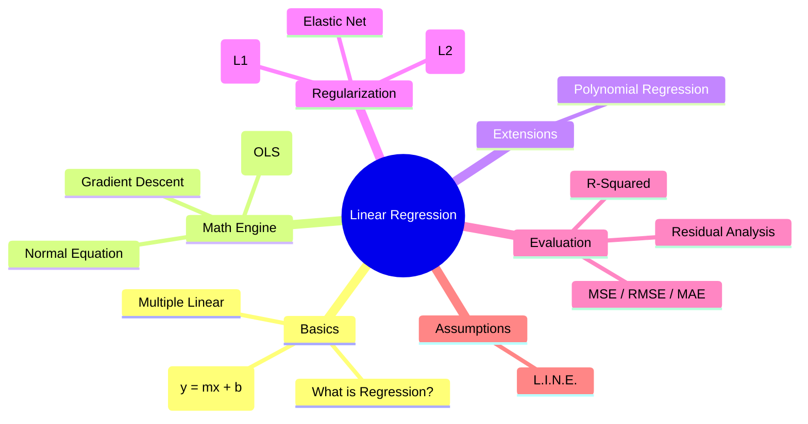
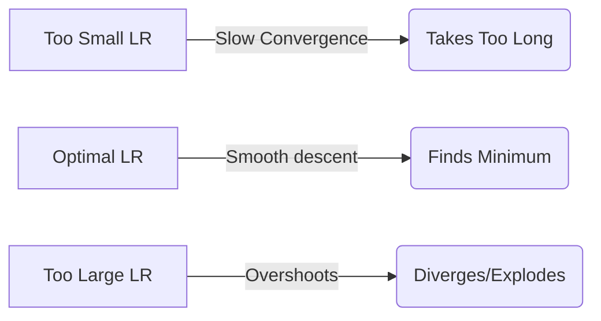

# ML Study Notes — Chapter 4: Linear Regression

Welcome to Chapter 4! Today we tackle **Linear Regression**, the granddaddy of all machine learning algorithms. While it might sound basic, mastering it gives you the foundation for almost every advanced algorithm, including Neural Networks.

## Overview

Here's the learning path for this chapter:



## Prerequisites
Before diving into this chapter, ensure you are comfortable with:
- Basic Python (Numpy, Pandas)
- Basic Calculus (derivatives)
- Matrix Multiplication (Linear Algebra basics)
- Chapter 3: Data Preprocessing

---

## 1. What is Regression?

### Intuition
Imagine you run a *Chai Stall* near a college campus. You've noticed that on colder days, you sell more cups of tea. If you can model this relationship, you can predict exactly how much milk to buy based on tomorrow's weather forecast. That prediction—estimating a **continuous number** (cups of tea) based on inputs (temperature)—is **Regression**.

### Definition
Regression is a supervised learning technique used to predict a continuous numerical value.

**Real-world Examples:**
- Predicting house prices based on square footage and location.
- Forecasting a company's revenue for the next quarter.
- Estimating the remaining lifespan of a machine in a factory.

---

## 2. Simple Linear Regression

### Intuition: The Best Fit Line
Let's stick with our Chai Stall. We plot Temperature (x-axis) vs. Cups Sold (y-axis). We see a downward trend. Simple Linear Regression tries to draw a straight line through these points that best captures the trend. 

### Mathematical Foundation
The equation of a straight line is:
$$ y = w_1x + w_0 $$
(You might know it as $y = mx + c$)

- $y$: Dependent variable (target to predict, e.g., Cups sold)
- $x$: Independent variable (feature, e.g., Temperature)
- $w_1$: Weight or Slope (how much y changes for a unit change in x)
- $w_0$: Bias or Intercept (the value of y when x is 0)

### Cost Function: Mean Squared Error (MSE)
How do we know if our line is good? We measure the errors! For every point, we calculate the difference between the actual value ($y_i$) and the predicted value ($\hat{y}_i$). We square these differences (to ignore negative signs and penalize large errors) and average them out.

$$ MSE = J(w_0, w_1) = \frac{1}{n} \sum_{i=1}^{n} (y_i - \hat{y}_i)^2 $$

### Ordinary Least Squares (OLS)
OLS is the mathematical derivation to find the exact $w_0$ and $w_1$ that minimize the MSE. Using calculus (setting partial derivatives to 0), we get closed-form formulas for them.

### Python Code: From Scratch vs. Sklearn

```python
import numpy as np
import matplotlib.pyplot as plt
from sklearn.linear_model import LinearRegression

# 1. Generate Toy Data
np.random.seed(42)
X = 2 * np.random.rand(100, 1) # Temperature
y = 4 + 3 * X + np.random.randn(100, 1) # Cups sold (with noise)

# --- APPROACH 1: FROM SCRATCH (using formulas) ---
x_mean = np.mean(X)
y_mean = np.mean(y)

# Calculate slope (w1) and intercept (w0)
numerator = np.sum((X - x_mean) * (y - y_mean))
denominator = np.sum((X - x_mean)**2)
w1_scratch = numerator / denominator
w0_scratch = y_mean - (w1_scratch * x_mean)

print(f"Scratch -> Intercept: {w0_scratch:.4f}, Slope: {w1_scratch:.4f}")

# --- APPROACH 2: SKLEARN ---
lin_reg = LinearRegression()
lin_reg.fit(X, y)

print(f"Sklearn -> Intercept: {lin_reg.intercept_[0]:.4f}, Slope: {lin_reg.coef_[0][0]:.4f}")

# Visualizing
plt.scatter(X, y, color='blue', label='Actual Data')
plt.plot(X, lin_reg.predict(X), color='red', label='Best Fit Line')
plt.xlabel('Temperature (X)')
plt.ylabel('Cups Sold (y)')
plt.legend()
plt.show()
```

---

## 3. Multiple Linear Regression

### Intuition
What if cup sales depend on Temperature AND whether it's an exam week? Now we have multiple features. We are no longer fitting a line in 2D space, but a plane in 3D space, or a hyperplane in n-dimensional space.

### Equation
$$ y = w_0 + w_1x_1 + w_2x_2 + ... + w_nx_n $$

### Matrix Form
$$ \mathbf{y} = \mathbf{X}\mathbf{w} $$
Where $\mathbf{X}$ is our feature matrix (with a column of 1s added for the intercept $w_0$), and $\mathbf{w}$ is our vector of weights.

### The Normal Equation
We can solve for all weights simultaneously using linear algebra:
$$ \mathbf{w} = (\mathbf{X}^T\mathbf{X})^{-1}\mathbf{X}^T\mathbf{y} $$

### Python Code: Multiple Regression
```python
from sklearn.datasets import fetch_california_housing
from sklearn.model_selection import train_test_split

# Load real dataset
california = fetch_california_housing()
X_multi, y_multi = california.data, california.target

# Split data
X_train, X_test, y_train, y_test = train_test_split(X_multi, y_multi, test_size=0.2, random_state=42)

# Train model
multi_reg = LinearRegression()
multi_reg.fit(X_train, y_train)

print(f"Intercept: {multi_reg.intercept_:.4f}")
print(f"Weights (first 3): {multi_reg.coef_[:3]}")
print(f"Train R2: {multi_reg.score(X_train, y_train):.4f}")
print(f"Test R2: {multi_reg.score(X_test, y_test):.4f}")
```

---

## 4. Gradient Descent

### Intuition
Imagine you are blindfolded at the top of a mountain, and your goal is to reach the valley (the minimum error). You feel the slope of the ground with your foot, take a step downhill, and repeat until the ground is flat. This is Gradient Descent!

### The Algorithm
1. Initialize weights randomly.
2. Calculate the gradient (slope) of the cost function (MSE).
3. Update weights in the opposite direction of the gradient.
4. Repeat until convergence.

$$ w_j := w_j - \alpha \frac{\partial}{\partial w_j} J(w) $$
Where $\alpha$ is the **Learning Rate** (size of the step).

### Learning Rate ($\alpha$)
- **Too small**: Takes forever to reach the bottom (slow convergence).
- **Too large**: Jumps over the valley, diverges to infinity.



### Types of Gradient Descent
| Type | How much data used per step? | Pros | Cons |
|---|---|---|---|
| **Batch GD** | Entire dataset | Stable, exact path | Slow on large data, memory intensive |
| **Stochastic (SGD)** | 1 random sample | Fast, escapes local minima | Noisy, bounces around minimum |
| **Mini-batch GD** | Small batch (e.g., 32, 64) | Best of both worlds (Sweet spot) | Requires tuning batch size |

### Python Code: GD from Scratch
```python
def gradient_descent(X, y, lr=0.1, epochs=1000):
    m = len(y)
    # Add x0=1 for intercept
    X_b = np.c_[np.ones((m, 1)), X]
    weights = np.random.randn(2, 1) # Random init

    for epoch in range(epochs):
        predictions = X_b.dot(weights)
        errors = predictions - y
        gradients = (2/m) * X_b.T.dot(errors)
        weights = weights - lr * gradients
        
    return weights

w_gd = gradient_descent(X, y)
print(f"GD -> Intercept: {w_gd[0][0]:.4f}, Slope: {w_gd[1][0]:.4f}")
```

---

## 5. Polynomial Regression

### Intuition
What if the relationship isn't a straight line? What if it's a curve? (e.g., the trajectory of a cricket ball). We can add powers of our original features to make our linear model fit nonlinear data!

Note: It's still called *Linear* Regression because it is linear with respect to the *weights*, even though the features are polynomial.

### Python Code: PolynomialFeatures
```python
from sklearn.preprocessing import PolynomialFeatures

# Generate curved data
m = 100
X_poly_data = 6 * np.random.rand(m, 1) - 3
y_poly_data = 0.5 * X_poly_data**2 + X_poly_data + 2 + np.random.randn(m, 1)

# Transform features
poly_features = PolynomialFeatures(degree=2, include_bias=False)
X_poly = poly_features.fit_transform(X_poly_data) # Now contains X and X^2

lin_reg_poly = LinearRegression()
lin_reg_poly.fit(X_poly, y_poly_data)

print(f"Actual equation: y = 0.5x^2 + 1x + 2")
print(f"Predicted equation: y = {lin_reg_poly.coef_[0][1]:.2f}x^2 + {lin_reg_poly.coef_[0][0]:.2f}x + {lin_reg_poly.intercept_[0]:.2f}")
```

**Danger:** High-degree polynomials will perfectly memorize the training data (overfitting) but fail terribly on new data.

---

## 6. Assumptions of Linear Regression (L.I.N.E.)

If these assumptions fail, your model's predictions and statistical significance are invalid.

1. **L**inearity: The relationship between X and y is linear. (Check: Scatter plot)
2. **I**ndependence: Observations are independent of each other (crucial in time-series). (Check: Durbin-Watson test)
3. **N**ormality of Residuals: The errors (residuals) are normally distributed. (Check: Q-Q plot or Histogram of residuals)
4. **E**qual Variance (Homoscedasticity): The variance of residuals is constant across all predicted values. (Check: Residual vs. Fitted plot)

---

## 7. Regularization (Fighting Overfitting)

When we have too many features (or high-degree polynomials), weights can become massive. Regularization adds a penalty to the cost function to keep weights small.

### Ridge Regression (L2 Penalty)
Shrinks weights toward zero, but rarely exactly zero. Good when most features are useful.
$$ Cost = MSE + \lambda \sum_{j=1}^{n} w_j^2 $$

### Lasso Regression (L1 Penalty)
Shrinks less important feature weights *exactly to zero*. **Acts as automatic feature selection!**
$$ Cost = MSE + \lambda \sum_{j=1}^{n} |w_j| $$

### Elastic Net
Combines L1 and L2. Use when you have millions of features and many are correlated.

### Comparison Table
| Feature | Ridge (L2) | Lasso (L1) | Elastic Net |
|---|---|---|---|
| **Penalty** | Squared weights | Absolute weights | Both |
| **Sparsity (Weights=0)** | No | Yes (Feature Selection) | Yes |
| **Handles Collinearity** | Great | Picks one, ignores rest | Good |
| **When to use?** | Default choice | Need interpretable model (few features) | Lots of features, highly correlated |

```python
from sklearn.linear_model import Ridge, Lasso, ElasticNet

# Ridge
ridge_reg = Ridge(alpha=1.0)
ridge_reg.fit(X_train, y_train)

# Lasso
lasso_reg = Lasso(alpha=0.1)
lasso_reg.fit(X_train, y_train)
```

---

## 8. Evaluation Metrics for Regression

How do we measure success?

| Metric | Formula | Interpretation | When to use |
|---|---|---|---|
| **MAE** (Mean Absolute Error) | $\frac{1}{n}\sum \|y - \hat{y}\|$ | Average error in original units | When outliers aren't a big deal |
| **MSE** (Mean Squared Error) | $\frac{1}{n}\sum (y - \hat{y})^2$ | Penalizes large errors | Math-friendly (differentiable for GD) |
| **RMSE** (Root Mean Squared Error)| $\sqrt{MSE}$ | Error in original units, penalizes outliers | Standard metric for most regression tasks |
| **R² Score** | $1 - \frac{SSR}{SST}$ | % of variance explained by model (0 to 1) | To compare models irrespective of scale |

```python
from sklearn.metrics import mean_squared_error, mean_absolute_error, r2_score

preds = multi_reg.predict(X_test)

mae = mean_absolute_error(y_test, preds)
mse = mean_squared_error(y_test, preds)
rmse = np.sqrt(mse)
r2 = r2_score(y_test, preds)

print(f"MAE: {mae:.2f}, RMSE: {rmse:.2f}, R2: {r2:.2f}")
```

---

## 9. Complete Project: House Price Prediction

Let's tie it all together in a mini-workflow. We usually perform EDA, Preprocessing, Training, and Evaluation. Here is a conceptual flow (the real code would combine what we've learned above):

1. **Load**: `df = pd.read_csv('housing.csv')`
2. **EDA**: `sns.pairplot(df)` to check for linearity.
3. **Preprocess**: `StandardScaler()` on features.
4. **Train**: `model = Ridge(alpha=1.0); model.fit(X_train, y_train)`
5. **Evaluate**: Calculate RMSE and R2 on the test set.
6. **Interpret**: Look at `model.coef_` to see which features impact price the most!

---

## 10. Residual Analysis

Residuals are the errors ($y - \hat{y}$). Plotting them helps verify assumptions.

```python
import seaborn as sns

residuals = y_test - preds
plt.figure(figsize=(10,4))

# 1. Residuals vs Predicted (Checks Homoscedasticity)
plt.subplot(1, 2, 1)
plt.scatter(preds, residuals, alpha=0.5)
plt.axhline(0, color='r', linestyle='--')
plt.title('Residuals vs Fitted')

# 2. Histogram of Residuals (Checks Normality)
plt.subplot(1, 2, 2)
sns.histplot(residuals, kde=True)
plt.title('Distribution of Residuals')
plt.show()
```
*If the first plot looks like a funnel (cone shape), you have Heteroscedasticity (bad!). It should look like a random cloud of points.*

---

## 11. Common Mistakes & Pitfalls
1. **Forgetting to scale features**: Gradient descent struggles massively if features are on different scales (e.g., Age 0-100 vs Income 0-1,000,000). Always use `StandardScaler`.
2. **Ignoring outliers**: OLS minimizes *squared* errors, making it highly sensitive to outliers.
3. **Multicollinearity**: If two features are highly correlated (e.g., House Area in sq_ft and House Area in sq_meters), OLS weights become unstable. Use Ridge or drop one feature.

---

## 12. Interview Questions 🎯

**Q1: What is the difference between R² and Adjusted R²?**
> **Answer**: R² always increases or stays the same as you add more features, even if they are useless (like predicting house price using the owner's shoe size). Adjusted R² penalizes you for adding useless features, giving a truer measure of model quality.

**Q2: Why do we use MSE as a cost function instead of MAE in OLS?**
> **Answer**: MSE is a smooth, continuous, and convex function, meaning it has a single global minimum and is easily differentiable. MAE is not differentiable at 0, making gradient descent mathematically trickier.

**Q3: When would you use Lasso over Ridge?**
> **Answer**: When I have hundreds of features and I suspect only a few are actually important. Lasso will shrink the unimportant feature weights to exactly zero, giving me a simpler, more interpretable model (feature selection).

**Q4: Your model's training error is low, but test error is very high. What is happening and how do you fix it?**
> **Answer**: The model is overfitting. I would fix it by: 1) Gathering more data, 2) Reducing model complexity (fewer polynomial degrees), or 3) Applying Regularization (Ridge/Lasso).

**Q5: What happens if features are perfectly correlated in Linear Regression?**
> **Answer**: The matrix $(X^TX)$ becomes singular (non-invertible), meaning the Normal Equation cannot be solved mathematically. In practice, algorithms will become highly unstable.

---

## 13. Practice Exercises

1. **Warm-up**: Code a Simple Linear Regression model using `sklearn` on a custom dataset of 10 points. Print the slope and intercept.
2. **Standardization Check**: Train a Gradient Descent model on unscaled data, then on scaled data. Observe the difference in convergence time and final MSE.
3. **Polynomial Fit**: Generate data using a cubic function ($ax^3 + bx^2 + cx + d$) with noise. Try fitting a linear model vs a polynomial model of degree 3. Plot both.
4. **Regularization Showdown**: Load the `fetch_california_housing` dataset. Train OLS, Ridge, and Lasso. Compare their R² scores and count how many coefficients are exactly 0 in the Lasso model.
5. **Assumption Checking**: Take your best model from Exercise 4, calculate the residuals on the training set, and plot a histogram to check for normality.

---
**Navigation:**
- Previous: [[ml-chapter-03-data-preprocessing-and-eda|← Chapter 3: Data Preprocessing]]
- Next: [[ml-chapter-05-logistic-regression-and-classification|Chapter 5: Logistic Regression →]]
