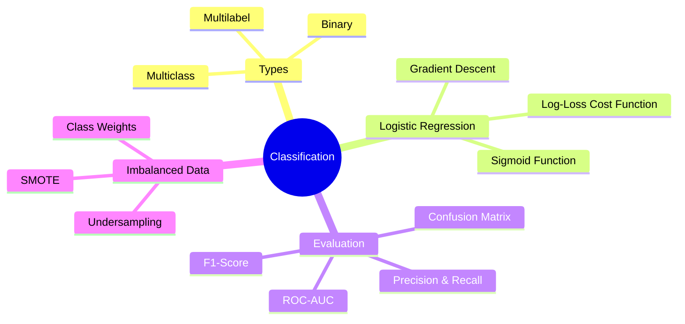
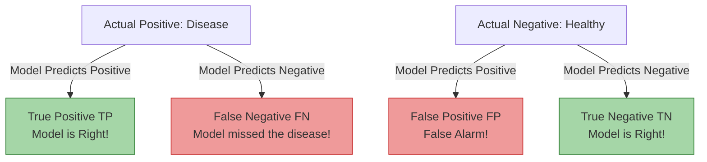

# ML Study Notes — Chapter 5: Logistic Regression and Classification

## Overview

Welcome to Chapter 5! In the previous chapter, we learned how to predict continuous numbers (like house prices) using Linear Regression. But what if we want to predict a *category* instead? Is this email Spam or Not Spam? Is this tumor Malignant or Benign? Will the customer Churn or Stay? This is where **Classification** comes in.

In this exhaustive guide, we'll master Classification, focusing primarily on **Logistic Regression**—the foundational classification algorithm. We'll also take a deep dive into evaluation metrics (because Accuracy is often a trap!) and learn how to handle tricky, imbalanced datasets.



---

## Prerequisites
Before diving in, you should have:
- Mastered Python (especially `numpy` and `pandas`)
- Basic understanding of Linear Regression (from Chapter 4)
- Basic understanding of gradient descent and cost functions
- Familiarity with the equation of a line ($y = mx + c$ or $y = WX + b$)

---

## 1. What is Classification?

### Intuition: The Sorting Hat
Imagine you're the Sorting Hat at Hogwarts. A student puts you on their head, and based on their traits (features like bravery, intelligence, loyalty), you have to assign them to one of four discrete houses (categories). You aren't predicting a continuous number (like how many house points they will earn); you are predicting a **class label**. This is the essence of classification.

### Definition
Classification is a type of Supervised Learning where the goal is to predict the categorical class labels of new instances, based on past observations.

### Real-World Examples
- **Spam Detection**: Spam (1) vs. Not Spam (0)
- **Medical Diagnosis**: Disease present (1) vs. Disease absent (0)
- **Image Recognition**: Cat, Dog, or Bird

---

## 2. Binary vs Multiclass vs Multilabel Classification

Let's break down the different flavors of classification:

| Type | Definition | Example | Output Format |
|---|---|---|---|
| **Binary Classification** | Two mutually exclusive classes. The core building block. | Spam vs. Not Spam; Fraud vs. Legit. | $y \in \{0, 1\}$ |
| **Multiclass Classification** | Three or more mutually exclusive classes. An instance belongs to exactly *one* class. | Predicting if an image is an Apple, Banana, OR Orange. | $y \in \{0, 1, 2, ..., K\}$ |
| **Multilabel Classification** | Multiple non-exclusive classes. An instance can belong to *multiple* classes simultaneously. | A movie being tagged as Action AND Comedy AND Sci-Fi. | $y \in \{[1,0,1], [0,1,1]\}$ (vector of binary flags) |

---

## 3. Logistic Regression: The Foundational Classifier

### Why Linear Regression Fails for Classification
**Intuition**: Imagine you want to predict if a tumor is malignant (1) or benign (0) based on its size. You fit a linear regression line. The line might output values like -2.5 or +5.8. How do you interpret a prediction of -2.5? It doesn't make sense for a probability or a binary class.
Furthermore, if you get a massive outlier (a giant malignant tumor), it will pull the linear regression line towards it, severely messing up the decision boundary for normal-sized tumors.

**Linear Regression predicts values from $-\infty$ to $+\infty$. Classification needs probabilities between $0$ and $1$.**

### The Sigmoid Function (Logistic Function)
To fix this, we need a mathematical function that takes *any* real number (from $-\infty$ to $+\infty$) and squashes it into a range between 0 and 1. Enter the **Sigmoid Function**, denoted by $\sigma(z)$.

**Mathematical Foundation:**
$$ \sigma(z) = \frac{1}{1 + e^{-z}} $$

Where $z$ is the output of our linear model:
$$ z = w_1x_1 + w_2x_2 + ... + w_nx_n + b = W^TX + b $$

So, our Logistic Regression hypothesis becomes:
$$ h_\theta(x) = \frac{1}{1 + e^{-(W^TX + b)}} $$

**How it works:**
- If $z$ is a very large positive number, $e^{-z} \to 0$, so $\sigma(z) \to 1$.
- If $z$ is a very large negative number, $e^{-z} \to \infty$, so $\sigma(z) \to 0$.
- If $z = 0$, $e^{0} = 1$, so $\sigma(0) = \frac{1}{1+1} = 0.5$.

### Probability Interpretation
The output of the sigmoid function, $h_\theta(x)$, is interpreted as the **probability that the given input belongs to the positive class (class 1)**.

$$ P(y=1 | X; W) = h_\theta(x) $$
$$ P(y=0 | X; W) = 1 - h_\theta(x) $$

### The Decision Boundary
If our model outputs a probability, how do we make a hard classification (0 or 1)? We use a **threshold**. By default, this is 0.5.

- Predict Class 1 if $h_\theta(x) \ge 0.5$
- Predict Class 0 if $h_\theta(x) < 0.5$

Since $\sigma(z) \ge 0.5$ when $z \ge 0$, this means we predict Class 1 when:
$$ W^TX + b \ge 0 $$

The line (or hyperplane) where $W^TX + b = 0$ is called the **Decision Boundary**. It separates the two classes in the feature space.

### Log-Odds and the Logit Function
If $p = P(y=1|X)$, the **odds** of the event happening is the ratio of the probability of it happening to the probability of it not happening: $\frac{p}{1-p}$.
If you take the natural logarithm of the odds, you get the **logit function**, which amazingly equals our linear equation $z$!

$$ \ln\left(\frac{p}{1-p}\right) = W^TX + b = z $$

This is why it's called Logistic *Regression*—we are performing a linear regression on the log-odds of the classes.

### The Cost Function: Binary Cross-Entropy / Log Loss
In Linear Regression, we used Mean Squared Error (MSE). If we use MSE for Logistic Regression, the cost function becomes non-convex (it looks like a roller coaster with many local minima) because of the sigmoid squashing function. Gradient Descent would get stuck!

Instead, we use **Binary Cross-Entropy** (also known as **Log Loss**).

**Mathematical Foundation:**
For a single training example $(x, y)$:
$$ Cost(h_\theta(x), y) = \begin{cases} -\log(h_\theta(x)) & \text{if } y = 1 \\ -\log(1 - h_\theta(x)) & \text{if } y = 0 \end{cases} $$

Why does this work?
- If $y=1$ and we predict $h_\theta(x)=1$, the cost is $-\log(1) = 0$. Perfect!
- If $y=1$ and we predict $h_\theta(x)=0.001$, the cost is $-\log(0.001) \to \infty$. We penalize the model heavily for being confidently wrong.

We can combine this into a single equation for the average cost over all $m$ examples:
$$ J(W, b) = -\frac{1}{m} \sum_{i=1}^{m} \left[ y^{(i)} \log(h_\theta(x^{(i)})) + (1 - y^{(i)}) \log(1 - h_\theta(x^{(i)})) \right] $$

### Gradient Descent for Logistic Regression
To minimize the cost function $J(W, b)$, we use Gradient Descent. Amazingly, after taking the partial derivatives (calculus magic!), the update rules look *exactly* the same as Linear Regression!

$$ W_{new} = W_{old} - \alpha \frac{1}{m} \sum_{i=1}^{m} (h_\theta(x^{(i)}) - y^{(i)}) x^{(i)} $$
$$ b_{new} = b_{old} - \alpha \frac{1}{m} \sum_{i=1}^{m} (h_\theta(x^{(i)}) - y^{(i)}) $$

The only difference is that $h_\theta(x)$ is now the sigmoid function, not a simple linear equation.

---

### Code: Logistic Regression from Scratch (Numpy)

```python
import numpy as np
import matplotlib.pyplot as plt

class LogisticRegressionFromScratch:
    def __init__(self, learning_rate=0.01, num_iterations=1000):
        self.lr = learning_rate
        self.num_iterations = num_iterations
        self.weights = None
        self.bias = None
        
    def _sigmoid(self, z):
        # Clip z to prevent overflow in exp
        z = np.clip(z, -250, 250)
        return 1 / (1 + np.exp(-z))
    
    def _compute_cost(self, X, y):
        m = X.shape[0]
        z = np.dot(X, self.weights) + self.bias
        y_hat = self._sigmoid(z)
        
        # Add epsilon to prevent log(0)
        epsilon = 1e-15
        cost = -(1/m) * np.sum(y * np.log(y_hat + epsilon) + (1-y) * np.log(1-y_hat + epsilon))
        return cost

    def fit(self, X, y):
        m, n = X.shape
        self.weights = np.zeros(n)
        self.bias = 0
        self.costs = []
        
        for i in range(self.num_iterations):
            # Forward pass
            z = np.dot(X, self.weights) + self.bias
            y_hat = self._sigmoid(z)
            
            # Gradients
            dw = (1/m) * np.dot(X.T, (y_hat - y))
            db = (1/m) * np.sum(y_hat - y)
            
            # Update parameters
            self.weights -= self.lr * dw
            self.bias -= self.lr * db
            
            # Record cost
            if i % 100 == 0:
                cost = self._compute_cost(X, y)
                self.costs.append(cost)
                
    def predict_proba(self, X):
        z = np.dot(X, self.weights) + self.bias
        return self._sigmoid(z)
        
    def predict(self, X, threshold=0.5):
        y_hat = self.predict_proba(X)
        return (y_hat >= threshold).astype(int)

# Let's test it on a toy dataset!
from sklearn.datasets import make_classification
from sklearn.model_selection import train_test_split

X, y = make_classification(n_samples=1000, n_features=2, n_informative=2, n_redundant=0, random_state=42)
X_train, X_test, y_train, y_test = train_test_split(X, y, test_size=0.2, random_state=42)

model = LogisticRegressionFromScratch(learning_rate=0.1, num_iterations=1000)
model.fit(X_train, y_train)

predictions = model.predict(X_test)
accuracy = np.mean(predictions == y_test)
print(f"Custom Model Accuracy: {accuracy * 100:.2f}%")
```

### Code: Logistic Regression with Scikit-Learn

```python
from sklearn.linear_model import LogisticRegression
from sklearn.metrics import accuracy_score

# Initialize the model
# Note: sklearn applies L2 regularization by default!
sk_model = LogisticRegression()

# Train the model
sk_model.fit(X_train, y_train)

# Make predictions
sk_preds = sk_model.predict(X_test)

# Evaluate
sk_acc = accuracy_score(y_test, sk_preds)
print(f"Scikit-Learn Accuracy: {sk_acc * 100:.2f}%")

# We can also get the probabilities
sk_probs = sk_model.predict_proba(X_test)
print(f"Probabilities for first test instance (Class 0, Class 1): {sk_probs[0]}")
```

---

## 4. Multiclass Logistic Regression

What if we have 3 classes (e.g., Apple, Banana, Orange)? Logistic regression is inherently binary, but we can extend it.

### One-vs-Rest (OvR) or One-vs-All (OvA)
**Intuition**: Train one binary classifier per class. 
1. Classifier 1: Apple vs [Banana, Orange]
2. Classifier 2: Banana vs [Apple, Orange]
3. Classifier 3: Orange vs [Apple, Banana]
When a new fruit comes in, pass it to all 3 classifiers. Pick the class whose classifier outputs the highest probability.

### One-vs-One (OvO)
**Intuition**: Train a binary classifier for *every possible pair* of classes.
For 3 classes, we need $3 * (3-1) / 2 = 3$ classifiers:
1. Apple vs Banana
2. Apple vs Orange
3. Banana vs Orange
When a new fruit comes in, it plays a "round-robin tournament". Whichever class wins the most duels is the final prediction. OvO is computationally expensive for many classes but good for algorithms that scale poorly with dataset size (like SVMs).

### Softmax Regression (Multinomial Logistic Regression)
Instead of multiple binary classifiers, we generalize the sigmoid function to handle multiple classes directly. This generalized function is called the **Softmax function**.
It takes a vector of raw scores (logits) and squashes them into a vector of probabilities that sum to 1.

$$ P(y=k | X) = \frac{e^{z_k}}{\sum_{j=1}^{K} e^{z_j}} $$

```python
# Sklearn automatically handles multiclass using multinomial or OvR based on the parameter!
from sklearn.datasets import make_classification

X_multi, y_multi = make_classification(n_samples=1000, n_classes=3, n_informative=3, random_state=42)
X_train_m, X_test_m, y_train_m, y_test_m = train_test_split(X_multi, y_multi, test_size=0.2)

# multi_class='multinomial' uses the Softmax function!
multi_model = LogisticRegression(multi_class='multinomial', solver='lbfgs')
multi_model.fit(X_train_m, y_train_m)
print(f"Multiclass Accuracy: {multi_model.score(X_test_m, y_test_m)*100:.2f}%")
```

---

## 5. Classification Evaluation Metrics (CRITICAL!)

If you remember ONE thing from this chapter, let it be this: **Accuracy is often a terrible metric in the real world.**

### The Problem with Accuracy
Imagine you are building a model to detect a rare disease that affects 1 in 10,000 people. 
If you write a "dumb" model that simply says `return 0` (No Disease) for every single patient, what is your accuracy?
9,999 / 10,000 = **99.99% Accuracy!**
Your model looks amazing, but it entirely failed its job—it didn't catch a single sick patient! This is the trap of **imbalanced classes**.

### The Confusion Matrix
To truly understand how our model performs, we need to see exactly *where* it is getting confused. The Confusion Matrix is a 2x2 table for binary classification.



- **True Positives (TP)**: We predicted 1, and it was 1. (Predicted Spam, is Spam)
- **True Negatives (TN)**: We predicted 0, and it was 0. (Predicted Not Spam, is Not Spam)
- **False Positives (FP) [Type I Error]**: We predicted 1, but it was 0. (False Alarm! An important email went to the Spam folder).
- **False Negatives (FN) [Type II Error]**: We predicted 0, but it was 1. (Missed it! A spam email went to the Inbox).

### Precision: When False Positives are Costly
**Intuition**: "Out of all the emails I called Spam, how many were ACTUALLY Spam?"
$$ Precision = \frac{TP}{TP + FP} $$
- **Use Case**: YouTube recommendations, Spam Filters. You don't want to falsely flag a vital work email as spam (High FP cost). You want high precision.

### Recall (Sensitivity): When False Negatives are Costly
**Intuition**: "Out of all the actual Spam emails in the world, how many did I manage to find?"
$$ Recall = \frac{TP}{TP + FN} $$
- **Use Case**: Medical diagnosis, Fraud Detection, Security systems. It is much worse to miss a cancer diagnosis (FN) than to run an extra test on a healthy person (FP). You want high recall.

### The Precision-Recall Trade-off
You can't have both perfectly. If you want 100% recall (find all the cancer), you just predict "Cancer" for everyone! But then your precision drops to near zero because of massive False Positives. If you want 100% precision, you only predict "Cancer" when you are absolutely, 99.999% certain. But then your recall drops because you miss the subtle cases.

### F1-Score: The Harmonic Mean
If you need a single metric that balances both Precision and Recall, use the F1-Score. It uses the harmonic mean, which punishes extreme values. (If Precision is 1.0 and Recall is 0.0, the average is 0.5, but the F1-score is 0).

$$ F1 = 2 \times \frac{Precision \times Recall}{Precision + Recall} $$

### Code: Classification Report in Sklearn

```python
from sklearn.metrics import classification_report, confusion_matrix
import seaborn as sns
import matplotlib.pyplot as plt

# Let's pretend we have some predictions
y_true = [0, 1, 0, 0, 1, 1, 0, 1, 0, 0] # 6 Negatives, 4 Positives
y_pred = [0, 1, 0, 0, 0, 1, 1, 1, 0, 0] # Model made some mistakes

print(classification_report(y_true, y_pred))

# Plot confusion matrix
cm = confusion_matrix(y_true, y_pred)
sns.heatmap(cm, annot=True, fmt='d', cmap='Blues')
plt.xlabel('Predicted Label')
plt.ylabel('True Label')
plt.title('Confusion Matrix')
plt.show()
```

### ROC Curve and AUC
The **Receiver Operating Characteristic (ROC)** curve plots the True Positive Rate (Recall) against the False Positive Rate (FPR) at *every possible classification threshold* (0.0 to 1.0).

- $TPR (Recall) = \frac{TP}{TP + FN}$
- $FPR = \frac{FP}{FP + TN}$ (Out of all negatives, how many did we falsely flag?)

The **AUC (Area Under the Curve)** represents the probability that the classifier will rank a randomly chosen positive instance higher than a randomly chosen negative instance. 
- AUC = 0.5: Random guessing (useless)
- AUC = 1.0: Perfect classifier

```python
from sklearn.metrics import roc_curve, roc_auc_score

# We need probabilities for the ROC curve, not hard predictions!
y_probs = sk_model.predict_proba(X_test)[:, 1] # Get probabilities for class 1

fpr, tpr, thresholds = roc_curve(y_test, y_probs)
auc = roc_auc_score(y_test, y_probs)

plt.plot(fpr, tpr, label=f'Logistic Regression (AUC = {auc:.2f})')
plt.plot([0, 1], [0, 1], 'k--', label='Random Guess')
plt.xlabel('False Positive Rate')
plt.ylabel('True Positive Rate')
plt.title('ROC Curve')
plt.legend()
plt.show()
```

---

## 6. Threshold Tuning

By default, we predict Class 1 if $P(y=1) \ge 0.5$. But what if we are detecting fraud? We might want to lower the threshold to 0.3 to catch more potential fraud, accepting more False Positives (higher Recall, lower Precision).
Conversely, for a spam filter, we might raise the threshold to 0.8, ensuring we only flag emails we are *very* sure about (higher Precision, lower Recall).

```python
# Custom thresholding
custom_threshold = 0.3
y_pred_custom = (y_probs >= custom_threshold).astype(int)

print("Metrics with threshold 0.3:")
print(classification_report(y_test, y_pred_custom))
```

---

## 7. Handling Imbalanced Classes

When one class vastly outnumbers the other (e.g., 99% legitimate transactions, 1% fraud), the model will be biased toward the majority class. How do we fix this?

1. **Class Weights**: Tell the algorithm to penalize errors on the minority class more heavily.
   - Sklearn implementation: `LogisticRegression(class_weight='balanced')`
2. **Undersampling**: Randomly delete examples from the majority class until it matches the minority class size. (Risk: Lose valuable data).
3. **Oversampling (SMOTE)**: Synthetic Minority Over-sampling Technique. Instead of just duplicating minority samples, it creates *synthetic* new examples by interpolating between existing minority samples.
4. **Stratified Sampling**: During `train_test_split`, ensure the train and test sets have the same proportion of classes as the original dataset. (`stratify=y`).

```python
# Example: Using SMOTE (requires imblearn library)
# pip install imbalanced-learn
from imblearn.over_sampling import SMOTE

smote = SMOTE(random_state=42)
X_train_smote, y_train_smote = smote.fit_resample(X_train, y_train)

print(f"Original class distribution: {np.bincount(y_train)}")
print(f"SMOTE class distribution: {np.bincount(y_train_smote)}")
```

---

## 8. Logistic Regression Assumptions

Just like Linear Regression, Logistic Regression has assumptions:
1. **Binary/Ordinal/Nominal Target**: The dependent variable must be categorical.
2. **Independence of Observations**: Data points should be independent of each other.
3. **Little to No Multicollinearity**: Features should not be highly correlated with each other.
4. **Linearity of Independent Variables and Log-Odds**: The log-odds must be a linear combination of the features. (If a feature has a non-linear relationship, we might need polynomial features).
5. **Large Sample Size**: Requires a decent amount of data to converge to stable weights.

---

## 9. Complete Project: Email Spam Classifier

Let's tie it all together with a complete, end-to-end pipeline.

```python
import pandas as pd
import numpy as np
from sklearn.model_selection import train_test_split
from sklearn.feature_extraction.text import TfidfVectorizer
from sklearn.linear_model import LogisticRegression
from sklearn.metrics import classification_report, confusion_matrix, roc_auc_score

# 1. Load Data (Simulated for this example)
data = {
    'email_text': [
        "Win a million dollars now!!! Click here",
        "Hi team, just a reminder about the meeting tomorrow at 10am.",
        "URGENT: Your account has been compromised. Verify immediately.",
        "Hey mom, I'll be home for dinner.",
        "Get cheap pharmaceuticals fast and easy!",
        "Please find attached the Q3 financial report."
    ],
    'label': [1, 0, 1, 0, 1, 0] # 1 = Spam, 0 = Not Spam
}
df = pd.DataFrame(data)

# 2. Preprocessing (Text to Numbers using TF-IDF)
# We will cover TF-IDF in depth in the NLP chapters, but it converts text to numerical vectors.
vectorizer = TfidfVectorizer(stop_words='english')
X = vectorizer.fit_transform(df['email_text'])
y = df['label']

# 3. Train-Test Split (with stratification for small datasets)
X_train, X_test, y_train, y_test = train_test_split(X, y, test_size=0.33, random_state=42, stratify=y)

# 4. Train Model with Class Weights (Best practice)
model = LogisticRegression(class_weight='balanced')
model.fit(X_train, y_train)

# 5. Evaluate
y_pred = model.predict(X_test)
y_probs = model.predict_proba(X_test)[:, 1]

print("--- Classification Report ---")
print(classification_report(y_test, y_pred))

print("--- ROC AUC Score ---")
print(f"{roc_auc_score(y_test, y_probs):.4f}")

# 6. Make a prediction on new data
new_emails = ["Congratulations! You are our lucky winner today!"]
new_X = vectorizer.transform(new_emails)
pred = model.predict(new_X)
print(f"Prediction for new email: {'Spam' if pred[0] == 1 else 'Not Spam'}")
```

---

## 10. Comparison: Linear vs Logistic Regression

| Feature | Linear Regression | Logistic Regression |
|---|---|---|
| **Objective** | Predict continuous values | Predict categorical probabilities |
| **Output Type** | Continuous ($-\infty$ to $+\infty$) | Discrete / Probability ($0$ to $1$) |
| **Function Used** | Straight line ($y = WX + b$) | Sigmoid curve ($\sigma(WX + b)$) |
| **Cost Function** | Mean Squared Error (MSE) | Binary Cross-Entropy (Log-Loss) |
| **Evaluation Metrics**| RMSE, MAE, R-Squared | Accuracy, Precision, Recall, F1, ROC-AUC |
| **Example** | House price prediction | Spam detection |

---

## 11. Common Mistakes & Pitfalls

1. **Using Accuracy on Imbalanced Data**: Predicting 99% accuracy on a dataset with 99% negatives is a false victory. Always check the confusion matrix and F1-score.
2. **Not Scaling Features**: Gradient descent converges much faster if features are scaled (e.g., using `StandardScaler`). For regularized Logistic Regression (which `sklearn` uses by default), feature scaling is **mandatory**.
3. **Ignoring the Threshold**: Blindly using 0.5. Always analyze your specific business problem and tune the threshold to optimize for either Precision or Recall.
4. **Multicollinearity**: If two features are highly correlated, the weights of the logistic regression model become unstable and hard to interpret. Use VIF (Variance Inflation Factor) to check.

---

## 12. Interview Questions 🎯

**Q1: Why can't we use Mean Squared Error (MSE) as a cost function for Logistic Regression?**
> **Answer**: If we use MSE with the non-linear sigmoid function, the cost function becomes non-convex. This means it will have multiple local minima, and Gradient Descent is highly likely to get stuck and fail to find the global minimum. Log-loss ensures a convex cost function.

**Q2: What is the difference between Precision and Recall? When would you prioritize one over the other?**
> **Answer**: Precision measures the accuracy of positive predictions (how many predicted positive are actually positive). Recall measures the ability to find all positive instances (how many actual positives were predicted positive). Prioritize Precision when false positives are costly (e.g., Spam filters blocking important emails). Prioritize Recall when false negatives are costly (e.g., Cancer detection).

**Q3: How does Logistic Regression handle non-linear decision boundaries?**
> **Answer**: By default, Logistic Regression only creates linear decision boundaries. However, you can create non-linear boundaries by applying feature engineering—specifically, creating polynomial features (e.g., $x_1^2, x_1x_2$) before passing them into the model.

**Q4: What is the output of the sigmoid function?**
> **Answer**: A value between 0 and 1, which represents the estimated probability that the input instance belongs to the positive class.

**Q5: How does L1 vs L2 regularization affect Logistic Regression?**
> **Answer**: L1 regularization (Lasso) adds an absolute value penalty, which pushes the weights of less important features exactly to zero, performing feature selection. L2 regularization (Ridge) adds a squared penalty, which shrinks weights towards zero but rarely exactly to zero, preventing single features from dominating.

**Q6: What is the logit function?**
> **Answer**: It is the natural logarithm of the odds: $\ln(\frac{p}{1-p})$. In logistic regression, the logit is modeled as a linear combination of the input features ($W^TX + b$).

**Q7: Your binary classifier has an AUC of 0.5. What does this mean?**
> **Answer**: An AUC of 0.5 means the classifier has no discriminative ability whatsoever. It is performing no better than random guessing.

---

## 13. Practice Exercises

1. **Math Practice**: Calculate the sigmoid of $z=0$, $z=2$, and $z=-2$ by hand using a calculator.
2. **Implementation**: Modify the `LogisticRegressionFromScratch` class to include L2 regularization in the gradient descent update rule.
3. **Metrics Calculation**: Given a Confusion Matrix where TP=50, TN=900, FP=10, FN=40, calculate Accuracy, Precision, Recall, and F1-Score by hand.
4. **Scikit-Learn**: Load the famous `Breast Cancer` dataset (`from sklearn.datasets import load_breast_cancer`). Train a Logistic Regression model. Experiment with the `class_weight='balanced'` parameter. Does it change the recall?
5. **Threshold Tuning Loop**: Write a Python loop that iterates through thresholds from 0.1 to 0.9. Calculate and print the Precision and Recall for each threshold to see how they trade off against each other.

---

## Navigation
- Previous: [[ml-chapter-04-linear-regression|← Chapter 4: Linear Regression]]
- Next: [[ml-chapter-06-knn-and-naive-bayes|Chapter 6: KNN and Naive Bayes →]]
