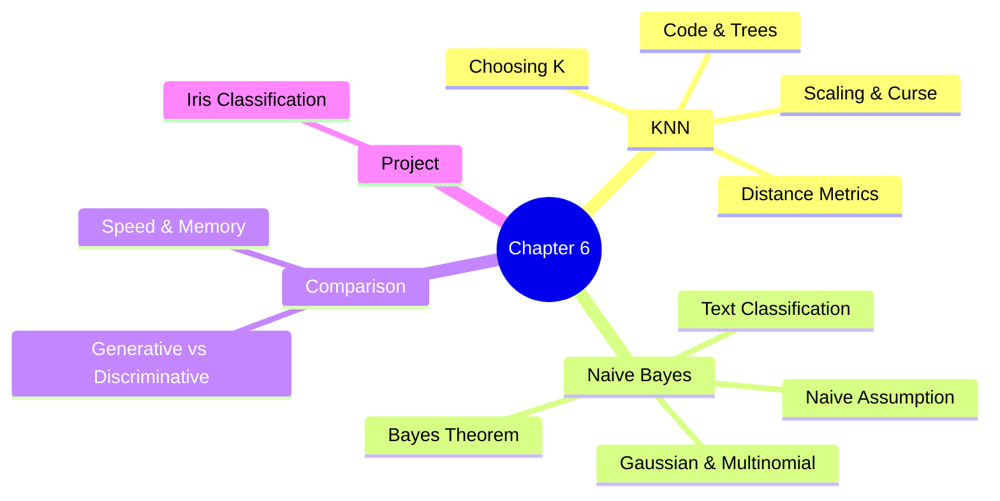
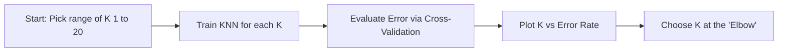
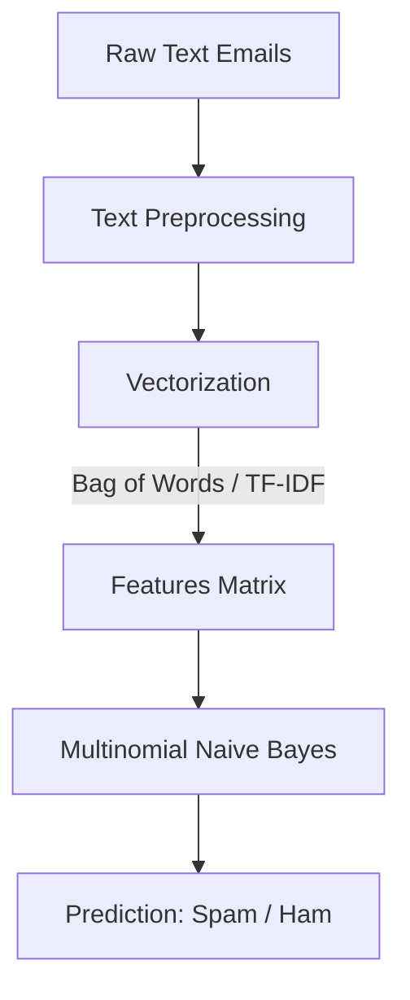

# ML Study Notes — Chapter 6: KNN and Naive Bayes

Welcome back, future ML Engineer! Today, we are stepping into the world of two extremely popular, fundamentally different, yet incredibly powerful machine learning algorithms: **K-Nearest Neighbors (KNN)** and **Naive Bayes**. 

Think of KNN as the **"social butterfly"** of algorithms—it judges a new data point by the company it keeps. On the other hand, Naive Bayes is the **"probabilistic detective"**—it uses historical evidence (and Bayes' Theorem) to calculate the likelihood of an event, blissfully ignoring complex relationships between clues.

Grab your chai, and let's dive deep!

---

## Overview

Here is the roadmap for our journey in this chapter:



---

## Prerequisites

Before jumping into this chapter, you should be comfortable with:
1. **Python Programming**: Basic data structures, loops, and functions.
2. **Numpy & Pandas**: Array manipulations, data filtering.
3. **Basic Probability**: Understanding what $P(A|B)$ means.
4. **Classification Basics**: Concepts like accuracy, train-test splits (from Chapter 5).

---

## 1. K-Nearest Neighbors (KNN)

### Intuition: The "Chai Stall" Analogy

Imagine you open a high-tech chai stall. A new customer walks in. You want to predict if they will order **Ginger Chai** or **Cardamom Chai** before they even speak. How? 

You look at the **K = 5** customers sitting nearest to them who look similar (maybe in age, attire, time of arrival). 
- If 4 out of those 5 closest customers ordered Ginger Chai, you confidently prep a Ginger Chai. 

This is the famous quote in action: *"You are the average of the 5 people you spend the most time with."* 

In ML terms, KNN classifies a new data point based on the majority class of its 'K' nearest data points in the feature space.

### Definition and "Lazy Learning"

**K-Nearest Neighbors (KNN)** is an **instance-based**, **lazy learning** algorithm.
- **Lazy Learning**: Unlike Logistic Regression or Neural Networks, KNN doesn't actually "learn" a mathematical model during the training phase. It simply *memorizes* the training dataset. All the heavy lifting (computation) happens during the prediction phase.
- **Instance-based**: It makes predictions by comparing the new instance with instances from the training data.

### Distance Metrics

How do we define "nearest"? We need a way to calculate the distance between two points, let's call them $p$ and $q$.

#### 1. Euclidean Distance (L2 Norm)
The straight-line distance between two points. It's the most common metric.
**Formula:**
$$ d(p, q) = \sqrt{\sum_{i=1}^{n} (q_i - p_i)^2} $$

#### 2. Manhattan Distance (L1 Norm)
The distance between two points measured along axes at right angles (like a taxi driving through a city grid).
**Formula:**
$$ d(p, q) = \sum_{i=1}^{n} |q_i - p_i| $$

#### 3. Minkowski Distance
A generalized distance metric. When $p=2$, it's Euclidean. When $p=1$, it's Manhattan.
**Formula:**
$$ d(p, q) = \left( \sum_{i=1}^{n} |q_i - p_i|^p \right)^{\frac{1}{p}} $$

#### 4. Cosine Similarity
Measures the angle between two vectors, completely ignoring their magnitude. Great for text data (which we'll see more of in NLP).
**Formula:**
$$ \text{Cosine Similarity} = \frac{A \cdot B}{||A|| \times ||B||} $$

```python
import numpy as np

def euclidean_distance(p, q):
    """Calculates straight-line distance."""
    return np.sqrt(np.sum((p - q) ** 2))

def manhattan_distance(p, q):
    """Calculates grid-like distance."""
    return np.sum(np.abs(p - q))

def cosine_similarity(p, q):
    """Calculates the cosine of the angle between vectors."""
    dot_product = np.dot(p, q)
    norm_p = np.linalg.norm(p)
    norm_q = np.linalg.norm(q)
    return dot_product / (norm_p * norm_q)

# Example Usage:
point1 = np.array([1, 2, 3])
point2 = np.array([4, 5, 6])

print(f"Euclidean: {euclidean_distance(point1, point2):.2f}")
print(f"Manhattan: {manhattan_distance(point1, point2)}")
print(f"Cosine Sim: {cosine_similarity(point1, point2):.4f}")
```

#### When to use which?

| Metric | Best Used For | Notes |
| :--- | :--- | :--- |
| **Euclidean** | Continuous, real-valued features of similar scale. | Standard default for KNN. Very sensitive to outliers. |
| **Manhattan** | High-dimensional data or data with outliers. | Grid-like path reduces the squared penalty of extreme values. |
| **Cosine** | Text data, recommendation systems. | Focuses on orientation, not magnitude (e.g., word frequencies). |

### Choosing K: The Balancing Act

Choosing the right `K` is crucial. `K` is a **hyperparameter** (a setting you configure before training).

- **Too small K (e.g., K=1)**: 
  - **Overfitting**: The model is too sensitive to noise. If one outlier is the nearest neighbor, the prediction flips. High variance, low bias.
- **Too large K (e.g., K=1000)**: 
  - **Underfitting**: The model becomes overly generalized. It will just predict the majority class of the entire dataset. Low variance, high bias.

#### The Elbow Method
To find the optimal K, we test various values of K (e.g., 1 to 20), calculate the error rate using **Cross-Validation**, and plot it. The point where the error stops decreasing significantly (the "elbow") is our optimal K.



### Feature Scaling: Why KNN DEMANDS It

Imagine predicting house prices using two features:
1. Number of Bedrooms (range: 1 to 5)
2. Square Footage (range: 500 to 5000)

If you use Euclidean distance, the Square Footage will completely dominate the distance calculation! A difference of 1000 sq ft will overshadow a difference of 3 bedrooms, even if bedrooms are more important.

**Rule of Thumb:** ALWAYS scale your data (StandardScaler or MinMaxScaler) before using distance-based algorithms like KNN.

### The Curse of Dimensionality

KNN struggles when you have hundreds or thousands of features (dimensions). 
In high-dimensional space, the concept of "distance" breaks down. The difference between the distance to the nearest neighbor and the furthest neighbor approaches zero. Everything seems equally far away.
- **Solution**: Use dimensionality reduction (like PCA) or feature selection before applying KNN on wide datasets.

### Classification vs Regression

KNN isn't just for classification!
- **KNN Classification**: Output is a discrete class label. (Uses **Mode** / Majority Vote of neighbors).
- **KNN Regression**: Output is a continuous value. (Uses **Mean** / Average of the neighbors' values).

#### Weighted KNN
Instead of a simple majority vote, what if we give more "voting power" to neighbors that are closer to the test point?
- Weight $w = \frac{1}{d^2}$
Closer neighbors have a higher say in the final prediction. Sklearn allows this with `weights='distance'`.

### Code: KNN From Scratch (Numpy)

Let's build the mathematical intuition by coding it from scratch.

```python
import numpy as np
from collections import Counter

class ScratchKNN:
    def __init__(self, k=3):
        self.k = k
        self.X_train = None
        self.y_train = None
        
    def fit(self, X, y):
        # Lazy learning - just memorize the data!
        self.X_train = X
        self.y_train = y
        
    def predict(self, X_test):
        # Predict for every point in X_test
        predictions = [self._predict_single(x) for x in X_test]
        return np.array(predictions)
        
    def _predict_single(self, x):
        # 1. Compute distances between x and all examples in the training set
        distances = [np.sqrt(np.sum((x - x_train)**2)) for x_train in self.X_train]
        
        # 2. Sort by distance and return indices of the first k neighbors
        k_indices = np.argsort(distances)[:self.k]
        
        # 3. Extract the labels of the k nearest neighbor training samples
        k_nearest_labels = [self.y_train[i] for i in k_indices]
        
        # 4. Return the most common class label (Majority vote)
        most_common = Counter(k_nearest_labels).most_common(1)
        return most_common[0][0]

# Quick Test
X_train = np.array([[1, 2], [1.5, 1.8], [5, 8], [8, 8], [1, 0.6], [9, 11]])
y_train = np.array([0, 0, 1, 1, 0, 1]) # 0 = low, 1 = high

clf = ScratchKNN(k=3)
clf.fit(X_train, y_train)

X_test = np.array([[1.2, 1.5], [6, 9]])
print("Scratch KNN Predictions:", clf.predict(X_test)) # Expected: [0, 1]
```

### Code: KNN with Sklearn (Classification & Regression)

```python
from sklearn.neighbors import KNeighborsClassifier, KNeighborsRegressor
from sklearn.preprocessing import StandardScaler
from sklearn.model_selection import train_test_split
import numpy as np

# --- 1. CLASSIFICATION ---
# Toy dataset
X = np.random.rand(100, 2) * 10
y = (X[:, 0] + X[:, 1] > 10).astype(int) # Class 1 if sum > 10, else 0

X_train, X_test, y_train, y_test = train_test_split(X, y, test_size=0.2, random_state=42)

# ALWAYS scale data for KNN!
scaler = StandardScaler()
X_train_scaled = scaler.fit_transform(X_train)
X_test_scaled = scaler.transform(X_test)

# Initialize and train
knn_clf = KNeighborsClassifier(n_neighbors=5, metric='euclidean', weights='uniform')
knn_clf.fit(X_train_scaled, y_train)
print("Sklearn Classification Acc:", knn_clf.score(X_test_scaled, y_test))

# --- 2. REGRESSION ---
y_reg = X[:, 0] * 2 + X[:, 1] * 1.5 + np.random.randn(100) # Continuous target
y_train_r, y_test_r = train_test_split(y_reg, test_size=0.2, random_state=42)

knn_reg = KNeighborsRegressor(n_neighbors=5)
knn_reg.fit(X_train_scaled, y_train_r)
print("Sklearn Regression R^2:", knn_reg.score(X_test_scaled, y_test_r))
```

### Time Complexity and Advanced Trees
- **Training Time**: $O(1)$. It just stores the data.
- **Prediction Time (Brute Force)**: $O(n \times d)$, where $n$ is number of samples and $d$ is number of dimensions. It has to compute the distance to *every single point*.

To speed up prediction, Sklearn uses data structures like **KD-Trees** and **Ball Trees** under the hood. These partition the data spatially so the algorithm doesn't have to check points that are obviously too far away, reducing prediction time to roughly $O(d \log n)$.

### KNN Pros and Cons

| Pros | Cons |
| :--- | :--- |
| Simple and highly intuitive to explain. | Computationally expensive during testing/prediction. |
| No assumptions about data distribution (non-parametric). | Memory intensive (must store entire dataset). |
| Naturally handles multi-class classification. | Highly sensitive to irrelevant features and scaling. |
| Can be used for both Classification & Regression. | Suffers badly from the Curse of Dimensionality. |

---

## 2. Naive Bayes

If KNN is the social butterfly, Naive Bayes is the **detective using cold hard probability**.

### Intuition: The Cricket Match Predictor

Imagine you want to predict if Team India will win a cricket match. You look at past data:
- How often do they win when the sky is **overcast**?
- How often do they win when the pitch is **green**?
- How often do they win when they **bat first**?

Naive Bayes calculates the probability of winning based on these features by multiplying the individual probabilities together. It assumes that the sky being overcast, the pitch being green, and batting first are completely **independent** events (which is the "naive" part).

### Bayes' Theorem Recap
At the heart of Naive Bayes is Reverend Thomas Bayes' famous theorem:

$$ P(A|B) = \frac{P(B|A) \cdot P(A)}{P(B)} $$

Where:
- $P(A|B)$: **Posterior Probability** (Probability of class A given the features B).
- $P(B|A)$: **Likelihood** (Probability of the features B given that class A is true).
- $P(A)$: **Prior Probability** (Overall probability of class A in the dataset).
- $P(B)$: **Marginal Probability** (Overall probability of the features B).

### The 'Naive' Assumption
In real life, features are almost never completely independent. (An overcast sky *does* affect whether a captain chooses to bat first). 
However, Naive Bayes ignores these relationships. It assumes feature independence. 
Mathematically, the likelihood expands as:
$$ P(x_1, x_2, ..., x_n | Y) = P(x_1 | Y) \cdot P(x_2 | Y) \cdot ... \cdot P(x_n | Y) $$

This drastically simplifies the math, making the algorithm blazing fast.

### Types of Naive Bayes

#### 1. Gaussian Naive Bayes
Used when your features are **continuous** and follow a normal (Gaussian) distribution. (e.g., height, weight, salary).
- It calculates the mean ($\mu$) and standard deviation ($\sigma$) for each class to estimate probabilities.

$$ P(x_i | y) = \frac{1}{\sqrt{2\pi\sigma_y^2}} \exp\left(-\frac{(x_i - \mu_y)^2}{2\sigma_y^2}\right) $$

#### 2. Multinomial Naive Bayes
Used for **discrete counts**. This is heavily used in Text Classification (e.g., predicting document topics). It looks at the frequency of words.

#### 3. Bernoulli Naive Bayes
Used for **binary/boolean** features. Useful when your features indicate whether a word is present (1) or absent (0) in a document, rather than how many times it appears.

### Code: Types of Naive Bayes (Sklearn)

```python
from sklearn.naive_bayes import GaussianNB, MultinomialNB, BernoulliNB
from sklearn.datasets import make_classification
import numpy as np

# 1. Gaussian NB (Continuous Data)
X_gauss, y_gauss = make_classification(n_features=4, random_state=42)
gnb = GaussianNB()
gnb.fit(X_gauss, y_gauss)
print("Gaussian NB score:", gnb.score(X_gauss, y_gauss))

# 2. Multinomial NB (Count Data - e.g., word counts)
X_multi = np.random.randint(5, size=(100, 10)) # Random integers 0-4
y_multi = np.random.randint(2, size=100)
mnb = MultinomialNB()
mnb.fit(X_multi, y_multi)
print("Multinomial NB score:", mnb.score(X_multi, y_multi))

# 3. Bernoulli NB (Binary Data)
X_bern = np.random.randint(2, size=(100, 10)) # Random 0s and 1s
y_bern = np.random.randint(2, size=100)
bnb = BernoulliNB()
bnb.fit(X_bern, y_bern)
print("Bernoulli NB score:", bnb.score(X_bern, y_bern))
```

### Laplace Smoothing (Additive Smoothing)

**The Zero-Frequency Problem:**
Imagine building a spam filter. The word "Cryptocurrency" never appeared in your training data for non-spam emails. 
So, $P(\text{"Cryptocurrency"} | \text{Not-Spam}) = 0$. 
Because Naive Bayes multiplies all probabilities, the entire probability of a new email being "Not-Spam" becomes $0 \times \text{anything} = 0$. The model will ALWAYS classify an email with this word as spam.

**The Fix:** Laplace Smoothing ($\alpha = 1$). We add a small count of 1 to every feature for every class so that no probability is ever zero.

### Why does Naive Bayes work so well?
Even though the independence assumption is often completely wrong, Naive Bayes still performs remarkably well. Why?
Because for classification, we don't care about the *exact* probability. We just care which class has the *highest* probability. Even if the calculated probabilities are distorted, the rank order (which one is biggest) usually remains correct.

### Text Classification Deep Dive: Spam Filter

Naive Bayes is the legendary algorithm for spam filtering. Let's build the pipeline.



#### Bag of Words & Vectorization
Machines don't understand text. We must convert text to numbers.
- **CountVectorizer (Bag of Words)**: Counts how many times each word appears in a sentence.
- **TfidfVectorizer (Term Frequency-Inverse Document Frequency)**: Gives higher weight to rare, meaningful words (like "Inheritance") and lowers the weight of common words (like "the", "and").

#### Code: Complete Spam Classifier

```python
from sklearn.feature_extraction.text import TfidfVectorizer
from sklearn.naive_bayes import MultinomialNB
from sklearn.metrics import accuracy_score, classification_report
from sklearn.model_selection import train_test_split

# 1. Dataset
emails = [
    "Win a free iPhone right now, click here!",
    "Hey Bob, are we still on for the meeting tomorrow?",
    "URGENT: Your bank account has been locked. Verify immediately.",
    "Hi mom, I will be home for dinner.",
    "Congratulations! You won $10,000 cash prize.",
    "Please find attached the quarterly financial report."
]
# 1 = Spam, 0 = Ham (Not Spam)
labels = [1, 0, 1, 0, 1, 0]

X_train, X_test, y_train, y_test = train_test_split(emails, labels, test_size=0.33, random_state=42)

# 2. Vectorization (Convert text to numbers)
vectorizer = TfidfVectorizer(stop_words='english')
X_train_vec = vectorizer.fit_transform(X_train)
X_test_vec = vectorizer.transform(X_test)

# 3. Train Naive Bayes
spam_model = MultinomialNB(alpha=1.0) # alpha=1.0 is Laplace smoothing
spam_model.fit(X_train_vec, y_train)

# 4. Predict and Evaluate
y_pred = spam_model.predict(X_test_vec)
print("Accuracy:", accuracy_score(y_test, y_pred))
print("\nClassification Report:\n", classification_report(y_test, y_pred))

# 5. Test on a brand new email
new_email = ["Claim your free lottery tickets today!"]
new_email_vec = vectorizer.transform(new_email)
prediction = spam_model.predict(new_email_vec)
print("Prediction for new email:", "Spam" if prediction[0] == 1 else "Ham")
```

### Naive Bayes Pros and Cons

| Pros | Cons |
| :--- | :--- |
| Extremely fast to train and predict. | The "Naive" assumption is rarely true in real life. |
| Requires relatively little training data. | Known as a "bad estimator" (probabilities outputted by `predict_proba` shouldn't be taken literally). |
| Handles high-dimensional data (like text) brilliantly. | Can struggle with numerical data compared to tree-based models. |
| Robust to irrelevant features. | |

---

## 3. KNN vs Naive Bayes Comparison

When to use which? Use this cheat sheet:

| Feature | K-Nearest Neighbors (KNN) | Naive Bayes |
| :--- | :--- | :--- |
| **Algorithm Type** | Discriminative, Lazy learner | Generative, Eager learner |
| **Speed (Training)** | $O(1)$ - Instant (just saves data) | Fast (calculates probabilities) |
| **Speed (Predicting)** | Very slow (must compare against all) | Blazing fast (simple multiplication) |
| **Memory Usage** | High (stores whole dataset) | Low (only stores probabilities/means) |
| **Curse of Dimensionality** | Suffers heavily (distance breaks down) | Handles it beautifully (great for Text/NLP) |
| **Feature Scaling** | **Mandatory** (needs Standard/MinMax) | **Not required** (uses probabilities) |
| **Best Use Cases** | Recommendation systems, simple low-dim data, anomaly detection | Text classification, Spam filtering, Sentiment analysis |

---

## 4. Complete Project: Iris Classification Comparison

Let's put them head-to-head on the famous Iris dataset!

```python
from sklearn.datasets import load_iris
from sklearn.model_selection import train_test_split
from sklearn.preprocessing import StandardScaler
from sklearn.neighbors import KNeighborsClassifier
from sklearn.naive_bayes import GaussianNB
from sklearn.metrics import accuracy_score
import time

# 1. Load Data
iris = load_iris()
X, y = iris.data, iris.target

# 2. Split Data
X_train, X_test, y_train, y_test = train_test_split(X, y, test_size=0.3, random_state=42)

# 3. Scale Data (Mandatory for KNN)
scaler = StandardScaler()
X_train_scaled = scaler.fit_transform(X_train)
X_test_scaled = scaler.transform(X_test)

# 4. Train and Evaluate KNN
start_time = time.time()
knn = KNeighborsClassifier(n_neighbors=5)
knn.fit(X_train_scaled, y_train)
knn_preds = knn.predict(X_test_scaled)
knn_time = time.time() - start_time
knn_acc = accuracy_score(y_test, knn_preds)

# 5. Train and Evaluate Naive Bayes (Gaussian, since features are continuous)
start_time = time.time()
nb = GaussianNB()
# Note: NB doesn't need scaled data, but using it here won't hurt.
nb.fit(X_train, y_train) 
nb_preds = nb.predict(X_test)
nb_time = time.time() - start_time
nb_acc = accuracy_score(y_test, nb_preds)

print("--- Algorithm Showdown: Iris Dataset ---")
print(f"KNN          | Acc: {knn_acc*100:.2f}% | Time: {knn_time:.5f} sec")
print(f"Naive Bayes  | Acc: {nb_acc*100:.2f}% | Time: {nb_time:.5f} sec")
```

---

## 5. Common Mistakes & Pitfalls

1. **Forgetting to Scale in KNN**: As discussed, unscaled data will ruin your Euclidean distance calculations.
2. **Using Even 'K' in Binary Classification**: If K=4 and 2 neighbors are Class A and 2 are Class B, you have a tie! Always try to use odd numbers for K to break ties.
3. **Ignoring the Zero-Frequency Problem in NB**: If coding from scratch, forgetting Laplace smoothing will cause your algorithm to aggressively predict 0 probabilities. Sklearn does this by default (`alpha=1.0`).
4. **Using Gaussian NB for text data**: Text is count/frequency-based. You must use Multinomial or Bernoulli Naive Bayes. Gaussian is for continuous numbers like weight/height.
5. **Taking Naive Bayes probabilities literally**: If `nb.predict_proba()` says there's a 99.9% chance an email is spam, it might actually only be 70% in reality. It pushes probabilities to extremes. Use it to *rank* classes, not to output a confidence percentage.

---

## 6. Interview Questions 🎯

Here are the most common questions you will face in internships/entry-level ML interviews regarding these algorithms:

1. 🎯 **Why is KNN called a "lazy" learner?**
   *Answer:* Because it does not learn a mathematical function or parameters during the training phase. It simply stores the training data and postpones all computation until a prediction is requested.

2. 🎯 **How does the choice of K affect the Bias-Variance tradeoff?**
   *Answer:* A small K (e.g., K=1) leads to high variance and low bias (overfitting the noise). A large K leads to high bias and low variance (underfitting, overly smoothed boundaries).

3. 🎯 **Is feature scaling necessary for Naive Bayes? Why or why not?**
   *Answer:* No. Naive Bayes relies on probabilities, not geometric distances. The probability of a feature belonging to a class is calculated independently of the magnitude of other features.

4. 🎯 **What is Laplace Smoothing and why is it used?**
   *Answer:* It's the process of adding a small value (usually 1) to the count of every feature to prevent the "Zero-Frequency Problem," where a previously unseen categorical feature zeroes out the entire probability calculation.

5. 🎯 **What is the "Curse of Dimensionality" in the context of KNN?**
   *Answer:* In high-dimensional spaces, the ratio of the distance to the nearest neighbor over the distance to the farthest neighbor approaches 1. Effectively, all points become almost equidistant, rendering distance metrics useless.

6. 🎯 **Can KNN be used for categorical features?**
   *Answer:* Standard Euclidean distance struggles with categorical features. You can use it by One-Hot Encoding the categories and using Hamming Distance or a custom distance metric, though Tree-based models are usually better.

7. 🎯 **What is the fundamental difference between Generative and Discriminative models? Which is Naive Bayes?**
   *Answer:* Discriminative models (like KNN or Logistic Regression) model the decision boundary between classes directly $P(Y|X)$. Generative models (like Naive Bayes) model the actual distribution of each class $P(X|Y)$ and use Bayes theorem to find $P(Y|X)$.

---

## 7. Practice Exercises

Ready to build some muscle?

1. **Implement Weighted KNN from scratch**: Modify the `ScratchKNN` code above so that neighbors vote based on $\frac{1}{distance + \epsilon}$ (add $\epsilon=1e-5$ to avoid division by zero).
2. **GridSearch K**: Use Sklearn's `GridSearchCV` on the Breast Cancer dataset to find the optimal $K$ and optimal distance metric (`'euclidean'` vs `'manhattan'`).
3. **Spam filter evaluation**: Download a Kaggle SMS Spam dataset. Implement a `TfidfVectorizer` + `MultinomialNB` pipeline. Plot the Confusion Matrix.
4. **The Naive Assumption test**: Create a synthetic dataset using `make_classification` where features are *highly correlated*. Train Naive Bayes and Logistic Regression. Observe who wins and explain why.
5. **Optimize KNN**: Profile the time it takes to run a Sklearn KNN model with `algorithm='brute'` vs `algorithm='kd_tree'` on a dataset with 50,000 samples.

---

## Navigation

- **Previous**: [[ml-chapter-05-logistic-regression-and-classification|← Chapter 5: Logistic Regression]]
- **Next**: [[ml-chapter-07-decision-trees-and-random-forests|Chapter 7: Decision Trees →]]
