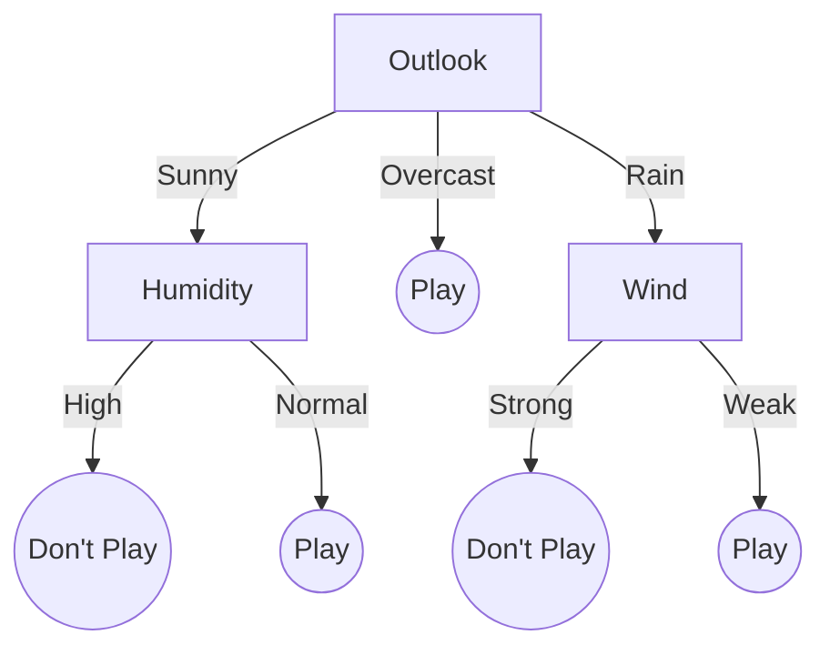

# ML Study Notes — Chapter 7: Decision Trees and Random Forests

## Overview

Welcome to Chapter 7! In this chapter, we explore one of the most intuitive and powerful families of algorithms in machine learning: tree-based models. We will start with the fundamental building block—the **Decision Tree**—which mimics human decision-making. Then, we will step up to **Random Forests**, a robust ensemble method that combines multiple trees to overcome their individual weaknesses. 

```mermaid
mindmap
  root((Tree Models))
    Decision Trees
      Splitting Criteria
        Entropy & Info Gain
        Gini Impurity
      Algorithms
        ID3, C4.5, CART
      Pruning
        Pre-pruning
        Post-pruning
    Random Forests
      Bagging
        Bootstrap Sampling
        Aggregation
      Feature Randomness
      Out-of-Bag (OOB) Score
      Feature Importance
    Project
      Customer Churn
    Comparisons
```

## Prerequisites

Before diving into this chapter, ensure you have a solid understanding of:
- Python programming (loops, functions, classes)
- `pandas` for data manipulation
- `scikit-learn` for basic modeling
- Basic probability concepts (events, likelihoods)

---

## 1. Decision Trees

### 1.1 Intuition: The 20 Questions Game

Think about the game "20 Questions." You try to guess an object by asking yes/no questions. To win, you don't ask "Is it a specific brand of shoe?" right away. Instead, you ask broad questions first: "Is it alive?" "Is it an animal?" Each question splits the remaining possibilities into two groups, ideally making each group as pure (similar) as possible.

A **Decision Tree** works exactly like this. It is a flowchart-like structure where:
- **Root Node**: The very top of the tree, representing the entire dataset. It contains the most important question.
- **Internal Nodes**: The intermediate questions (splits based on feature values).
- **Branches**: The outcome of a question (e.g., True/False, or > 50 / <= 50).
- **Leaf Nodes**: The final prediction (class label for classification, or continuous value for regression).

### 1.2 A Simple Decision Tree Visualization

Let's visualize a tree trying to decide if we should play cricket outside.



*In this tree, Outlook is the root node. If Outlook is Overcast, we reach a leaf node immediately and decide to play.*

### 1.3 Splitting Criteria: How to Ask the Best Question

How does the tree know which feature to split on first? It uses a mathematical metric to measure the "impurity" or "messiness" of a node. The goal is to choose the split that creates the purest child nodes.

#### 1.3.1 Entropy

**Entropy** is a measure of randomness or uncertainty in a system. In a completely pure node (all samples belong to one class), entropy is 0. In a completely mixed node (50/50 split of two classes), entropy is 1.

**Mathematical Formula:**
$$ H(S) = - \sum_{i=1}^{c} p_i \log_2(p_i) $$

Where:
- $S$ is the current dataset (or node).
- $c$ is the number of classes.
- $p_i$ is the proportion of samples belonging to class $i$.

*Analogy:* Imagine a jar of marbles. If all marbles are red, the jar has 0 entropy (zero surprise if you pull one out). If half are red and half are blue, the entropy is maximum (maximum surprise).

#### 1.3.2 Information Gain (IG)

**Information Gain** measures how much the entropy decreases after splitting the dataset on a specific feature. The tree calculates the IG for every possible split and chooses the one with the highest IG.

**Mathematical Formula:**
$$ IG = H(\text{parent}) - \sum_{v \in \text{Values}(A)} \frac{|S_v|}{|S|} H(S_v) $$

Where:
- $H(\text{parent})$ is the entropy of the parent node.
- $A$ is the feature we are splitting on.
- $S_v$ is the subset of $S$ where feature $A$ has value $v$.
- $\frac{|S_v|}{|S|}$ is the weight (proportion of samples) going into that child node.

#### 1.3.3 Gini Impurity

**Gini Impurity** is an alternative to Entropy. It measures the probability of incorrectly classifying a randomly chosen element if it were randomly labeled according to the distribution of labels in the node.

**Mathematical Formula:**
$$ \text{Gini}(S) = 1 - \sum_{i=1}^{c} (p_i)^2 $$

Gini is slightly faster to compute than Entropy because it doesn't use logarithms. It is the default metric in `scikit-learn`'s CART implementation.

#### 1.3.4 Entropy vs Gini Comparison

| Feature | Entropy | Gini Impurity |
| :--- | :--- | :--- |
| **Formula** | $-\sum p_i \log_2(p_i)$ | $1 - \sum p_i^2$ |
| **Max Value (Binary)** | 1.0 (at 50/50 split) | 0.5 (at 50/50 split) |
| **Computation Speed** | Slower (uses log) | Faster (uses square) |
| **Behavior** | Tends to create balanced trees | Tends to isolate the most frequent class |
| **When to use** | Good for exploratory analysis | Default choice, computationally efficient |

### 1.4 Tree Building Algorithm (CART - Classification and Regression Trees)

The most common algorithm used today is CART. Let's walk through how it builds a tree.

**Step-by-step Process:**
1. Start with the whole dataset at the root node.
2. For every feature, and every possible value of that feature, calculate the Gini Impurity (or Entropy) of the resulting split.
3. Choose the feature and value that results in the lowest weighted average Gini Impurity (highest Information Gain) for the child nodes.
4. Split the dataset into two child nodes.
5. Repeat steps 2-4 recursively for each child node.
6. Stop when a stopping criterion is met (e.g., node is pure, max depth reached, or min samples split reached).

### 1.5 Python Code: Decision Tree from Scratch (Simplified)

To truly understand how this works, let's write a very simplified, bare-bones Decision Tree for binary classification using Gini impurity.

```python
import numpy as np

class Node:
    def __init__(self, feature_index=None, threshold=None, left=None, right=None, value=None):
        self.feature_index = feature_index
        self.threshold = threshold
        self.left = left
        self.right = right
        self.value = value # Leaf node class prediction

class SimpleDecisionTree:
    def __init__(self, max_depth=3):
        self.max_depth = max_depth
        self.root = None

    def _gini(self, y):
        # Calculate Gini Impurity
        classes = np.unique(y)
        gini = 1.0
        for cls in classes:
            p = len(y[y == cls]) / len(y)
            gini -= p ** 2
        return gini

    def _best_split(self, X, y):
        best_gini = float('inf')
        best_split = None
        n_samples, n_features = X.shape

        for feature_index in range(n_features):
            thresholds = np.unique(X[:, feature_index])
            for threshold in thresholds:
                # Split the data
                left_mask = X[:, feature_index] <= threshold
                right_mask = ~left_mask

                if sum(left_mask) == 0 or sum(right_mask) == 0:
                    continue

                # Calculate weighted Gini
                n = len(y)
                n_left, n_right = sum(left_mask), sum(right_mask)
                gini_left, gini_right = self._gini(y[left_mask]), self._gini(y[right_mask])
                weighted_gini = (n_left / n) * gini_left + (n_right / n) * gini_right

                if weighted_gini < best_gini:
                    best_gini = weighted_gini
                    best_split = {
                        'feature_index': feature_index,
                        'threshold': threshold,
                        'left_X': X[left_mask], 'left_y': y[left_mask],
                        'right_X': X[right_mask], 'right_y': y[right_mask]
                    }
        return best_split

    def _build_tree(self, X, y, depth=0):
        # Stopping criteria: pure node or max depth
        if len(np.unique(y)) == 1 or depth >= self.max_depth:
            leaf_value = np.bincount(y).argmax() # Most common class
            return Node(value=leaf_value)

        best_split = self._best_split(X, y)
        if best_split is None:
            leaf_value = np.bincount(y).argmax()
            return Node(value=leaf_value)

        left_child = self._build_tree(best_split['left_X'], best_split['left_y'], depth + 1)
        right_child = self._build_tree(best_split['right_X'], best_split['right_y'], depth + 1)

        return Node(best_split['feature_index'], best_split['threshold'], left_child, right_child)

    def fit(self, X, y):
        self.root = self._build_tree(X, y)

    def _predict_one(self, x, node):
        if node.value is not None:
            return node.value
        if x[node.feature_index] <= node.threshold:
            return self._predict_one(x, node.left)
        return self._predict_one(x, node.right)

    def predict(self, X):
        return np.array([self._predict_one(x, self.root) for x in X])

# Let's test it on a dummy dataset
X = np.array([[2, 3], [1, 5], [3, 6], [8, 1], [7, 2], [9, 3]])
y = np.array([0, 0, 0, 1, 1, 1]) # Class 0 (low x1), Class 1 (high x1)

tree = SimpleDecisionTree(max_depth=2)
tree.fit(X, y)
predictions = tree.predict(X)
print("Predictions:", predictions)
```

### 1.6 Decision Trees for Regression

Decision trees aren't just for classification; they can predict continuous numbers too. 
- **Splitting Criterion for Regression**: Instead of Gini or Entropy, regression trees use **Mean Squared Error (MSE)** or Mean Absolute Error (MAE). They look for splits that minimize the variance of the target variable within the child nodes.
- **Leaf Node Value**: Instead of taking a majority vote, a regression tree leaf returns the **mean** (average) of the target values of all samples in that leaf.

### 1.7 Overfitting and Pruning

Decision trees are notorious for **overfitting**. If left unchecked, a tree will keep splitting until every leaf contains just one sample. This perfectly memorizes the training data (100% accuracy) but fails miserably on unseen data.

To prevent this, we use **Pruning** (cutting back the tree).

#### 1.7.1 Pre-pruning (Early Stopping)
We stop the tree from growing too deep in the first place by setting hyperparameters:
- `max_depth`: Limits the maximum depth of the tree.
- `min_samples_split`: Minimum number of samples required to split an internal node.
- `min_samples_leaf`: Minimum number of samples required to be at a leaf node.

#### 1.7.2 Post-pruning (Cost Complexity Pruning)
Grow the tree fully, then trim it back. `scikit-learn` uses `ccp_alpha` (Cost-Complexity Pruning Alpha). Increasing `ccp_alpha` increases the penalty for having a complex (deep/wide) tree, effectively pruning branches that don't add enough predictive power to justify their complexity.

### 1.8 Python Code: Scikit-Learn Implementation and Visualization

Let's use `scikit-learn` to build, prune, and visualize a Decision Tree.

```python
import pandas as pd
from sklearn.datasets import load_iris
from sklearn.tree import DecisionTreeClassifier, plot_tree
from sklearn.model_selection import train_test_split
from sklearn.metrics import accuracy_score
import matplotlib.pyplot as plt

# Load Data
iris = load_iris()
X, y = iris.data, iris.target

# Split data
X_train, X_test, y_train, y_test = train_test_split(X, y, test_size=0.2, random_state=42)

# Initialize and fit the model (with pre-pruning)
clf = DecisionTreeClassifier(
    criterion='gini',
    max_depth=3,            # Pre-pruning: max depth of 3
    min_samples_leaf=5,     # Pre-pruning: at least 5 samples in a leaf
    random_state=42
)
clf.fit(X_train, y_train)

# Evaluate
y_pred = clf.predict(X_test)
print(f"Accuracy: {accuracy_score(y_test, y_pred):.4f}")

# Visualize the Tree
plt.figure(figsize=(15, 10))
plot_tree(clf, 
          filled=True, 
          feature_names=iris.feature_names, 
          class_names=iris.target_names,
          rounded=True)
plt.title("Decision Tree Visualization")
plt.show()
```

### 1.9 Pros and Cons of Decision Trees

| Pros | Cons |
| :--- | :--- |
| Highly interpretable (like a flowchart). | Very prone to overfitting if not pruned. |
| Requires almost no data preprocessing (no scaling/normalization needed). | Unstable: a small change in data can result in a completely different tree. |
| Can handle both numerical and categorical data natively. | Biased towards features with many levels. |
| Implicitly performs feature selection. | Greedy algorithm (CART) doesn't guarantee the globally optimal tree. |

---

## 2. Random Forests

### 2.1 Intuition: The Wisdom of the Crowd

Imagine you are trying to guess the exact weight of a cow at a fair. If you ask one person (a Decision Tree), they might be wildly wrong due to their personal biases (overfitting). But if you ask 1,000 random people, some will guess too high, some too low. If you average all their guesses, the final answer is remarkably close to the true weight.

This is the principle behind **Random Forests**. It is an **ensemble** method—it builds a "forest" of many Decision Trees and merges their predictions to get a more accurate and stable result.

### 2.2 Bagging (Bootstrap Aggregating)

Random Forests use a technique called Bagging to create diverse trees.

1. **Bootstrap Sampling**: Imagine you have a dataset of 1,000 rows. A single tree in the forest doesn't look at all 1,000 rows. Instead, it draws 1,000 samples *with replacement* from the dataset. This means some rows will be picked multiple times, and roughly 37% of the rows won't be picked at all (these are called Out-of-Bag or OOB samples).
2. **Aggregating**: Each tree makes a prediction. The forest combines them.
   - For Classification: Majority vote.
   - For Regression: Average of the predictions.

*Bagging reduces variance (overfitting) without increasing bias.*

### 2.3 Feature Randomness

If we just use Bagging, all the trees might still look very similar if there is one incredibly dominant feature. 

To ensure the trees are truly diverse (decorrelated), Random Forests add a second layer of randomness: **Feature Randomness**.
At *every single node split* during the building of a tree, the algorithm is not allowed to look at all features. It only looks at a random subset of features (usually $\sqrt{\text{total features}}$ for classification). It must pick the best split from that limited subset.

### 2.4 Hyperparameters to Tune

Random Forests have several important hyperparameters:
- `n_estimators`: The number of trees in the forest. (More is generally better, but slower. Usually 100-500 is good).
- `max_depth`: Max depth of individual trees. (Can often be left as None because Bagging handles overfitting).
- `max_features`: Number of features to consider at each split (auto, sqrt, log2).
- `bootstrap`: Whether to use bootstrap samples (True by default).
- `min_samples_split` / `min_samples_leaf`: Pruning parameters for individual trees.

### 2.5 Feature Importance

One great advantage of Random Forests is that they can tell you which features are most important for predicting the target.

- **Gini Importance (Impurity-based)**: Averages the decrease in Gini impurity across all trees for a specific feature. High value = important feature.
- **Permutation Importance**: Measures how much the model's accuracy drops when you randomly shuffle a single feature's data. If accuracy drops massively, the feature is important.

### 2.6 Out-of-Bag (OOB) Score

Remember that in Bootstrap sampling, about 37% of the data is left out for each tree. This OOB data acts as a built-in validation set! The Random Forest can evaluate its performance on these left-out samples during training, eliminating the strict need for a separate validation set.

### 2.7 Python Code: Random Forest with Scikit-Learn

```python
from sklearn.ensemble import RandomForestClassifier
from sklearn.datasets import load_breast_cancer

# Load dataset
cancer = load_breast_cancer()
X, y = cancer.data, cancer.target
X_train, X_test, y_train, y_test = train_test_split(X, y, test_size=0.2, random_state=42)

# Initialize Random Forest
rf = RandomForestClassifier(
    n_estimators=100,        # 100 trees
    max_features='sqrt',     # Random subset of features
    bootstrap=True,          # Use bootstrap sampling
    oob_score=True,          # Calculate OOB score
    random_state=42,
    n_jobs=-1                # Use all CPU cores!
)

# Train the model
rf.fit(X_train, y_train)

# Predictions and Evaluation
print(f"Test Set Accuracy: {rf.score(X_test, y_test):.4f}")
print(f"OOB Score (Built-in Validation): {rf.oob_score_:.4f}")

# Extract and plot Feature Importances
importances = pd.Series(rf.feature_importances_, index=cancer.feature_names)
importances.nlargest(10).sort_values().plot(kind='barh', color='teal', figsize=(10,6))
plt.title("Top 10 Feature Importances (Gini)")
plt.xlabel("Importance Score")
plt.show()
```

### 2.8 Pros and Cons of Random Forests

| Pros | Cons |
| :--- | :--- |
| Highly accurate and robust to overfitting. | Black box model; not as interpretable as a single tree. |
| Handles non-linear relationships well. | Training can be slow with hundreds of deep trees. |
| Requires very little hyperparameter tuning to get a good baseline. | Large memory footprint (saving hundreds of trees). |
| Provides built-in Feature Importance and OOB evaluation. | Not ideal for extrapolating data outside the training range (regression). |

---

## 3. Decision Tree vs Random Forest

| Feature | Decision Tree | Random Forest |
| :--- | :--- | :--- |
| **Type** | Single Estimator | Ensemble (Bagging) |
| **Interpretability** | High (Visualizable) | Low (Black box) |
| **Overfitting Risk** | Very High (High Variance) | Low (Averages out variance) |
| **Performance** | Generally lower | Generally much higher |
| **Training Speed** | Fast | Slower (Trains $N$ trees) |
| **Prediction Speed** | Very Fast | Slower (Passes data through $N$ trees) |
| **Use Case** | Need to explain rules to stakeholders | Need high predictive accuracy |

---

## 4. Complete Project: Customer Churn Prediction with Random Forest

Let's put it all together in a realistic scenario. We want to predict if a telecom customer will cancel their subscription (Churn).

```python
import pandas as pd
import numpy as np
from sklearn.model_selection import train_test_split
from sklearn.ensemble import RandomForestClassifier
from sklearn.metrics import classification_report, confusion_matrix, accuracy_score
import seaborn as sns
import matplotlib.pyplot as plt

# 1. Simulate a Telecom Churn Dataset (since we don't have a local CSV)
np.random.seed(42)
n = 1000
data = {
    'Tenure_Months': np.random.randint(1, 72, n),
    'Monthly_Charges': np.random.uniform(20, 120, n),
    'Has_Internet': np.random.choice([0, 1], n, p=[0.2, 0.8]),
    'Tech_Support': np.random.choice([0, 1], n, p=[0.7, 0.3]),
    'Contract_Type': np.random.choice([0, 1, 2], n, p=[0.5, 0.3, 0.2]) # 0: M2M, 1: 1Yr, 2: 2Yr
}
df = pd.DataFrame(data)

# Create a realistic target variable based on features
# Churn is more likely if tenure is low, charges are high, no tech support, and M-to-M contract
churn_prob = (
    (72 - df['Tenure_Months']) / 100 + 
    (df['Monthly_Charges']) / 200 + 
    (1 - df['Tech_Support']) * 0.3 + 
    (df['Contract_Type'] == 0) * 0.4
)
# Normalize probability and convert to binary
churn_prob = churn_prob / churn_prob.max()
df['Churn'] = (np.random.rand(n) < churn_prob).astype(int)

# 2. Preprocess & Split
X = df.drop('Churn', axis=1)
y = df['Churn']
X_train, X_test, y_train, y_test = train_test_split(X, y, test_size=0.2, random_state=42)

# 3. Train Random Forest
rf_model = RandomForestClassifier(n_estimators=100, max_depth=5, random_state=42)
rf_model.fit(X_train, y_train)

# 4. Evaluate
y_pred = rf_model.predict(X_test)
print("Classification Report:\n", classification_report(y_test, y_pred))

# 5. Confusion Matrix Visualization
cm = confusion_matrix(y_test, y_pred)
plt.figure(figsize=(6,4))
sns.heatmap(cm, annot=True, fmt='d', cmap='Blues', cbar=False)
plt.title("Confusion Matrix: Churn Prediction")
plt.xlabel("Predicted")
plt.ylabel("Actual")
plt.show()

# 6. Feature Importance
feat_imps = pd.Series(rf_model.feature_importances_, index=X.columns).sort_values(ascending=False)
print("\nFeature Importances:")
print(feat_imps)
```

---

## 5. Common Mistakes & Pitfalls

1. **Not Pruning Decision Trees**: Beginners often run `DecisionTreeClassifier()` with default parameters. In sklearn, default `max_depth` is None, meaning the tree will grow until every leaf is pure. This guarantees massive overfitting. Always set a `max_depth` or `min_samples_leaf`.
2. **Scaling Data Unnecessarily**: Decision trees and Random Forests are scale-invariant. They just split on thresholds (e.g., $X > 50$). You **do not** need to use `StandardScaler` or `MinMaxScaler` for tree-based models. Don't waste compute time!
3. **One-Hot Encoding Features with Hundreds of Categories**: Trees struggle with highly sparse data resulting from One-Hot Encoding features with very high cardinality (e.g., Zip Codes). Target Encoding or Leave-One-Out Encoding is often better for trees.
4. **Ignoring the OOB Score**: People often set aside a 20% validation set when training a Random Forest. While fine, you can save that 20% for training and just use the built-in `oob_score_` to tune hyperparameters.

---

## 6. Interview Questions 🎯

1. 🎯 **Q: Explain how a Decision Tree handles categorical vs numerical variables.**
   - **A:** For numerical variables, the tree sorts the values and tests midpoints between adjacent values as thresholds (e.g., Age < 35.5). For categorical variables, it tests splits based on belonging to a category or subset of categories (e.g., Color == 'Red'). Note: sklearn's implementation currently requires categorical variables to be numerically encoded (like ordinal or one-hot) before fitting.

2. 🎯 **Q: What is Information Gain, and how is it related to Entropy?**
   - **A:** Entropy measures the impurity or disorder of a dataset. Information Gain is the reduction in Entropy after splitting the dataset on a particular feature. The tree algorithm selects the feature that maximizes Information Gain (i.e., reduces Entropy the most).

3. 🎯 **Q: Why does a Decision Tree overfit, and how can you prevent it?**
   - **A:** It overfits because it recursively splits the data until it perfectly memorizes the training set (leaves with 1 sample). Prevent it by pre-pruning (setting `max_depth`, `min_samples_split`) or post-pruning (`ccp_alpha`).

4. 🎯 **Q: Explain the two types of randomness introduced in a Random Forest.**
   - **A:** 1. **Data Randomness**: Bootstrapping (sampling with replacement) creates a slightly different dataset for each tree. 2. **Feature Randomness**: At each node split, the tree is only allowed to consider a random subset of features (usually $\sqrt{n}$), preventing dominant features from being picked every time.

5. 🎯 **Q: What is the OOB error in Random Forests?**
   - **A:** Because trees are trained on bootstrap samples, about 36.8% of the data is left out per tree (Out-of-Bag). The OOB error is the average error calculated by passing these left-out samples through the trees that didn't see them during training. It serves as a free validation score.

6. 🎯 **Q: Can a Random Forest extrapolate beyond the training data for regression tasks?**
   - **A:** No. A Random Forest Regressor averages the values of the leaf nodes. It cannot predict a value higher than the maximum target value or lower than the minimum target value it saw during training. Linear regression *can* extrapolate.

7. 🎯 **Q: How does Random Forest calculate feature importance?**
   - **A:** Typically using Gini Importance (Mean Decrease in Impurity). It calculates how much a specific feature reduced the Gini impurity across all splits in all trees where it was used, weighted by the number of samples reaching those nodes.

---

## 7. Practice Exercises

**Beginner:**
1. Load the `wine` dataset from sklearn (`load_wine`). Train a Decision Tree Classifier.
2. Experiment with `max_depth` = 2, 5, and None. Plot the training accuracy vs testing accuracy to observe overfitting.
3. Visualize the tree with `max_depth=3` using `plot_tree`.

**Intermediate:**
4. Load the `california_housing` dataset (`fetch_california_housing`). Train a `DecisionTreeRegressor` and a `RandomForestRegressor`.
5. Compare their Mean Squared Error (MSE) on a test set. 
6. Extract the top 3 most important features from the Random Forest model.

**Advanced:**
7. Implement a function from scratch to calculate Information Gain given a parent array of labels and two child arrays of labels. Test it on a small dummy list.
8. Train a Random Forest with `oob_score=True`. Compare the OOB score to the score on a manually held-out test set. Are they similar?

---

## Navigation

- Previous: [[ml-chapter-06-knn-and-naive-bayes|← Chapter 6: KNN and Naive Bayes]]
- Next: [[ml-chapter-08-svm-and-kernel-methods|Chapter 8: SVM and Kernel Methods →]]
