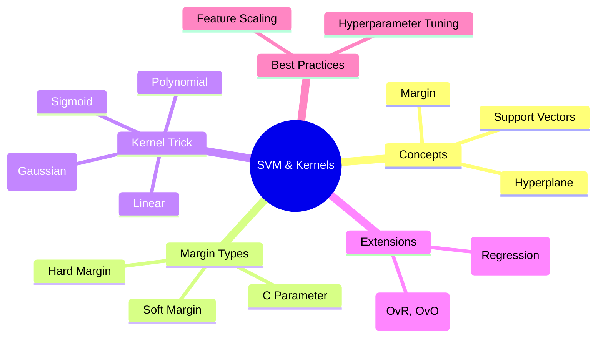
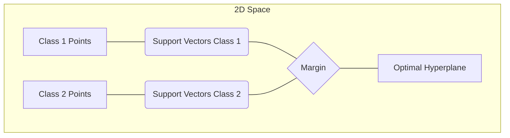

# ML Study Notes — Support Vector Machines and Kernel Methods

## Overview

Welcome to Chapter 8! In this chapter, we explore **Support Vector Machines (SVM)** and **Kernel Methods**—one of the most robust and mathematically elegant machine learning algorithms. While it might sound like a complex terminator robot, SVM is fundamentally about finding the widest possible "road" that separates different classes of data. 



## Prerequisites
Before diving into SVMs, you should be comfortable with:
- Linear algebra (vectors, dot products)
- Concept of hyperplanes and equations of lines/planes
- Basic optimization concepts
- Python data science stack (`numpy`, `pandas`, `scikit-learn`)

---

## 1. What is SVM?

### Intuition: The Widest Road
Imagine you have a table with red apples and green apples scattered on it, and you need to place a straight stick to separate them. There might be many ways to place this stick. Which one is best? 

The best stick is the one that is as far away from both the closest red apple and the closest green apple as possible. In SVM terms, the stick is the **decision boundary**, and the empty space on both sides of the stick (before hitting any apples) is the **margin**. SVM wants to maximize this margin.

### Definition
A **Support Vector Machine (SVM)** is a supervised machine learning algorithm used for both classification and regression. The objective of the SVM algorithm is to find a hyperplane in an N-dimensional space (N — the number of features) that distinctly classifies the data points with the maximum margin.

---

## 2. Linear SVM

When data can be perfectly separated by a straight line (or flat plane), it is called **linearly separable**.

### Concepts
- **Hyperplane**: A decision boundary that separates data into classes. In 2D, it's a line. In 3D, it's a plane. In N dimensions, it's a hyperplane.
- **Equation of Hyperplane**: $w \cdot x + b = 0$, where $w$ is the weight vector and $b$ is the bias.
- **Support Vectors**: The data points that are closest to the hyperplane. These are the critical points; if you move them, the position of the hyperplane changes. Other data points don't matter as much.
- **Margin**: The distance between the hyperplane and the support vectors. 
- **Maximum Margin Classifier**: The linear classifier that maximizes this margin.



### Python Code: Basic Linear SVM

```python
import numpy as np
import matplotlib.pyplot as plt
from sklearn import svm
from sklearn.datasets import make_blobs

# Generate linearly separable data
X, y = make_blobs(n_samples=50, centers=2, random_state=6)

# Fit the model
clf = svm.SVC(kernel='linear', C=1000)
clf.fit(X, y)

print(f"Weights (w): {clf.coef_}")
print(f"Bias (b): {clf.intercept_}")
print(f"Number of Support Vectors: {len(clf.support_vectors_)}")
```

---

## 3. Hard Margin vs Soft Margin SVM

### Hard Margin
In a perfect world, our apples are perfectly separated. A Hard Margin SVM demands that **zero** points fall inside the margin or on the wrong side. 
- **Problem**: This makes it highly sensitive to outliers. If one red apple accidentally rolled near the green apples, the hard margin might be impossible to draw or would result in a terrible, narrow road.

### Soft Margin
Real-world data is messy. A Soft Margin SVM allows some data points to be misclassified or fall inside the margin to achieve a wider, more robust decision boundary overall.
- **Slack Variables ($\xi$)**: We introduce a variable that measures how much a point violates the margin.
- **The C Parameter**: The most important hyperparameter in linear SVM. 
  - **High C**: Strict. Penalizes misclassifications heavily. Narrower margin, fewer violations (Harder margin). Risk of overfitting.
  - **Low C**: Relaxed. Allows more violations for a wider margin (Softer margin). Better generalization.

```python
from sklearn.model_selection import train_test_split
from sklearn.metrics import accuracy_score

# X, y from previous example, but let's add some noise
X, y = make_blobs(n_samples=100, centers=2, cluster_std=2.0, random_state=42)
X_train, X_test, y_train, y_test = train_test_split(X, y, test_size=0.2)

# High C (Strict)
clf_high_c = svm.SVC(kernel='linear', C=100)
clf_high_c.fit(X_train, y_train)

# Low C (Relaxed)
clf_low_c = svm.SVC(kernel='linear', C=0.01)
clf_low_c.fit(X_train, y_train)

print(f"High C Accuracy: {accuracy_score(y_test, clf_high_c.predict(X_test))}")
print(f"Low C Accuracy: {accuracy_score(y_test, clf_low_c.predict(X_test))}")
```

---

## 4. Mathematical Foundation

### Optimization Problem (Primal Form)
For a hard margin, we want to maximize the margin, which is $\frac{2}{||w||}$. Maximizing this is equivalent to minimizing $\frac{1}{2} ||w||^2$.

Subject to the constraint that all points are classified correctly:
$y_i (w \cdot x_i + b) \ge 1$ for all $i$.

For a soft margin, we add the slack variables:
Minimize: $\frac{1}{2} ||w||^2 + C \sum_{i=1}^n \xi_i$
Subject to: $y_i (w \cdot x_i + b) \ge 1 - \xi_i$ and $\xi_i \ge 0$.

### Dual Form and Lagrange Multipliers
Instead of solving the primal problem directly, we use Lagrange Multipliers to convert it into the **Dual Form**. 
*Intuition*: This transforms the problem so that the decision boundary depends *only* on the dot product of the input vectors ($x_i \cdot x_j$). This mathematical quirk is what makes the "Kernel Trick" possible!

### Hinge Loss
SVM uses the **Hinge Loss** function. For a true label $y \in \{-1, 1\}$ and a prediction $f(x) = w \cdot x + b$:
$L = \max(0, 1 - y \cdot f(x))$

If the point is on the correct side of the margin, loss is 0. Otherwise, loss increases linearly.

---

## 5. The Kernel Trick (The Magic of SVM)

### Why Linear Boundaries Aren't Enough
What if our red and green apples are arranged in concentric circles? A straight stick cannot separate them. This is famously known as the XOR problem or non-linear separability.

### Mapping to Higher Dimensions
If we can't separate them in 2D, what if we throw them into the air (3D) based on some property, and then slide a flat sheet of metal (a 3D hyperplane) between them? 
By applying a mapping function $\phi(x)$, we project data into a higher-dimensional space where it *is* linearly separable.

### What is a Kernel Function?
Calculating the mapping $\phi(x)$ for every point into a very high (sometimes infinite) dimensional space is computationally expensive.
**The Kernel Trick**: Since the SVM dual form only requires the dot product of vectors, a Kernel function $K(x_i, x_j)$ calculates the dot product of the vectors in the higher-dimensional space *without actually transforming them*.
$K(x_i, x_j) = \phi(x_i) \cdot \phi(x_j)$

### Common Kernels

| Kernel | Formula | When to use | Pros / Cons |
|---|---|---|---|
| **Linear** | $K(x, x') = x \cdot x'$ | Many features (Text classification) | Fast, simple. Can't handle non-linear data. |
| **Polynomial** | $K(x, x') = (\gamma x \cdot x' + r)^d$ | Image processing, NLP | Highly flexible. Slow, prone to overfitting with high degree $d$. |
| **RBF (Gaussian)** | $K(x, x') = \exp(-\gamma \|\|x - x'\|\|^2)$ | Default choice for non-linear | Infinite dimensions. Must tune $\gamma$ carefully. |
| **Sigmoid** | $K(x, x') = \tanh(\gamma x \cdot x' + r)$ | Neural network proxies | Rarely used now, not always valid. |

### The Gamma ($\gamma$) Parameter
For RBF and Poly kernels, $\gamma$ defines how far the influence of a single training example reaches.
- **High $\gamma$**: Points must be very close to be considered similar. Decision boundary becomes wiggly (overfitting).
- **Low $\gamma$**: Points far apart are considered similar. Decision boundary is smoother (underfitting).

### Code: Linear vs RBF on Non-linear Data

```python
from sklearn.datasets import make_circles

# Generate circular data
X, y = make_circles(n_samples=100, factor=0.3, noise=0.05, random_state=0)

# Linear Kernel
clf_lin = svm.SVC(kernel='linear')
clf_lin.fit(X, y)

# RBF Kernel
clf_rbf = svm.SVC(kernel='rbf', gamma='scale') # gamma='scale' is a good default
clf_rbf.fit(X, y)

print(f"Linear accuracy on non-linear data: {clf_lin.score(X,y)}")
print(f"RBF accuracy on non-linear data: {clf_rbf.score(X,y)}")
```

---

## 6. SVM for Regression (SVR)

SVM isn't just for classification! Support Vector Regression (SVR) flips the logic.
Instead of an empty margin separating classes, SVR tries to fit as many data points as possible *inside* a tube of width $\epsilon$ (epsilon) around the regression line, while penalizing points outside the tube.

- **Epsilon-insensitive tube**: Errors within the distance $\epsilon$ from the true value are ignored (loss = 0).

```python
from sklearn.svm import SVR
import numpy as np

# Sine wave data
X = np.sort(5 * np.random.rand(40, 1), axis=0)
y = np.sin(X).ravel()
y[::5] += 3 * (0.5 - np.random.rand(8)) # add noise

# Fit SVR
svr_rbf = SVR(kernel='rbf', C=100, gamma=0.1, epsilon=0.1)
svr_rbf.fit(X, y)

# Predictions
y_pred = svr_rbf.predict(X)
```

---

## 7. SVM for Multiclass

Standard SVM is a binary classifier (Class 0 or Class 1). To handle multiclass problems (e.g., classifying digits 0-9), we use strategies:

1. **One-vs-Rest (OvR) / One-vs-All**: Trains $N$ binary classifiers (e.g., "Is it a 0 or not?", "Is it a 1 or not?"). Prediction is the class with the highest confidence score. Fast, but datasets are imbalanced.
2. **One-vs-One (OvO)**: Trains $N(N-1)/2$ classifiers for every pair of classes (e.g., "0 vs 1", "0 vs 2"). Each classifier votes. Less prone to imbalance, but trains many models. (scikit-learn uses OvO by default for `SVC`).

---

## 8. Hyperparameter Tuning for SVM

SVMs are highly sensitive to hyperparameters. You *must* tune them.

- **C**: Tradeoff between margin width and errors.
- **kernel**: 'linear', 'poly', 'rbf', 'sigmoid'.
- **gamma**: Influence of single points (for 'rbf', 'poly', 'sigmoid').
- **degree**: Degree of polynomial (only for 'poly').

### GridSearchCV Example
```python
from sklearn.model_selection import GridSearchCV
from sklearn.datasets import load_iris

X, y = load_iris(return_X_y=True)
X_train, X_test, y_train, y_test = train_test_split(X, y, test_size=0.2)

param_grid = {
    'C': [0.1, 1, 10, 100],
    'gamma': [1, 0.1, 0.01, 0.001],
    'kernel': ['rbf', 'linear']
}

grid = GridSearchCV(svm.SVC(), param_grid, refit=True, verbose=2, cv=5)
grid.fit(X_train, y_train)

print(grid.best_params_)
print(grid.best_estimator_)
```

---

## 9. Feature Scaling with SVM

**CRITICAL RULE**: Always scale your features before feeding them to an SVM!
Because SVM tries to maximize the distance between data points, if one feature has a scale of 0-1000 and another is 0-1, the SVM will entirely ignore the small feature. 
Use `StandardScaler` or `MinMaxScaler`.

```python
from sklearn.preprocessing import StandardScaler

scaler = StandardScaler()
X_train_scaled = scaler.fit_transform(X_train)
X_test_scaled = scaler.transform(X_test)

# Now feed X_train_scaled to the SVM
```

---

## 10. SVM vs Other Algorithms

| Feature | SVM | Logistic Regression | Decision Trees |
|---|---|---|---|
| **Boundary** | Linear (or non-linear via kernels) | Linear | Orthogonal / Step-wise |
| **Robust to Outliers** | Yes (mostly depends on Support Vectors) | No | Yes |
| **High Dimensions** | Excellent (especially with few samples) | Good | Prone to overfitting |
| **Interpretability** | Low (Black box with RBF) | High (Weights show importance) | High (Visual trees) |
| **Speed (Training)** | Slow on large datasets ($O(n^3)$) | Fast | Fast |
| **Need Scaling?** | **YES** | **YES** | No |

---

## 11. Complete Project: Handwritten Digit Classification

Let's put it all together to recognize 8x8 pixel images of handwritten digits.

```python
import matplotlib.pyplot as plt
from sklearn import datasets, svm, metrics
from sklearn.model_selection import train_test_split
from sklearn.preprocessing import StandardScaler

# 1. Load Data
digits = datasets.load_digits()
n_samples = len(digits.images)
data = digits.images.reshape((n_samples, -1)) # Flatten 8x8 images to 64D vectors

# 2. Split Data
X_train, X_test, y_train, y_test = train_test_split(
    data, digits.target, test_size=0.5, shuffle=False
)

# 3. Scale Data (Crucial for SVM!)
scaler = StandardScaler()
X_train = scaler.fit_transform(X_train)
X_test = scaler.transform(X_test)

# 4. Train SVM
# RBF kernel is generally the best starting point
clf = svm.SVC(kernel='rbf', C=10, gamma=0.001)
clf.fit(X_train, y_train)

# 5. Evaluate
predicted = clf.predict(X_test)
print(f"Classification report:\n{metrics.classification_report(y_test, predicted)}\n")

# 6. Visualize some predictions
_, axes = plt.subplots(nrows=1, ncols=4, figsize=(10, 3))
for ax, image, prediction in zip(axes, X_test[:4], predicted[:4]):
    ax.set_axis_off()
    # Unscale for visualization if needed, but here we just show the scaled array reshaped
    ax.imshow(image.reshape(8, 8), cmap=plt.cm.gray_r, interpolation="nearest")
    ax.set_title(f"Prediction: {prediction}")
# plt.show()
```

---

## 12. When to Use SVM

**Best Use Cases:**
- High dimensional spaces (e.g., Text classification, Gene expression data).
- When the number of dimensions is greater than the number of samples.
- When you need a highly accurate boundary and have memory to store support vectors.

**Limitations:**
- **Large Datasets**: Training time scales cubically $O(N^3)$. Not suitable for >100k rows.
- **Noisy Data**: SVMs don't perform well when classes overlap heavily.
- **Interpretability**: Explaining an RBF SVM decision to stakeholders is very difficult.
- No direct probabilistic interpretation (unlike Logistic Regression). You have to use Platt Scaling (setting `probability=True` in sklearn), which is slow.

---

## 13. Common Mistakes & Pitfalls

1. **Forgetting to Scale Features**: This is the #1 reason an SVM performs poorly.
2. **Using RBF Kernel blindly on Text Data**: Text data usually has 10,000+ features. A Linear Kernel is much faster and usually performs just as well because data is often linearly separable in such high dimensions.
3. **Not tuning C and Gamma**: Default parameters rarely give optimal results.
4. **Using SVM on millions of rows**: It will take days to train. Use `LinearSVC` or Stochastic Gradient Descent (`SGDClassifier`) instead for massive datasets.

---

## 14. Interview Questions 🎯

1. 🎯 **What is the "Kernel Trick"?**
   > *Answer*: It is a mathematical technique that allows SVMs to operate in a high-dimensional feature space without actually calculating the coordinates of the data in that space. It computes the dot product directly, saving massive computational resources.

2. 🎯 **What are Support Vectors?**
   > *Answer*: The data points that lie closest to the decision boundary (margin). They are the points that are most difficult to classify. The entire model relies only on these points.

3. 🎯 **How does the C parameter affect the SVM model?**
   > *Answer*: C controls the penalty for misclassification. A small C creates a wider margin but allows more errors (high bias, low variance). A large C creates a narrower margin to strictly classify training points (low bias, high variance, risk of overfitting).

4. 🎯 **What is the Hinge Loss?**
   > *Answer*: The loss function used in SVM. It penalizes predictions not just for being wrong, but for being close to the margin. $\max(0, 1 - y \cdot f(x))$.

5. 🎯 **Why is feature scaling essential for SVM?**
   > *Answer*: SVMs calculate distances between data points. If features are on different scales, the feature with the largest scale will dominate the distance calculation.

6. 🎯 **What happens if Gamma is set too high in an RBF kernel?**
   > *Answer*: The model becomes too sensitive to individual data points. The decision boundary tightens closely around training points, leading to severe overfitting.

7. 🎯 **Can SVM output probabilities?**
   > *Answer*: Not directly. However, we can use an expensive technique called Platt Scaling (a logistic regression model trained on the SVM outputs) to estimate probabilities. In scikit-learn, this is done by setting `probability=True`.

---

## 15. Practice Exercises

1. **Basic**: Load the `breast_cancer` dataset from `sklearn.datasets`. Train a Linear SVM and an RBF SVM without scaling. Record accuracy.
2. **Intermediate**: Apply `StandardScaler` to the breast cancer dataset. Retrain both models. Compare the improvement in accuracy.
3. **Intermediate**: Perform a `GridSearchCV` on the scaled breast cancer dataset to find the optimal `C` and `gamma` parameters for the RBF kernel.
4. **Advanced**: Write a Python script to visualize the decision boundary of an SVM on a 2D dataset. Plot the support vectors explicitly (using `clf.support_vectors_`).
5. **Expert**: Use `LinearSVC` instead of `SVC(kernel='linear')` on a very large synthesized dataset (make 100,000 samples). Compare the training time using the `time` module.

---

## Chapter Summary
- **SVM** maximizes the margin between classes.
- **Support Vectors** dictate the hyperplane.
- **C** controls the Hardness/Softness of the margin.
- **Kernels** (Linear, RBF, Poly) allow non-linear classification via the Kernel Trick.
- Always **scale your features**.
- Tune **C and Gamma**.
- Excellent for high-dimension, low-sample data, but scales poorly with millions of rows.

---

## Navigation
- Previous: [[ml-chapter-07-decision-trees-and-random-forests|← Chapter 7: Decision Trees]]
- Next: [[ml-chapter-09-ensemble-methods-and-boosting|Chapter 9: Ensemble Methods →]]
