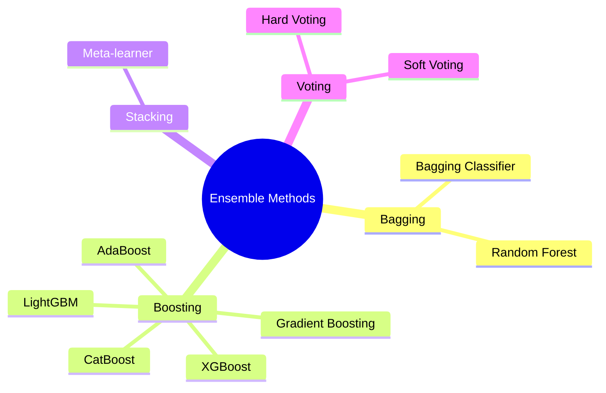
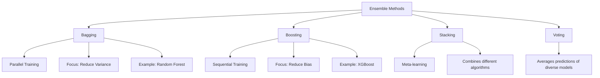
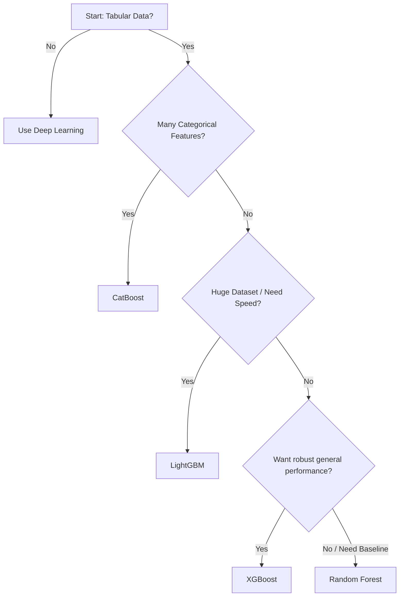

# ML Study Notes — Ensemble Methods and Boosting

## Overview

Welcome to Chapter 9! In this chapter, we will learn about **Ensemble Methods**—some of the most powerful and widely used techniques in machine learning. Whether you are aiming to crack a Kaggle competition or secure a top-tier ML engineering internship, mastering ensemble techniques like Random Forest, XGBoost, and LightGBM is essential.

Ensemble methods combine multiple machine learning models to create a single, more powerful predictive model. Think of it as combining the "wisdom of the crowd."



## Prerequisites
- Familiarity with Decision Trees (Chapter 7)
- Understanding of Bias and Variance (Chapter 4)
- Python, NumPy, Pandas, and Scikit-Learn basics

---

## 1. What are Ensemble Methods?

### Intuition: "Wisdom of the Crowd"
Imagine you are at a carnival trying to guess the number of jellybeans in a huge jar. 
- If you ask just one person, their guess might be way off.
- If you ask 100 people and take the average of their guesses, the combined answer is usually surprisingly close to the true number!

In machine learning, an **ensemble** takes multiple "weak learners" (individual models that are slightly better than random guessing) and combines their predictions to form a "strong learner" (a highly accurate model).

### Definition
**Ensemble learning** is a machine learning paradigm where multiple models (often called "base estimators") are trained to solve the same problem, and their predictions are aggregated (via voting or averaging) to produce a final output.

---

## 2. Why Ensembles Work: Bias-Variance Decomposition

Every model makes errors due to two main sources:
1. **Bias**: Error from erroneous assumptions (underfitting).
2. **Variance**: Error from sensitivity to small fluctuations in the training set (overfitting).

Ensemble methods work by directly attacking one or both of these errors:
- Combining independent models with high variance (like deep decision trees) using **Bagging** reduces *variance* without increasing bias.
- Combining models sequentially with high bias (like shallow trees) using **Boosting** reduces *bias* while keeping variance in check.

---

## 3. Types of Ensemble Methods



---

## 4. Bagging (Bootstrap Aggregating)

### Intuition
If you train the same model on the exact same data, you get the same model. To create diverse models, we give each model a slightly different dataset.

### Bootstrap Sampling
Bootstrap sampling means drawing samples from the dataset *with replacement*. 
If our dataset is `[A, B, C, D, E]`, one bootstrap sample might be `[A, A, C, D, E]` and another might be `[B, C, C, D, D]`. Some examples are repeated, and some are left out (Out-of-Bag samples).

### How Bagging Reduces Variance
By training multiple models on different subsets and averaging their predictions, the model becomes robust to noise in the original data.

### Code: Bagging in Scikit-Learn

```python
from sklearn.datasets import make_classification
from sklearn.model_selection import train_test_split
from sklearn.ensemble import BaggingClassifier
from sklearn.tree import DecisionTreeClassifier
from sklearn.metrics import accuracy_score

# 1. Create dataset
X, y = make_classification(n_samples=1000, n_features=20, random_state=42)
X_train, X_test, y_train, y_test = train_test_split(X, y, test_size=0.2, random_state=42)

# 2. Initialize Bagging Classifier with Decision Trees
base_tree = DecisionTreeClassifier(random_state=42)
bagging_clf = BaggingClassifier(
    estimator=base_tree,
    n_estimators=50,      # 50 trees
    max_samples=0.8,      # Each tree uses 80% of data
    bootstrap=True,       # With replacement
    n_jobs=-1,            # Use all CPU cores
    random_state=42
)

# 3. Train and Predict
bagging_clf.fit(X_train, y_train)
y_pred = bagging_clf.predict(X_test)
print(f"Bagging Accuracy: {accuracy_score(y_test, y_pred):.4f}")
```

---

## 5. AdaBoost (Adaptive Boosting)

### Intuition
Instead of training models in parallel, AdaBoost trains them *sequentially*. Each new model pays special attention to the data points that the previous model got wrong. 

Imagine a study group preparing for an exam:
- Person 1 takes a practice test and fails geometry questions.
- Person 2 studies extra hard on geometry, but fails algebra.
- Person 3 focuses on algebra.
Together, they form a perfect team.

### Step-by-Step Algorithm
1. Initialize weights for all data points equally: $w_i = \frac{1}{N}$.
2. For each weak learner $t = 1 \dots T$:
   - Train the learner on the weighted dataset.
   - Calculate the error rate $\epsilon_t$.
   - Calculate the learner's weight in the final vote: $\alpha_t = \frac{1}{2} \ln \left( \frac{1 - \epsilon_t}{\epsilon_t} \right)$.
   - Update data point weights: increase weights of misclassified points, decrease for correctly classified ones.
   - Normalize weights so they sum to 1.
3. Final prediction is the weighted majority vote of all learners.

### Code: AdaBoost in Scikit-Learn

```python
from sklearn.ensemble import AdaBoostClassifier

# AdaBoost using Decision Stumps (max_depth=1)
adaboost_clf = AdaBoostClassifier(
    estimator=DecisionTreeClassifier(max_depth=1, random_state=42),
    n_estimators=100,
    learning_rate=0.5,
    random_state=42
)

adaboost_clf.fit(X_train, y_train)
y_pred_ada = adaboost_clf.predict(X_test)
print(f"AdaBoost Accuracy: {accuracy_score(y_test, y_pred_ada):.4f}")
```

---

## 6. Gradient Boosting

### Intuition
While AdaBoost adjusts *sample weights*, Gradient Boosting tries to fit the new model to the **residual errors** of the previous model. 

Analogy: Playing mini-golf. 
- Stroke 1 gets you close to the hole (Model 1).
- Stroke 2 corrects the remaining distance (Model 2).
- Stroke 3 taps it in (Model 3).

### Mathematical Foundation
The model updates sequentially:
$F_m(x) = F_{m-1}(x) + \nu \cdot h_m(x)$
Where:
- $F_m(x)$ is the combined model at step $m$.
- $h_m(x)$ is the new tree trained on the residuals (gradient of the loss function).
- $\nu$ is the **learning rate** (shrinkage), which controls how much each tree contributes. Smaller $\nu$ requires more trees but usually yields better generalization.

### Code: Gradient Boosting

```python
from sklearn.ensemble import GradientBoostingClassifier

gb_clf = GradientBoostingClassifier(
    n_estimators=100,
    learning_rate=0.1,
    max_depth=3,
    subsample=0.8,  # Stochastic Gradient Boosting
    random_state=42
)

gb_clf.fit(X_train, y_train)
y_pred_gb = gb_clf.predict(X_test)
print(f"Gradient Boosting Accuracy: {accuracy_score(y_test, y_pred_gb):.4f}")
```

---

## 7. XGBoost (eXtreme Gradient Boosting)

### Why XGBoost Dominates
XGBoost is an optimized, distributed gradient boosting library designed to be highly efficient, flexible, and portable. It's the algorithm behind winning solutions in many Kaggle competitions.

### Key Improvements
1. **Regularization**: Adds L1 (Lasso) and L2 (Ridge) penalties to the leaf weights to prevent overfitting.
2. **Sparsity Awareness**: Automatically learns how to handle missing values (missing data goes to the default direction learned during training).
3. **Column Subsampling**: Similar to Random Forest, it randomly samples features for each tree.
4. **Hardware Optimization**: Cache-aware access, out-of-core computing, and parallelized tree building.

### Code: XGBoost

```python
# pip install xgboost
import xgboost as xgb

xgb_clf = xgb.XGBClassifier(
    n_estimators=200,
    learning_rate=0.05,
    max_depth=4,
    colsample_bytree=0.8,
    subsample=0.8,
    random_state=42,
    use_label_encoder=False,
    eval_metric='logloss'
)

xgb_clf.fit(X_train, y_train)
y_pred_xgb = xgb_clf.predict(X_test)
print(f"XGBoost Accuracy: {accuracy_score(y_test, y_pred_xgb):.4f}")

# Feature Importance
import matplotlib.pyplot as plt
xgb.plot_importance(xgb_clf, max_num_features=10)
plt.show()
```

---

## 8. LightGBM

### Intuition
Created by Microsoft, LightGBM is built for speed and efficiency, especially on massive datasets. It achieves this using two novel techniques:
1. **GOSS (Gradient-based One-Side Sampling)**: Keeps data points with large gradients (errors) and randomly samples points with small gradients.
2. **EFB (Exclusive Feature Bundling)**: Bundles mutually exclusive features to reduce the number of features.

**Tree Growth**: LightGBM grows trees **leaf-wise** (vertically) rather than **level-wise** (horizontally), which reduces loss faster but is more prone to overfitting on small datasets.

### Code: LightGBM

```python
# pip install lightgbm
import lightgbm as lgb

lgb_clf = lgb.LGBMClassifier(
    n_estimators=200,
    learning_rate=0.05,
    num_leaves=31,  # Controls complexity in leaf-wise growth
    random_state=42
)

lgb_clf.fit(X_train, y_train)
y_pred_lgb = lgb_clf.predict(X_test)
print(f"LightGBM Accuracy: {accuracy_score(y_test, y_pred_lgb):.4f}")
```

---

## 9. CatBoost

### Intuition
Created by Yandex, CatBoost (Categorical Boosting) is exceptional at handling categorical features automatically without requiring tedious preprocessing like One-Hot Encoding.

It uses **Ordered Boosting**, which eliminates a specific type of target leakage present in standard gradient boosting algorithms.

### Code: CatBoost

```python
# pip install catboost
from catboost import CatBoostClassifier

cat_clf = CatBoostClassifier(
    iterations=200,
    learning_rate=0.05,
    depth=4,
    verbose=0, # Silent output
    random_seed=42
)

cat_clf.fit(X_train, y_train)
y_pred_cat = cat_clf.predict(X_test)
print(f"CatBoost Accuracy: {accuracy_score(y_test, y_pred_cat):.4f}")
```

---

## 10. Stacking (Stacked Generalization)

### Intuition
Stacking combines multiple diverse models (e.g., a Tree, an SVM, and a Logistic Regression) by training a **Meta-Learner** on top of their predictions. 
- Level 0: The base models make predictions.
- Level 1: The meta-learner uses Level 0 predictions as its input features to make the final prediction.

### Code: Stacking

```python
from sklearn.ensemble import StackingClassifier
from sklearn.linear_model import LogisticRegression
from sklearn.ensemble import RandomForestClassifier
from sklearn.svm import SVC

# Define base learners
base_models = [
    ('rf', RandomForestClassifier(n_estimators=50, random_state=42)),
    ('svc', SVC(probability=True, random_state=42))
]

# Define meta-learner
meta_model = LogisticRegression()

# Initialize Stacking Classifier
stack_clf = StackingClassifier(
    estimators=base_models,
    final_estimator=meta_model,
    cv=5
)

stack_clf.fit(X_train, y_train)
y_pred_stack = stack_clf.predict(X_test)
print(f"Stacking Accuracy: {accuracy_score(y_test, y_pred_stack):.4f}")
```

---

## 11. Voting Classifier

Voting combines predictions directly without a meta-learner.
- **Hard Voting**: Majority rules. (e.g., 2 models say Class 1, 1 says Class 0 -> Class 1 wins).
- **Soft Voting**: Averages the predicted probabilities. Generally performs better.

```python
from sklearn.ensemble import VotingClassifier

voting_clf = VotingClassifier(
    estimators=base_models,
    voting='soft'
)
voting_clf.fit(X_train, y_train)
print(f"Soft Voting Accuracy: {accuracy_score(y_test, voting_clf.predict(X_test)):.4f}")
```

---

## 12. Comparison: Bagging vs Boosting vs Stacking

| Feature | Bagging | Boosting | Stacking |
| :--- | :--- | :--- | :--- |
| **Model Type** | Homogeneous (e.g., all trees) | Homogeneous (e.g., all trees) | Heterogeneous (different algorithms) |
| **Execution** | Parallel | Sequential | Sequential (Level 0 then Level 1) |
| **Goal** | Reduce Variance | Reduce Bias | Improve overall predictive power |
| **Training Data** | Bootstrap samples | Weighted data or Residuals | Original data -> Predictions |
| **Example** | Random Forest | XGBoost, AdaBoost | StackingClassifier |

---

## 13. XGBoost vs LightGBM vs CatBoost

| Feature | XGBoost | LightGBM | CatBoost |
| :--- | :--- | :--- | :--- |
| **Tree Growth** | Level-wise | Leaf-wise | Symmetric trees |
| **Speed** | Fast | Very Fast | Fast on CPU, Very Fast on GPU |
| **Categorical Features**| Requires explicit encoding | Built-in (integer encoded) | Best-in-class built-in handling |
| **Missing Values** | Native support | Native support | Native support |
| **Best Used When** | General purpose, reliable tuning | Large datasets, need fast training | Many categorical features |

---

## 14. When to Use Which Ensemble Method



---

## 15. Complete Project: Credit Card Fraud Detection

Fraud detection is heavily imbalanced (few frauds, many normal transactions). Ensembles handle this well.

```python
import pandas as pd
from sklearn.metrics import classification_report, roc_auc_score
from imblearn.over_sampling import SMOTE

# Assuming df is loaded with 'Class' as target
# X = df.drop('Class', axis=1)
# y = df['Class']

# 1. Train-test split
# X_train, X_test, y_train, y_test = train_test_split(X, y, stratify=y, test_size=0.2, random_state=42)

# 2. Handle imbalance using SMOTE
# smote = SMOTE(random_state=42)
# X_train_sm, y_train_sm = smote.fit_resample(X_train, y_train)

# 3. Train XGBoost with scale_pos_weight for imbalance
# model = xgb.XGBClassifier(scale_pos_weight=99) # If 1% fraud
# model.fit(X_train, y_train)

# 4. Evaluate
# y_pred = model.predict(X_test)
# y_prob = model.predict_proba(X_test)[:, 1]
# print(classification_report(y_test, y_pred))
# print(f"ROC AUC: {roc_auc_score(y_test, y_prob):.4f}")
```
*(Code is pseudo-code structure since dataframe needs to be downloaded)*

---

## 16. Common Mistakes & Pitfalls

1. **Not tuning Hyperparameters**: Algorithms like XGBoost have many parameters. Using defaults often leads to overfitting. Always tune `max_depth`, `learning_rate`, and `n_estimators`.
2. **Ignoring Learning Rate in Boosting**: High learning rate + many trees = severe overfitting. Always use early stopping.
3. **Using Leaf-wise growth (LightGBM) on small datasets**: Leaf-wise trees overfit easily on small data. Limit `max_depth` or `num_leaves`.
4. **Data Leakage in Stacking**: Ensure you use cross-validation (like `StackingClassifier` does natively) to generate meta-features, otherwise the meta-learner will overfit.

---

## 17. Interview Questions 🎯

1. **🎯 What is the difference between Bagging and Boosting?**
   *Answer*: Bagging trains models in parallel on random subsets to reduce variance (overfitting). Boosting trains models sequentially, where each model corrects the errors of the previous one, reducing bias (underfitting).
2. **🎯 How does Random Forest handle feature selection?**
   *Answer*: At each split in a tree, RF considers only a random subset of features (usually $\sqrt{n\_features}$). This forces trees to be diverse and uncorrelated.
3. **🎯 Why is XGBoost so popular?**
   *Answer*: It's fast, scalable, includes built-in L1/L2 regularization to prevent overfitting, handles missing values natively, and performs column block parallelization.
4. **🎯 What is the role of the learning rate in Gradient Boosting?**
   *Answer*: It scales the contribution of each tree. A lower learning rate requires more trees but makes the model more robust and less prone to overfitting.
5. **🎯 Explain how AdaBoost updates sample weights.**
   *Answer*: After a weak learner predicts, misclassified samples have their weights increased, and correctly classified samples have weights decreased. The next learner is forced to focus on the heavy (misclassified) samples.
6. **🎯 Hard Voting vs. Soft Voting?**
   *Answer*: Hard voting counts the categorical predictions (majority rules). Soft voting averages the predicted probabilities, which takes the confidence of models into account and usually performs better.
7. **🎯 When would you choose LightGBM over XGBoost?**
   *Answer*: When the dataset is extremely large and training speed/memory usage is a primary concern, LightGBM's leaf-wise growth and GOSS/EFB optimizations make it much faster.

---

## 18. Practice Exercises

1. **Beginner**: Load the `breast_cancer` dataset from `sklearn.datasets`. Train a Random Forest and an AdaBoost model. Compare their accuracies.
2. **Intermediate**: Take the same dataset and implement a `VotingClassifier` combining Logistic Regression, SVM, and Random Forest using Soft Voting.
3. **Intermediate**: Train an `XGBClassifier` and plot the feature importances using `xgb.plot_importance`. Identify the top 3 most important features.
4. **Advanced**: Implement a hyperparameter tuning grid search for `LightGBM` optimizing `num_leaves`, `learning_rate`, and `n_estimators`.
5. **Advanced**: Build a `StackingClassifier` using XGBoost and Random Forest as base estimators, and a Logistic Regression meta-learner. Compare its performance to the individual base models.

---

## Chapter Summary
- **Bagging** builds multiple independent models and averages them to reduce variance (e.g., Random Forest).
- **Boosting** builds models sequentially to correct errors, reducing bias (e.g., AdaBoost, Gradient Boosting, XGBoost).
- **Stacking** learns how to best combine predictions from multiple heterogeneous models using a meta-learner.
- **XGBoost, LightGBM, and CatBoost** are state-of-the-art gradient boosting libraries essential for modern ML tasks.

---
**Navigation:**
- Previous: [[ml-chapter-08-svm-and-kernel-methods|← Chapter 8: SVM and Kernel Methods]]
- Next: [[ml-chapter-10-unsupervised-learning-clustering|Chapter 10: Unsupervised Learning - Clustering →]]
