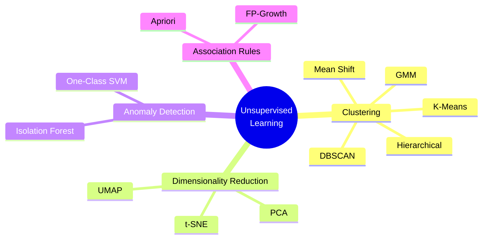

# ML Study Notes — Chapter 10: Unsupervised Learning — Clustering

## Overview

Welcome to Chapter 10! So far, we've focused on *Supervised Learning*, where our dataset came with neat little labels (like "spam" vs "not spam", or the actual price of a house). But what happens in the real world when you just have a massive pile of data and *no labels at all*? How do you make sense of it? 

Imagine walking into a chaotic, unlabeled library. Your job is to organize the books. Even without knowing the genres in advance, you'd intuitively group books that look similar—maybe by cover style, size, or common words in the title. That intuition is **Clustering**, the heart of Unsupervised Learning.



## Prerequisites
Before diving in, ensure you are comfortable with:
- **Python basics** (loops, functions, classes)
- **NumPy arrays** and vectorized operations
- **Pandas DataFrames**
- The concept of **Distance Metrics** (especially Euclidean distance) from KNN.

---

## 1. What is Unsupervised Learning?

### Intuition
Imagine a chai stall owner watching thousands of customers visit his shop over a year. He doesn't have a label for every customer (like "Corporate Employee" or "College Student"). However, he notices patterns: one group comes at 9 AM and buys coffee with a quick bite, while another group comes at 5 PM, stays for an hour, and drinks multiple chais. He just discovered *customer segments* without any predefined labels!

**Unsupervised Learning** is the branch of machine learning that learns from test data that has not been labeled, classified, or categorized. The algorithm identifies commonalities in the data and reacts based on the presence or absence of such commonalities.

### Supervised vs Unsupervised Learning

| Feature | Supervised Learning | Unsupervised Learning |
|---------|---------------------|-----------------------|
| **Data** | Labeled ($X$ and $y$) | Unlabeled ($X$ only) |
| **Goal** | Predict outcomes for new data | Discover hidden patterns or groupings |
| **Feedback** | Explicit (comparing prediction to true label) | None (no "right" answer) |
| **Complexity** | Usually simpler evaluation | Harder to evaluate objectively |
| **Examples** | Regression, Classification | Clustering, Dimensionality Reduction |

### Types of Unsupervised Learning
1. **Clustering**: Grouping similar data points together (e.g., Customer Segmentation).
2. **Dimensionality Reduction**: Reducing the number of features while retaining important information (e.g., PCA for data compression or visualization).
3. **Anomaly Detection**: Finding rare items, events, or observations which raise suspicions by differing significantly from the majority of the data (e.g., Fraud Detection).
4. **Association Rules**: Discovering interesting relations between variables in large databases (e.g., Market Basket Analysis - "People who buy diapers also buy beer").

---

## 2. What is Clustering?

Clustering is the task of dividing the population or data points into a number of groups such that data points in the same groups are more similar to other data points in the same group than those in other groups. 

In simple words, the aim is to segregate groups with similar traits and assign them into clusters.

### Real-World Examples
- **Customer Segmentation**: Grouping customers based on purchasing history to target them with specific marketing campaigns.
- **Document Grouping**: Grouping news articles into topics (Sports, Politics, Tech) automatically.
- **Image Compression**: Grouping similar pixel colors to reduce the total number of colors needed to represent an image (Color Quantization).
- **Biology**: Grouping plants or animals given their features.

---

## 3. K-Means Clustering

K-Means is the most famous clustering algorithm. It's simple, fast, and highly effective for many problems.

### Intuition
You are a pizza delivery company and want to open $K=3$ new branches in a city to minimize delivery times. Where do you place them?
1. You randomly drop 3 pins on the map (Centroids).
2. Every household (data point) is assigned to the nearest pin.
3. You move each pin to the *center* (mean) of all households assigned to it.
4. Repeat steps 2 and 3 until the pins stop moving.

### Algorithm (Lloyd's Algorithm) Step-by-Step
1. **Initialization**: Choose $K$ random points from the data as initial centroids.
2. **Assignment Step**: Assign each data point to the nearest centroid using a distance metric (usually Euclidean distance).
3. **Update Step**: Recompute the centroids by taking the mean of all data points assigned to that centroid's cluster.
4. **Convergence**: Repeat steps 2 and 3 until the centroids no longer change significantly (or a maximum number of iterations is reached).

### Mathematical Foundation
Given a set of observations $(x_1, x_2, \dots, x_n)$, K-Means aims to partition the $n$ observations into $K$ sets ($S = \{S_1, S_2, \dots, S_K\}$) so as to minimize the within-cluster sum of squares (WCSS), also known as **Inertia**.

$$ \arg\min_S \sum_{i=1}^{K} \sum_{x \in S_i} ||x - \mu_i||^2 $$

where $\mu_i$ is the mean of points in $S_i$.

### The Initialization Problem (K-Means++)
If you drop your initial pizza branches all in one corner of the city, the algorithm might get stuck in a bad layout (local optimum). 
**K-Means++** is a smart initialization technique that spreads out the initial centroids. It picks the first centroid randomly, and then picks subsequent centroids such that they are far away from the already chosen ones. `sklearn` uses K-Means++ by default.

### Choosing K (The Number of Clusters)
K-Means requires you to specify $K$ beforehand. How do we know how many clusters exist?

#### 1. The Elbow Method
Calculate the WCSS (Inertia) for different values of $K$. As $K$ increases, WCSS will always decrease (if $K=N$, WCSS is 0). The "elbow" is the point where the rate of decrease sharply shifts, indicating that adding more clusters doesn't give much better modeling of the data.

#### 2. The Silhouette Score
Measures how similar an object is to its own cluster (cohesion) compared to other clusters (separation). The score ranges from -1 to +1. A high value indicates that the object is well matched to its own cluster and poorly matched to neighboring clusters.

$$ s = \frac{b - a}{\max(a, b)} $$
Where:
- $a$: Mean distance between a sample and all other points in the same cluster.
- $b$: Mean distance between a sample and all other points in the *next nearest* cluster.

### Code Example: K-Means with Sklearn & Choosing K

```python
import numpy as np
import matplotlib.pyplot as plt
from sklearn.datasets import make_blobs
from sklearn.cluster import KMeans
from sklearn.metrics import silhouette_score

# Generate synthetic data (4 hidden clusters)
X, y_true = make_blobs(n_samples=500, centers=4, cluster_std=0.8, random_state=42)

# --- 1. Elbow Method ---
wcss = []
K_range = range(1, 11)
for k in K_range:
    kmeans = KMeans(n_clusters=k, init='k-means++', random_state=42, n_init=10)
    kmeans.fit(X)
    wcss.append(kmeans.inertia_)

plt.figure(figsize=(12, 5))
plt.subplot(1, 2, 1)
plt.plot(K_range, wcss, marker='o', linestyle='--')
plt.title('Elbow Method')
plt.xlabel('Number of Clusters (K)')
plt.ylabel('WCSS (Inertia)')

# --- 2. Silhouette Score ---
silhouette_scores = []
K_range_sil = range(2, 11) # Silhouette requires at least 2 clusters
for k in K_range_sil:
    kmeans = KMeans(n_clusters=k, init='k-means++', random_state=42, n_init=10)
    cluster_labels = kmeans.fit_predict(X)
    silhouette_scores.append(silhouette_score(X, cluster_labels))

plt.subplot(1, 2, 2)
plt.plot(K_range_sil, silhouette_scores, marker='o', linestyle='-', color='orange')
plt.title('Silhouette Score Method')
plt.xlabel('Number of Clusters (K)')
plt.ylabel('Silhouette Score')
plt.tight_layout()
plt.show()

# Based on the plots, K=4 is the clear winner!
best_k = 4
best_kmeans = KMeans(n_clusters=best_k, init='k-means++', random_state=42, n_init=10)
y_kmeans = best_kmeans.fit_predict(X)

# Plot final clusters
plt.figure(figsize=(6, 5))
plt.scatter(X[:, 0], X[:, 1], c=y_kmeans, s=30, cmap='viridis')
plt.scatter(best_kmeans.cluster_centers_[:, 0], best_kmeans.cluster_centers_[:, 1], 
            s=200, c='red', marker='X', label='Centroids')
plt.title(f'K-Means Clustering (K={best_k})')
plt.legend()
plt.show()
```

### K-Means from Scratch (NumPy)
To truly understand the math, let's code Lloyd's algorithm from scratch.

```python
import numpy as np

class KMeansScratch:
    def __init__(self, k=3, max_iters=100):
        self.k = k
        self.max_iters = max_iters
        self.centroids = None
        
    def fit(self, X):
        # 1. Randomly initialize centroids (picking random data points)
        random_indices = np.random.choice(X.shape[0], self.k, replace=False)
        self.centroids = X[random_indices]
        
        for _ in range(self.max_iters):
            # 2. Assignment Step: calculate distance from points to centroids
            # Using broadcasting to compute distances efficiently
            distances = np.sqrt(((X - self.centroids[:, np.newaxis])**2).sum(axis=2))
            labels = np.argmin(distances, axis=0)
            
            # 3. Update Step: compute new centroids as means of assigned points
            new_centroids = np.array([X[labels == i].mean(axis=0) for i in range(self.k)])
            
            # Check for convergence
            if np.all(self.centroids == new_centroids):
                break
                
            self.centroids = new_centroids
            
        return labels

# Usage
# scratch_kmeans = KMeansScratch(k=4)
# labels = scratch_kmeans.fit(X)
```

### Mini-Batch K-Means
Standard K-Means calculates distances from *every* point to *every* centroid at each iteration. For massive datasets (millions of rows), this is too slow. 
**Mini-Batch K-Means** takes random subsets (batches) of data at each iteration to update the centroids. It converges much faster with only a slight loss in quality. Available in sklearn via `from sklearn.cluster import MiniBatchKMeans`.

### Limitations of K-Means
- Needs $K$ in advance.
- Assumes clusters are spherical and of similar size. Fails miserably on elongated or nested clusters (like two concentric moons).
- Highly sensitive to outliers (since it uses mean, and mean is sensitive to outliers).

---

## 4. Hierarchical Clustering

Instead of assigning points to $K$ clusters all at once, what if we build a hierarchy of clusters?

### Two Approaches:
1. **Agglomerative (Bottom-Up)**: Start with every single data point as its own cluster. Successively merge the two closest clusters until only one giant cluster remains. (Most common).
2. **Divisive (Top-Down)**: Start with all points in one giant cluster. Successively split it until every point is its own cluster.

### Linkage Methods (How do we define distance between *clusters*?)
When deciding which two clusters to merge, how do we measure the distance between cluster A (has 5 points) and cluster B (has 10 points)?
- **Single Linkage**: Shortest distance between any point in A and any point in B. (Prone to chaining).
- **Complete Linkage**: Longest distance between any point in A and any point in B. (Tends to produce compact clusters).
- **Average Linkage**: Average distance between all points in A and all points in B.
- **Ward's Method**: Merge clusters that result in the smallest increase in total WCSS (variance). (Most commonly used, works very well).

### The Dendrogram
A dendrogram is a tree-like diagram that records the sequences of merges. The y-axis represents the distance between the clusters when they were merged. 
To get discrete clusters, we draw a horizontal line across the dendrogram ("cutting the tree").

### Code Example: Hierarchical Clustering with SciPy & Sklearn

```python
import numpy as np
import matplotlib.pyplot as plt
from scipy.cluster.hierarchy import dendrogram, linkage
from sklearn.cluster import AgglomerativeClustering
from sklearn.datasets import make_moons

# Let's generate some complex data (K-Means fails here)
X, y = make_moons(n_samples=200, noise=0.05, random_state=42)

# 1. Plot Dendrogram using SciPy
plt.figure(figsize=(10, 5))
plt.title("Hierarchical Clustering Dendrogram (Ward Linkage)")
# linkage function performs the bottom-up clustering
Z = linkage(X, method='ward') 
dendrogram(Z, truncate_mode='level', p=3) # Truncate for cleaner viz
plt.axhline(y=15, color='r', linestyle='--') # Where to cut
plt.show()

# 2. Perform Clustering with Sklearn
agg_cluster = AgglomerativeClustering(n_clusters=2, linkage='ward')
y_agg = agg_cluster.fit_predict(X)

plt.figure(figsize=(6, 5))
plt.scatter(X[:, 0], X[:, 1], c=y_agg, cmap='viridis')
plt.title("Agglomerative Clustering")
plt.show()
```

---

## 5. DBSCAN (Density-Based Spatial Clustering of Applications with Noise)

K-Means assumes clusters are spherical. Hierarchical clustering is computationally expensive ($O(N^3)$). What if we have weirdly shaped clusters and noise? Enter DBSCAN!

### Intuition
Think of a crowd in a plaza. A "cluster" is a dense group of people. If someone is standing far away from the crowd, they are "noise". DBSCAN groups together points that are closely packed together, marking as outliers points that lie alone in low-density regions.

### Key Concepts
- **Epsilon ($\epsilon$)**: The maximum radius of the neighborhood around a point.
- **MinPts**: The minimum number of points required to form a dense region (a cluster) within the $\epsilon$ radius.

### Point Classifications:
1. **Core Point**: Has at least `MinPts` points within its $\epsilon$-neighborhood (including itself). It is the heart of a cluster.
2. **Border Point**: Has fewer than `MinPts` within its neighborhood, but lies within the $\epsilon$-neighborhood of a Core Point. It is the edge of a cluster.
3. **Noise (Outlier)**: Neither a core nor a border point.

### How to choose Epsilon ($\epsilon$)? (The k-distance graph)
Calculate the distance from every point to its $k^{th}$ nearest neighbor (where $k$ is usually set to `MinPts`). Sort these distances and plot them. The "knee" (sharp bend) in the plot gives a good estimate for $\epsilon$.

### Advantages of DBSCAN
- Does NOT require specifying the number of clusters $K$.
- Can find arbitrarily shaped clusters (moons, circles, S-shapes).
- Robust to outliers (it explicitly identifies them as noise).

### Code Example: DBSCAN on non-spherical data

```python
import numpy as np
import matplotlib.pyplot as plt
from sklearn.cluster import DBSCAN
from sklearn.datasets import make_moons

# Dataset where K-Means fails
X, _ = make_moons(n_samples=300, noise=0.05, random_state=42)

# Apply DBSCAN
# eps=0.2 means neighborhood radius is 0.2
# min_samples=5 means we need 5 points to form a core
dbscan = DBSCAN(eps=0.2, min_samples=5)
y_dbscan = dbscan.fit_predict(X)

# Note: DBSCAN assigns a label of -1 to noise/outliers!
plt.figure(figsize=(6, 5))
# Plot clusters
plt.scatter(X[y_dbscan >= 0, 0], X[y_dbscan >= 0, 1], c=y_dbscan[y_dbscan >= 0], cmap='viridis', label='Core/Border')
# Plot noise
plt.scatter(X[y_dbscan == -1, 0], X[y_dbscan == -1, 1], c='red', marker='x', label='Noise')
plt.title("DBSCAN Clustering")
plt.legend()
plt.show()
```

---

## 6. Mean Shift Clustering

### Intuition
Imagine topographic map with hills. You drop a bunch of marbles on the map. They will all roll uphill and gather at the peaks. Mean Shift does exactly this. It's a sliding-window-based algorithm that attempts to find dense areas of data points.

It updates the center of a window to be the mean of the points within it, shifting the window until it converges at a local density maximum.

- **Advantage**: No need to specify $K$. Handles arbitrary shapes well.
- **Disadvantage**: Highly computationally expensive ($O(N^2)$), not scalable for large datasets. Parameter tuning (bandwidth/window size) is non-trivial.

---

## 7. Gaussian Mixture Models (GMM)

K-Means performs "hard clustering"—a point belongs to exactly one cluster. What if a point is on the boundary between two clusters? GMM provides "soft clustering"—it gives the *probability* that a point belongs to a cluster.

### Intuition
GMM assumes that the dataset was generated by a mixture of several Gaussian (Normal) distributions. 
Think of K-Means as drawing hard circles around data. GMM draws *ellipses* and calculates the probability of a point being inside that ellipse.

### Expectation-Maximization (EM) Algorithm
GMM uses the EM algorithm to find the parameters of these Gaussian distributions:
1. **Initialization**: Guess the parameters (mean, variance, weight) of $K$ Gaussians.
2. **Expectation (E-step)**: Calculate the probability that each data point belongs to each Gaussian.
3. **Maximization (M-step)**: Update the parameters of the Gaussians based on the probabilities calculated in the E-step.
4. Repeat E and M steps until convergence.

### When to use GMM over K-Means?
- When clusters are elliptical (not just spherical).
- When you need a confidence score (probability) for cluster assignment.
- When clusters overlap.

### Code Example: GMM

```python
import numpy as np
import matplotlib.pyplot as plt
from sklearn.mixture import GaussianMixture
from sklearn.datasets import make_blobs

# Generate elliptical data
X, _ = make_blobs(n_samples=400, centers=4, cluster_std=0.60, random_state=0)
X = np.dot(X, np.random.RandomState(0).randn(2, 2)) # stretch to make elliptical

gmm = GaussianMixture(n_components=4, covariance_type='full', random_state=42)
gmm.fit(X)
labels = gmm.predict(X)
probs = gmm.predict_proba(X) # Get soft assignment probabilities

# Size of dots proportional to certainty of assignment
certainty = probs.max(axis=1)

plt.figure(figsize=(6, 5))
plt.scatter(X[:, 0], X[:, 1], c=labels, s=40 * certainty**2, cmap='viridis', zorder=2)
plt.title('Gaussian Mixture Model')
plt.show()
```

---

## 8. Cluster Evaluation Metrics

Evaluating unsupervised learning is hard because we don't have the "ground truth" $y$ labels. 

### Internal Metrics (No true labels needed)
1. **Silhouette Score**: (-1 to 1). Higher is better. Measures cohesion vs separation.
2. **Davies-Bouldin Index**: Lower is better. The average similarity measure of each cluster with its most similar cluster, where similarity is the ratio of within-cluster distances to between-cluster distances.
3. **Calinski-Harabasz Index (Variance Ratio Criterion)**: Higher is better. Ratio of the sum of between-clusters dispersion and of within-cluster dispersion. Fast to compute.

### External Metrics (If you happen to have true labels for testing)
1. **Adjusted Rand Index (ARI)**: (-1 to 1). Similarity measure between two clusterings, adjusted for chance. 1.0 is perfect match.
2. **Normalized Mutual Information (NMI)**: (0 to 1). Measures the mutual information between true labels and predicted labels.

---

## 9. Comparison Table

| Feature | K-Means | Hierarchical | DBSCAN | GMM |
|---------|---------|--------------|--------|-----|
| **Requires $K$?** | Yes | Yes (to cut tree) | No | Yes |
| **Cluster Shape** | Spherical | Spherical (Ward) or Arbitrary (Single) | Arbitrary | Elliptical |
| **Handles Outliers?**| No (sensitive) | No | Yes (marks as noise) | Yes (soft prob) |
| **Scalability** | Excellent ($O(N)$) | Poor ($O(N^3)$) | Good ($O(N \log N)$) | Moderate |
| **Assignment** | Hard | Hard | Hard | Soft (Probabilistic) |
| **Best Use Case** | Fast, general purpose | Understanding hierarchy | Spatial data, noise | Overlapping clusters |

---

## 10. Complete Project: Customer Segmentation

Let's do a mini-project. We have a dataset of mall customers with their Age, Annual Income, and Spending Score (1-100). We want to segment them.

```python
import pandas as pd
import numpy as np
import matplotlib.pyplot as plt
import seaborn as sns
from sklearn.cluster import KMeans
from sklearn.preprocessing import StandardScaler

# 1. Simulate Mall Data
np.random.seed(42)
income = np.random.normal(60, 20, 200)
spending = np.random.normal(50, 20, 200)
# Create artificial clusters for realism
income[0:50] += 40; spending[0:50] -= 30  # High Income, Low Spend
income[50:100] += 40; spending[50:100] += 30 # High Income, High Spend
income[100:150] -= 30; spending[100:150] += 30 # Low Income, High Spend

df = pd.DataFrame({'Income': income, 'Spending': spending})

# 2. Preprocessing: Scaling is CRUCIAL for distance-based algorithms!
scaler = StandardScaler()
X_scaled = scaler.fit_transform(df)

# 3. Choose K using Elbow Method
wcss = []
for i in range(1, 11):
    kmeans = KMeans(n_clusters=i, init='k-means++', random_state=42, n_init=10)
    kmeans.fit(X_scaled)
    wcss.append(kmeans.inertia_)

# Assume Elbow shows K=5 is best
kmeans = KMeans(n_clusters=5, init='k-means++', random_state=42, n_init=10)
df['Cluster'] = kmeans.fit_predict(X_scaled)

# 4. Visualization & Interpretation
plt.figure(figsize=(10, 6))
sns.scatterplot(data=df, x='Income', y='Spending', hue='Cluster', palette='Set1', s=100)
plt.title("Mall Customer Segmentation")
plt.show()

# 5. Interpretation
# Cluster X: High Income, Low Spending -> "Careful/Misers"
# Cluster Y: High Income, High Spending -> "Target Audience"
# Cluster Z: Low Income, High Spending -> "Careless"
```

---

## 11. Common Mistakes in Clustering

1. **Not Scaling Data**: K-Means and DBSCAN rely on distance metrics (Euclidean). If Income is in $100,000s and Age is in 10s, Income will completely dominate the distance calculation. *Always use StandardScaler or MinMaxScaler first.*
2. **Blindly trusting K-Means**: Using K-Means on heavily imbalanced clusters or non-spherical data will yield terrible results. Visualize your data (perhaps using PCA first) to see if DBSCAN might be better.
3. **Ignoring Outliers**: Outliers pull K-Means centroids away from the true cluster centers. Clean data or use DBSCAN if outliers are prevalent.
4. **Over-interpreting the "Elbow"**: The elbow plot is often smooth, not a sharp angle. Use Silhouette score in conjunction to make a solid decision.

---

## 12. Interview Questions 🎯

1. **🎯 What is the difference between Supervised and Unsupervised Learning?**
   *Answer*: Supervised learning uses labeled data to train models to predict outcomes. Unsupervised learning uses unlabeled data to discover hidden patterns, groupings, or structures (like clustering).

2. **🎯 How does the K-Means algorithm work?**
   *Answer*: It initializes $K$ centroids, assigns each point to the nearest centroid, recalculates the centroid as the mean of assigned points, and repeats until convergence.

3. **🎯 Why is feature scaling important in K-Means?**
   *Answer*: K-Means uses Euclidean distance. Features with larger scales will disproportionately influence the distance calculation, distorting the clusters. Scaling ensures all features contribute equally.

4. **🎯 What is the K-Means++ initialization and why is it useful?**
   *Answer*: It's an algorithm to choose the initial centroids by spacing them as far apart from each other as possible. It prevents K-Means from getting stuck in poor local optima.

5. **🎯 How do you evaluate a clustering algorithm if you have no true labels?**
   *Answer*: Using internal metrics like Silhouette Score (measures cohesion vs separation), Davies-Bouldin index, or the Elbow method (WCSS).

6. **🎯 When would you choose DBSCAN over K-Means?**
   *Answer*: When the data has outliers/noise, when you don't know the number of clusters $K$, or when the clusters have arbitrary, non-spherical shapes (e.g., moons or nested circles).

7. **🎯 Explain the difference between Hard and Soft Clustering.**
   *Answer*: In Hard Clustering (K-Means), a point belongs entirely to one cluster. In Soft Clustering (GMM), a point has a probability of belonging to each cluster (e.g., 80% Cluster A, 20% Cluster B).

---

## 13. Practice Exercises

**Beginner**
1. Generate a synthetic dataset using `sklearn.datasets.make_blobs` with 3 centers. Apply K-Means and plot the results.
2. Apply `StandardScaler` to the `make_blobs` dataset and see if the clustering results change. Why or why not?

**Intermediate**
3. Load the famous "Iris" dataset (`sklearn.datasets.load_iris`). Drop the labels. Apply K-Means (K=3) and Hierarchical Clustering. Which one produces clusters that more closely match the dropped labels?
4. Write a function that takes a dataset and a max $K$, runs K-Means for $k=2$ to $K$, and plots both the Elbow curve and the Silhouette score curve side-by-side.

**Advanced**
5. Generate concentric circles using `sklearn.datasets.make_circles(n_samples=500, factor=0.5, noise=0.05)`. Try K-Means on it. Observe the failure. Then, apply DBSCAN and tune `eps` and `min_samples` until it perfectly captures the two circles.
6. Implement K-Means from scratch using only standard Python lists and `math` (no NumPy). Compare its execution speed with the NumPy vectorized version provided in the notes on a dataset of 10,000 points.

---

## Navigation
- Previous: [[ml-chapter-09-ensemble-methods-and-boosting|← Chapter 9: Ensemble Methods]]
- Next: [[ml-chapter-11-dimensionality-reduction|Chapter 11: Dimensionality Reduction →]]
