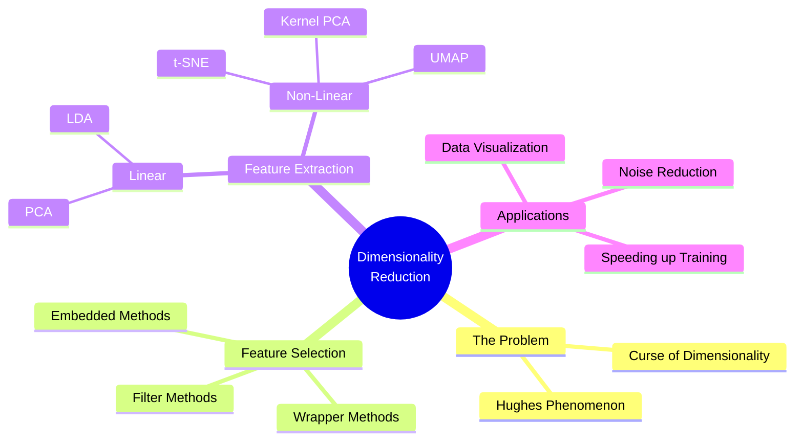
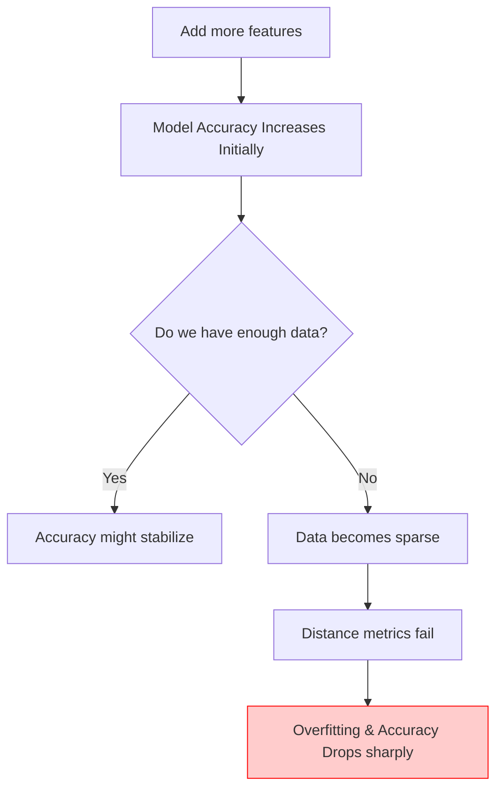
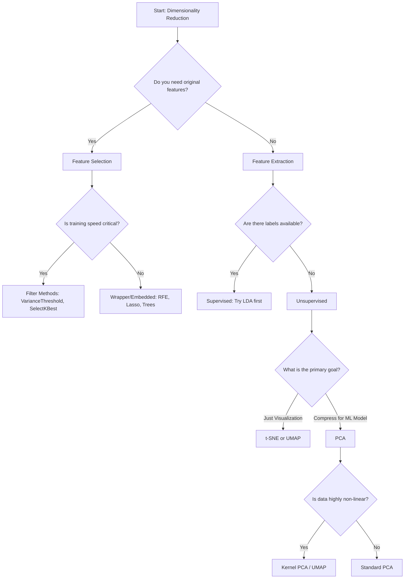

# ML Study Notes — Chapter 11: Dimensionality Reduction

Welcome back! So far, we've dealt with datasets that have a manageable number of columns (features). But what happens when you have thousands, or even millions, of features? Imagine working with high-resolution images where every single pixel is a feature, or analyzing DNA sequences. 

This chapter introduces **Dimensionality Reduction**, the art of compressing information. By the end of this chapter, you'll know how to distill a massive dataset down to its absolute essence without losing the critical patterns.

---

## Overview

Here is a roadmap of what we will cover:



## Prerequisites
Before diving in, make sure you are comfortable with:
- Linear Algebra (Vectors, Matrices, Eigenvalues/Eigenvectors)
- Basic Probability and Statistics (Variance, Covariance)
- Python, NumPy, Pandas, and Scikit-Learn
- Supervised and Unsupervised Learning concepts

---

## 1. What is Dimensionality Reduction?

### Intuition
Imagine a chai stall menu that lists 50 different attributes for every cup of tea: temperature in Celsius, temperature in Fahrenheit, amount of milk, amount of sugar, color hex code, weight of cup, etc. 
Do you need all 50 attributes to describe a good cup of chai? No. Many attributes are redundant (Celsius vs. Fahrenheit), and some are useless (weight of the cup). You could probably summarize the entire menu with just 3 dimensions: **Sweetness**, **Milkiness**, and **Spiciness**.

**Dimensionality Reduction** is exactly this: transforming data from a high-dimensional space into a lower-dimensional space so that the low-dimensional representation retains some meaningful properties of the original data.

### Why Reduce Dimensions?
1. **To overcome the Curse of Dimensionality** (more on this below).
2. **Space & Time Complexity**: Less data means faster training and less memory usage.
3. **Data Visualization**: We can only visualize data in 2D or 3D.
4. **Noise Reduction**: Dropping less important features often drops the noise.
5. **Simpler Models**: Less prone to overfitting.

---

## 2. The Curse of Dimensionality

### What happens as dimensions increase?
As the number of features (dimensions) grows, the volume of the space increases exponentially. If you have 100 data points scattered on a 1D line, they are dense. Put those same 100 points in a 10,000-dimensional space, and they are incredibly isolated.

### Sparsity in High Dimensions
In high-dimensional space, almost all points are far away from each other. The data becomes **sparse**. Machine learning models thrive on finding patterns in dense regions of data. If every data point is an island, the model can't generalize.

### Why Distance Metrics Break Down
In high dimensions, the difference between the maximum distance and minimum distance between points approaches zero.
$$ \lim_{d \to \infty} \frac{Dist_{max} - Dist_{min}}{Dist_{min}} \to 0 $$
This means distance metrics like Euclidean distance become meaningless. If all points are roughly the same distance apart, algorithms like K-Nearest Neighbors (KNN) or K-Means completely fail.

### Hughes Phenomenon
You might think: *"More features = more information = better accuracy!"* 
False. **Hughes Phenomenon** states that for a fixed number of training samples, the predictive power of a classifier first increases as dimensions increase, but then sharply decreases. You need exponentially more data to sustain the performance as you add dimensions.



---

## 3. Feature Selection vs Feature Extraction

There are two primary ways to reduce dimensions: **Feature Selection** and **Feature Extraction**.

### Feature Selection
Keeping a subset of the original features and discarding the rest. The retained features mean exactly what they meant originally.
- **Filter Methods**: Select features based on statistical scores (e.g., Variance Threshold, Correlation). Fast, independent of any ML model.
- **Wrapper Methods**: Train models on different subsets of features to find the best combination (e.g., Recursive Feature Elimination). Very slow.
- **Embedded Methods**: The model performs feature selection during training (e.g., L1 Lasso Regularization, Decision Tree Feature Importance).

### Feature Extraction
Creating *new* features that are combinations of the original features. The original features are projected into a new space. 
- **Example**: Creating a "BMI" feature from "Height" and "Weight".
- **Algorithms**: PCA, t-SNE, UMAP, LDA.

### Comparison Table

| Aspect | Feature Selection | Feature Extraction |
| :--- | :--- | :--- |
| **Method** | Chooses a subset of original features | Creates new, synthetic features |
| **Interpretability**| High (Original meaning is kept) | Low (New features are mathematically derived) |
| **Information Loss**| High (Discarded features are gone completely) | Low (New features compress information from all original features) |
| **Examples** | SelectKBest, RFE, Lasso | PCA, LDA, t-SNE, UMAP |

---

## 4. Principal Component Analysis (PCA)

PCA is the undisputed king of dimensionality reduction. If you only learn one algorithm from this chapter, make it PCA.

### Intuition
Imagine you have 2D data of students' heights and weights. The points form an elongated oval shape pointing diagonally upwards. 
If you had to compress this 2D data into a 1D line while keeping the maximum amount of information (spread/variance), where would you draw the line? 
You would draw it through the longest part of the oval. This line is the **First Principal Component (PC1)**. 
The second line, perpendicular to the first, covering the remaining variance, is **PC2**.

PCA finds new axes (Principal Components) that maximize the variance of the data. 

### Step-by-Step Algorithm
1. **Standardize the Data**: Center the data around mean 0 and scale it (variance 1). Critical step!
2. **Compute the Covariance Matrix**: Understand how variables vary together.
3. **Compute Eigenvectors and Eigenvalues**: The eigenvectors are the directions of the new axes. The eigenvalues are the magnitude of variance in those directions.
4. **Sort**: Sort eigenvectors by decreasing eigenvalues.
5. **Select Top-K**: Pick the top $k$ eigenvectors to form a projection matrix $W$.
6. **Transform**: Multiply original data $X$ by $W$ to get the new lower-dimensional data.

### Mathematical Foundation
Covariance matrix $\Sigma$:
$$ \Sigma = \frac{1}{n-1} X^T X $$
Eigen-decomposition:
$$ \Sigma v = \lambda v $$
where $v$ is an eigenvector and $\lambda$ is an eigenvalue.

### PCA from Scratch (NumPy)

```python
import numpy as np
import matplotlib.pyplot as plt

# Generate dummy 2D data (correlated)
np.random.seed(42)
x = np.random.normal(0, 1, 100)
y = 2 * x + np.random.normal(0, 0.5, 100)
X = np.column_stack((x, y))

# Step 1: Standardize
X_mean = np.mean(X, axis=0)
X_std = X - X_mean

# Step 2: Covariance Matrix
cov_matrix = np.cov(X_std.T)
print("Covariance Matrix:\n", cov_matrix)

# Step 3: Eigenvalues and Eigenvectors
eigenvalues, eigenvectors = np.linalg.eig(cov_matrix)

# Step 4: Sort
idx = eigenvalues.argsort()[::-1]
eigenvalues = eigenvalues[idx]
eigenvectors = eigenvectors[:, idx]

print("\nEigenvalues:", eigenvalues)
print("Eigenvectors:\n", eigenvectors)

# Step 5: Select Top-K (let's pick k=1)
k = 1
W = eigenvectors[:, :k]

# Step 6: Transform data
X_pca = X_std.dot(W)
print("\nOriginal shape:", X.shape)
print("Reduced shape:", X_pca.shape)
```

### PCA with Scikit-Learn

```python
from sklearn.decomposition import PCA
from sklearn.preprocessing import StandardScaler

# Always scale before PCA!
scaler = StandardScaler()
X_scaled = scaler.fit_transform(X)

pca = PCA(n_components=1)
X_pca_sklearn = pca.fit_transform(X_scaled)

print("Explained Variance Ratio:", pca.explained_variance_ratio_)
```

### Explained Variance & Scree Plot
How many components should you keep? We look at the **Explained Variance Ratio**. It tells us what percentage of the total variance is captured by each principal component.

A **Scree Plot** graphs this out. You usually look for the "elbow" in the graph or aim for a cumulative variance of around 95%.

```python
from sklearn.datasets import load_breast_cancer

# Load a higher dimensional dataset (30 features)
data = load_breast_cancer()
X_bc = StandardScaler().fit_transform(data.data)

pca_bc = PCA()
pca_bc.fit(X_bc)

# Calculate cumulative explained variance
cumulative_variance = np.cumsum(pca_bc.explained_variance_ratio_)

# Plotting the Scree Plot
plt.figure(figsize=(8, 5))
plt.plot(range(1, len(cumulative_variance)+1), cumulative_variance, marker='o', linestyle='--')
plt.axhline(y=0.95, color='r', linestyle='-')
plt.text(15, 0.96, '95% Threshold', color='r')
plt.title('Scree Plot: Explained Variance vs. Number of Components')
plt.xlabel('Number of Components')
plt.ylabel('Cumulative Explained Variance')
plt.grid(True)
plt.show()
```

### Limitations of PCA
- **Linear Only**: PCA assumes the data lives on a linear subspace. If your data is shaped like a Swiss Roll (a spiral in 3D), PCA will flatten it and crush the internal structure.
- **Loss of Interpretability**: PC1 is a linear combination of all original features. You can't easily say "PC1 is height".
- **Sensitive to Outliers**: Because it maximizes variance, massive outliers will drag the principal components toward themselves.

---

## 5. Kernel PCA

To solve the "linear only" limitation of standard PCA, we use **Kernel PCA**. It uses the "Kernel Trick" (similar to Support Vector Machines) to implicitly project data into a much higher-dimensional space where it *becomes* linearly separable, and then performs PCA.

```python
from sklearn.decomposition import KernelPCA
from sklearn.datasets import make_circles

# Generate non-linear data (concentric circles)
X_circles, y_circles = make_circles(n_samples=400, factor=.3, noise=.05)

# Standard PCA will fail to separate these
pca = PCA(n_components=2)
X_pca = pca.fit_transform(X_circles)

# Kernel PCA with an RBF (Radial Basis Function) kernel
kpca = KernelPCA(kernel="rbf", fit_inverse_transform=True, gamma=10)
X_kpca = kpca.fit_transform(X_circles)
```

---

## 6. t-SNE (t-Distributed Stochastic Neighbor Embedding)

t-SNE is an award-winning algorithm specifically designed for **visualizing high-dimensional data in 2D or 3D**. 

### Intuition
Think of a massive crowd of people (data points). t-SNE asks: "Who is standing close to whom?" 
It calculates the probability that point A is a neighbor of point B in the high-dimensional space. Then, it tries to arrange these points on a flat 2D map so that those same probabilities are preserved. It uses a heavy-tailed t-distribution in the low-dimensional space to prevent the "crowding problem" (where all points clump into the center).

### Perplexity
The most important hyperparameter is **Perplexity**. It's essentially a guess about the number of close neighbors each point has. Usually, values between 5 and 50 work best.

> [!WARNING] 
> **NEVER use t-SNE for feature extraction before training a model!** 
> t-SNE is highly non-linear, stochastic (randomized), and its output dimensions have absolutely no interpretable meaning. It does not preserve global distances. It is purely a visualization tool to see if clusters exist.

### t-SNE Code Example

```python
from sklearn.manifold import TSNE
from sklearn.datasets import load_digits
import seaborn as sns

# Load 64-dimensional digit images
digits = load_digits()
X_digits = digits.data
y_digits = digits.target

# Apply t-SNE
tsne = TSNE(n_components=2, perplexity=30, random_state=42)
X_tsne = tsne.fit_transform(X_digits)

# Plot
plt.figure(figsize=(10, 8))
sns.scatterplot(x=X_tsne[:, 0], y=X_tsne[:, 1], hue=y_digits, palette='tab10', legend='full')
plt.title('t-SNE visualization of Digits dataset')
plt.show()
```

---

## 7. UMAP (Uniform Manifold Approximation and Projection)

UMAP is the modern successor to t-SNE. It achieves similar excellent visualizations but has massive advantages:
1. **Incredibly Fast**: Scales much better to large datasets.
2. **Preserves Global Structure**: t-SNE only cares about local neighbors. UMAP does a better job showing how different clusters relate to each other.
3. **Can be used for general dimensionality reduction**: Unlike t-SNE, you *can* use UMAP to reduce dimensions before passing to an ML model, though PCA is still often preferred for its stability.

```python
# Note: Requires installing umap-learn (`pip install umap-learn`)
import umap

reducer = umap.UMAP(n_neighbors=15, min_dist=0.1, random_state=42)
X_umap = reducer.fit_transform(X_digits)
```

---

## 8. Linear Discriminant Analysis (LDA)

While PCA is *unsupervised* (it ignores target labels), **LDA is a Supervised Dimensionality Reduction technique**.

### Intuition
If you have two classes of data, PCA will find the axis with the highest variance overall. But what if that axis mixes the two classes together?
LDA uses the class labels. It searches for an axis that:
1. Maximizes the distance **between** the means of the classes.
2. Minimizes the variance (scatter) **within** each class.

It wants to pull the different classes as far apart as possible while squishing the points within the same class tightly together.

### PCA vs LDA

| Feature | PCA | LDA |
| :--- | :--- | :--- |
| **Type** | Unsupervised | Supervised |
| **Goal** | Maximize Variance | Maximize class separability |
| **Uses Labels?**| No | Yes |
| **Max Components**| Number of features | Number of classes - 1 |

### LDA Code Example

```python
from sklearn.discriminant_analysis import LinearDiscriminantAnalysis

# Let's say we have 3 classes. Max components for LDA = 3 - 1 = 2
lda = LinearDiscriminantAnalysis(n_components=2)

# Notice we pass y (the labels) to the fit_transform method!
X_lda = lda.fit_transform(X_bc, data.target) 
```

---

## 9. Feature Selection Methods

Sometimes you don't want math-heavy synthetic features; you just want to drop the useless columns.

### 1. Variance Threshold (Filter)
Removes all features whose variance doesn't meet a threshold. (e.g., removing a feature that is 99% the same value for all rows).
```python
from sklearn.feature_selection import VarianceThreshold
sel = VarianceThreshold(threshold=0.1)
X_high_var = sel.fit_transform(X)
```

### 2. SelectKBest (Filter)
Uses statistical tests to select features with the highest relationship to the target.
- **For Regression**: `f_regression`, `mutual_info_regression`
- **For Classification**: `chi2`, `f_classif`, `mutual_info_classif`

```python
from sklearn.feature_selection import SelectKBest, f_classif
# Select top 5 features
selector = SelectKBest(score_func=f_classif, k=5)
X_top5 = selector.fit_transform(X_bc, data.target)
```

### 3. Recursive Feature Elimination - RFE (Wrapper)
Trains a model, looks at feature importances, drops the weakest one, and repeats until the desired number of features remains.
```python
from sklearn.feature_selection import RFE
from sklearn.ensemble import RandomForestClassifier

rf = RandomForestClassifier()
# Keep top 10 features
rfe = RFE(estimator=rf, n_features_to_select=10)
X_rfe = rfe.fit_transform(X_bc, data.target)
```

### 4. L1 Regularization / Lasso (Embedded)
L1 penalty pushes the coefficients of weak features exactly to zero.
```python
from sklearn.linear_model import Lasso
lasso = Lasso(alpha=0.1)
lasso.fit(X_bc, data.target)
# Features where lasso.coef_ != 0 are the selected features
```

---

## 10. When to Use What?



---

## 11. Complete Project: Face Recognition with PCA (Eigenfaces)

One of the most famous applications of PCA is "Eigenfaces" for facial recognition.

```python
import matplotlib.pyplot as plt
from sklearn.datasets import fetch_olivetti_faces
from sklearn.decomposition import PCA
from sklearn.model_selection import train_test_split
from sklearn.svm import SVC
from sklearn.metrics import classification_report

# 1. Load Data
print("Loading dataset...")
faces = fetch_olivetti_faces()
X = faces.data   # 400 images, each 4096 dimensions (64x64 pixels)
y = faces.target # 40 different people

# 2. Train/Test Split
X_train, X_test, y_train, y_test = train_test_split(X, y, test_size=0.25, random_state=42)

# 3. Apply PCA (Compute Eigenfaces)
# We compress 4096 dimensions down to 150
pca = PCA(n_components=150, whiten=True, random_state=42)
X_train_pca = pca.fit_transform(X_train)
X_test_pca = pca.transform(X_test)

print(f"Original shape: {X_train.shape}")
print(f"Reduced shape: {X_train_pca.shape}")

# 4. Train a Classifier on the PCA-reduced data
svm = SVC(kernel='rbf', class_weight='balanced')
svm.fit(X_train_pca, y_train)

# 5. Evaluate
y_pred = svm.predict(X_test_pca)
print("\nClassification Report:")
print(classification_report(y_test, y_pred))

# Optional: Plot the Eigenfaces (the Principal Components)
fig, axes = plt.subplots(3, 5, figsize=(10, 6), subplot_kw={'xticks':(), 'yticks':()})
for i, ax in enumerate(axes.ravel()):
    ax.imshow(pca.components_[i].reshape(64, 64), cmap='gray')
    ax.set_title(f"Eigenface {i+1}")
plt.suptitle("Top 15 Eigenfaces (Principal Components)")
plt.show()
```
*Note: The "Eigenfaces" look like creepy, blurry ghosts. They represent the core directional variances in human facial structure in the dataset!*

---

## 12. Common Mistakes & Pitfalls

1. **Forgetting to Standardize Data Before PCA**: PCA relies on variance. If one feature is measured in millimeters and another in kilometers, the millimeter feature will have a massive variance and dominate the PCA. ALWAYS `StandardScaler()` before PCA.
2. **Using t-SNE as a Preprocessing Step**: As mentioned, t-SNE is for your eyes only. It distorts global distances. Do not feed t-SNE outputs into a Random Forest.
3. **Data Leakage in PCA**: Just like any scaling, you must `fit()` PCA only on the training set, and then `transform()` both the training and test sets. Do not `fit` on the entire dataset before splitting.
4. **Throwing Away the Scree Plot**: Don't just blindly pick `n_components=2` because it's easy. Look at the explained variance ratio to ensure you aren't dropping 80% of your data's information.

---

## 13. Interview Questions 🎯

1. **🎯 What is the Curse of Dimensionality?**
   *Answer*: As dimensions increase, data becomes sparse, making it hard for algorithms to find patterns. Distance metrics (like Euclidean) lose meaning because the distance between any two points becomes roughly equal.
2. **🎯 How does PCA work?**
   *Answer*: PCA standardizes data, calculates the covariance matrix, computes its eigenvalues and eigenvectors, and uses the eigenvectors with the largest eigenvalues to project data into a lower-dimensional space, maximizing variance.
3. **🎯 Why do we need to scale data before applying PCA?**
   *Answer*: PCA looks for directions of maximum variance. If features are on different scales, features with larger ranges will artificially dominate the principal components.
4. **🎯 What is the difference between PCA and LDA?**
   *Answer*: PCA is unsupervised and maximizes the variance of the data regardless of class. LDA is supervised and maximizes the separability between known classes while minimizing within-class scatter.
5. **🎯 Can PCA be used for categorical variables?**
   *Answer*: Generally, no. PCA assumes continuous numerical data and linear relationships. For categorical data, techniques like Multiple Correspondence Analysis (MCA) are better.
6. **🎯 Why would you choose UMAP over t-SNE?**
   *Answer*: UMAP is much faster, scales to larger datasets better, and preserves global data structure (the relationship between clusters) much better than t-SNE, which mostly focuses on local neighbors.
7. **🎯 Explain Feature Selection vs Feature Extraction.**
   *Answer*: Selection drops columns to keep a subset of original features (maintains interpretability). Extraction mathematically combines columns to create entirely new, lower-dimensional features (loses interpretability but often retains more information).

---

## 14. Practice Exercises

1. **Easy**: Load the `Iris` dataset. Apply PCA to reduce it to 2 dimensions. Plot the result on a scatter plot, coloring by class.
2. **Medium**: On the `Breast Cancer` dataset, train a Logistic Regression model on raw data (scaled) vs data reduced by PCA to 95% variance. Compare the training time and accuracy. 
3. **Medium**: Implement a Variance Threshold on a dummy dataset containing a column of all zeroes, a column of all ones, and a column of random numbers. Prove that it drops the first two columns.
4. **Hard**: Compare PCA, t-SNE, and UMAP visually. Load the `Digits` dataset (handwritten numbers). Create a 1x3 subplot showing the 2D projection of each algorithm. Which one separates the numbers the best?
5. **Advanced**: Implement PCA completely from scratch using NumPy (no sklearn) on the `Wine` dataset. Verify your results match sklearn's PCA output (note: signs/directions might be flipped, which is mathematically fine).

---
## Navigation
- Previous: [[ml-chapter-10-unsupervised-learning-clustering|← Chapter 10: Clustering]]
- Next: [[ml-chapter-12-model-evaluation-and-selection|Chapter 12: Model Evaluation →]]
