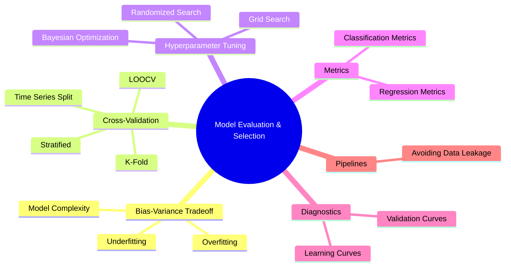
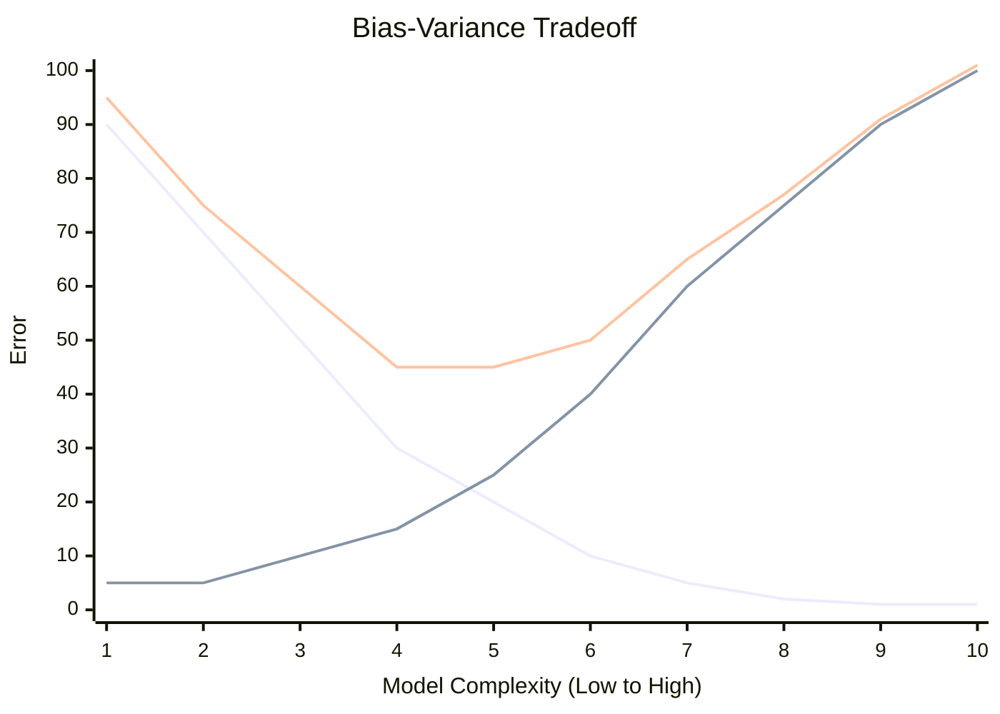

# ML Study Notes — Chapter 12: Model Evaluation and Selection

## Overview
Welcome to Chapter 12! Imagine you're a cricket selector picking the national team for the World Cup. You wouldn't just select players based on their performance in one practice match (training set). You want to see how they perform in domestic leagues, challenging overseas tours, and pressure situations (validation and test sets). You evaluate them on multiple metrics: batting average, strike rate, fitness, and fielding. 

In Machine Learning, building a model is only half the battle. Knowing **how good** your model is, and more importantly, how it will perform in the real world on unseen data, is what separates a novice from a true ML Engineer. This chapter covers the rigorous processes required to evaluate models, tune their knobs (hyperparameters), and confidently select the best one.



## Prerequisites
- Proficiency in Python, NumPy, Pandas, and Scikit-Learn.
- Understanding of basic classification and regression algorithms (Linear Regression, Decision Trees, Random Forests).
- Basic understanding of metrics like Accuracy, MSE.

---

## 1. Why Model Evaluation Matters

A model is only as good as its evaluation. Without rigorous evaluation, you are flying blind.

**Intuition**: Think of a student preparing for exams. If they only study the exact questions from the textbook (training data) and test themselves on those same questions, they might score 100%. But in the real exam with new questions (test data), they might fail completely. 

In ML, our goal is **Generalization** — the ability to perform well on unseen, future data. Model evaluation helps us estimate this generalization error, compare different algorithms, and tune them for peak performance.

---

## 2. The Bias-Variance Tradeoff (CRITICAL CONCEPT)

This is the central dogma of Machine Learning. Every predictive model balances two sources of error: Bias and Variance.

### What is Bias? (Underfitting)
Bias is the error introduced by approximating a real-world problem, which may be extremely complex, by a much simpler model.
- **High Bias** means the model pays very little attention to the training data and oversimplifies the model. It leads to **Underfitting**.
- **Analogy**: A stubbornly orthodox coach who believes every batsman must play defensively, regardless of whether it's a Test match or T20. The coach ignores the nuances of the game.

### What is Variance? (Overfitting)
Variance is the error introduced by the model's sensitivity to small fluctuations in the training set.
- **High Variance** means the model pays too much attention to the training data, capturing the noise along with the underlying pattern. It leads to **Overfitting**.
- **Analogy**: A player who drastically changes their entire batting stance and technique after every single dismissal. They are too reactive to specific events (noise).

### The Tradeoff
The total error of a model can be mathematically decomposed as:
$$ \text{Total Error} = \text{Bias}^2 + \text{Variance} + \text{Irreducible Error} $$

- **Irreducible Error**: The noise inherent in the problem itself (e.g., unmeasured variables). You can't reduce this.
- If you increase model complexity (e.g., deeper decision trees, more polynomial degrees), Bias decreases but Variance increases.
- If you decrease model complexity, Variance decreases but Bias increases.
- The goal is to find the **sweet spot**.

### Visual Explanation: The Bullseye Analogy
Imagine the target (bullseye) is the true value we want to predict.
- **Low Bias, Low Variance**: Arrows hit the center tightly. (Ideal)
- **High Bias, Low Variance**: Arrows hit tightly together, but far from the center. (Consistent but wrong)
- **Low Bias, High Variance**: Arrows are scattered around the center. (Right on average, but wildly inconsistent)
- **High Bias, High Variance**: Arrows are scattered and far from the center. (Terrible)

### Mermaid Diagram: Tradeoff Curve



### Python Code: Visualizing Bias and Variance with Polynomials

```python
import numpy as np
import matplotlib.pyplot as plt
from sklearn.pipeline import Pipeline
from sklearn.preprocessing import PolynomialFeatures
from sklearn.linear_model import LinearRegression

np.random.seed(0)

# True function
def true_fun(X):
    return np.cos(1.5 * np.pi * X)

n_samples = 30
X = np.sort(np.random.rand(n_samples))
y = true_fun(X) + np.random.randn(n_samples) * 0.1

X_test = np.linspace(0, 1, 100)

plt.figure(figsize=(14, 4))
degrees = [1, 4, 15] # Underfit, Good Fit, Overfit

for i, degree in enumerate(degrees):
    ax = plt.subplot(1, 3, i + 1)
    
    polynomial_features = PolynomialFeatures(degree=degree, include_bias=False)
    linear_regression = LinearRegression()
    pipeline = Pipeline([("polynomial_features", polynomial_features),
                         ("linear_regression", linear_regression)])
    pipeline.fit(X[:, np.newaxis], y)
    
    plt.plot(X_test, pipeline.predict(X_test[:, np.newaxis]), label="Model")
    plt.plot(X_test, true_fun(X_test), label="True function", linestyle='--')
    plt.scatter(X, y, edgecolor='b', s=20, label="Samples")
    
    plt.title(f"Degree {degree}")
    plt.ylim((-2, 2))
    plt.legend(loc="best")

plt.show()
```
- **Degree 1 (High Bias)**: The straight line can't capture the curve (Underfitting).
- **Degree 4 (Sweet Spot)**: Captures the underlying trend without chasing every point.
- **Degree 15 (High Variance)**: The line passes through almost every point, but wildly swings in between (Overfitting).

---

## 3. Overfitting and Underfitting

### How to Detect Them?
You detect them by comparing the model's performance on the **Training Set** vs the **Validation Set**.

| Situation | Training Error | Validation Error | Diagnosis |
| :--- | :--- | :--- | :--- |
| Model performs poorly on both | High | High | **Underfitting** (High Bias) |
| Model performs great on train, poorly on val | Low | High | **Overfitting** (High Variance) |
| Model performs well on both | Low | Low | **Good Fit** (Ideal) |

### Solutions for Overfitting (Reducing Variance)
1. **Get More Data**: The best cure for overfitting. More data forces the model to learn general patterns.
2. **Regularization**: Add a penalty to the loss function (L1/L2 regularization) to constrain model weights.
3. **Simplify the Model**: Reduce depth in trees, reduce polynomial degree, use fewer hidden layers in neural networks.
4. **Early Stopping**: Stop training when validation error starts increasing (common in Neural Nets and Gradient Boosting).
5. **Dropout / Pruning**: Randomly drop neurons (Deep Learning) or prune branches (Decision Trees).

### Solutions for Underfitting (Reducing Bias)
1. **Increase Model Complexity**: Use non-linear models, deeper trees, or higher polynomial degrees.
2. **Feature Engineering**: Create more relevant features (e.g., interaction terms).
3. **Decrease Regularization**: Reduce the penalty (lower `alpha` in Ridge/Lasso, higher `C` in SVM/Logistic Regression).

---

## 4. Cross-Validation (CRITICAL)

### Why a single hold-out set is not enough?
Normally, we split data into Train (80%) and Test (20%). But what if, by pure luck, all the "hard" examples end up in the test set? Your model looks terrible. Or what if all the "easy" examples are in the test set? Your model looks artificially great. 
Your evaluation metric becomes highly dependent on the random state of the split.

### K-Fold Cross-Validation
**Intuition**: Don't just split once. Split the data into $K$ equal parts (folds). Train on $K-1$ folds, test on the remaining 1 fold. Repeat this $K$ times, so every fold gets to be the test set exactly once. Average the results.

```mermaid
graph TD
    Data[Full Dataset] --> Fold1[Fold 1: Test | Folds 2-5: Train]
    Data --> Fold2[Fold 2: Test | Folds 1,3,4,5: Train]
    Data --> Fold3[Fold 3: Test | Folds 1,2,4,5: Train]
    Data --> Fold4[Fold 4: Test | Folds 1,2,3,5: Train]
    Data --> Fold5[Fold 5: Test | Folds 1,2,3,4: Train]
    
    Fold1 --> M1(Model 1 Score)
    Fold2 --> M2(Model 2 Score)
    Fold3 --> M3(Model 3 Score)
    Fold4 --> M4(Model 4 Score)
    Fold5 --> M5(Model 5 Score)
    
    M1 & M2 & M3 & M4 & M5 --> Avg{Average Score}
```

### Stratified K-Fold
Used for classification problems, especially imbalanced datasets. It ensures that the proportion of classes is the same in every fold as it is in the whole dataset. 
- **Analogy**: If a school is 80% boys and 20% girls, every class section (fold) should also be exactly 80% boys and 20% girls.

### Leave-One-Out Cross-Validation (LOOCV)
$K$ is set to the total number of samples $N$. You train on $N-1$ samples and test on 1. Repeat $N$ times.
- **Pros**: Least biased estimate.
- **Cons**: Computationally massive for large datasets.

### Time Series Split
Standard K-Fold randomly shuffles data. For time series (e.g., stock prices), this is disastrous because you'd be predicting the past using the future (Data Leakage). 
Time Series Split ensures that the training set always comes *before* the test set chronologically.

### Code: Implementing Cross-Validation

```python
from sklearn.datasets import load_breast_cancer
from sklearn.model_selection import cross_val_score, StratifiedKFold
from sklearn.ensemble import RandomForestClassifier
import numpy as np

# Load Data
X, y = load_breast_cancer(return_X_y=True)

# Initialize Model
rf = RandomForestClassifier(n_estimators=100, random_state=42)

# Standard K-Fold implicitly used for Classification is StratifiedKFold in sklearn
# Let's explicitly define it for clarity
skf = StratifiedKFold(n_splits=5, shuffle=True, random_state=42)

# Run Cross Validation
scores = cross_val_score(rf, X, y, cv=skf, scoring='accuracy')

print(f"Scores for each fold: {np.round(scores, 4)}")
print(f"Mean Accuracy: {scores.mean():.4f}")
print(f"Standard Deviation: {scores.std():.4f}")
```

### Comparison of CV Methods

| Method | Best Used For | Pros | Cons |
| :--- | :--- | :--- | :--- |
| **K-Fold** | General regression | Robust estimate of model performance | Can be slow if K is large |
| **Stratified K-Fold** | Classification (imbalanced) | Preserves class distributions | Slightly more complex to set up manually |
| **LOOCV** | Tiny datasets (N < 100) | Maximizes training data | Extremely computationally expensive |
| **Time Series Split** | Temporal/Sequential data | Prevents future data leakage | Folds have varying sizes |

---

## 5. Hyperparameter Tuning

### Parameters vs Hyperparameters
- **Parameters**: Learned by the model during training from the data (e.g., Weights and Biases in neural nets, split points in decision trees).
- **Hyperparameters**: Set by the ML engineer *before* training begins to control the learning process (e.g., Learning rate, `max_depth` of a tree, `K` in KNN).
- **Analogy**: Parameters are the skills a driver learns on the track. Hyperparameters are the car's suspension stiffness and tire pressure set by the mechanic before the race.

### GridSearchCV
Exhaustively tries every single combination of hyperparameters provided in a dictionary.
- **Pros**: Guaranteed to find the best combination in your grid.
- **Cons**: Curse of dimensionality. If you have many parameters, it takes forever.

### RandomizedSearchCV
Samples random combinations from distributions of hyperparameters.
- **Pros**: Much faster than Grid Search. Often finds a model that is "good enough" or even better than GridSearch if given continuous distributions.

### Code: Complete Tuning Pipeline for Random Forest

```python
from sklearn.model_selection import RandomizedSearchCV
from scipy.stats import randint, uniform

# Define parameter distributions
param_dist = {
    'n_estimators': randint(50, 500),
    'max_depth': [None, 10, 20, 30],
    'min_samples_split': randint(2, 11),
    'min_samples_leaf': randint(1, 5),
    'max_features': ['sqrt', 'log2', None]
}

rf_tune = RandomForestClassifier(random_state=42)

# Initialize RandomizedSearch
random_search = RandomizedSearchCV(
    estimator=rf_tune, 
    param_distributions=param_dist, 
    n_iter=20,          # Number of random combinations to try
    cv=3,               # 3-fold cross-validation for each combo
    scoring='f1_macro', # Use appropriate metric
    n_jobs=-1,          # Use all CPU cores
    random_state=42,
    verbose=1
)

# Fit (Uncomment to run - takes a moment)
# random_search.fit(X, y)
# print(f"Best Parameters: {random_search.best_params_}")
# print(f"Best CV Score: {random_search.best_score_}")

# You can access the best model directly:
# best_rf_model = random_search.best_estimator_
```

### Advanced: Bayesian Optimization (Optuna)
Instead of blind guessing (Random) or brute force (Grid), Bayesian Optimization uses probability to guess which hyperparameters might work best next, based on past evaluations. Libraries like **Optuna** or **Hyperopt** are industry standards for this.

---

## 6. Classification Metrics Deep Dive

We covered basics earlier, but let's go deeper. 

### Confusion Matrix Recap
- **True Positives (TP)**: Predicted Yes, Actually Yes.
- **True Negatives (TN)**: Predicted No, Actually No.
- **False Positives (FP)**: Predicted Yes, Actually No (Type I Error).
- **False Negatives (FN)**: Predicted No, Actually Yes (Type II Error).

### Multiclass Averaging: Macro vs Micro vs Weighted
When you have more than 2 classes, how do you calculate a single F1 score?
- **Macro Average**: Calculate metric for each class independently, then take unweighted average. Treats all classes equally (good for checking performance on minority classes).
- **Micro Average**: Aggregate the contributions of all classes to compute the average metric globally. (In multiclass, Micro F1 = Accuracy).
- **Weighted Average**: Calculate metrics for each class, and average them weighted by support (the number of true instances for each label).

### Log Loss (Cross-Entropy Loss)
Used when models output probabilities (e.g., Logistic Regression `predict_proba`). It heavily penalizes models that are confident AND wrong.
$$ \text{Log Loss} = -\frac{1}{N} \sum_{i=1}^{N} [y_i \log(\hat{y}_i) + (1-y_i) \log(1-\hat{y}_i)] $$
- Perfect model: Log Loss = 0.

### Matthews Correlation Coefficient (MCC)
The most robust metric for imbalanced classes. It acts like a correlation coefficient between observed and predicted binary classifications.
- Range: -1 (total disagreement) to +1 (perfect prediction). 0 indicates random guessing.

```python
from sklearn.metrics import classification_report, matthews_corrcoef, log_loss

# Assume y_true and y_pred, y_prob are defined
# print(classification_report(y_true, y_pred))
# print("MCC:", matthews_corrcoef(y_true, y_pred))
# print("Log Loss:", log_loss(y_true, y_prob))
```

---

## 7. Regression Metrics Deep Dive

| Metric | Formula | Interpretation | When to Use |
| :--- | :--- | :--- | :--- |
| **MAE** (Mean Absolute Error) | $\frac{1}{n}\sum \|y - \hat{y}\|$ | Average error in actual units. | When outliers are present and shouldn't dominate. |
| **MSE** (Mean Squared Error) | $\frac{1}{n}\sum (y - \hat{y})^2$ | Heavily penalizes large errors. | When large errors are highly undesirable. |
| **RMSE** (Root Mean Squared Error)| $\sqrt{MSE}$ | Average error in actual units, sensitive to outliers. | Standard go-to metric for regression. |
| **R²** (Coefficient of Determination) | $1 - \frac{MSE}{Var(y)}$ | Proportion of variance explained by model (0 to 1). | To explain how well the model captures the data variance. |
| **Adjusted R²** | $1 - (1-R^2)\frac{n-1}{n-k-1}$ | Adjusts R² for number of predictors ($k$). | When comparing models with different numbers of features. |
| **MAPE** (Mean Absolute Percentage Error)| $\frac{100}{n}\sum \|\frac{y - \hat{y}}{y}\|$ | Error as a percentage. | Business stakeholders love this (e.g., "Demand forecast is off by 5%"). |

---

## 8. Model Selection Strategies

### Nested Cross-Validation
If you use CV to tune hyperparameters (inner loop), and then report the best score from that same CV, your performance estimate is optimistically biased (you overfit to the validation set). 
**Solution**: Nested CV. 
- Outer CV loop: Estimates model performance.
- Inner CV loop (inside each outer fold): Tunes hyperparameters.

### Statistical Tests for Comparison
If Model A gets 85% accuracy and Model B gets 86%, is Model B truly better, or is it just random noise?
You can use the **Paired Student's t-test** or **Wilcoxon signed-rank test** on the cross-validation fold scores of Model A and Model B to see if the difference is statistically significant (p-value < 0.05).

---

## 9. Learning Curves

Learning curves plot the model's performance (train and validation score) on the y-axis against the **number of training samples** on the x-axis.

**Diagnosing from Curves:**
- **High Bias (Underfitting)**: Both training and validation scores plateau early and are close together, but the score is poor. Adding more data won't help. You need a complex model.
- **High Variance (Overfitting)**: Training score is high, validation score is low. There is a large gap between them. Adding more data will likely narrow the gap and improve validation score.

### Code: Plotting Learning Curves

```python
from sklearn.model_selection import learning_curve
import matplotlib.pyplot as plt

def plot_learning_curve(estimator, X, y):
    train_sizes, train_scores, test_scores = learning_curve(
        estimator, X, y, cv=5, n_jobs=-1, 
        train_sizes=np.linspace(0.1, 1.0, 5)
    )
    
    train_mean = np.mean(train_scores, axis=1)
    test_mean = np.mean(test_scores, axis=1)
    
    plt.plot(train_sizes, train_mean, 'o-', color="r", label="Training score")
    plt.plot(train_sizes, test_mean, 'o-', color="g", label="Cross-validation score")
    plt.xlabel("Training examples")
    plt.ylabel("Score")
    plt.legend(loc="best")
    plt.grid()
    plt.show()

# plot_learning_curve(rf, X, y)
```

---

## 10. Validation Curves

Validation curves plot the model's performance against **varying values of a single hyperparameter**.

It visually demonstrates the Bias-Variance tradeoff as you change complexity.

### Code: Plotting Validation Curves

```python
from sklearn.model_selection import validation_curve

param_range = np.arange(1, 50, 5)
train_scores, test_scores = validation_curve(
    RandomForestClassifier(), X, y, param_name="max_depth", 
    param_range=param_range, cv=5, scoring="accuracy", n_jobs=-1
)

train_mean = np.mean(train_scores, axis=1)
test_mean = np.mean(test_scores, axis=1)

plt.plot(param_range, train_mean, label="Training score", color="r")
plt.plot(param_range, test_mean, label="Cross-validation score", color="g")
plt.title("Validation Curve: max_depth")
plt.xlabel("max_depth")
plt.ylabel("Accuracy")
plt.legend(loc="best")
plt.show()
```
*Notice how training score keeps going up, but validation score peaks and then drops or plateaus (onset of overfitting).*

---

## 11. Model Complexity and Regularization (Recap)

Regularization explicitly controls model complexity by adding a penalty for large weights.
- **L1 (Lasso)**: Forces some weights to exactly zero. Performs feature selection.
- **L2 (Ridge)**: Forces weights to be small but not zero.

A **Regularization Path Plot** shows how feature weights shrink towards zero as the regularization strength (e.g., `alpha`) increases.

---

## 12. Pipeline Best Practices: Preventing Data Leakage

**Data Leakage** happens when information from outside the training dataset is used to create the model. This leads to wildly optimistic performance during evaluation but terrible real-world performance.

**Common Mistake**: Scaling data (e.g., `StandardScaler`) on the *entire* dataset before splitting or cross-validating. The scaler calculates the mean using test data, leaking future information!

**Golden Rule**: Preprocessing (Scaling, Imputation, PCA) must happen **INSIDE** the cross-validation loop. Only fit transformers on the training folds.

**Solution: Scikit-Learn Pipelines**
```python
from sklearn.pipeline import Pipeline
from sklearn.preprocessing import StandardScaler
from sklearn.svm import SVC

# PERFECT: Pipeline ensures fit() is only called on training folds during CV
pipe = Pipeline([
    ('scaler', StandardScaler()),
    ('svc', SVC())
])

# CV handles the splitting, and the pipeline respects the splits
scores = cross_val_score(pipe, X, y, cv=5)
```

---

## 13. Complete Project: Model Selection Showdown

Let's put it all together to compare multiple models on the wine dataset.

```python
import pandas as pd
from sklearn.datasets import load_wine
from sklearn.model_selection import StratifiedKFold, cross_validate
from sklearn.pipeline import Pipeline
from sklearn.preprocessing import StandardScaler
from sklearn.linear_model import LogisticRegression
from sklearn.ensemble import RandomForestClassifier, GradientBoostingClassifier
from sklearn.svm import SVC

# 1. Load Data
wine = load_wine()
X, y = wine.data, wine.target

# 2. Define Models in Pipelines
models = {
    "Logistic Regression": Pipeline([('scaler', StandardScaler()), ('lr', LogisticRegression(max_iter=1000))]),
    "Support Vector Machine": Pipeline([('scaler', StandardScaler()), ('svm', SVC())]),
    "Random Forest": Pipeline([('scaler', StandardScaler()), ('rf', RandomForestClassifier(random_state=42))]),
    "Gradient Boosting": Pipeline([('scaler', StandardScaler()), ('gb', GradientBoostingClassifier(random_state=42))])
}

# 3. Setup CV and evaluate
cv = StratifiedKFold(n_splits=5, shuffle=True, random_state=42)
results = []

for name, model in models.items():
    # Use cross_validate to get multiple metrics
    cv_results = cross_validate(model, X, y, cv=cv, 
                                scoring=('accuracy', 'f1_macro'),
                                return_train_score=False)
    
    results.append({
        "Model": name,
        "Accuracy (Mean)": cv_results['test_accuracy'].mean(),
        "Accuracy (Std)": cv_results['test_accuracy'].std(),
        "F1 Macro (Mean)": cv_results['test_f1_macro'].mean()
    })

# 4. Compare
results_df = pd.DataFrame(results).sort_values(by="Accuracy (Mean)", ascending=False)
print(results_df.to_markdown(index=False))
```
*(In practice, you would then take the best model, perform GridSearchCV to tune it, and finally evaluate on a separate hold-out test set).*

---

## 14. Common Mistakes in Model Evaluation

1. **Not using a hold-out test set**: Using CV for tuning, and reporting the CV score as final. (Solution: Train/Val/Test splits or Nested CV).
2. **Data Leakage**: Fitting a `StandardScaler` or `TF-IDF` on the whole dataset before splitting.
3. **Ignoring Class Imbalance**: Using Accuracy on a dataset where 99% of samples are Class 0. Use F1, PR-AUC, or MCC instead.
4. **Random Splitting Time Series**: Using K-Fold on sequential data instead of TimeSeriesSplit.
5. **Over-tuning (Peeking at Test Data)**: Going back and tweaking hyperparameters because the final Test score wasn't good enough. You just overfit to the test set!

---

## 15. Interview Questions 🎯

1. **Q: Explain the Bias-Variance tradeoff to a non-technical stakeholder.**
   - *A*: Imagine an archer. High bias is an archer who consistently hits the top right of the target (systematic error, underthinking). High variance is an archer whose arrows scatter everywhere (inconsistent, overreacting to wind). We want an archer who is both centered and consistent.
2. **Q: How do you detect if your model is overfitting? What steps do you take to resolve it?**
   - *A*: Compare training and validation error. If training error is very low but validation error is high, it's overfitting. Fixes: Collect more data, apply regularization, simplify the model (e.g., prune trees), or use dropout.
3. **Q: Why should you do feature scaling *after* train-test split?**
   - *A*: To prevent data leakage. If scaled before, information about the test set (its mean/variance) leaks into the training process, leading to artificially inflated performance.
4. **Q: What is the difference between K-Fold and Stratified K-Fold? When do you use which?**
   - *A*: K-Fold randomly splits data. Stratified K-Fold maintains the percentage of target classes in each fold. Use Stratified for classification tasks, especially imbalanced ones. Use standard K-Fold for regression.
5. **Q: In Random Forest, what happens to bias and variance as you increase `n_estimators` (number of trees)?**
   - *A*: Variance decreases (due to averaging of many uncorrelated trees), while bias remains mostly unchanged. It does not cause overfitting.
6. **Q: How do Grid Search and Randomized Search differ? Which is better?**
   - *A*: Grid Search exhaustively tries all combinations. Randomized Search samples randomly from a distribution. Randomized Search is generally better for large parameter spaces because it explores more unique values of important parameters in less time.
7. **Q: What is Nested Cross-Validation and why is it used?**
   - *A*: An outer CV loop estimates the generalization error, while an inner CV loop tunes hyperparameters. It is used to ensure the final performance estimate is completely unbiased and hasn't been optimized for the validation folds.

---

## 16. Practice Exercises

1. **Bias-Variance Diagnosis**: Generate a synthetic regression dataset using `make_regression`. Train a DecisionTreeRegressor with `max_depth` varying from 1 to 20. Plot the training and validation MSE on a line graph. Identify the point where overfitting begins.
2. **Pipeline Leakage Test**: Create a script that intentionally scales the whole dataset before splitting, records the CV score, and then compares it to a proper `Pipeline` where scaling is inside the fold. Observe the difference (it will be small but present).
3. **Imbalanced Tuning**: Load the `breast_cancer` dataset, artificially imbalance it by dropping 90% of the benign cases. Tune an SVM model using `GridSearchCV`. Optimize for `f1_macro` instead of accuracy.
4. **Time Series Evaluation**: Download a historical stock price dataset. Attempt to predict if tomorrow's price will be up or down. Compare standard K-Fold CV against TimeSeriesSplit. Why are the results different?
5. **The Ultimate Showdown**: Take a dataset from Kaggle (e.g., Titanic or House Prices). Build a pipeline that tests at least 4 algorithms, tunes their hyperparameters using RandomizedSearchCV, and outputs a formatted markdown table comparing their Train and Test metrics.

---
**Navigation:**
- Previous: [[ml-chapter-11-dimensionality-reduction|← Chapter 11: Dimensionality Reduction]]
- Next: [[ml-chapter-13-feature-engineering|Chapter 13: Feature Engineering →]]
