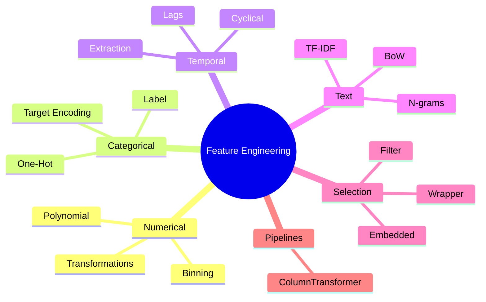

# ML Study Notes — Chapter 13: Feature Engineering

## Overview
Feature engineering is the secret sauce of applied machine learning. It's the process of transforming raw data into features that better represent the underlying problem to the predictive models, resulting in improved model accuracy on unseen data. Think of it like a master chef preparing ingredients before cooking—the better the prep, the better the final dish.



## Prerequisites
Before diving into this chapter, you should be comfortable with:
- Pandas for data manipulation (DataFrames, GroupBy).
- Scikit-learn basics (Pipelines, Estimators, Transformers).
- Basic understanding of what models like Linear Regression and Decision Trees do.

## 1. What is Feature Engineering?
Feature engineering is **the art of creating better inputs for your model**. It involves using domain knowledge to extract features from raw data via data mining techniques.

> "Coming up with features is difficult, time-consuming, requires expert knowledge. Applied machine learning is basically feature engineering." — *Andrew Ng*

**Why is it so impactful?**
A simple model (like Logistic Regression) with excellent features will almost always outperform a complex model (like a Deep Neural Network) with poor features. Features dictate the "ceiling" of your model's performance.

## 2. Types of Features
- **Numerical**: Continuous (height, weight) or Discrete (number of children).
- **Categorical**: Nominal (colors, cities) or Ordinal (low/medium/high).
- **Temporal**: Dates, timestamps, durations.
- **Text**: Free-form text, reviews, tweets.
- **Spatial**: Latitude, longitude, zip codes.

---

## 3. Numerical Feature Transformations
Sometimes, models (especially linear ones) assume features are normally distributed or have a linear relationship with the target. Transformations can help align your data with these assumptions.

### Log Transformation
Useful for heavily skewed distributions (like income, prices). It pulls in outliers and spreads out clustered data.
**Mathematical Foundation**:
$x' = \log(x + 1)$ (We use $\log(x+1)$ to avoid $\log(0)$).

### Binning / Discretization
Converting continuous variables into discrete categories. Useful when the exact value matters less than the range (e.g., ages to age groups).

### Polynomial and Interaction Features
Creating new features by multiplying existing ones or raising them to a power. If $x_1$ and $x_2$ are features, we might create $x_1^2$, $x_2^2$, and $x_1 x_2$ (interaction).

### Code Example: Numerical Transformations
```python
import numpy as np
import pandas as pd
from sklearn.preprocessing import FunctionTransformer, KBinsDiscretizer, PolynomialFeatures

df = pd.DataFrame({
    'income': [10000, 50000, 100000, 5000000, 15000],
    'age': [22, 45, 30, 60, 25],
    'experience_years': [1, 20, 5, 35, 2]
})

# 1. Log Transform (Log1p to handle zeros safely)
log_transformer = FunctionTransformer(np.log1p)
df['log_income'] = log_transformer.transform(df[['income']])

# 2. Binning (Age groups)
binner = KBinsDiscretizer(n_bins=3, encode='ordinal', strategy='quantile')
df['age_group'] = binner.fit_transform(df[['age']])

# 3. Polynomial & Interaction
poly = PolynomialFeatures(degree=2, include_bias=False)
poly_features = poly.fit_transform(df[['age', 'experience_years']])
# poly_features contains: age, exp, age^2, age*exp, exp^2
```

---

## 4. Categorical Feature Engineering
Machine learning models need numbers, not words. We must convert categorical text into numbers without losing information or creating false relationships.

### One-Hot Encoding (OHE)
Creates a new binary column for each category.
*Best for*: Low-cardinality nominal features (e.g., colors: red, blue, green).
*Pitfall*: High cardinality causes the "Curse of Dimensionality" (thousands of new columns).

### Label Encoding / Ordinal Encoding
Assigns an integer to each category (e.g., Low=0, Medium=1, High=2).
*Best for*: Tree-based models or strictly ordinal features.

### Target Encoding (Mean Encoding)
Replaces a category with the mean of the target variable for that category. Needs regularization (smoothing) to prevent overfitting.
*Best for*: High-cardinality nominal features.

### Code Example: Categorical Encoders
```python
import pandas as pd
from sklearn.preprocessing import OneHotEncoder, OrdinalEncoder
from category_encoders import TargetEncoder # pip install category_encoders

df = pd.DataFrame({
    'city': ['Mumbai', 'Delhi', 'Mumbai', 'Bangalore', 'Delhi'],
    'size': ['Small', 'Medium', 'Small', 'Large', 'Medium'],
    'target_price': [100, 150, 120, 200, 140]
})

# 1. One-Hot Encoding
ohe = OneHotEncoder(sparse_output=False, drop='first') # drop='first' avoids collinearity
city_ohe = ohe.fit_transform(df[['city']])

# 2. Ordinal Encoding
ordinal = OrdinalEncoder(categories=[['Small', 'Medium', 'Large']])
df['size_encoded'] = ordinal.fit_transform(df[['size']])

# 3. Target Encoding
te = TargetEncoder(smoothing=10) # smoothing is the regularization parameter
df['city_target_encoded'] = te.fit_transform(df['city'], df['target_price'])
```

### Comparison Table: Categorical Encodings

| Method | How it works | Best For | Pros | Cons |
|---|---|---|---|---|
| One-Hot | Binary columns per category | Low cardinality, nominal | Linear models love it | Explodes dimensions |
| Ordinal | Integer mapping | Ordinal data, trees | Keeps dimensions low | Assumes linear relationship (bad for linear models on nominal data) |
| Target | Mean of target per category | High cardinality, nominal | Powerful, keeps dims low | High risk of data leakage / overfitting |
| Frequency | Replaces with frequency count | High cardinality | Simple | Collisions if frequencies are same |
| Hashing | Hashes category to fixed space | Very high cardinality | Fast, fixed size | Irreversible, collisions |

---

## 5. Date/Time Feature Engineering
Dates in raw format (`2026-07-24 14:30:00`) are useless to models. We must extract meaning from them.

### Extraction & Recency
Extract components: Year, Month, Day, Hour, Day of Week, Is Weekend.
Calculate recency: "Days since last purchase".

### Cyclical Encoding
Months and hours are cyclical. December (12) is close to January (1), but numerically they are far apart. We use sine and cosine transformations to preserve this cyclical nature.
$x_{sin} = \sin(2 \pi \frac{x}{\text{max\_val}})$
$x_{cos} = \cos(2 \pi \frac{x}{\text{max\_val}})$

### Code Example: Time Features
```python
import pandas as pd
import numpy as np

df = pd.DataFrame({
    'timestamp': pd.to_datetime(['2026-01-01 23:00', '2026-01-02 01:00'])
})

# 1. Extraction
df['hour'] = df['timestamp'].dt.hour
df['day_of_week'] = df['timestamp'].dt.dayofweek
df['is_weekend'] = df['day_of_week'].isin([5, 6]).astype(int)

# 2. Cyclical Encoding (for hour)
df['hour_sin'] = np.sin(2 * np.pi * df['hour'] / 23.0)
df['hour_cos'] = np.cos(2 * np.pi * df['hour'] / 23.0)
```

---

## 6. Text Feature Engineering
Raw text must be tokenized and vectorized.

### Bag of Words (CountVectorizer)
Counts the frequency of each word.

### TF-IDF (Term Frequency - Inverse Document Frequency)
Penalizes words that appear too frequently across all documents (like 'the', 'is') and rewards unique, meaningful words.
$TFIDF(t, d) = TF(t, d) \times \log(\frac{N}{DF(t)})$

### Code Example: Text Vectorization
```python
from sklearn.feature_extraction.text import TfidfVectorizer

corpus = [
    "Machine learning is fascinating.",
    "Feature engineering makes machine learning models better.",
    "Deep learning is a subset of machine learning."
]

# Unigrams and Bigrams
tfidf = TfidfVectorizer(ngram_range=(1, 2), stop_words='english')
X_text = tfidf.fit_transform(corpus)
print(tfidf.get_feature_names_out()[:5]) 
```

---

## 7. Feature Creation Strategies
This is where domain expertise shines!

- **Ratio Features**: E.g., `Debt_to_Income_Ratio = Debt / Income`.
- **Domain Knowledge**: E.g., `BMI = Weight / (Height^2)`.
- **Aggregations (GroupBy statistics)**: Customer's average past purchase amount.
- **Window/Lag Features (Time Series)**: 7-day rolling average of sales, or sales from $t-1$ (lag 1).

---

## 8. Feature Selection
Too many features cause overfitting, slow down training, and make models hard to interpret. We need to select the best ones.

### 1. Filter Methods
Fast, statistical tests independent of any machine learning model.
- *Pearson Correlation*: Linear relationship between numerical feature and continuous target.
- *Chi-Squared*: Categorical feature and categorical target.
- *Mutual Information*: Non-linear relationships.

### 2. Wrapper Methods
Use a predictive model to evaluate feature subsets (computationally expensive).
- *Recursive Feature Elimination (RFE)*: Train model, drop weakest feature, repeat.

### 3. Embedded Methods
Selection occurs naturally during model training.
- *Lasso (L1) Regularization*: Shrinks less important feature coefficients to exactly 0.
- *Tree-based importance*: Random Forest or Gradient Boosting naturally splits on the best features.

### Code Example: Feature Selection
```python
from sklearn.datasets import load_diabetes
from sklearn.feature_selection import SelectKBest, mutual_info_regression, RFE
from sklearn.linear_model import Lasso, LinearRegression

X, y = load_diabetes(return_X_y=True)

# 1. Filter: Select top 5 using Mutual Information
selector_kbest = SelectKBest(score_func=mutual_info_regression, k=5)
X_kbest = selector_kbest.fit_transform(X, y)

# 2. Embedded: Lasso (L1)
lasso = Lasso(alpha=0.1)
lasso.fit(X, y)
# Features where lasso.coef_ != 0 are selected

# 3. Wrapper: RFE
rfe = RFE(estimator=LinearRegression(), n_features_to_select=5)
X_rfe = rfe.fit_transform(X, y)
```

---

## 9. Feature Importance
How do we know which features the model actually used?

- **Gini Importance**: (Tree-specific) How much variance a feature reduces when split on.
- **Permutation Importance**: Shuffle a single column and see how much the model's accuracy drops. If it drops a lot, the feature is important. (Model agnostic).
- **SHAP Values**: Game-theoretic approach explaining individual predictions. The gold standard for interpretability.

---

## 10. Handling High-Cardinality Categorical Features
High cardinality = A category with hundreds or thousands of unique values (e.g., zip codes, user IDs).
**Solutions**:
1. Target Encoding (with strong smoothing).
2. Frequency Encoding.
3. Hashing Trick.
4. Clustering/Binning: Group rare categories into an "Other" bucket.
5. Extract properties: Turn 'Zip Code' into 'City Population' or 'Median Income of Zip Code'.

---

## 11. Feature Engineering Pipeline
Always use `sklearn.pipeline.Pipeline` and `sklearn.compose.ColumnTransformer`. This prevents data leakage and makes deployment easy.

```python
from sklearn.pipeline import Pipeline
from sklearn.compose import ColumnTransformer
from sklearn.impute import SimpleImputer
from sklearn.preprocessing import StandardScaler, OneHotEncoder
from sklearn.ensemble import RandomForestRegressor

# Define columns
num_cols = ['age', 'income']
cat_cols = ['city', 'profession']

# Numerical Pipeline
num_transformer = Pipeline(steps=[
    ('imputer', SimpleImputer(strategy='median')),
    ('scaler', StandardScaler())
])

# Categorical Pipeline
cat_transformer = Pipeline(steps=[
    ('imputer', SimpleImputer(strategy='constant', fill_value='missing')),
    ('onehot', OneHotEncoder(handle_unknown='ignore'))
])

# Combine using ColumnTransformer
preprocessor = ColumnTransformer(
    transformers=[
        ('num', num_transformer, num_cols),
        ('cat', cat_transformer, cat_cols)
    ])

# Full Pipeline
model = Pipeline(steps=[('preprocessor', preprocessor),
                        ('regressor', RandomForestRegressor())])

# model.fit(X_train, y_train)
# model.predict(X_test)
```

---

## 12. Common Mistakes in Feature Engineering
1. **Data Leakage**: Using information in the feature that won't be available at prediction time (e.g., using "Number of late payments" to predict "Will default", but calculating it over a period that includes the default).
2. **Transforming before splitting**: Always do `train_test_split` BEFORE applying scalers, PCA, or target encoding. `fit` on train, `transform` on both.
3. **Ignoring business context**: Blindly applying math without asking domain experts what actually matters.
4. **Too many features**: Adding noise that confuses the model.

---

## 13. Interview Questions 🎯

**Q1: What is the Curse of Dimensionality, and how does One-Hot Encoding contribute to it?**
A: As the number of dimensions (features) increases, data points become extremely sparse in the high-dimensional space, requiring exponentially more data to generalize. OHE on high-cardinality features adds hundreds of sparse binary columns, directly causing this curse.

**Q2: Explain Target Encoding and its biggest risk.**
A: Target encoding replaces categorical values with the mean of the target variable for that category. Its biggest risk is Data Leakage/Overfitting, especially for rare categories. This is mitigated by using smoothing/regularization and calculating means using K-Fold cross-validation.

**Q3: When would you use L1 (Lasso) regularization for feature selection instead of a Filter method?**
A: L1 evaluates features *in the context of the model*, capturing interactions and collinearity (if two features are highly correlated, L1 usually zeros out one). Filter methods evaluate each feature independently, ignoring how they work together.

**Q4: How do you encode cyclical features like the hour of the day?**
A: Using sine and cosine transformations. $sin\_time = \sin(2\pi \cdot \frac{hour}{24})$. This ensures that Hour 23 and Hour 0 are treated as mathematically close to each other.

**Q5: What is Data Leakage in feature engineering? Give an example.**
A: Leakage is when the training data contains information about the target that will not be available at inference time. Example: Predicting if a user will churn next month, and including a feature "Days since last login" calculated up to today, rather than up to the cutoff date.

**Q6: What is the difference between Gini Importance and Permutation Importance?**
A: Gini is specific to tree-based models and measures how much a feature improves node purity during training. It tends to be biased towards high-cardinality continuous features. Permutation Importance is model-agnostic, calculated post-training on a validation set by shuffling a column and observing the drop in performance.

**Q7: How do you handle missing values in a categorical column before applying One-Hot Encoding?**
A: Treat the missing value as its own category (e.g., fill with "Unknown" or "Missing"). This allows the model to learn if the "missingness" itself holds predictive power.

---

## 14. Practice Exercises
1. **Beginner**: Take the Titanic dataset. Extract the 'Title' (Mr, Mrs, Miss, Dr, etc.) from the 'Name' column and group rare titles into an 'Other' bucket. Apply One-Hot Encoding to it.
2. **Intermediate**: Create a custom sklearn Transformer that takes a DataFrame containing a 'DOB' (Date of Birth) column and outputs an 'Age' column.
3. **Intermediate**: Load the Boston Housing dataset. Use `PolynomialFeatures` to generate interaction terms for all numerical columns. Then use Lasso Regression to select the top 10 most important features.
4. **Advanced**: Implement Target Encoding from scratch using pandas `groupby` and `transform`. Add a smoothing parameter that blends the category mean with the global mean based on the category's count.
5. **Advanced**: Write a complete `Pipeline` for a dataset containing Text, Categorical, and Numerical data, routing each type through its own specific transformation steps before feeding it to an XGBoost model.

---
**Navigation**
- Previous: [[ml-chapter-12-model-evaluation-and-selection|← Chapter 12: Model Evaluation]]
- Next: [[ml-chapter-14-neural-networks-and-deep-learning-intro|Chapter 14: Neural Networks →]]
