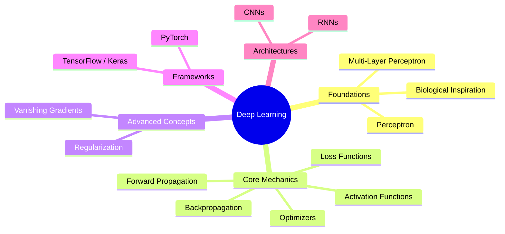
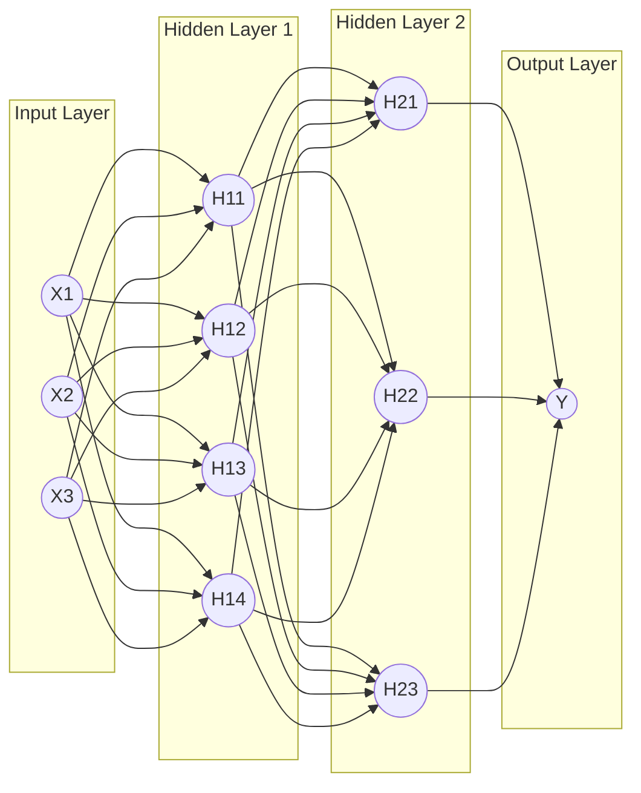
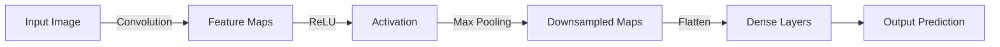

# ML Study Notes — Chapter 14: Neural Networks and Deep Learning Introduction

## Overview

Welcome to Chapter 14! So far, we've explored traditional Machine Learning algorithms—from Linear Regression to Random Forests. But what happens when the data becomes incredibly complex, like recognizing a face in an image or translating languages? Enter **Deep Learning**. 

Deep Learning is the subfield of ML that powers modern AI, utilizing artificial **Neural Networks** inspired by the human brain. In this chapter, we will build a neural network from scratch, understand the math behind its learning (backpropagation), and write our first Deep Learning models using TensorFlow/Keras.



## Prerequisites
Before diving into this chapter, ensure you are comfortable with:
- Linear Algebra (Dot products, Matrices).
- Calculus (Derivatives, Chain Rule).
- Python (NumPy, Scikit-Learn).
- Concept of Gradient Descent (covered in Chapter 3).

---

## 1. From ML to Deep Learning

### Why Neural Networks? (The Limitations of Traditional ML)
Imagine you want to classify images of cats and dogs. In traditional ML (like SVM or Random Forest), you have to manually extract features: "does it have pointy ears?", "what is the color histogram?", "edge detection filters". This is called **Feature Engineering**, and it's heavily domain-dependent and time-consuming.

**Deep Learning** automates feature extraction. Given raw pixels, the network itself learns which features (edges, textures, shapes) are important to distinguish a cat from a dog. 

Think of traditional ML as hiring a detective where you give them exactly what clues to look for. Deep learning is like hiring Sherlock Holmes—you just show him the crime scenes, and he figures out what clues matter.

---

## 2. Biological Inspiration

The human brain consists of billions of interconnected cells called **neurons**. 
- **Dendrites**: Receive signals from other neurons.
- **Soma (Cell Body)**: Processes the incoming signals.
- **Axon**: Transmits the signal to the next neuron.
- **Synapse**: The connection point between neurons, which can be strong or weak.

An **Artificial Neuron** mirrors this:
- **Inputs ($X$)**: Represent dendrites.
- **Weights ($W$)**: Represent synapse strength.
- **Summation + Activation**: Represent the soma deciding whether to fire.
- **Output**: Represents the axon transmitting the signal.

---

## 3. The Perceptron

The perceptron is the simplest type of artificial neuron, invented in 1957.

### Intuition
Think of a Perceptron as a bouncer at a club. The bouncer considers various factors before letting you in: age, dress code, behavior. They assign a "weight" to each factor. If the total score crosses a "threshold" (bias), you get in (Output = 1), else you are rejected (Output = 0).

### Mathematical Model
1. **Weighted Sum ($z$)**: $z = w_1x_1 + w_2x_2 + \dots + w_nx_n + b$ (or $z = W \cdot X + b$)
2. **Activation Function**: Applies a step function to output $1$ if $z > 0$, else $0$.

### Limitations
A single perceptron can only learn **linearly separable** patterns (like AND, OR gates). It fundamentally **cannot solve the XOR problem** (where inputs are different). This limitation historically caused an "AI Winter".

### Python Code: Perceptron from Scratch
```python
import numpy as np

class SimplePerceptron:
    def __init__(self, learning_rate=0.1, epochs=10):
        self.lr = learning_rate
        self.epochs = epochs
        self.weights = None
        self.bias = None
        
    def activation(self, z):
        return 1 if z >= 0 else 0
        
    def fit(self, X, y):
        n_samples, n_features = X.shape
        self.weights = np.zeros(n_features)
        self.bias = 0
        
        # Perceptron Learning Rule
        for _ in range(self.epochs):
            for idx, x_i in enumerate(X):
                linear_output = np.dot(x_i, self.weights) + self.bias
                y_predicted = self.activation(linear_output)
                
                # Update rule
                update = self.lr * (y[idx] - y_predicted)
                self.weights += update * x_i
                self.bias += update
                
    def predict(self, X):
        linear_output = np.dot(X, self.weights) + self.bias
        return np.array([self.activation(z) for z in linear_output])

# Let's test it on AND logic gate
X = np.array([[0,0], [0,1], [1,0], [1,1]])
y = np.array([0, 0, 0, 1]) # AND logic

p = SimplePerceptron(epochs=10)
p.fit(X, y)
print("Predictions for AND gate:", p.predict(X))
```

---

## 4. Multi-Layer Perceptron (MLP)

To solve non-linear problems like XOR, we stack perceptrons into layers. This architecture is called a **Multi-Layer Perceptron (MLP)** or a Feedforward Neural Network.

### Architecture
- **Input Layer**: Receives the raw data (number of nodes = number of features).
- **Hidden Layers**: Layers between input and output. They are "hidden" because we don't know exactly what they are computing. They extract complex non-linear patterns.
- **Output Layer**: Produces the final prediction.



**Deep Learning** simply refers to MLPs with *many* hidden layers.

---

## 5. Activation Functions (CRITICAL)

Without activation functions, a neural network is just a giant linear regression model, no matter how many layers it has. Linear combination of linear functions is just another linear function. Activation functions inject **non-linearity**.

### Comparison of Activation Functions

| Function | Formula | Range | Pros | Cons | When to use |
|----------|---------|-------|------|------|-------------|
| **Step** | $f(x)=1$ if $x>0$ else $0$ | $\{0, 1\}$ | Simple | Not differentiable (can't use gradient descent) | Never in modern DL |
| **Sigmoid** | $\sigma(z) = \frac{1}{1 + e^{-z}}$ | $(0, 1)$ | Smooth, outputs probabilities | **Vanishing gradient**, not zero-centered | Output layer for binary classification |
| **Tanh** | $\tanh(z) = \frac{e^z - e^{-z}}{e^z + e^{-z}}$ | $(-1, 1)$ | Zero-centered, stronger gradients than sigmoid | Vanishing gradient for extreme values | Hidden layers (rarely used now) |
| **ReLU** | $f(z) = \max(0, z)$ | $[0, \infty)$ | Fast, solves vanishing gradient for positive values | **Dying ReLU problem** (negative inputs become dead neurons) | Default for hidden layers |
| **Leaky ReLU** | $f(z) = \max(\alpha z, z)$ where $\alpha \approx 0.01$ | $(-\infty, \infty)$ | Fixes dying ReLU problem | Slightly more complex to compute | When standard ReLU dies |
| **Softmax** | $\frac{e^{z_i}}{\sum e^{z_j}}$ | $(0, 1)$, sum=1 | Converts outputs into probabilities | Sensitive to outliers | Output layer for Multi-class classification |

### Visualizing Activation Functions in Python

```python
import numpy as np
import matplotlib.pyplot as plt

def sigmoid(z): return 1 / (1 + np.exp(-z))
def tanh(z): return np.tanh(z)
def relu(z): return np.maximum(0, z)
def leaky_relu(z, alpha=0.1): return np.where(z > 0, z, z * alpha)

z = np.linspace(-5, 5, 100)

plt.figure(figsize=(12, 8))

plt.subplot(2, 2, 1)
plt.plot(z, sigmoid(z), 'b', label='Sigmoid')
plt.title('Sigmoid')
plt.grid(True)

plt.subplot(2, 2, 2)
plt.plot(z, tanh(z), 'r', label='Tanh')
plt.title('Tanh')
plt.grid(True)

plt.subplot(2, 2, 3)
plt.plot(z, relu(z), 'g', label='ReLU')
plt.title('ReLU')
plt.grid(True)

plt.subplot(2, 2, 4)
plt.plot(z, leaky_relu(z), 'm', label='Leaky ReLU')
plt.title('Leaky ReLU')
plt.grid(True)

plt.tight_layout()
plt.show()
```

---

## 6. Forward Propagation

Forward propagation is the process of pushing data through the network from input to output to get a prediction.

### Step-by-Step Matrix Form
For a layer $l$:
1. Compute weighted sum: $Z^{[l]} = W^{[l]} \cdot A^{[l-1]} + b^{[l]}$
2. Apply activation: $A^{[l]} = g(Z^{[l]})$

Where $A^{[0]} = X$ (Input).

### Example
Imagine an input $X = [2, 3]$. 
Hidden layer has 2 neurons. Weight matrix $W_1 = \begin{bmatrix} 0.1 & 0.2 \\ 0.3 & 0.4 \end{bmatrix}$, bias $b_1 = [0.5, 0.5]$.
$Z_1 = X \cdot W_1^T + b_1 = [2, 3] \cdot \begin{bmatrix} 0.1 & 0.3 \\ 0.2 & 0.4 \end{bmatrix} + [0.5, 0.5] = [0.8 + 0.5, 1.8 + 0.5] = [1.3, 2.3]$
Applying ReLU: $A_1 = [1.3, 2.3]$.
This goes into the next layer!

---

## 7. Loss Functions

How do we know if our network's predictions are good? We use a Loss Function to measure the error.

1. **Binary Cross-Entropy (Log Loss)**: Used for Binary Classification (Output activation: Sigmoid).
   $L = - \frac{1}{N} \sum [y \log(\hat{y}) + (1-y) \log(1-\hat{y})]$
2. **Categorical Cross-Entropy**: Used for Multi-Class Classification (Output activation: Softmax).
   $L = - \sum y_i \log(\hat{y}_i)$
3. **Mean Squared Error (MSE)**: Used for Regression (Output activation: Linear).
   $L = \frac{1}{N} \sum (y - \hat{y})^2$

---

## 8. Backpropagation (THE KEY ALGORITHM)

Forward propagation gives us a prediction and an error. **Backpropagation** tells us how to adjust the weights to reduce that error.

### Intuition
Imagine you are playing golf blindfolded. You take a swing (Forward Propagation). Your friend tells you "You missed 5 meters to the right" (Loss Function). You mentally trace back your swing to figure out how to adjust your grip, stance, and force for the next swing (Backpropagation).

### The Chain Rule
Backpropagation is just the **Chain Rule of Calculus** applied repeatedly. To find out how much a small change in a weight $w$ affects the total Loss $L$, we compute the partial derivative:
$\frac{\partial L}{\partial w} = \frac{\partial L}{\partial \hat{y}} \times \frac{\partial \hat{y}}{\partial z} \times \frac{\partial z}{\partial w}$

### Python Code: Neural Network from Scratch
Here's a 2-layer network that learns the XOR logic gate.

```python
import numpy as np

# XOR Data
X = np.array([[0,0], [0,1], [1,0], [1,1]])
y = np.array([[0], [1], [1], [0]])

# Initialize weights randomly
np.random.seed(42)
W1 = np.random.randn(2, 4) # 2 inputs, 4 hidden neurons
b1 = np.zeros((1, 4))
W2 = np.random.randn(4, 1) # 4 hidden, 1 output
b2 = np.zeros((1, 1))

def sigmoid(z): return 1 / (1 + np.exp(-z))
def sigmoid_deriv(a): return a * (1 - a)

epochs = 10000
lr = 0.1

for i in range(epochs):
    # --- FORWARD PROPAGATION ---
    Z1 = np.dot(X, W1) + b1
    A1 = sigmoid(Z1)
    
    Z2 = np.dot(A1, W2) + b2
    A2 = sigmoid(Z2)
    
    # Calculate Loss (MSE for simplicity here)
    loss = np.mean(0.5 * (A2 - y)**2)
    
    # --- BACKPROPAGATION ---
    # Output layer error
    dZ2 = (A2 - y) * sigmoid_deriv(A2)
    dW2 = np.dot(A1.T, dZ2)
    db2 = np.sum(dZ2, axis=0, keepdims=True)
    
    # Hidden layer error
    dZ1 = np.dot(dZ2, W2.T) * sigmoid_deriv(A1)
    dW1 = np.dot(X.T, dZ1)
    db1 = np.sum(dZ1, axis=0, keepdims=True)
    
    # --- UPDATE WEIGHTS ---
    W1 -= lr * dW1
    b1 -= lr * db1
    W2 -= lr * dW2
    b2 -= lr * db2
    
    if i % 2000 == 0:
        print(f"Epoch {i}, Loss: {loss:.4f}")

print("\nFinal Predictions:")
print(np.round(A2, 3))
```

---

## 9. Optimizers

Optimizers dictate *how* the weights are updated based on the gradients. 

| Optimizer | Intuition | Pros | Cons |
|-----------|-----------|------|------|
| **Vanilla SGD** | Taking small steps down the hill. | Simple, low memory footprint. | Very slow, gets stuck in local minima/saddle points. |
| **SGD with Momentum** | Like a snowball rolling down a hill, gaining speed. | Overcomes local minima, faster convergence. | Requires tuning the momentum parameter. |
| **RMSprop** | Adjusts step size for each weight based on recent gradient sizes. | Good for non-stationary objectives (like RNNs). | Can still be slow. |
| **Adam** (Adaptive Moment Estimation) | Combines Momentum (snowball) and RMSprop (adaptive steps). | **Industry Standard**. Fast, works well with default params. | Can overfit slightly more than SGD on some tasks. |

**Rule of Thumb:** Start with **Adam** with a learning rate of $0.001$.

---

## 10. Regularization in Neural Networks

Deep networks are incredibly powerful, which makes them prone to **overfitting** (memorizing the training data). We use regularization to combat this.

1. **L1/L2 Regularization (Weight Decay)**: Adds a penalty to the loss function based on the size of weights. Forces the network to use small weights.
2. **Dropout**: Randomly "turns off" a percentage (e.g., 20%) of neurons during each training step. Forces the network not to rely on any single neuron and learn robust features. Like cross-training employees so the company doesn't collapse if one gets sick.
3. **Batch Normalization**: Normalizes the inputs of each hidden layer to have mean 0 and variance 1. Dramatically speeds up training and acts as a slight regularizer.
4. **Early Stopping**: Monitor validation loss during training. Stop training when validation loss starts increasing (which indicates overfitting).

---

## 11. Vanishing and Exploding Gradients

Deep networks have many layers. Because of the Chain Rule, gradients are multiplied backwards through the layers.
- **Vanishing Gradients**: If gradients are small (e.g., $< 1$), multiplying them repeatedly makes them shrink exponentially to zero. The early layers never learn! (Common with Sigmoid/Tanh).
- **Exploding Gradients**: If gradients are large ($> 1$), they multiply and become NaN (infinity), breaking the model.

### Solutions:
1. Use **ReLU** activation instead of Sigmoid.
2. Proper **Weight Initialization**: 
   - **Xavier/Glorot Initialization**: Used with Sigmoid/Tanh.
   - **He Initialization**: Used with ReLU.
3. **Batch Normalization**.
4. **Residual Connections (ResNets)**: Add skip connections that allow gradients to bypass layers.

---

## 12. Introduction to TensorFlow/Keras

Writing backprop from scratch is fun, but in the real world, we use frameworks that do **Automatic Differentiation**. The most popular is TensorFlow, accessed via the Keras API.

### Keras Sequential API Example (MNIST Digit Classification)

```python
import tensorflow as tf
from tensorflow.keras.models import Sequential
from tensorflow.keras.layers import Dense, Flatten, Dropout
from tensorflow.keras.datasets import mnist

# 1. Load Data
(X_train, y_train), (X_test, y_test) = mnist.load_data()
X_train, X_test = X_train / 255.0, X_test / 255.0 # Normalize pixels to [0,1]

# 2. Define Model (MLP)
model = Sequential([
    Flatten(input_shape=(28, 28)),          # Flatten 2D images to 1D vectors (784)
    Dense(128, activation='relu'),          # Hidden Layer 1
    Dropout(0.2),                           # Regularization
    Dense(64, activation='relu'),           # Hidden Layer 2
    Dense(10, activation='softmax')         # Output Layer (10 classes: 0-9)
])

# 3. Compile Model
model.compile(optimizer='adam',
              loss='sparse_categorical_crossentropy', # Used when labels are integers, not one-hot
              metrics=['accuracy'])

# 4. Train Model
# model.fit(X_train, y_train, epochs=5, validation_split=0.2) 
# Note: Uncomment to run if tensorflow is installed

# 5. Evaluate
# test_loss, test_acc = model.evaluate(X_test, y_test)
```

---

## 13. Introduction to PyTorch

PyTorch is the other massive Deep Learning framework, primarily developed by Meta.
- **Keras/TensorFlow** is often preferred for production, IoT, and ease of use.
- **PyTorch** is highly preferred in research, academia, and advanced models due to its dynamic computational graph and Pythonic nature.

PyTorch relies on building custom Classes inheriting from `nn.Module`.

---

## 14. Convolutional Neural Networks (CNN) Overview

MLPs are bad for images. A 1000x1000 color image flattened becomes 3,000,000 inputs. An MLP would require billions of weights.

**CNNs** solve this by using **Filters (Kernels)** that slide (convolve) over the image to detect local patterns like edges, curves, and textures.


*When to use CNNs:* Images, Video, Audio spectrograms.

---

## 15. Recurrent Neural Networks (RNN) Overview

Standard networks have no memory; inputs are processed independently. 
**RNNs** have a "hidden state" that loops back into the network, allowing it to remember past inputs in a sequence.
- **LSTM / GRU**: Advanced RNNs that solve the vanishing gradient problem in long sequences.

*When to use RNNs:* Text (NLP), Time Series, Speech recognition, Sequences.

---

## 16. Transfer Learning

Training deep networks from scratch takes massive data and GPU power. **Transfer Learning** is taking a model pre-trained on a huge dataset (like ResNet50 trained on millions of images), chopping off the final output layer, and replacing it with a new one for your specific task.

You keep the "feature extraction" intelligence of the pre-trained model and only train the final "classification" layer.

---

## 17. ML vs Deep Learning Comparison

| Feature | Traditional ML (e.g., Random Forest) | Deep Learning |
|---------|--------------------------------------|---------------|
| **Data Requirements** | Works well with small/medium data | Requires massive amounts of data |
| **Hardware** | Can run on standard CPUs | Requires powerful GPUs |
| **Feature Engineering** | Highly necessary (manual) | Learns features automatically |
| **Interpretability** | High (Decision trees are readable) | Low ("Black Box") |
| **Execution Time** | Fast to train | Very slow to train |
| **Use Cases** | Tabular data, structured data | Images, Audio, Text, Complex patterns |

---

## 18. Common Mistakes & Pitfalls

1. **Not normalizing input data**: Neural networks expect inputs around 0 with variance 1. If features have vastly different scales, gradients will go crazy.
2. **Using Softmax for multi-label**: If an image can be both a dog AND a cat, use multiple Sigmoids, not a single Softmax (Softmax forces probabilities to sum to 1).
3. **Too high Learning Rate**: Loss will bounce around and never converge (or explode to NaN).
4. **Not using Regularization**: Training a huge network on a small dataset will guarantee 100% training accuracy and terrible test accuracy (massive overfitting).

---

## 19. Interview Questions 🎯

1. 🎯 **What is the dying ReLU problem and how do you fix it?**
   *Answer*: When a large negative gradient flows through a ReLU neuron, its weights get updated such that it always outputs negative values. Since ReLU(x < 0) = 0, the neuron stops outputting anything and its gradient becomes zero forever (it dies). Fix: Use Leaky ReLU or Parametric ReLU.
2. 🎯 **Why do we need non-linear activation functions?**
   *Answer*: Without them, multiple layers of linear combinations collapse into a single linear function. The network wouldn't be able to learn complex, non-linear boundaries.
3. 🎯 **What is the difference between Epoch, Batch, and Iteration?**
   *Answer*: Epoch = one forward+backward pass of ALL training examples. Batch size = number of examples in one forward/backward pass. Iterations = number of batches needed to complete one Epoch.
4. 🎯 **How does Dropout work as regularization?**
   *Answer*: It randomly disables neurons during training, preventing co-adaptation. The network is forced to learn redundant, robust features rather than relying on a few specific neurons.
5. 🎯 **What is the Vanishing Gradient problem?**
   *Answer*: In deep networks, gradients are multiplied via the chain rule during backprop. If these gradients are $<1$ (like derivatives of Sigmoid), multiplying them makes the gradients exponentially smaller. Early layers get tiny updates and stop learning.
6. 🎯 **Why is Adam preferred over standard SGD?**
   *Answer*: Adam adapts the learning rate for each individual weight based on the first and second moments of the gradients, leading to faster and more reliable convergence.
7. 🎯 **How do you initialize weights in a neural network? Can you initialize them to zero?**
   *Answer*: You cannot initialize them to zero, because all neurons would compute the exact same gradients and update symmetrically (symmetry breaking problem). You initialize randomly, usually using He initialization for ReLU or Glorot/Xavier for Tanh/Sigmoid.

---

## 20. Practice Exercises

1. **Math**: Calculate the output of a single perceptron with inputs $X=[2, -1]$, weights $W=[0.5, -0.2]$, bias $b=-1$, and a ReLU activation.
2. **Code Implementation**: Modify the scratch Neural Network code provided above to solve the OR gate instead of XOR.
3. **Keras Basic**: Build a Keras Sequential model for the California Housing dataset (Regression). Use MSE as the loss function and no activation on the final output layer.
4. **Optimization Tuning**: Train the MNIST network using SGD with a learning rate of $0.01$. Compare the training time and accuracy to using the Adam optimizer.
5. **Regularization Experiment**: Create an intentionally massive network (e.g., 3 layers of 512 neurons) for a small dataset (like Iris). Observe overfitting. Add Dropout(0.5) layers and observe the difference in validation accuracy.

---

## Navigation
- Previous: [[ml-chapter-13-feature-engineering|← Chapter 13: Feature Engineering]]
- Next: [[ml-chapter-15-nlp-and-recommender-systems|Chapter 15: NLP →]]
