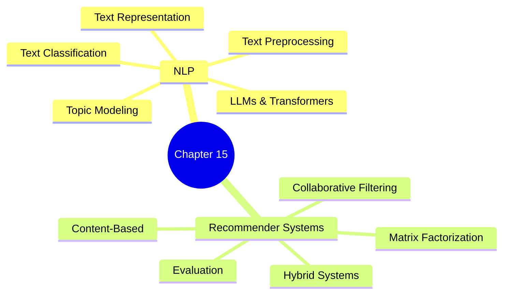
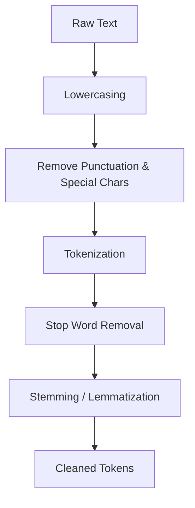
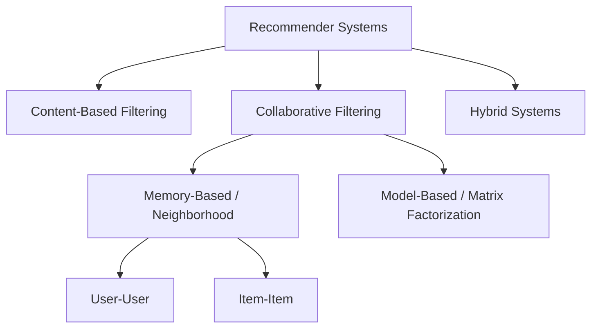

# ML Study Notes — Chapter 15: Natural Language Processing and Recommender Systems

## Overview
Welcome to Chapter 15! In this chapter, we bridge the gap between human communication and machine understanding, and explore how systems personalize content for users. We will tackle two of the most ubiquitous applications of Machine Learning: **Natural Language Processing (NLP)** and **Recommender Systems**. 

Whether it's ChatGPT understanding your prompts, Gmail filtering spam, Netflix suggesting your next binge-watch, or Amazon recommending products, NLP and Recommender Systems are at the core. 



## Prerequisites
- Proficiency in Python, `numpy`, and `pandas`.
- Understanding of basic ML algorithms (Naive Bayes, Logistic Regression, SVM) from previous chapters.
- Familiarity with distance metrics (like Cosine Similarity) and linear algebra basics.

---

# Part A: Natural Language Processing (NLP)

## 1. What is NLP?
**Intuition**: Imagine you run a busy chai stall. A customer says, "Bhaiya, ek kadak chai, chini kam." (Brother, one strong tea, less sugar). You instantly understand the intent, entities, and sentiment. Teaching a computer to do this—extracting meaning from unstructured text data—is NLP.

**Definition**: Natural Language Processing is a subfield of artificial intelligence focused on enabling computers to understand, interpret, process, and generate human language in a valuable way.

---

## 2. Text Preprocessing Pipeline
Raw text is messy. It has punctuation, uppercase/lowercase variations, emojis, and filler words. We need to clean it before feeding it to ML models.



### Steps Explained:
1. **Lowercasing**: Converting everything to lowercase. (`"Chai"` and `"chai"` should mean the same thing).
2. **Removing punctuation/special characters**: Stripping out `! ? @ # $`.
3. **Tokenization**: Splitting text into smaller units (tokens).
   - *Word Tokenization*: "I love ML" $\rightarrow$ `["I", "love", "ML"]`
   - *Sentence Tokenization*: Splitting paragraphs into sentences.
4. **Stop word removal**: Removing common words that add little semantic value (e.g., "is", "the", "in", "and").
5. **Stemming (Porter, Snowball)**: Crudely chopping off word endings to get the root word. E.g., `running` $\rightarrow$ `run`, `happiness` $\rightarrow$ `happi`.
6. **Lemmatization (WordNet)**: Using dictionary rules to find the meaningful root (lemma). E.g., `better` $\rightarrow$ `good`, `running` $\rightarrow$ `run`.

### Stemming vs. Lemmatization Table

| Feature | Stemming | Lemmatization |
| :--- | :--- | :--- |
| **Speed** | Fast (rule-based chopping) | Slower (dictionary lookup) |
| **Accuracy** | Low (often outputs non-words like `happi`) | High (outputs valid dictionary words) |
| **Use Case** | Search engines, large datasets | Chatbots, language translation, sentiment analysis |

### Code: Complete Preprocessing Pipeline

```python
import nltk
import re
from nltk.corpus import stopwords
from nltk.tokenize import word_tokenize
from nltk.stem import WordNetLemmatizer

# Download necessary NLTK data (run once)
nltk.download('punkt')
nltk.download('stopwords')
nltk.download('wordnet')

def preprocess_text(text):
    # 1. Lowercasing
    text = text.lower()
    
    # 2. Remove punctuation and special characters
    text = re.sub(r'[^\w\s]', '', text)
    
    # 3. Tokenization
    tokens = word_tokenize(text)
    
    # 4. Stop word removal
    stop_words = set(stopwords.words('english'))
    filtered_tokens = [word for word in tokens if word not in stop_words]
    
    # 5. Lemmatization
    lemmatizer = WordNetLemmatizer()
    lemmatized_tokens = [lemmatizer.lemmatize(word) for word in filtered_tokens]
    
    return " ".join(lemmatized_tokens)

raw_text = "The quick brown foxes are running quickly over the lazy dogs!"
print(f"Raw: {raw_text}")
print(f"Cleaned: {preprocess_text(raw_text)}")
# Output: quick brown fox running quickly lazy dog
```

---

## 3. Text Representation
ML models only understand numbers. We must convert text to numerical vectors.

### 3.1 Bag of Words (BoW)
**Intuition**: Count how many times each word appears in a document, ignoring order. Like counting ingredients in a recipe.
**Code**:
```python
from sklearn.feature_extraction.text import CountVectorizer

corpus = [
    "I love machine learning.",
    "Machine learning is fun.",
    "I love fun."
]

vectorizer = CountVectorizer()
X = vectorizer.fit_transform(corpus)

print("Vocabulary:", vectorizer.get_feature_names_out())
print("BoW Matrix:\n", X.toarray())
```

### 3.2 TF-IDF (Term Frequency-Inverse Document Frequency)
**Intuition**: BoW gives too much importance to frequent words. TF-IDF boosts words that are frequent in one document but rare across all documents (unique keywords).

**Mathematical Foundation**:
- **TF (Term Frequency)** = (Number of times term $t$ appears in a document) / (Total number of words in that document)
- **IDF (Inverse Document Frequency)** = $\log\left(\frac{\text{Total number of documents}}{\text{Number of documents containing term } t}\right)$
- **TF-IDF** = $TF \times IDF$

**Code**:
```python
from sklearn.feature_extraction.text import TfidfVectorizer

tfidf_vectorizer = TfidfVectorizer()
X_tfidf = tfidf_vectorizer.fit_transform(corpus)
print("TF-IDF Matrix:\n", X_tfidf.toarray())
```

### 3.3 N-grams
Instead of single words (unigrams), we consider pairs (bigrams) or triplets (trigrams).
- "not good" (bigram) captures negative sentiment, unlike ["not", "good"] (unigrams).
- In `CountVectorizer`, use `ngram_range=(1, 2)` to include both unigrams and bigrams.

### 3.4 Word Embeddings
Dense, low-dimensional vectors where similar words have similar vectors (capturing semantic meaning).

- **Word2Vec**: Neural network based. Two architectures:
  - *CBOW (Continuous Bag of Words)*: Predict a target word given its context.
  - *Skip-gram*: Predict context words given a target word.
- **GloVe**: Count-based approach using global word co-occurrence matrix.
- **FastText**: Considers subwords (n-grams of characters), great for handling out-of-vocabulary words.

---

## 4. Text Classification
### Project: Movie Review Sentiment Classifier
Let's build a classifier to predict if a review is positive or negative.

```python
import pandas as pd
from sklearn.model_selection import train_test_split
from sklearn.feature_extraction.text import TfidfVectorizer
from sklearn.naive_bayes import MultinomialNB
from sklearn.metrics import accuracy_score, classification_report

# 1. Create a dummy dataset (Imagine this is IMDB)
data = {'review': ["This movie was excellent and thrilling!", 
                   "Terrible acting and boring plot.",
                   "I loved the cinematography.",
                   "Worst movie I have ever seen.",
                   "Highly recommended, great acting."],
        'sentiment': [1, 0, 1, 0, 1]} # 1: Positive, 0: Negative
df = pd.DataFrame(data)

# 2. Train-Test Split
X_train, X_test, y_train, y_test = train_test_split(df['review'], df['sentiment'], test_size=0.4, random_state=42)

# 3. TF-IDF Vectorization
tfidf = TfidfVectorizer(stop_words='english')
X_train_tfidf = tfidf.fit_transform(X_train)
X_test_tfidf = tfidf.transform(X_test)

# 4. Train Naive Bayes
model = MultinomialNB()
model.fit(X_train_tfidf, y_train)

# 5. Evaluate
y_pred = model.predict(X_test_tfidf)
print(f"Accuracy: {accuracy_score(y_test, y_pred)}")
print(classification_report(y_test, y_pred))

# Test on a new review
new_review = ["The movie was boring and a waste of time"]
new_vec = tfidf.transform(new_review)
print("Prediction:", "Positive" if model.predict(new_vec)[0] == 1 else "Negative")
```

---

## 5. Named Entity Recognition (NER)
**Intuition**: Highlighting proper nouns (people, places, organizations) in a text.
*Example using `spaCy` (conceptually)*:
"Tim Cook is the CEO of Apple Inc. in California."
$\rightarrow$ Tim Cook (PERSON), Apple Inc. (ORG), California (GPE).

---

## 6. Text Similarity
How similar are two sentences? We represent them as vectors and compute distance.
- **Cosine Similarity**: Measures the cosine of the angle between two vectors. Independent of magnitude.
  $\text{Cosine Similarity} = \frac{A \cdot B}{||A|| ||B||}$
- **Jaccard Similarity**: Size of intersection divided by size of union of sets.

```python
from sklearn.metrics.pairwise import cosine_similarity

vec1 = tfidf.transform(["Machine learning is great"])
vec2 = tfidf.transform(["I love machine learning"])

print("Cosine Similarity:", cosine_similarity(vec1, vec2)[0][0])
```

---

## 7. Topic Modeling (LDA)
**Latent Dirichlet Allocation (LDA)** is an unsupervised technique to find hidden topics in a collection of documents.
**Intuition**: Looking at a set of news articles, LDA might figure out Topic 1 is about [politics, election, vote] and Topic 2 is about [cricket, match, run].

---

## 8. Transformers and LLMs (Brief Overview)
**Transformers** (introduced in 2017 paper "Attention Is All You Need") revolutionized NLP.
- **Attention Mechanism**: Allows the model to focus on relevant words in a sentence, regardless of distance. (e.g., in "The bank of the river", "bank" attends heavily to "river" rather than financial terms).
- **BERT (Bidirectional Encoder Representations from Transformers)**: Reads text in both directions. Great for classification and understanding.
- **GPT (Generative Pre-trained Transformer)**: Reads left-to-right. Great for text generation.
- **HuggingFace**: The "GitHub of ML models" where you can download pre-trained transformers in 3 lines of code.
*Career Note*: Knowing how to fine-tune HuggingFace models is a highly sought-after skill for ML Engineers today.

---

# Part B: Recommender Systems

## 9. What are Recommender Systems?
Systems designed to predict the "rating" or "preference" a user would give to an item.
- Netflix: Which movie will you watch next?
- Amazon: Customers who bought this also bought...

## 10. Types of Recommender Systems



---

## 11. Content-Based Filtering
**Intuition**: "If you liked *Inception* (Sci-Fi, Action, Nolan), you will like *Interstellar* (Sci-Fi, Space, Nolan)."
Recommends items similar to those a user liked in the past, based on item attributes.

**Code: Simple Content-Based Recommender**
```python
import pandas as pd
from sklearn.feature_extraction.text import TfidfVectorizer
from sklearn.metrics.pairwise import cosine_similarity

# Movies and their descriptions
movies = pd.DataFrame({
    'title': ['Inception', 'Interstellar', 'The Dark Knight', 'The Hangover'],
    'description': ['A thief who enters the dreams of others.',
                    'A team of explorers travel through a wormhole in space.',
                    'Batman raises the stakes in his war on crime.',
                    'Three buddies wake up from a bachelor party in Las Vegas.']
})

# Vectorize descriptions
tfidf = TfidfVectorizer(stop_words='english')
tfidf_matrix = tfidf.fit_transform(movies['description'])

# Compute cosine similarity between all movies
cosine_sim = cosine_similarity(tfidf_matrix, tfidf_matrix)

def recommend(title, cosine_sim=cosine_sim):
    idx = movies[movies['title'] == title].index[0]
    sim_scores = list(enumerate(cosine_sim[idx]))
    # Sort movies based on similarity scores
    sim_scores = sorted(sim_scores, key=lambda x: x[1], reverse=True)
    # Get top 2 most similar (excluding itself)
    sim_scores = sim_scores[1:3]
    movie_indices = [i[0] for i in sim_scores]
    return movies['title'].iloc[movie_indices]

print("Recommendations for Inception:")
print(recommend('Inception').values)
```

---

## 12. Collaborative Filtering (CF)
**Intuition**: "People who have similar tastes as you liked this movie, so you might like it too." Relies entirely on historical user-item interactions (ratings, clicks), independent of item attributes.

- **User-User CF**: Find users similar to User A, and recommend what they liked.
- **Item-Item CF**: Find items similar to Item X (because users rated them similarly), and recommend to users who liked Item X. (Used heavily by Amazon, more stable than User-User).

**The Cold Start Problem**: What if a new user joins or a new item is added? CF fails because there are no ratings. Content-based or Hybrid models solve this.

---

## 13. Matrix Factorization (Model-Based CF)
**Intuition**: Decompose the massive, sparse User-Item rating matrix into two smaller matrices: User features and Item features (latent factors). 

**SVD (Singular Value Decomposition)** is a classic algorithm used here. If a user is a vector in latent space, and an item is a vector in the same space, their dot product predicts the rating!
Other advanced techniques: ALS (Alternating Least Squares) for large sparse datasets.

---

## 14. Evaluation Metrics for Recommenders

- **RMSE (Root Mean Square Error)**: Measures error in predicted ratings (e.g., predicting 4 stars when the user gave 3).
- **Precision@K**: Out of the top $K$ recommendations given, how many were relevant?
- **Recall@K**: Out of all relevant items in the universe, how many did we capture in the top $K$?
- **NDCG (Normalized Discounted Cumulative Gain)**: Cares about the *order* of recommendations. A relevant item at rank 1 is better than at rank 5.

---

## 15. NLP vs Recommender Systems
How do they connect?
NLP is heavily used to power Content-Based Recommenders. We use TF-IDF, Word Embeddings, or LLMs to understand the text of product reviews, item descriptions, and user comments to generate high-quality features for Recommender Systems.

---

## 16. Common Mistakes & Pitfalls
- **Ignoring the Cold Start Problem**: Releasing a CF recommender for a brand new app will result in zero recommendations.
- **Not Lowercasing text**: Treating "Apple" and "apple" as separate features bloats the vocabulary.
- **Overusing Stemming**: Stemming can destroy meaning. If context matters, use Lemmatization or Embeddings instead.
- **Feedback Loops in RecSys**: If you only recommend popular items, they get more clicks, making them more popular. This creates an echo chamber.

---

## 17. 🎯 Interview Questions

1. **Q: Explain TF-IDF and why it's better than Bag of Words.**
   *A: BoW only counts frequencies, overweighting common words. TF-IDF penalizes words that appear frequently across all documents (like 'is', 'the') and boosts rare, document-specific keywords, providing better semantic representation.*
2. **Q: What is the difference between Stemming and Lemmatization?**
   *A: Stemming uses crude rules to chop off prefixes/suffixes, often leaving non-words. Lemmatization uses vocabulary and morphological analysis to return valid dictionary root words (lemmas).*
3. **Q: What is the Cold Start problem in recommender systems?**
   *A: The inability of Collaborative Filtering to recommend items to new users (no rating history) or recommend new items (no ratings received). Solved using Content-based or demographic fallback.*
4. **Q: How does Word2Vec capture semantic meaning?**
   *A: By utilizing the context in which words appear. It trains a shallow neural network to predict a word given its neighbors (or vice versa), forcing the hidden layer weights to cluster semantically similar words close together in vector space.*
5. **Q: Would you prefer User-User or Item-Item Collaborative filtering for Amazon?**
   *A: Item-Item. Amazon has way more users than items, and user tastes change fast. Item similarity (e.g., iPhone 14 vs iPhone 15) remains relatively static over time, making it easier to compute and cache offline.*
6. **Q: What is Cosine Similarity?**
   *A: A metric used to measure how similar two vectors are irrespective of their magnitude. It calculates the cosine of the angle between them. Useful in NLP for text similarity and in RecSys for item similarity.*
7. **Q: Explain Matrix Factorization intuitively.**
   *A: It breaks down a large sparse user-item matrix into lower-dimensional user matrices and item matrices (latent features). The dot product of a user's vector and an item's vector gives the predicted rating.*

---

## 18. Practice Exercises

1. **Pre-processing Basics**: Write a Python script using NLTK to tokenize, remove stop words, and lemmatize a Wikipedia paragraph of your choice.
2. **Spam Detector**: Download the SMS Spam Collection dataset from Kaggle. Build a pipeline with `TfidfVectorizer` and a `RandomForestClassifier` to detect spam messages.
3. **Similarity Search**: Given a list of 5 sentences, write a function that takes a new query sentence and returns the most similar sentence from the list using Cosine Similarity on BoW vectors.
4. **Simple CF**: Create a dummy 5x5 user-item rating matrix in pandas with some `NaN` values. Write a script to calculate the pearson correlation between User 1 and User 2.
5. **Advanced RecSys**: Use the `Surprise` library in Python to build a Matrix Factorization (SVD) model on the MovieLens 100K dataset and calculate the RMSE.

---

## Chapter Summary
- **NLP** helps machines understand text through preprocessing (tokenization, lemmatization) and vectorization (BoW, TF-IDF, Embeddings).
- Modern NLP is dominated by **Transformers** (LLMs).
- **Recommender Systems** match users to items using **Content-Based** (item features) or **Collaborative Filtering** (user-item interactions).
- **Matrix Factorization** uncovers latent features to predict missing ratings.

---
**Navigation**:
- Previous: [[ml-chapter-14-neural-networks-and-deep-learning-intro|← Chapter 14: Neural Networks]]
- Next: [[ml-chapter-16-ml-deployment-and-interview-prep|Chapter 16: Deployment & Interview →]]
