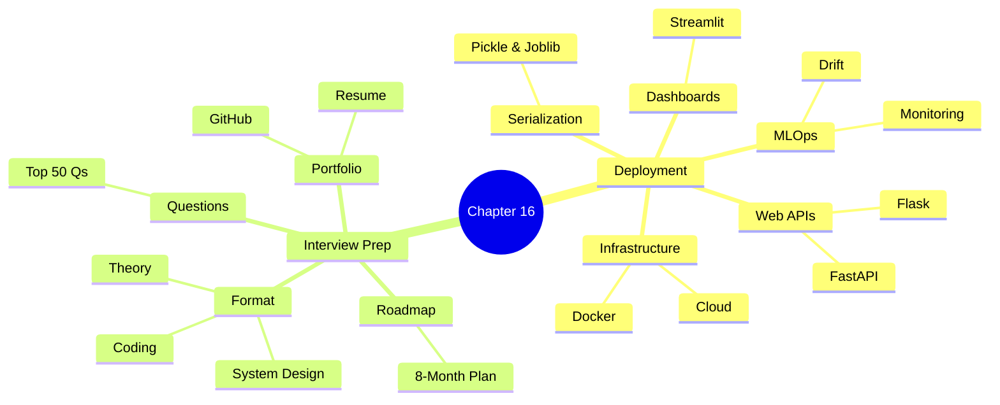
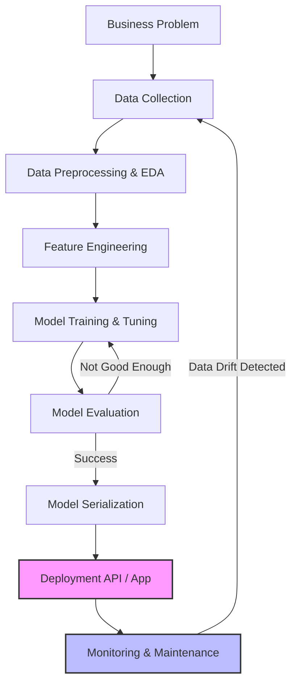
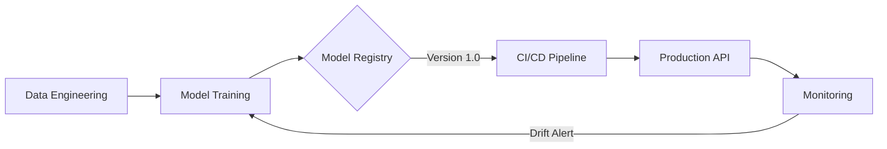
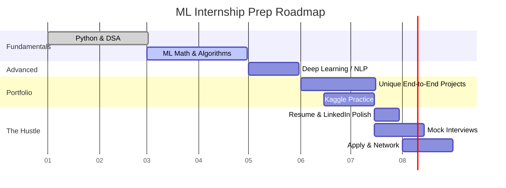

# ML Study Notes — Chapter 16: ML Deployment and Interview Preparation

Welcome to the **final chapter**, future ML Engineer! 🎓 

You've trained models, optimized hyperparameters, built deep learning networks, and worked with text data. But an ML model in a Jupyter Notebook is like a beautiful painting locked in a dark basement. Until it's deployed and accessible to users, it generates no real value. 

In **Part A** of this chapter, we'll learn how to take a trained model and deploy it to the real world—so someone can actually use it! We'll cover serialization, APIs, Docker, and MLOps.
In **Part B**, we switch gears completely to **Interview Preparation**. We'll cover the types of interviews, top 50 questions, system design, and your 8-month internship roadmap.

Let's finish strong!

## Overview Mindmap



## Prerequisites
Before tackling this chapter, you should be comfortable with:
- Training and evaluating ML models using `scikit-learn`.
- Basic understanding of web concepts (HTTP requests, JSON).
- Familiarity with the command line.

---

# Part A: ML Deployment

## 1. The ML Lifecycle — From Idea to Production

Deploying an ML model is not a one-time event; it's a cycle. 

**Intuition**: Think of a restaurant. Creating the recipe (training the model) is just step one. You need to gather ingredients (data), cook the dish, serve it to customers (deployment), ask for feedback (monitoring), and tweak the recipe if tastes change (retraining).



## 2. Model Serialization

You've trained a `RandomForestClassifier` and it gets 95% accuracy. How do you save it so you don't have to retrain it every time? We use **serialization** (saving) and **deserialization** (loading).

### 2.1 Pickle vs. Joblib

- **`pickle`**: Python's built-in serialization library. Great for general Python objects.
- **`joblib`**: A library specifically optimized for saving large numpy arrays. Since `scikit-learn` models use numpy heavily, `joblib` is preferred for ML models.

### 2.2 ONNX (Open Neural Network Exchange)

**What is it?** A universal format for ML models. You can train a model in PyTorch/Scikit-Learn (Python) and run it in C++, Java, or JavaScript using ONNX.

### Python Code: Saving and Loading Models

```python
from sklearn.datasets import load_iris
from sklearn.ensemble import RandomForestClassifier
import joblib
import pickle

# 1. Train a model
X, y = load_iris(return_X_y=True)
clf = RandomForestClassifier(n_estimators=10, random_state=42)
clf.fit(X, y)

# -------------------------------
# Using Joblib (Recommended for Scikit-Learn)
# -------------------------------
# Save the model
joblib.dump(clf, 'rf_model.joblib')
print("Model saved using joblib!")

# Load the model
loaded_rf_joblib = joblib.load('rf_model.joblib')
sample_pred = loaded_rf_joblib.predict([[5.1, 3.5, 1.4, 0.2]])
print(f"Joblib Prediction: {sample_pred}")

# -------------------------------
# Using Pickle
# -------------------------------
# Save the model
with open('rf_model.pkl', 'wb') as f:
    pickle.dump(clf, f)

# Load the model
with open('rf_model.pkl', 'rb') as f:
    loaded_rf_pickle = pickle.load(f)
```

> [!WARNING]
> Never load a `.pkl` or `.joblib` file from an untrusted source! They can contain malicious code that runs when deserialized.

---

## 3. Building a REST API with Flask

**Intuition**: Think of a REST API as a drive-thru window. 
- You drive up and shout your order (HTTP POST request with data).
- The worker inside (the Flask App) passes the order to the chef (the ML model).
- The chef cooks the food (makes a prediction).
- The worker hands you your food in a neat bag (JSON response).

### Complete Flask ML API

Create a file named `app.py`:

```python
# app.py
from flask import Flask, request, jsonify
import joblib
import numpy as np

# Initialize Flask app
app = Flask(__name__)

# Load the trained model (from previous step)
model = joblib.load('rf_model.joblib')

@app.route('/')
def home():
    return "Welcome to the Iris Prediction API! Use the /predict endpoint."

@app.route('/predict', methods=['POST'])
def predict():
    try:
        # Get JSON data from the request
        data = request.get_json()
        
        # Extract features from JSON (expecting a list of 4 numbers)
        features = data['features']
        
        # Convert to numpy array and reshape for a single prediction
        features_array = np.array(features).reshape(1, -1)
        
        # Make prediction
        prediction = model.predict(features_array)
        
        # Convert to standard Python int for JSON serialization
        pred_class = int(prediction[0])
        
        # Mapping for output
        classes = {0: 'Setosa', 1: 'Versicolor', 2: 'Virginica'}
        
        # Return response
        return jsonify({
            'status': 'success',
            'prediction': classes[pred_class],
            'class_id': pred_class
        })
        
    except Exception as e:
        return jsonify({'status': 'error', 'message': str(e)}), 400

if __name__ == '__main__':
    app.run(debug=True, host='0.0.0.0', port=5000)
```

**Testing it**:
You run `python app.py`. Then you send a request (using Postman, or `curl`):
```bash
curl -X POST http://127.0.0.1:5000/predict \
     -H "Content-Type: application/json" \
     -d '{"features": [5.1, 3.5, 1.4, 0.2]}'
```

---

## 4. Building with FastAPI (The Modern Alternative)

Flask is great, but **FastAPI** is taking over the ML world. 
**Why?**
1. It is incredibly fast (as the name implies).
2. Built-in data validation using `pydantic`.
3. Auto-generates a gorgeous interactive documentation page (Swagger UI).

### Simple FastAPI ML endpoint

```python
# fast_app.py
from fastapi import FastAPI, HTTPException
from pydantic import BaseModel
import joblib
import numpy as np

# Define the input data schema
class IrisFeatures(BaseModel):
    sepal_length: float
    sepal_width: float
    petal_length: float
    petal_width: float

app = FastAPI(title="Iris ML API")
model = joblib.load('rf_model.joblib')

@app.post("/predict")
def predict(features: IrisFeatures):
    # Data is automatically validated!
    X = np.array([[
        features.sepal_length, 
        features.sepal_width, 
        features.petal_length, 
        features.petal_width
    ]])
    
    pred = model.predict(X)[0]
    classes = {0: 'Setosa', 1: 'Versicolor', 2: 'Virginica'}
    
    return {"prediction": classes[int(pred)]}
    
# Run using: uvicorn fast_app:app --reload
```

---

## 5. Streamlit for ML Demos

APIs are for machines. If you want to show your model to a recruiter or your boss, you need a User Interface (UI).
**Streamlit** turns Python scripts into interactive web apps in minutes, with no HTML/CSS required!

### Streamlit App Code

```python
# ui_app.py
import streamlit as st
import joblib
import numpy as np

# Load model
model = joblib.load('rf_model.joblib')
classes = {0: 'Setosa', 1: 'Versicolor', 2: 'Virginica'}

st.title("🌺 Iris Flower Predictor")
st.write("Adjust the sliders to predict the flower species!")

# Input features via sliders
sepal_length = st.slider("Sepal Length", 4.0, 8.0, 5.1)
sepal_width = st.slider("Sepal Width", 2.0, 5.0, 3.5)
petal_length = st.slider("Petal Length", 1.0, 7.0, 1.4)
petal_width = st.slider("Petal Width", 0.1, 3.0, 0.2)

if st.button("Predict"):
    X = np.array([[sepal_length, sepal_width, petal_length, petal_width]])
    pred = model.predict(X)[0]
    st.success(f"The predicted species is: **{classes[pred]}**")

# Run using: streamlit run ui_app.py
```

---

## 6. Docker Basics for ML

**The Problem**: "But it works on my machine!" 
You build your project on Windows Python 3.10 with `scikit-learn==1.2.2`. You send it to your teammate on a Mac with Python 3.11. The model crashes.

**The Solution: Docker.** 
Docker wraps your code, your libraries, and the operating system into a standardized "container". It guarantees that the code will run exactly the same way everywhere.

### The Dockerfile

Create a file named `Dockerfile` (no extension):

```dockerfile
# Use an official Python runtime as a parent image
FROM python:3.9-slim

# Set the working directory in the container
WORKDIR /app

# Copy the requirements file into the container
COPY requirements.txt .

# Install dependencies
RUN pip install --no-cache-dir -r requirements.txt

# Copy the rest of the application code
COPY . .

# Expose port 5000 (if using Flask)
EXPOSE 5000

# Command to run the application
CMD ["python", "app.py"]
```

**Commands**:
```bash
# Build the image (don't forget the dot!)
docker build -t my-ml-app .

# Run the container
docker run -p 5000:5000 my-ml-app
```

---

## 7. MLOps Introduction

**MLOps (Machine Learning Operations)** is the set of practices combining ML, DevOps, and Data Engineering to deploy and maintain ML systems reliably.

### Key Components of MLOps
1. **Experiment Tracking**: Keeping track of hyperparameter tuning, metrics, and models. (Tool: **MLflow**, Weights & Biases)
2. **Model Registry**: A central hub to store versions of your trained models (e.g., v1, v2, staging, production).
3. **Automated Pipelines (CI/CD)**: When you push new code to GitHub, tests automatically run, and if they pass, the new model is deployed.



---

## 8. Model Monitoring: Data Drift and Concept Drift

Once a model is deployed, it starts degrading over time. Why? The world changes.

- **Data Drift**: The distribution of incoming features changes.
  *Example*: A loan prediction model trained on people earning \$50k. Inflation hits, now average income is \$80k. The model sees data it hasn't seen before.
- **Concept Drift**: The relationship between X and y changes.
  *Example*: A spam filter trained in 2018. The spammers change their tactics in 2024. The old words are no longer spammy; new words are. The fundamental concept of "what is spam" has shifted.

**Solution**: Log all predictions and periodically compare the production data distribution against the training data distribution. Retrain when necessary.

---
---

# Part B: ML Interview Preparation

You are aiming for an internship in 8 months. Let's break down how to crack the interview.

## 10. Types of ML Interviews

For entry-level or internship roles, expect a mix of the following:

1. **Coding Round (DSA)**: Usually Leetcode Easy/Medium. Arrays, Strings, HashMaps, Trees. 
2. **Python Data Stack**: Write code using Pandas, Numpy, or SQL to manipulate data.
3. **ML Theory**: Deep dive into algorithms, math, and concepts. 
4. **Take-home Assignment**: "Here is a dataset. Give us a notebook with EDA, modeling, and your conclusions in 48 hours."
5. **System Design / Case Study**: "How would you build X?"

---

## 11. Top 50 ML Interview Questions

Here is the holy grail. Master these to crack the theory rounds.

### ML Basics
1. 🎯 **What is the Bias-Variance Tradeoff?**
   *Answer*: Bias is error from erroneous assumptions (underfitting). Variance is error from sensitivity to small fluctuations in training data (overfitting). As model complexity increases, bias decreases and variance increases. You want the sweet spot in the middle.
2. 🎯 **What is overfitting and how do you prevent it?**
   *Answer*: When a model learns the noise in the training data instead of the signal, failing to generalize. Prevent via: more data, cross-validation, regularization (L1/L2), pruning, early stopping, or simpler models.
3. **What is cross-validation?**
   *Answer*: Splitting data into $k$ folds, training on $k-1$ folds and validating on the remaining fold, repeating $k$ times to ensure the model's robustness and prevent overfitting to a specific train-test split.
4. **Parametric vs Non-parametric models?**
   *Answer*: Parametric models (Linear Regression, Naive Bayes) have a fixed number of parameters and strong assumptions about data distribution. Non-parametric models (KNN, Decision Trees) grow in complexity with data and make fewer assumptions.
5. **What is the Curse of Dimensionality?**
   *Answer*: As the number of features increases, the volume of the feature space increases exponentially, making data sparse. This degrades the performance of distance-based algorithms like KNN.

### Supervised Learning
6. 🎯 **What are the assumptions of Linear Regression?**
   *Answer*: Linear relationship, Independence of errors, Homoscedasticity (constant variance of errors), Normality of error distribution, and lack of Multicollinearity.
7. 🎯 **Logistic Regression vs Support Vector Machines (SVM)?**
   *Answer*: Both are linear classifiers. Logistic regression outputs probabilities and optimizes log loss. SVM focuses on maximizing the margin between classes and uses support vectors; it handles non-linear data well via the kernel trick.
8. **Explain the Random Forest algorithm.**
   *Answer*: An ensemble method using Bagging. It builds multiple decision trees on bootstrapped samples of the data, and at each split, it only considers a random subset of features. The final prediction is majority vote (classification) or average (regression).
9. 🎯 **Random Forest vs Gradient Boosting?**
   *Answer*: RF builds trees independently in parallel (bagging) to reduce variance. GB builds trees sequentially (boosting), where each tree tries to correct the errors of the previous one, reducing bias.
10. **What is the Kernel Trick in SVM?**
    *Answer*: A mathematical technique that projects non-linearly separable data into a higher-dimensional space where a linear hyperplane can separate them, without explicitly computing the coordinates in that high-dimensional space.

### Unsupervised Learning
11. 🎯 **How does K-Means work? How do you choose K?**
    *Answer*: Initialize K centroids. Assign points to nearest centroid. Update centroids to mean of assigned points. Repeat until convergence. Choose K using the **Elbow Method** (plot WCSS vs K and find the "elbow") or Silhouette Score.
12. **Limitations of K-Means?**
    *Answer*: Assumes spherical clusters of equal size. Highly sensitive to outliers and initial centroid placement. Struggles with non-linear cluster boundaries.
13. 🎯 **Explain Principal Component Analysis (PCA).**
    *Answer*: A dimensionality reduction technique that transforms original variables into a new set of orthogonal variables (Principal Components) that capture the maximum variance in the data.

### Feature Engineering & Data Handling
14. 🎯 **How do you handle imbalanced datasets?**
    *Answer*: 1. Resampling (SMOTE for oversampling, or undersampling). 2. Choose right metrics (F1, PR-AUC instead of Accuracy). 3. Class weights in the algorithm. 4. Use tree-based ensemble methods.
15. **When should you use Standardization (Z-score) vs Normalization (Min-Max)?**
    *Answer*: Standardization (mean 0, std 1) is preferred when data has outliers or follows a Gaussian distribution, commonly used for SVM, Logistic Regression, PCA. Normalization (scale 0-1) is good when you need a bounded range, e.g., for Neural Networks or image pixels.
16. **How do you handle missing values?**
    *Answer*: Dropping rows/cols (if missingness is low), Mean/Median/Mode imputation, predictive imputation (KNN, IterativeImputer), or treating "Missing" as a distinct category.

### Evaluation Metrics
17. 🎯 **Precision vs Recall? Give an example.**
    *Answer*: Precision is "Out of all predicted Positives, how many are actually Positive?" Recall is "Out of all actual Positives, how many did we find?" 
    *Example*: In cancer detection, High Recall is crucial (don't miss any cancer). In spam filtering, High Precision is crucial (don't send real emails to spam).
18. **What is the F1 Score?**
    *Answer*: The harmonic mean of Precision and Recall. $F1 = 2 \times \frac{Precision \times Recall}{Precision + Recall}$. Used when you want a balance and have imbalanced classes.
19. 🎯 **What is ROC-AUC?**
    *Answer*: ROC curve plots True Positive Rate (Recall) vs False Positive Rate at various thresholds. AUC is the Area Under the Curve (0 to 1). It measures the model's ability to rank positive instances higher than negative instances.

### Practical / System Design
20. 🎯 **How would you build a fraud detection system?**
    *Answer*: Frame as binary classification. Handle severe class imbalance. Extract features (transaction frequency, location mismatch, amount velocity). Choose an interpretable model like XGBoost. Optimize for high Recall (catch fraud) but monitor False Positive Rate so customers' cards aren't constantly blocked.

*(Note for the student: Be sure to look up and study the rest of the 50 common questions online. We've highlighted the most critical 20 here!)*

---

## 12. ML Case Study Framework

In interviews, you will often get open-ended questions like "Design a Recommendation System for Netflix." Use this 7-step framework:

1. **Clarify the Problem**: Ask questions! "What is the business goal? Increase watch time or click-through rate?"
2. **Frame as ML**: "This is a Ranking problem." or "This is Binary Classification (will click / won't click)."
3. **Data Requirements**: "What data do we have? User demographics, watch history, video metadata (tags, length)."
4. **Feature Engineering**: Mention specific features. "Time since last login", "Cosine similarity between user vector and video vector."
5. **Model Selection**: Start simple (Collaborative Filtering / Matrix Factorization) -> go complex (Deep Learning / Two-Tower Neural Network).
6. **Evaluation Metrics**: Offline metrics (NDCG, Precision@K). Online metrics (A/B testing, actual watch time).
7. **Deployment & Scale**: Caching, real-time vs batch inference, handling new users (Cold Start problem).

---

## 13. Building Your ML Portfolio

A strong portfolio gets you past the resume screen.

- **GitHub**: Don't just upload a `.ipynb` named `Untitled1.ipynb`. Add a `README.md` with:
  - Problem statement.
  - Data source.
  - Methods used.
  - Key findings (with plots).
  - Instructions to run the code.
- **Projects**: Do NOT do Titanic, Iris, or MNIST. They are cliché. 
  - *Do*: Scrape your own data. Build an end-to-end app using Streamlit and deploy it on Heroku/Render.
- **Resume**: Emphasize **Impact**. Don't say: "Used Random Forest on data." Say: "Built a Random Forest classifier that predicted customer churn with 85% F1-score, enabling targeted retention campaigns."

---

## 14. 8-Month Internship Roadmap

Here is your battle plan for the next 8 months. Stick to it!



---

## 15. Resources for Continued Learning

- **Books**:
  - *Hands-On Machine Learning with Scikit-Learn, Keras, and TensorFlow* (Aurélien Géron) - The Bible for practical ML.
  - *Introduction to Statistical Learning (ISLR)* - The Bible for ML theory/math.
- **Courses**:
  - Andrew Ng's Machine Learning Specialization (Coursera).
  - fast.ai (Practical Deep Learning for Coders).
- **Practice**:
  - Kaggle.com (Start with playground competitions).
  - MachineLearningMastery.com tutorials.

---

## 16. Final Advice from a Professor

Learning ML is a marathon, not a sprint. 
1. **Don't just import libraries**: Understand *how* the math works under the hood. Implement Gradient Descent from scratch at least once.
2. **Data is King**: 80% of your time in the real world will be spent cleaning and formatting data. Learn Pandas inside out.
3. **Be humble**: The field moves incredibly fast. What is state-of-the-art today will be obsolete in 2 years. Learn how to learn.
4. **Deploy your stuff**: A mediocre model deployed as a web app is infinitely more impressive than a 99% accuracy model hidden in a Jupyter notebook.

You are equipped with everything you need. Now go out there, build things, break things, and crack that internship!

---

## Practice Exercises

1. **Deploy a Model**: Take any model you built in a previous chapter, serialize it with `joblib`, and build a Flask API around it.
2. **Streamlit UI**: Build a Streamlit app for a housing price prediction model. Include sliders for square footage, number of bedrooms, etc.
3. **Dockerize**: Write a `Dockerfile` for your Flask API and run it locally.
4. **Interview Practice**: Grab a friend (or ChatGPT) and do a 30-minute mock interview using 5 questions from the Top 50 list above. Answer them verbally.
5. **System Design**: Write a 1-page document outlining how you would design a system to detect toxic comments on a social media platform.

---
## Navigation
- Previous: [[ml-chapter-15-nlp-and-recommender-systems|← Chapter 15: NLP & Recommenders]]
- This is the final chapter! 🎓 Good luck!
