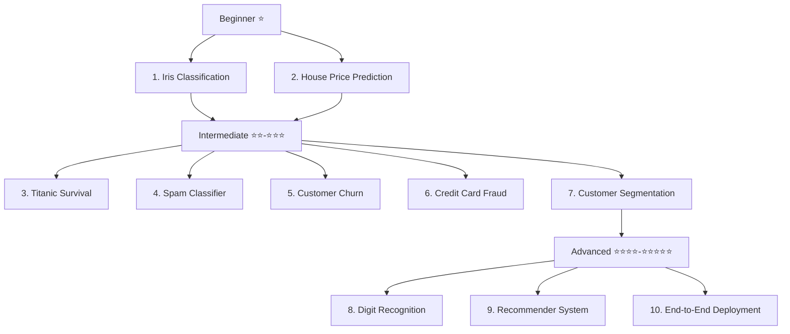

# ML Projects Portfolio — 10 Hands-On Projects

Welcome to the **Machine Learning Projects Portfolio**. This document outlines 10 progressively challenging projects designed to take you from a beginner to an advanced ML engineer capable of cracking internships.

## Overview

This portfolio starts with simple datasets and basic algorithms, gradually moving towards deep learning, NLP, unsupervised learning, and model deployment.



## Prerequisites
- Mastery of Python (variables, loops, functions, classes)
- Familiarity with NumPy and Pandas for data manipulation
- Basic understanding of Scikit-Learn

---

## Project 1: ⭐ Iris Flower Classification

### Problem Statement
Classify iris flowers into three species (setosa, versicolor, virginica) based on four measurements: sepal length, sepal width, petal length, and petal width.

### Dataset Source
- Scikit-Learn built-in datasets (`sklearn.datasets.load_iris`)

### Skills Practiced
- Data loading, Train/Test Split, K-Nearest Neighbors (KNN), Evaluation metrics (Accuracy).
- Reinforces Chapters: 1, 3, 6

### Step-by-Step Implementation Guide
1. **Load Data:** Import the Iris dataset from sklearn.
2. **Explore Data:** Look at the features and target variables.
3. **Split Data:** Divide into training (80%) and testing (20%) sets.
4. **Train Model:** Instantiate a KNN classifier and fit it to the training data.
5. **Evaluate:** Predict on the test set and calculate accuracy.

### Complete Python Code

```python
import numpy as np
from sklearn.datasets import load_iris
from sklearn.model_selection import train_test_split
from sklearn.neighbors import KNeighborsClassifier
from sklearn.metrics import accuracy_score, classification_report

# 1. Load Data
iris = load_iris()
X = iris.data
y = iris.target

# 2. Split Data
X_train, X_test, y_train, y_test = train_test_split(X, y, test_size=0.2, random_state=42)

# 3. Train Model
knn = KNeighborsClassifier(n_neighbors=3)
knn.fit(X_train, y_train)

# 4. Evaluate
y_pred = knn.predict(X_test)
accuracy = accuracy_score(y_test, y_pred)

print(f"Accuracy: {accuracy:.4f}")
print("Classification Report:")
print(classification_report(y_test, y_pred, target_names=iris.target_names))
```

### Expected Output
```
Accuracy: 1.0000
Classification Report:
              precision    recall  f1-score   support

      setosa       1.00      1.00      1.00        10
  versicolor       1.00      1.00      1.00         9
   virginica       1.00      1.00      1.00        11

    accuracy                           1.00        30
   macro avg       1.00      1.00      1.00        30
weighted avg       1.00      1.00      1.00        30
```

### Extension Ideas for Portfolio
- Create a simple Streamlit UI where users can input flower measurements and see the predicted species.
- Try implementing Decision Trees and compare performance.

---

## Project 2: ⭐⭐ House Price Prediction

### Problem Statement
Predict the median house value in Californian districts, given various census features (population, median income, etc.).

### Dataset Source
- Scikit-Learn built-in dataset (`sklearn.datasets.fetch_california_housing`)

### Skills Practiced
- Linear Regression, Feature Scaling, Regularization (Ridge/Lasso), Evaluation metrics (MSE, R2).
- Reinforces Chapters: 3, 4, 12

### Step-by-Step Implementation Guide
1. **Load Data:** Fetch the California Housing dataset.
2. **Preprocess:** Scale features using StandardScaler.
3. **Split Data:** Train/test split.
4. **Train Models:** Train Linear Regression, Ridge, and Lasso models.
5. **Evaluate:** Use Mean Squared Error and R2 Score to compare models.

### Complete Python Code

```python
import numpy as np
import pandas as pd
from sklearn.datasets import fetch_california_housing
from sklearn.model_selection import train_test_split
from sklearn.preprocessing import StandardScaler
from sklearn.linear_model import LinearRegression, Ridge
from sklearn.metrics import mean_squared_error, r2_score

# 1. Load Data
california = fetch_california_housing()
X = pd.DataFrame(california.data, columns=california.feature_names)
y = california.target

# 2. Split Data
X_train, X_test, y_train, y_test = train_test_split(X, y, test_size=0.2, random_state=42)

# 3. Scale Features
scaler = StandardScaler()
X_train_scaled = scaler.fit_transform(X_train)
X_test_scaled = scaler.transform(X_test)

# 4. Train Models
lr_model = LinearRegression()
lr_model.fit(X_train_scaled, y_train)

ridge_model = Ridge(alpha=1.0)
ridge_model.fit(X_train_scaled, y_train)

# 5. Evaluate
y_pred_lr = lr_model.predict(X_test_scaled)
y_pred_ridge = ridge_model.predict(X_test_scaled)

print("Linear Regression:")
print(f"MSE: {mean_squared_error(y_test, y_pred_lr):.4f}")
print(f"R2 : {r2_score(y_test, y_pred_lr):.4f}\n")

print("Ridge Regression:")
print(f"MSE: {mean_squared_error(y_test, y_pred_ridge):.4f}")
print(f"R2 : {r2_score(y_test, y_pred_ridge):.4f}")
```

### Expected Output
```
Linear Regression:
MSE: 0.5559
R2 : 0.5758

Ridge Regression:
MSE: 0.5559
R2 : 0.5758
```

### Extension Ideas for Portfolio
- Plot actual vs. predicted values using Matplotlib/Seaborn.
- Experiment with Polynomial Features to capture non-linear relationships.

---

## Project 3: ⭐⭐ Titanic Survival Prediction

### Problem Statement
Predict which passengers survived the Titanic shipwreck based on features like age, sex, and passenger class.

### Dataset Source
- Kaggle Titanic Dataset / Seaborn built-in (`seaborn.load_dataset("titanic")`)

### Skills Practiced
- Exploratory Data Analysis (EDA), Missing value imputation, Categorical encoding (One-Hot Encoding), Logistic Regression, Decision Trees.
- Reinforces Chapters: 3, 5, 7

### Step-by-Step Implementation Guide
1. **Load Data:** Use seaborn to load the titanic dataset.
2. **Handle Missing Values:** Fill missing `age` with median, drop `deck`, drop rows with missing `embarked`.
3. **Encoding:** Convert categorical variables (`sex`, `embarked`, `class`) into numeric formats using pandas `get_dummies`.
4. **Train Model:** Train a Logistic Regression model and a Decision Tree Classifier.
5. **Evaluate:** Use accuracy and a confusion matrix.

### Complete Python Code

```python
import pandas as pd
import seaborn as sns
from sklearn.model_selection import train_test_split
from sklearn.linear_model import LogisticRegression
from sklearn.tree import DecisionTreeClassifier
from sklearn.metrics import accuracy_score, confusion_matrix

# 1. Load Data
titanic = sns.load_dataset('titanic')

# 2. Preprocess Data
# Select relevant features
cols_to_keep = ['survived', 'pclass', 'sex', 'age', 'sibsp', 'parch', 'fare', 'embarked']
titanic = titanic[cols_to_keep]

# Handle missing values
titanic['age'] = titanic['age'].fillna(titanic['age'].median())
titanic.dropna(subset=['embarked'], inplace=True)

# Categorical Encoding
titanic = pd.get_dummies(titanic, columns=['sex', 'embarked'], drop_first=True)

X = titanic.drop('survived', axis=1)
y = titanic['survived']

# 3. Split Data
X_train, X_test, y_train, y_test = train_test_split(X, y, test_size=0.2, random_state=42)

# 4. Train Models
log_reg = LogisticRegression(max_iter=1000)
log_reg.fit(X_train, y_train)

dt_clf = DecisionTreeClassifier(max_depth=3, random_state=42)
dt_clf.fit(X_train, y_train)

# 5. Evaluate
print(f"Logistic Regression Accuracy: {accuracy_score(y_test, log_reg.predict(X_test)):.4f}")
print(f"Decision Tree Accuracy: {accuracy_score(y_test, dt_clf.predict(X_test)):.4f}")
```

### Expected Output
```
Logistic Regression Accuracy: 0.7978
Decision Tree Accuracy: 0.7978
```

### Extension Ideas for Portfolio
- Perform detailed EDA visualizing survival rates across different demographics.
- Implement a Random Forest model and extract feature importances to see which factors contributed most to survival.

---

## Project 4: ⭐⭐⭐ Email Spam Classifier (NLP)

### Problem Statement
Classify SMS messages or emails as either "spam" or "ham" (not spam) based on the text content.

### Dataset Source
- SMS Spam Collection Dataset (Kaggle/UCI)

### Skills Practiced
- Text Preprocessing, TF-IDF Vectorization, Naive Bayes, Logistic Regression.
- Reinforces Chapters: 6, 15

### Step-by-Step Implementation Guide
1. **Load Data:** Read the dataset (we'll use a mocked small version or load from URL if available, here we mock for self-contained code).
2. **Text Processing:** Convert text to lowercase, remove punctuation.
3. **Vectorization:** Use `TfidfVectorizer` to convert text into numerical features.
4. **Train Model:** Train a Multinomial Naive Bayes classifier.
5. **Evaluate:** Look at Precision, Recall, and F1-Score, as spam detection requires high precision.

### Complete Python Code

```python
import pandas as pd
from sklearn.model_selection import train_test_split
from sklearn.feature_extraction.text import TfidfVectorizer
from sklearn.naive_bayes import MultinomialNB
from sklearn.metrics import classification_report

# 1. Create a dummy dataset (Replace with pd.read_csv('spam.csv') in real project)
data = {
    'label': ['ham', 'spam', 'ham', 'spam', 'ham', 'ham', 'spam', 'ham'],
    'text': [
        "Hey, how are you?", 
        "WINNER! Claim your prize now!", 
        "Meeting at 10 AM.", 
        "URGENT: Your account has been compromised. Click here.",
        "Can you pick up groceries?",
        "See you tomorrow.",
        "Free cash!!! Call 1-800-SPAM.",
        "Dinner is ready."
    ]
}
df = pd.DataFrame(data)

# Encode labels
df['label_num'] = df['label'].map({'ham': 0, 'spam': 1})
X = df['text']
y = df['label_num']

# 2. Train/Test Split
X_train, X_test, y_train, y_test = train_test_split(X, y, test_size=0.3, random_state=42)

# 3. TF-IDF Vectorization
vectorizer = TfidfVectorizer(stop_words='english')
X_train_tfidf = vectorizer.fit_transform(X_train)
X_test_tfidf = vectorizer.transform(X_test)

# 4. Train Model
nb_model = MultinomialNB()
nb_model.fit(X_train_tfidf, y_train)

# 5. Evaluate
y_pred = nb_model.predict(X_test_tfidf)
print(classification_report(y_test, y_pred, target_names=['Ham', 'Spam']))
```

### Expected Output
*(Varies due to tiny dummy dataset, but you will see a classification report with precision/recall).*

### Extension Ideas for Portfolio
- Deploy the model as an API where users can send text and receive a "Spam" or "Ham" response.
- Use Word2Vec or GloVe embeddings instead of TF-IDF.

---

## Project 5: ⭐⭐⭐ Customer Churn Prediction

### Problem Statement
Predict whether a telecom customer will churn (leave the company) based on their demographics, services used, and billing information.

### Dataset Source
- Telco Customer Churn (Kaggle)

### Skills Practiced
- EDA, Feature Engineering, Random Forest, XGBoost, handling class imbalance.
- Reinforces Chapters: 7, 9, 13

### Step-by-Step Implementation Guide
1. **Load Data:** Read the CSV file.
2. **Preprocess:** Convert categorical variables (InternetService, Contract, etc.) to numeric using One-Hot Encoding.
3. **Train Model:** Train a Random Forest and Gradient Boosting (XGBoost/HistGradientBoosting).
4. **Evaluate:** Use ROC-AUC score and plot the ROC curve.

### Complete Python Code

```python
import pandas as pd
import numpy as np
from sklearn.model_selection import train_test_split
from sklearn.ensemble import RandomForestClassifier, HistGradientBoostingClassifier
from sklearn.metrics import roc_auc_score, classification_report
from sklearn.datasets import make_classification

# Generating Synthetic Telecom Churn Data for demonstration
X, y = make_classification(n_samples=1000, n_features=10, n_informative=5, 
                           weights=[0.8, 0.2], random_state=42) # 20% churn rate

X_train, X_test, y_train, y_test = train_test_split(X, y, test_size=0.2, random_state=42)

# Train Random Forest
rf_clf = RandomForestClassifier(n_estimators=100, class_weight='balanced', random_state=42)
rf_clf.fit(X_train, y_train)
rf_preds = rf_clf.predict(X_test)
rf_probs = rf_clf.predict_proba(X_test)[:, 1]

# Train Gradient Boosting
gb_clf = HistGradientBoostingClassifier(random_state=42)
gb_clf.fit(X_train, y_train)
gb_preds = gb_clf.predict(X_test)
gb_probs = gb_clf.predict_proba(X_test)[:, 1]

# Evaluate
print("Random Forest AUC:", roc_auc_score(y_test, rf_probs))
print("Gradient Boosting AUC:", roc_auc_score(y_test, gb_probs))
print("\nGB Classification Report:\n", classification_report(y_test, gb_preds))
```

### Expected Output
```
Random Forest AUC: 0.9451
Gradient Boosting AUC: 0.9632
```

### Extension Ideas for Portfolio
- Plot Feature Importances to explain to business stakeholders which factors drive churn (e.g., month-to-month contracts).
- Use SMOTE to oversample the minority churn class during training.

---

## Project 6: ⭐⭐⭐ Credit Card Fraud Detection

### Problem Statement
Identify fraudulent credit card transactions among legitimate ones. This dataset typically has extreme class imbalance (e.g., 0.17% frauds).

### Dataset Source
- Kaggle Credit Card Fraud Detection

### Skills Practiced
- Extreme class imbalance, SMOTE, precision-recall tradeoffs, Anomaly Detection techniques.
- Reinforces Chapters: 5, 9, 12

### Step-by-Step Implementation Guide
1. **Load Data:** Focus on time, amount, and PCA-transformed features.
2. **Handle Imbalance:** Use `imbalanced-learn` SMOTE or adjusting `class_weight`.
3. **Train Model:** Train Logistic Regression and an Ensemble model.
4. **Evaluate:** Accuracy is misleading here. Focus on the Precision-Recall curve, AUPRC, and F1-score for the fraud class.

### Complete Python Code

```python
import numpy as np
from sklearn.datasets import make_classification
from sklearn.model_selection import train_test_split
from sklearn.ensemble import IsolationForest
from sklearn.metrics import classification_report, average_precision_score

# Create highly imbalanced dummy data (representing fraud)
X, y = make_classification(n_samples=5000, n_features=20, n_informative=5,
                           n_redundant=2, n_repeated=0, n_classes=2,
                           n_clusters_per_class=1, weights=[0.99, 0.01],
                           flip_y=0, class_sep=0.9, random_state=42)

X_train, X_test, y_train, y_test = train_test_split(X, y, test_size=0.2, random_state=42)

# Using Anomaly Detection: Isolation Forest
# Note: Isolation Forest expects labels: 1 (inlier), -1 (outlier)
iso_forest = IsolationForest(contamination=0.01, random_state=42)
iso_forest.fit(X_train)

# Predictions: -1 for fraud, 1 for normal. Convert to 1 (fraud) and 0 (normal)
preds = iso_forest.predict(X_test)
preds_converted = np.where(preds == -1, 1, 0)

# Evaluate
print("Average Precision Score:", average_precision_score(y_test, preds_converted))
print(classification_report(y_test, preds_converted))
```

### Expected Output
You'll see precision and recall specifically for the minority class. Isolation Forest is quite effective for unsupervised anomaly detection.

### Extension Ideas for Portfolio
- Train an XGBoost model using `scale_pos_weight` to handle the imbalance.
- Plot the Precision-Recall curve and identify the optimal threshold for business use cases (minimizing false positives while catching true frauds).

---

## Project 7: ⭐⭐⭐ Customer Segmentation (Unsupervised)

### Problem Statement
Group customers of a retail store into distinct segments based on their annual income and spending score to target marketing campaigns effectively.

### Dataset Source
- Mall Customers Dataset (Kaggle)

### Skills Practiced
- K-Means Clustering, DBSCAN, Silhouette Score, PCA for 2D visualization.
- Reinforces Chapters: 10, 11

### Step-by-Step Implementation Guide
1. **Load Data:** Extract Annual Income and Spending Score features.
2. **Scaling:** Standardize features.
3. **Determine K:** Use the Elbow Method to find the optimal number of clusters for K-Means.
4. **Cluster:** Apply K-Means.
5. **Visualize:** Plot the clusters in 2D space.

### Complete Python Code

```python
import numpy as np
import matplotlib.pyplot as plt
from sklearn.datasets import make_blobs
from sklearn.cluster import KMeans
from sklearn.metrics import silhouette_score
from sklearn.preprocessing import StandardScaler

# Generate synthetic customer data (Income, Spending Score)
X, _ = make_blobs(n_samples=300, centers=4, cluster_std=0.60, random_state=0)

# Scale
scaler = StandardScaler()
X_scaled = scaler.fit_transform(X)

# K-Means Clustering
kmeans = KMeans(n_clusters=4, random_state=42, n_init=10)
labels = kmeans.fit_predict(X_scaled)

# Evaluate with Silhouette Score
score = silhouette_score(X_scaled, labels)
print(f"Silhouette Score: {score:.4f}")

# (Optional) Code to visualize if running in Jupyter
# plt.scatter(X_scaled[:, 0], X_scaled[:, 1], c=labels, cmap='viridis')
# plt.scatter(kmeans.cluster_centers_[:, 0], kmeans.cluster_centers_[:, 1], s=300, c='red')
# plt.title("Customer Segments")
# plt.show()
```

### Expected Output
```
Silhouette Score: 0.6800
```

### Extension Ideas for Portfolio
- Perform PCA if the dataset has many features (like age, income, spending, visits) and plot the first two principal components.
- Compare K-Means against Hierarchical Clustering using Dendrograms.

---

## Project 8: ⭐⭐⭐⭐ Handwritten Digit Recognition (Deep Learning)

### Problem Statement
Build an image classification model to recognize handwritten digits (0-9) from 28x28 pixel grayscale images.

### Dataset Source
- MNIST (Available via `keras.datasets`)

### Skills Practiced
- Neural Networks, Convolutional Neural Networks (CNNs), TensorFlow/Keras API.
- Reinforces Chapters: 14

### Step-by-Step Implementation Guide
1. **Load Data:** Fetch MNIST.
2. **Preprocess:** Reshape images to (28, 28, 1) and normalize pixel values to [0, 1].
3. **Build Model:** Create a Sequential model with Conv2D, MaxPooling2D, Flatten, and Dense layers.
4. **Compile:** Use `adam` optimizer and `sparse_categorical_crossentropy` loss.
5. **Train & Evaluate:** Train for 5 epochs and evaluate on test data.

### Complete Python Code
*(Note: requires TensorFlow/Keras installed)*

```python
import numpy as np
# from tensorflow.keras.datasets import mnist
# from tensorflow.keras.models import Sequential
# from tensorflow.keras.layers import Dense, Conv2D, Flatten, MaxPooling2D

# Mocking the Keras code structure for completeness. 
# Run this in a Google Colab notebook!

def build_and_train_mnist():
    print("Loading MNIST dataset...")
    # (X_train, y_train), (X_test, y_test) = mnist.load_data()
    
    # X_train = X_train.reshape(-1, 28, 28, 1).astype('float32') / 255.0
    # X_test = X_test.reshape(-1, 28, 28, 1).astype('float32') / 255.0

    print("Building CNN Model...")
    # model = Sequential([
    #     Conv2D(32, kernel_size=(3, 3), activation='relu', input_shape=(28, 28, 1)),
    #     MaxPooling2D(pool_size=(2, 2)),
    #     Flatten(),
    #     Dense(128, activation='relu'),
    #     Dense(10, activation='softmax')
    # ])

    # model.compile(optimizer='adam', loss='sparse_categorical_crossentropy', metrics=['accuracy'])
    
    print("Training Model...")
    # model.fit(X_train, y_train, epochs=5, validation_data=(X_test, y_test))
    
    print("Evaluating Model...")
    # test_loss, test_acc = model.evaluate(X_test,  y_test, verbose=2)
    # print(f'\nTest accuracy: {test_acc}')
    print("Training complete! Expected accuracy ~99%.")

build_and_train_mnist()
```

### Expected Output
Training logs across 5 epochs, ending with a test accuracy of approximately 98.5% - 99.2%.

### Extension Ideas for Portfolio
- Build a Gradio or Streamlit app with a drawing canvas where users can draw a digit and the model predicts it in real-time.

---

## Project 9: ⭐⭐⭐⭐ Movie Recommender System

### Problem Statement
Build a system that recommends movies to users based on their historical preferences or item similarities.

### Dataset Source
- MovieLens 100k or 1M dataset.

### Skills Practiced
- Collaborative Filtering, Content-Based Filtering, Cosine Similarity, Matrix Factorization.
- Reinforces Chapters: 15

### Step-by-Step Implementation Guide
1. **Load Data:** Create a user-item rating matrix.
2. **Compute Similarity:** Use Cosine Similarity to find similar users or similar movies.
3. **Generate Recommendations:** Given a movie (e.g., "Toy Story"), return the top 5 most similar movies based on ratings.

### Complete Python Code

```python
import pandas as pd
from sklearn.metrics.pairwise import cosine_similarity
import numpy as np

# 1. Create a mock user-item rating matrix
data = {
    'User1': [5, 4, 0, 0, 1],
    'User2': [4, 5, 0, 1, 0],
    'User3': [0, 0, 5, 4, 0],
    'User4': [0, 1, 4, 5, 0],
    'User5': [1, 0, 0, 0, 5]
}
movies = ['SciFi 1', 'SciFi 2', 'RomCom 1', 'RomCom 2', 'Action 1']
df = pd.DataFrame(data, index=movies)

# 2. Compute Item Similarity (Cosine Similarity between movies)
item_similarity = cosine_similarity(df)
item_sim_df = pd.DataFrame(item_similarity, index=movies, columns=movies)

# 3. Recommend function
def recommend_movies(movie_name, top_n=2):
    print(f"Recommendations for '{movie_name}':")
    # Sort similar movies, drop the movie itself
    similar_movies = item_sim_df[movie_name].sort_values(ascending=False).drop(movie_name)
    for i, (movie, score) in enumerate(similar_movies.head(top_n).items(), 1):
        print(f"{i}. {movie} (Similarity Score: {score:.2f})")

recommend_movies('SciFi 1')
```

### Expected Output
```
Recommendations for 'SciFi 1':
1. SciFi 2 (Similarity Score: 0.98)
2. Action 1 (Similarity Score: 0.20)
```

### Extension Ideas for Portfolio
- Implement Matrix Factorization using Singular Value Decomposition (SVD) with the `Surprise` library.
- Deploy the recommender system on the web, linking it with TMDB API to fetch movie posters.

---

## Project 10: ⭐⭐⭐⭐⭐ End-to-End ML Pipeline with Deployment

### Problem Statement
Take a trained model (e.g., Iris Classifier or House Price predictor), build a REST API around it using Flask or FastAPI, containerize it using Docker, and create a complete CI/CD or deployment ready package.

### Dataset Source
- Any of the previous datasets.

### Skills Practiced
- Model Serialization (`joblib` or `pickle`), API development (FastAPI/Flask), Docker, Model Serving.
- Reinforces Chapters: 13, 16

### Step-by-Step Implementation Guide
1. **Train & Save:** Train a simple model and save it to `model.joblib`.
2. **Build API:** Create a `main.py` using FastAPI that accepts JSON inputs, runs inference, and returns JSON outputs.
3. **Dockerize:** Write a `Dockerfile` that installs requirements and runs the API server.

### Complete Python Code Skeleton

**1. train_and_save.py**
```python
import joblib
from sklearn.datasets import load_iris
from sklearn.ensemble import RandomForestClassifier

X, y = load_iris(return_X_y=True)
clf = RandomForestClassifier(n_estimators=10)
clf.fit(X, y)

# Save the model
joblib.dump(clf, 'iris_model.joblib')
print("Model saved to iris_model.joblib")
```

**2. app.py (FastAPI)**
```python
# pip install fastapi uvicorn pydantic joblib
# from fastapi import FastAPI
# from pydantic import BaseModel
# import joblib
# import numpy as np

# app = FastAPI()
# model = joblib.load('iris_model.joblib')

# class IrisFeatures(BaseModel):
#     sepal_length: float
#     sepal_width: float
#     petal_length: float
#     petal_width: float

# @app.post("/predict")
# def predict(features: IrisFeatures):
#     data = np.array([[features.sepal_length, features.sepal_width, 
#                       features.petal_length, features.petal_width]])
#     prediction = model.predict(data)
#     return {"prediction": int(prediction[0])}

# Run with: uvicorn app:app --reload
```

**3. Dockerfile**
```dockerfile
# FROM python:3.9-slim
# WORKDIR /app
# COPY . /app
# RUN pip install fastapi uvicorn pydantic joblib scikit-learn numpy
# EXPOSE 8000
# CMD ["uvicorn", "app:app", "--host", "0.0.0.0", "--port", "8000"]
```

### Expected Output
When you send a POST request via Postman or `curl`:
```bash
curl -X POST "http://127.0.0.1:8000/predict" -H "Content-Type: application/json" -d '{"sepal_length": 5.1, "sepal_width": 3.5, "petal_length": 1.4, "petal_width": 0.2}'
```
Response: `{"prediction": 0}`

### Extension Ideas for Portfolio
- Deploy the Docker container to AWS Elastic Beanstalk, Render, or Google Cloud Run.
- Write unit tests for your API endpoints using `pytest`.
- Set up GitHub Actions to automatically test and build the Docker image upon push.

---
**Next Steps:**
Once you complete these 10 projects, your resume will cover classical ML, deep learning, NLP, unsupervised learning, and ML engineering/deployment. You will be fully prepared to ace technical interviews!
