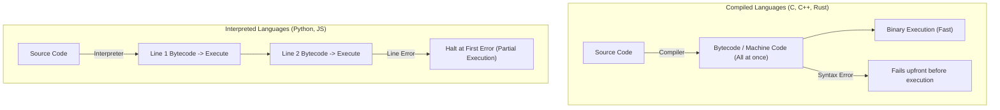

# Complete Python for AI & ML (Beginner to Pro) — Part 01

## Executive Overview (00:00:00)

- **Source**: [Not Your College YouTube Lecture](https://www.youtube.com/watch?v=62eeQhh7SrI&t=19634s)
- **Instructors**: [[Not Your College]] & Akarsh Vyas (Sheryians AI School)
- **Scope**: Part 1 of 7-part detailed study series covering Python Fundamentals for Artificial Intelligence, Machine Learning, Data Science, and Data Analysis.
- **Coverage (Part 01)**: Introduction, Core Language Mechanics (Compiled vs. Interpreted), Installation & VS Code Setup, Chapter 2 (Comments, Variables, Rules, and Naming Conventions).

---

## Detailed Section Breakdown

### 1. Introduction (00:00:00 – 00:03:16)

- **AI/ML Foundation**: Python is the non-negotiable prerequisite for specialized tech domains including Artificial Intelligence (AI), Machine Learning (ML), Data Science (DS), and Data Analysis (DA).
- **Curriculum Structure**: The course is divided into 27 structured modules across a 3-part core series designed to take students from absolute zero to complete operational autonomy in Python programming.
- **Pedagogical Rule**: Avoid jumping across conflicting tutorial sources. Consistency within one structured curriculum guarantees linear skill progression.

### 2. What is Python & Language Architecture (00:03:16 – 00:17:02)

#### Language Definition & History (00:04:06)
- **High-Level & General-Purpose**: Python is a high-level, general-purpose programming language created by **Guido van Rossum** and first released in **1991**.
- **Etymology**: Named after the British comedy show *Monty Python's Flying Circus*, not the snake.
- **Readability**: Designed with plain-English syntax, making it accessible for beginners while remaining powerful enough to drive infrastructure at Google, Instagram, YouTube, and NASA.

#### Code Execution Model: Compiled vs. Interpreted (00:06:10)

Computers execute code via lower-level representations. Python processes code differently from traditional compiled languages.



| Feature | Compiled Languages (C, C++, Rust, Go) | Interpreted Languages (Python, JavaScript, Ruby) |
| :--- | :--- | :--- |
| **Translation Timing** | Entire source file translated into machine code upfront | Translated line-by-line during runtime `(00:08:48)` |
| **Execution Speed** | Faster execution after compilation `(00:11:05)` | Slightly slower runtime due to real-time interpretation `(00:11:05)` |
| **Error Handling** | All syntax errors reported prior to runtime `(00:11:24)` | Halts execution immediately at the first failing line `(00:11:24)` |
| **Portability** | Platform-specific binaries produced `(00:11:49)` | Runs on any OS with Python interpreter installed `(00:11:49)` |

#### Ecosystem & Industry Use Cases (00:12:10)

Python's widespread adoption across modern engineering stems from its extensive library ecosystem (over 400,000+ PyPI packages):

1. **AI & Machine Learning**: TensorFlow, PyTorch, Scikit-Learn (backbone of models like ChatGPT and Gemini).
2. **Data Science & Analytics**: Pandas, NumPy, Matplotlib, Seaborn.
3. **Web Backend Systems**: Django, Flask, FastAPI (powers backend infrastructures of Instagram, Pinterest, Spotify).
4. **Automation & Scripting**: OS file management, web scraping, task scheduling.
5. **Cybersecurity & Ethical Hacking**: Security tooling, network analysis scripts, penetration test clients (e.g., Metasploit modules).

> *"Python's simplicity combined with its massive library ecosystem makes it the primary language for AI and Data Engineering in 2026."* (14:34) — *Akarsh Vyas*

---

### 3. Installation & Development Environment Setup (00:17:02 – 00:32:16)

#### System Installation Requirements (00:17:18)
- **Python Interpreter**: Core engine (Python 3.x) required to translate Python code into executable bytecode.
- **IDE (Integrated Development Environment)**: Visual Studio Code (VS Code) recommended for project file structure management.

#### Windows Specific Configuration (00:20:09)
- Download the official standalone installer from `python.org`.
- **CRITICAL STEP**: Must check the **`Add Python.exe to PATH`** checkbox during wizard initialization. Failing to check this box prevents shell/terminal invocation of Python binaries globally.

#### VS Code Workspace & Extensions Setup (00:25:54)
- **Folder Setup**: Create a dedicated project workspace directory (e.g., `NYC-Python`).
- **Required VS Code Extensions**:
  1. **Code Runner**: Enables single-click script invocation.
  2. **Python (Microsoft)**: Provides IntelliSense, linting, and debugging capabilities.

#### Script Execution Methods (00:28:25)

File naming requires the `.py` extension. Example script: `main.py`.

```python
print("Hello NYC People")
```

Execution options:
1. **VS Code GUI**: Click the *Run Python File* action icon.
2. **Terminal Direct Command** `(00:30:42)`:
   ```bash
   python main.py
   ```

*Note*: Using the interactive Terminal permits user input (`input()`), whereas read-only output consoles prevent interactive execution.

---

### 4. Chapter 2: Comments and Variables (00:32:16 – 00:44:45)

#### Python Comments (00:32:24)
Comments are explanatory notes ignored by the Python interpreter during execution.

- **Single-Line Comments**: Created using `#`.
  ```python
  # This line is an inline comment explaining code logic
  print("Hello NYC Student")
  ```
- **Multi-Line Comments / Docstrings**: Formatted using triple quotes (`'''` or `"""`).
  ```python
  """
  Multi-line block note:
  Line 1: Explaining setup
  Line 2: Explaining workflow
  """
  ```

#### Variables as Labeled Memory Containers (00:35:27)

A variable functions as a named reference (labeled container) storing a value in system RAM.

```python
sher = 12
print(sher)  # Output: 12
```

#### The 3 Strict Variable Naming Rules (00:39:02)

1. **Rule 1: Cannot Start with a Number**:
   - `1hello = 45` ❌ *(Raises SyntaxError)*
   - `hello1 = 45` ✅
2. **Rule 2: Cannot Contain Spaces**:
   - `sher nyc = 10` ❌ *(Raises SyntaxError)*
   - `sher_nyc = 10` ✅
3. **Rule 3: Avoid Special Characters**:
   - Symbols like `@`, `#`, `$`, `!` are reserved for operators and decorators (`#` creates comments, `@` defines decorators).
   - *Exception*: Underscore (`_`) is permitted.

#### Variable Naming Conventions (00:41:29)

| Convention | Pattern | Example | Primary Use Case |
| :--- | :--- | :--- | :--- |
| **Camel Case** | Initial word lowercase, subsequent words capitalized | `sheryiansXNyc` | Common in JavaScript / Java |
| **Pascal Case** | Every word capitalized | `SheryiansXNyc` | Class names in Python & OOP |
| **Snake Case** | All lowercase words joined by underscores | `sheryians_x_nyc` | **Python Standard (PEP 8)** `(00:43:41)` |

```python
# Snake Case (PEP 8 Recommended for Python Variables)
sheryians_x_nyc = 45
```

---

## Code Examples Summary

```python
# --- Single-line and Multi-line Comments ---
# Single line comment
print("Execution test")

"""
Multi-line block comment
storing contextual notes
"""

# --- Variable Declaration and Printing ---
a = 12
b = 56
user_name = "Akarsh"

# Printing variable contents
print(a)          # Outputs: 12
print(user_name)  # Outputs: Akarsh

# --- Variable Naming Conventions ---
camelCaseVar = 100
PascalCaseVar = 200
snake_case_var = 300  # Preferred in Python
```

---

## Key Takeaways

1. **Python Interpreter Architecture**: Python executes line-by-line, converting code to bytecode and then binary. It halts execution immediately at the first syntax or runtime error encountered.
2. **Setup Hygiene**: Always select "Add Python to PATH" on Windows systems during installation to avoid binary path errors in terminal interfaces.
3. **Variable Discipline**: Variables act as memory pointers. Always follow PEP 8 standards using `snake_case` naming conventions for variables in Python.

---

## Source Verification & Links

- **Original Source Capture**: [[01_RAW/SOURCE/Complete Python for AI & ML (Beginner to Pro).md]]
- **Video Timestamp Reference**: [00:00:00 – 00:44:45](https://www.youtube.com/watch?v=62eeQhh7SrI&t=0s)
