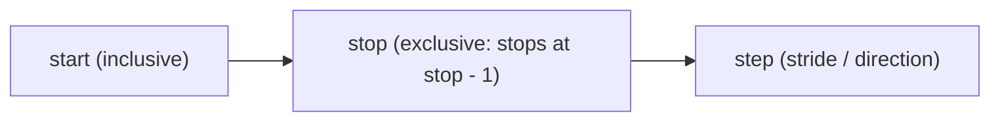

# Complete Python for AI & ML (Beginner to Pro) — Part 02

## Executive Overview (00:44:45)

- **Source**: [Not Your College YouTube Lecture](https://www.youtube.com/watch?v=62eeQhh7SrI&t=19634s)
- **Instructors**: [[Not Your College]] & Akarsh Vyas (Sheryians AI School)
- **Scope**: Part 2 of 7-part detailed study series covering Python Fundamentals for AI, Machine Learning, Data Science, and Data Analysis.
- **Coverage (Part 02)**: Chapter 3 (Data Types: Integers, Floats, Complex Numbers, Strings, Booleans, NoneType) and Chapter 4 (Strings Deep-Dive, Unicode, Indexing, Slicing, Explicit/Implicit Type Conversion, Truthy vs. Falsy Values).

---

## Detailed Section Breakdown

### 1. Chapter 3: Data Types (00:44:45 – 01:01:00)

#### Dynamic Typing System (00:45:17)
Unlike statically typed languages (C, C++, Java) where data types must be explicitly declared (`int x = 10;`), Python uses **dynamic typing**. The Python interpreter infers data types automatically at runtime based on assigned values.

#### Category 1: Numbers (00:46:12)

Python categorizes numeric values into three distinct types:

1. **Integer (`int`)** `(00:46:56)`: Whole numbers extending from negative infinity to positive infinity, including 0.
   - Examples: `-23`, `0`, `45`.
   - Inspection: `type(a)` returns `<class 'int'>`.
2. **Float (`float`)** `(00:49:40)`: Fractional or decimal numbers ($p/q$ representations).
   - Examples: `12.1`, `-0.5`, `3.14159`.
   - **Division Trait** `(00:51:47)`: Performing division (`/`) in Python **always** yields a `float`, even if the division has no remainder (e.g., `12 / 3` outputs `4.0`).
3. **Complex (`complex`)** `(00:53:11)`: Consists of a real part and an imaginary part represented by `j` (mathematical $\text{iota}$).
   - Example: `12 + 3j`.
   - Inspection: `type(12 + 3j)` returns `<class 'complex'>`.

#### Category 2: Strings (`str`) (00:54:57)
- Any sequence of characters enclosed within single (`'...'`) or double (`"..."`) quotes.
- Can store letters, numbers, spaces, and special symbols simultaneously.

#### Category 3: Booleans (`bool`) (00:58:20)
- Represents truth values: `True` or `False`.
- Case-sensitive: Must begin with capital `T` or `F`.

#### Category 4: NoneType (`None`) (01:00:06)
- Represents the absence of a value or a null reference (`None`).

---

### 2. Chapter 4: Strings Anatomy, Indexing & Slicing (01:01:00 – 01:15:42)

#### Unicode System (`ord()`) (01:01:18)
Every character in a Python string is assigned a unique Unicode integer value. Python provides the built-in `ord()` function to inspect a character's Unicode code point:

```python
print(ord('H'))  # Output: 72
print(ord('h'))  # Output: 104
print(ord(' '))  # Output: 32 (space character)
```

#### String Indexing (00:03:28)

Strings are ordered sequences of characters. Each position has an integer index:
- **Positive Indexing**: Starts from `0` at the leftmost character and increments to $N-1$.
- **Negative Indexing**: Starts from `-1` at the rightmost character and decrements to $-N$.

```text
 String:   C   O   L   L   E   G   E
 Pos Idx:  0   1   2   3   4   5   6
 Neg Idx: -7  -6  -5  -4  -3  -2  -1
```

```python
word = "COLLEGE"
print(word[0])    # Output: 'C'
print(word[2])    # Output: 'L'
print(word[-1])   # Output: 'E'
```

#### String Slicing Mechanics (01:07:33)

Slicing extracts a substring using bracket notation with 3 parameters: `sequence[start : stop : step]`.



- **Start**: Index where extraction begins (inclusive). Default = `0`.
- **Stop**: Index where extraction halts (exclusive). The character at `stop` is **not** included. Default = end of string.
- **Step**: Stride size between extracted indices. Default = `1`.

```python
word = "COLLEGE"

# Extracting substring "LEG" (Indices 3 to 5) -> stop index must be 6
print(word[3:6:1])  # Output: 'LEG'

# Stepping by 2
print(word[0:7:2])  # Output: 'CLEE'

# Utilizing Defaults (Omit parameters)
print(word[::2])    # Output: 'CLEE'
print(word[:])      # Output: 'COLLEGE'
```

---

### 3. Type Conversion / Type Casting (01:15:42 – 01:31:55)

Type conversion transforms data from one data type to another.

#### Explicit Type Conversion (01:16:30)

Explicit conversion uses built-in function calls:

1. **`int()`**: Converts valid numeric strings or floats to integers.
   - Float truncation: `int(12.9)` -> `12`.
   - **Invalid Conversion**: Attempting `int("12.5")` raises a `ValueError` because `"12.5"` is not a valid integer literal string.
2. **`float()`** `(01:23:16)`: Converts numeric strings or integers to floats (e.g., `float("12.4")` -> `12.4`, `float(143)` -> `143.0`).
3. **`str()`** `(01:24:53)`: Converts any Python data type (numbers, complex, booleans) into string representation.
4. **`bool()`** `(01:26:45)`: Converts a value to `True` or `False`.

#### Truthy vs. Falsy Values (01:28:33)

When evaluated in a boolean context (`bool()`), Python classifies all values into Truthy or Falsy.

> **The 7 Falsy Values in Python** `(01:29:42)`:
> 1. `False`
> 2. `0` (Integer zero)
> 3. `0.0` (Float zero)
> 4. `""` (Empty string)
> 5. `[]` (Empty list)
> 6. `()` (Empty tuple)
> 7. `{}` (Empty dict/set) & `None`

*All other non-zero numbers and non-empty sequences evaluate to `True` (Truthy).*

```python
print(bool(12))       # True
print(bool(0))        # False
print(bool("Hello"))  # True
print(bool(""))       # False
```

#### Implicit Type Conversion (Coercion) (01:30:33)
Python automatically converts data types during specific operations to prevent data loss. For example, dividing two integers via `/` automatically promotes the result to `float`:

```python
result = 12 / 2  # Result is 6.0 (float), not 6 (int)
```

---

## Code Examples Summary

```python
# --- Data Types Inspection ---
a = -23
b = 12.1
c = 12 + 3j
d = "NYC"
e = True

print(type(a))  # <class 'int'>
print(type(b))  # <class 'float'>
print(type(c))  # <class 'complex'>
print(type(d))  # <class 'str'>
print(type(e))  # <class 'bool'>

# --- String Indexing and Slicing ---
text = "COLLEGE"
print(text[0])       # 'C'
print(text[-1])      # 'E'
print(text[3:6])     # 'LEG'

# --- Type Conversion ---
num_str = "45"
num_int = int(num_str)  # Converts string "45" to int 45
float_val = float(10)   # Converts int 10 to float 10.0

# Falsy evaluation
print(bool(""))      # False
print(bool("Python")) # True
```

---

## Key Takeaways

1. **Numeric Trait**: Division (`/`) in Python ALWAYS returns a `float`.
2. **Slicing Rule**: The `stop` index in slicing `[start:stop:step]` is exclusive (stops at $stop - 1$).
3. **Falsy Discipline**: Remember Python's 7 falsy values (`False`, `0`, `0.0`, `""`, `[]`, `()`, `{}` / `None`). All other non-empty values evaluate to `True`.

---

## Source Verification & Links

- **Original Source Capture**: [[01_RAW/SOURCE/Complete Python for AI & ML (Beginner to Pro).md]]
- **Video Timestamp Reference**: [00:44:45 – 01:31:55](https://www.youtube.com/watch?v=62eeQhh7SrI&t=2685s)
