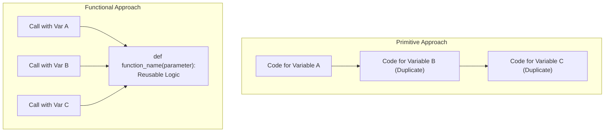
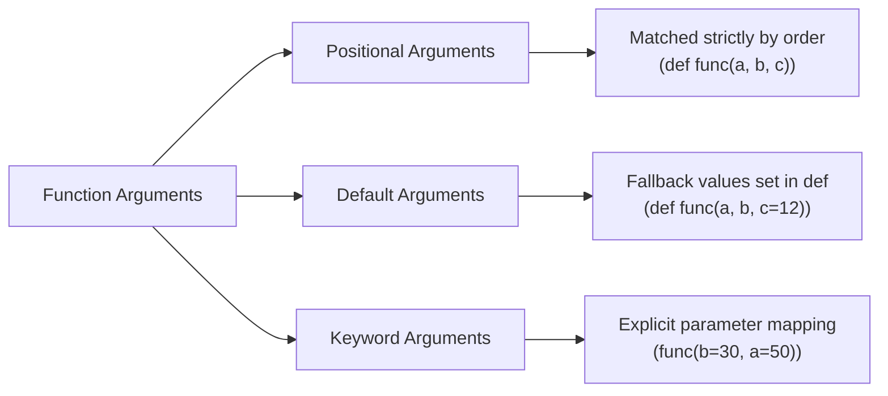
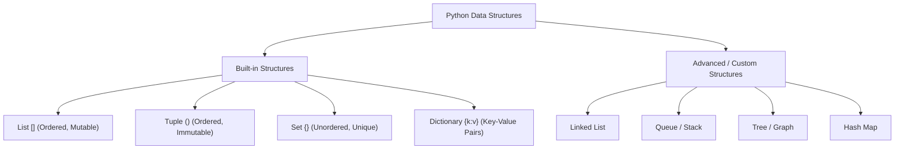

# Complete Python for AI & ML Part 2 (Intermediate to Advanced) — Part 01: Functions & Data Structures Overview

## Executive Overview (00:00:00 - 00:01:27)

* **Source**: [Watch on YouTube](https://www.youtube.com/watch?v=QR2TyeZRknw&t=124s)
* **Creator**: [[Not Your College]] (Mentor: Akarsh Vyas)
* **Part 1 Focus**: Functional Programming Fundamentals, Function Definitions, Argument Types (Positional, Default, Keyword), and Overview of Python Built-in Data Structures.

This tutorial series covers intermediate-to-advanced Python concepts tailored for Artificial Intelligence (AI) and Machine Learning (ML) practitioners. Part 2 focuses on moving away from primitive code execution to modular functional architecture, built-in data structures (Lists, Tuples, Sets, Dictionaries), Exception Handling, File Handling, and GUI development.

---

## 1. Functions Explained (00:01:27 - 00:19:50)

### 1.1 Course Resources & Setup (00:01:30)

* **HTML Course Notes**: Course materials provided via Google Drive are packaged as single HTML documents (`Final Book 1.html`). These must be downloaded locally and opened in a web browser rather than viewed as raw source text in Google Drive.
* **Code Repository**: Official code files and project scripts are available on GitHub (`NYC-python` and `NYC-filehandling`).

### 1.2 Conceptual Analogy & Motivation (00:02:41 - 00:04:04)

A **function** is a named, reusable block of code designed to perform a single, specific task. 

* **Primitive Approach vs. Functional Approach**:
  * *Primitive Approach*: Writing sequential, linear code that executes directly line-by-line. Code logic must be duplicated every time a task is needed for a new variable or dataset.
  * *Functional Approach*: Encapsulating logic inside a named container (a function). The logic is written once and can be reused infinitely by invoking the function's name.



#### Real-World Analogy
Consider a function named `water`. When invoked (`water()`), it dispenses water. Calling an unrecognized alias (e.g., `pani()`) results in a runtime error because the identifier has not been defined in the scope.

### 1.3 Why Functions Are Necessary: Palindrome Code Refactoring (00:04:31 - 00:07:11)

Without functions, checking whether multiple numbers are palindromes requires repeating the entire algorithm for every variable:

```python
# Unfactored Primitive Approach (Repetitive Code)
a = 123
reverse = 0
copy = a
while a > 0:
    reverse = reverse * 10 + a % 10
    a = a // 10

if copy == reverse:
    print("Palindrome number")
else:
    print("Not a palindrome")

# Checking a second variable 'b' requires copy-pasting and renaming 'a' to 'b'
b = 343
reverse_b = 0
copy_b = b
while b > 0:
    reverse_b = reverse_b * 10 + b % 10
    b = b // 10
...
```

Functions resolve this inefficiency by parameterizing the input variable so the logic is written exactly once.

### 1.4 Built-in Functions vs. User-Defined Functions (00:07:11 - 00:08:11)

Python categorizes functions into two main types:

| Category | Description | Examples |
| :--- | :--- | :--- |
| **Built-in Functions (Implicit)** | Pre-defined functions provided by the Python standard library. | `print()`, `input()`, `len()`, `int()`, `float()`, `type()` |
| **User-Defined Functions (Explicit)** | Custom functions created by developers using the `def` keyword. | `palindrome_checker()`, `addition()`, `subtraction()` |

### 1.5 Function Syntax and Execution Mechanics (00:08:11 - 00:11:01)

Creating a user-defined function requires four key syntax elements:
1. `def` keyword: Signals the definition of a new function.
2. **Function Identifier**: The unique name assigned to the function.
3. **Parentheses `()`**: Container for zero or more parameters.
4. **Colon `:` and Indentation Block**: Defines the code block encapsulated by the function.

```python
# Function Definition Syntax
def hello():
    print("Hello, how are you?")
    print("Welcome to NYC")

# Function Invocation (Call)
hello()
hello()  # Reused multiple times
```

> **Key Rule**: Defining a function allocates its block in memory but does **not** execute it. Execution occurs only when the function is explicitly called using its name followed by parentheses `()`.

### 1.6 Parameters vs. Arguments (00:11:01 - 00:14:42)

* **Parameters**: Variable names listed in the function definition header. They act as placeholders for inputs the function expects.
* **Arguments**: Actual values or expressions passed into the function when it is called.

```python
# 'a' and 'b' are PARAMETERS
def addition(a, b):
    print(a + b)

# 13 and 25 are ARGUMENTS passed into 'a' and 'b' respectively
addition(13, 25)  # Output: 38
addition(50, 50)  # Output: 100
```

### 1.7 Refactored Palindrome Checker Function (00:14:42 - 00:19:50)

By wrapping the palindrome logic inside a parameterized function, any number can be verified with a single function call:

```python
def palindrome_checker(number):
    copy = number
    reverse = 0
    temp = number
    while temp > 0:
        reverse = reverse * 10 + temp % 10
        temp = temp // 10
    
    if copy == reverse:
        print(f"{copy} is a palindrome number")
    else:
        print(f"{copy} is not a palindrome number")

# Multi-invocation testing
palindrome_checker(121)  # 121 is a palindrome number
palindrome_checker(456)  # 456 is not a palindrome number
palindrome_checker(324)  # 324 is not a palindrome number
```

---

## 2. Types of Function Arguments (00:19:50 - 00:29:38)

Python supports three primary argument-passing mechanisms:



### 2.1 Positional Arguments (00:19:50 - 00:22:12)

Arguments are assigned to parameters based strictly on their order of occurrence in the function call.

```python
def multiply(a, b, c, d):
    print(a * b * c * d)

multiply(5, 2, 3, 4)  # a=5, b=2, c=3, d=4 -> Output: 120
```

#### Constraint: Required Argument Rule
If a function defines $N$ positional parameters without default values, exactly $N$ arguments must be provided. Omitting an argument raises a `TypeError`:

```python
# Error Example
multiply(5, 2, 3) 
# TypeError: multiply() missing 1 required positional argument: 'd'
```

### 2.2 Default Arguments (00:22:12 - 00:26:35)

Default arguments allow parameters to fall back to a predefined value if no corresponding argument is passed during function invocation.

```python
def addition(a, b, c=12):
    print(a + b + c)

addition(5, 5)     # a=5, b=5, c=12 (default) -> Output: 22
addition(5, 5, 5)  # a=5, b=5, c=5 (overridden) -> Output: 15
```

#### Syntax Rule: Non-Default Parameters Constraint
Non-default parameters cannot follow default parameters in the function definition signature.

```python
# INVALID SYNTAX (Raises SyntaxError)
# def addition(a, c=12, b):
#     pass

# VALID SYNTAX
def addition(a, b, c=12, d=10):
    print(a + b + c + d)
```

### 2.3 Keyword Arguments (00:26:35 - 00:29:38)

Keyword arguments allow passing values by explicitly identifying parameter names during the function call, bypassing positional ordering rules.

```python
def subtraction(a, b):
    print(b - a)

# Bypassing order: b receives 30, a receives 50
subtraction(b=30, a=50)  # Output: -20
```

#### Syntax Rule: Ordering Constraint in Invocation
Positional arguments cannot appear after keyword arguments in a function call.

```python
# INVALID INVOCATION (Raises SyntaxError)
# subtraction(b=30, 50)  # SyntaxError: positional argument follows keyword argument

# VALID INVOCATION
subtraction(50, b=30)     # a=50, b=30
```

---

## 3. Python Data Structures Overview (00:29:38 - 00:33:54)

### 3.1 Limitations of Primitive Variables (00:29:46 - 00:30:38)

Primitive variables (`int`, `float`, `str`, `bool`) store only a single value at a time. Managing large collections of related data using individual primitive variables leads to unmaintainable code structures.

```python
# Primitive storage (Inflexible)
a = "string"
b = 10
c = 3.14
```

### 3.2 What is a Data Structure? (00:30:38 - 00:31:50)

A **Data Structure** is a specialized format for organizing, processing, retrieving, and storing multiple values within a single variable structure.

### 3.3 Built-in vs. Custom/Advanced Data Structures (00:31:50 - 00:33:54)

Python provides four core built-in data structures out of the box, alongside advanced data structures utilized in computer science algorithm design:

| Data Structure Category | Included Structures | Primary Characteristics |
| :--- | :--- | :--- |
| **Built-in Python Data Structures** | `List`, `Tuple`, `Set`, `Dictionary` | Native language constructs, optimized for general data manipulation. |
| **Advanced / Explicit Data Structures** | `Linked List`, `Queue`, `Stack`, `Tree`, `HashMap` | Abstract data types implemented customly or via specialized libraries for algorithmic optimization. |



### 3.4 Data Structures & Algorithms (DSA) Context in AI & ML (00:32:39 - 00:33:54)

* **Data Structures and Algorithms (DSA)** refers to the study of structuring data efficiently and applying algorithmic patterns to solve complex computational problems.
* In AI & Machine Learning, mastering Python's built-in data structures (`list`, `tuple`, `set`, `dict`) is foundational for data manipulation, feature engineering, and working with numerical libraries (e.g., NumPy arrays, Pandas DataFrames).

---

## 4. Summary Matrix of Function Argument Types

| Argument Type | Syntax Example (Definition / Call) | Key Rule / Constraint |
| :--- | :--- | :--- |
| **Positional** | `def f(a, b): ...` / `f(10, 20)` | Order matters strictly; all positional arguments without defaults are mandatory. |
| **Default** | `def f(a, b=5): ...` / `f(10)` | Default parameters must follow non-default parameters in `def`. |
| **Keyword** | `def f(a, b): ...` / `f(b=20, a=10)` | Positional arguments cannot follow keyword arguments in invocation. |

---

## Key Terms & Vocabulary

* **Function**: A reusable, named block of code executed on demand.
* **Indentation Block**: In Python, 4 spaces defining the body of control structures and functions.
* **Parameter**: A variable defined in a function signature.
* **Argument**: An actual value passed into a function upon invocation.
* **Positional Argument**: An argument matched by position in the call sequence.
* **Default Argument**: A parameter value used when no argument is supplied.
* **Keyword Argument**: An argument explicitly matched to a parameter name in the call.
* **Data Structure**: A structured container holding multiple data elements.

---

## Next Topics in Part 02
* Deep dive into **Lists in Python** (`00:33:54` onwards): Syntax, memory layout, indexing, slicing, mutability, methods, and algorithmic problem-solving.
