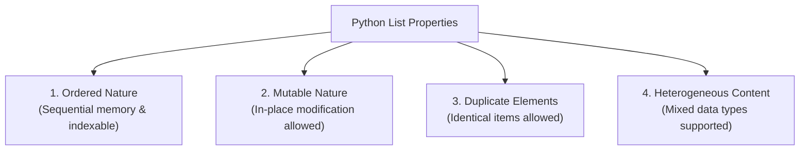
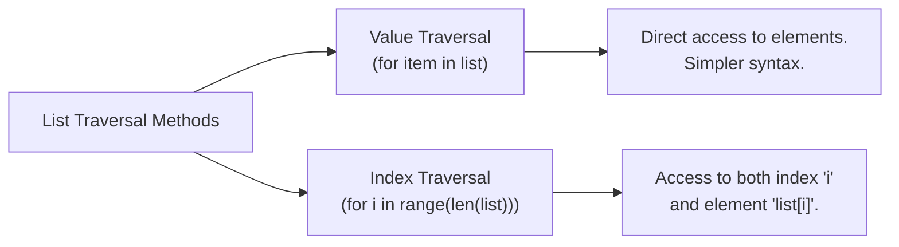

# Complete Python for AI & ML Part 2 (Intermediate to Advanced) — Part 02: Lists & List Operations

## Executive Overview (00:33:54 - 01:06:51)

* **Source**: [Watch on YouTube](https://www.youtube.com/watch?v=QR2TyeZRknw&t=124s)
* **Creator**: [[Not Your College]] (Mentor: Akarsh Vyas)
* **Part 2 Focus**: Deep dive into Python Lists—Core Characteristics (Ordered, Mutable, Heterogeneous, Duplicates), Indexing/Slicing, Memory Model, Traversal Techniques (Value vs. Index), and Core Mutation Methods (`append`, `insert`, `pop`, `remove`, `clear`, `sort`).

Lists serve as the foundational linear data structure in Python, forming the basis for higher-level numerical arrays and data frames used in Machine Learning workflows.

---

## 1. Core Characteristics of Python Lists (00:33:54 - 00:43:28)

### 1.1 Definition & Syntax (00:33:59)

A **List** is a mutable, ordered collection of items enclosed within square brackets `[]` and separated by commas.

```python
# List Definition
my_list = [12, 23, 45, 67, 89]
print(type(my_list))  # Output: <class 'list'>
```

### 1.2 The Four Key Properties of Lists



#### 1. Ordered Nature & Memory Model (00:34:46 - 00:37:16)
Elements in a list are stored sequentially in memory, with each element assigned a fixed, zero-based position index.

```python
# Positional Indexing Scheme
# Element:    12    23    45    67    89
# Positive:    0     1     2     3     4
# Negative:   -5    -4    -3    -2    -1

l = [12, 23, 45, 67, 89]
print(l[1])   # Output: 23 (Positive indexing)
print(l[-1])  # Output: 89 (Negative indexing)
```

#### 2. Mutable Nature vs. Immutable Strings (00:37:16 - 00:41:07)
* **Mutability**: Lists allow modifying individual elements in-place without creating a new object in memory.
* **String Immutability Comparison**: Strings do not support item assignment and raise a `TypeError` if indexed modification is attempted.

```python
# STRING IMMUTABILITY (Raises TypeError)
s = "HELQL"
# s[-1] = "O"  # TypeError: 'str' object does not support item assignment

# LIST MUTABILITY (Allowed)
numbers = [10, 22, 30, 40, 50]
numbers[1] = 20  # Replaces 22 with 20
print(numbers)   # Output: [10, 20, 30, 40, 50]
```

#### 3. Duplicate Elements Allowed (00:41:07 - 00:42:33)
Unlike sets or dictionary keys, lists accept identical elements at multiple index positions.

```python
duplicates_list = [1, 2, 2, 3, 3, 3, 1]
print(duplicates_list)  # Output: [1, 2, 2, 3, 3, 3, 1]
```

#### 4. Heterogeneous Data Storage (00:54:57 - 00:55:50)
While lower-level arrays (e.g., C arrays) require **homogeneous** data types (all elements must be of the same type), Python lists support **heterogeneous** data types within a single instance:

```python
mixed_list = [10, 12.5, True, "Hello", print]  # Accepts int, float, bool, str, function
```

---

## 2. List Traversal Techniques (00:43:28 - 00:52:59)

Iterating through a list can be performed via two main paradigms:



### 2.1 Traversal by Value (00:43:52 - 00:46:00)

Iterates directly over the items stored in the list. Useful when index positions are not required for logic execution.

```python
a = [10, 20, 30, 40, 50]

for item in a:
    print(item)
# Output: 10, 20, 30, 40, 50 (on separate lines)
```

### 2.2 Traversal by Index (00:46:00 - 00:51:46)

Uses `range(len(list))` to generate integer indices dynamically. This pattern is essential when algorithms require reading or modifying indices alongside element values.

```python
a = [10, 20, 30, 40, 50]

# Dynamic bounds: len(a) yields 5; range(0, 5) produces indices 0, 1, 2, 3, 4
for i in range(len(a)):
    print(f"Index {i} holds value {a[i]}")

# Output:
# Index 0 holds value 10
# Index 1 holds value 20
# Index 2 holds value 30
# Index 3 holds value 40
# Index 4 holds value 50
```

---

## 3. List Mutation Methods & Operations (00:52:59 - 01:06:51)

Python's built-in `list` class includes public methods for adding, inserting, deleting, and reordering elements.

### 3.1 Adding & Inserting Elements (00:53:39 - 00:58:20)

| Method | Syntax | Behavior | Complexity / Position |
| :--- | :--- | :--- | :--- |
| `append()` | `lst.append(item)` | Appends `item` to the very end of the list. Modifies list in-place. | $O(1)$ amortized; End of list. |
| `insert()` | `lst.insert(index, item)` | Inserts `item` at target `index`, shifting existing elements to the right. | $O(n)$; Arbitrary index position. |

```python
numbers = [10, 20, 40, 50]

# 1. Append (Adds to the end)
numbers.append(60)
print(numbers)  # Output: [10, 20, 40, 50, 60]

# 2. Insert (Adds at index 2, inserting 30 between 20 and 40)
numbers.insert(2, 30)
print(numbers)  # Output: [10, 20, 30, 40, 50, 60]
```

### 3.2 Functions vs. Methods: Understanding Return Values (00:59:40 - 01:02:19)

A key programming concept is distinguishing between functions that perform side-effects (e.g., `print()`) versus functions/methods that **return** a value.

```python
# Side effect vs Return value
def get_greeting():
    return "How are you?"

result = get_greeting()  # Value captured in 'result' variable
print(result)            # Output: How are you?
```

### 3.3 Deleting & Removing Elements (00:58:20 - 01:07:36)

| Method | Syntax | Return Value | Behavior |
| :--- | :--- | :--- | :--- |
| `pop()` | `lst.pop([index])` | **Returns removed item** | Removes item at `index` (default: `-1` / last item). Raises `IndexError` if list is empty. |
| `remove()` | `lst.remove(value)` | Returns `None` | Removes the **first occurrence** of `value`. Raises `ValueError` if `value` is not found. |
| `clear()` | `lst.clear()` | Returns `None` | Removes all elements, leaving an empty list `[]`. |

```python
data = [10, 20, 30, 40, 55, 50]

# 1. pop() - Default removes last element (-1) and returns it
popped_item = data.pop()
print(popped_item)  # Output: 50
print(data)         # Output: [10, 20, 30, 40, 55]

# 2. pop(index) - Removes element at specified index 4 (55)
popped_specific = data.pop(4)
print(popped_specific)  # Output: 55
print(data)              # Output: [10, 20, 30, 40]

# 3. remove(value) - Removes first occurrence of value
sample = [10, 55, 20, 55, 30]
sample.remove(55)
print(sample)  # Output: [10, 20, 55, 30] (Second 55 remains)

# 4. clear() - Empties the list completely
sample.clear()
print(sample)  # Output: []
```

### 3.4 Sorting Elements Preview (01:07:12 - 01:08:38)

* `sort()`: Reorders list elements in-place in ascending order (default). Modifies the original list object and returns `None`.

```python
unsorted = [29, 45, 67, 12, 90, 34]
unsorted.sort()
print(unsorted)  # Output: [12, 29, 34, 45, 67, 90]
```

---

## 4. Summary Comparison: List Mutation Methods

| Method Name | Operates On | In-Place Modification? | Return Value | Common Error Trigger |
| :--- | :--- | :--- | :--- | :--- |
| `append(x)` | Value | Yes | `None` | Passing multiple arguments directly. |
| `insert(i, x)` | Index & Value | Yes | `None` | Passing invalid index types. |
| `pop(i)` | Index (Optional) | Yes | Removed Element | `IndexError` if index out of bounds or list empty. |
| `remove(x)` | Value | Yes | `None` | `ValueError` if value not found in list. |
| `clear()` | Entire List | Yes | `None` | None. |
| `sort()` | Entire List | Yes | `None` | Sorting incompatible types (e.g. `int` and `str`). |

---

## Key Terms & Vocabulary

* **List**: An ordered, mutable, heterogeneous collection sequence in Python.
* **Index**: A zero-based integer representing an element's position in a sequence.
* **Mutability**: The ability of an object state to be modified after creation.
* **Heterogeneous**: Containing items of different data types.
* **In-Place Modification**: Modifying an object directly in memory without creating a new copy.
* **Traversal**: Iterating sequentially through each element in a collection.
* **Pop**: An operation that removes and yields an element from a data structure.

---

## Next Topics in Part 03
* Advanced List Methods (`extend`, `index`, `count`, `reverse`, `copy`).
* List Practice Problems & Algorithmic Patterns.
* Transition to **Tuples in Python** (`01:42:00`).
