Complexity analysis is the foundational skill that separates coders from engineers. For machine learning, where you might be pre-processing 100 million text records or scaling a deep learning pipeline, choosing an $O(n^2)$ algorithm instead of an $O(n \log n)$ one could mean the difference between a task finishing in 2 minutes versus 3.1 years. It allows us to mathematically predict how an algorithm's runtime and memory usage will scale as the input size $n$ grows, stripping away hardware specifics and focusing purely on the algorithm's efficiency.

## 1. Why Complexity Matters

In the real world, algorithms don't run on infinite computing resources.
- **Interview Expectations**: Every single DSA interview will ask "What is the time and space complexity of your solution?" If you can't answer it, you fail. Period.
- **ML Model Scaling**: 🤖 **ML Connection:** When training a KNN model, computing distances between the query point and all training points is $O(n \cdot d)$. If $n$ (samples) and $d$ (features) are huge, inference becomes impossibly slow without optimizations like KD-Trees.

## Growth Rates Diagram

```mermaid
graph TD
    %% Define styles
    classDef excellent fill:#90EE90,stroke:#333,stroke-width:1px;
    classDef good fill:#ADD8E6,stroke:#333,stroke-width:1px;
    classDef fair fill:#FFFFE0,stroke:#333,stroke-width:1px;
    classDef bad fill:#FFB6C1,stroke:#333,stroke-width:1px;
    classDef terrible fill:#FF7F7F,stroke:#333,stroke-width:1px;

    O1["O(1) Constant"]:::excellent
    Olog["O(log n) Logarithmic"]:::excellent
    On["O(n) Linear"]:::good
    Onlogn["O(n log n) Linearithmic"]:::fair
    On2["O(n^2) Quadratic"]:::bad
    O2n["O(2^n) Exponential"]:::terrible
    Onfac["O(n!) Factorial"]:::terrible
```



## 2. Big O Notation Classes

Big O notation describes the upper bound of the growth rate. Let's look at the standard classes.

### O(1) Constant Time
Execution time is independent of input size.

```python
def get_first_element(arr):
    # Independent of the array size. Takes 1 operation.
    if not arr: return None
    return arr[0]

# Output: 10
print(get_first_element([10, 20, 30, 40, 50]))
```

### O(log n) Logarithmic Time
Execution time grows logarithmically. At each step, the input is halved (e.g., Binary Search).

```python
def binary_search(arr, target):
    left, right = 0, len(arr) - 1
    while left <= right:
        mid = left + (right - left) // 2
        if arr[mid] == target:
            return mid
        elif arr[mid] < target:
            left = mid + 1
        else:
            right = mid - 1
    return -1

# Output: 2
print(binary_search([1, 3, 5, 7, 9], 5)) 
```

### O(n) Linear Time
Execution time grows directly proportional to input size.

```python
def find_max(arr):
    if not arr: return None
    max_val = arr[0]
    for num in arr: # Loops exactly 'n' times
        if num > max_val:
            max_val = num
    return max_val

# Output: 9
print(find_max([1, 3, 5, 9, 7]))
```

### O(n log n) Linearithmic Time
Usually seen in efficient sorting algorithms like Merge Sort or Python's built-in `Timsort`.

```python
def sort_array(arr):
    # Built-in sort uses Timsort which is O(n log n)
    arr.sort() 
    return arr

# Output: [1, 2, 3, 5, 8]
print(sort_array([3, 1, 8, 5, 2]))
```

### O(n²) Quadratic Time
Typically nested loops iterating over the same data.

```python
def print_all_pairs(arr):
    pairs = []
    # Outer loop runs n times, inner loop runs n times -> n * n = n^2
    for i in range(len(arr)):
        for j in range(len(arr)):
            pairs.append((arr[i], arr[j]))
    return pairs

# Output: [(1, 1), (1, 2), (2, 1), (2, 2)]
print(print_all_pairs([1, 2]))
```

### O(2ⁿ) Exponential Time
Often seen in recursive algorithms that branch multiple times per step (e.g., naive Fibonacci).

```python
def fibonacci(n):
    # Each call branches into two more calls
    if n <= 1:
        return n
    return fibonacci(n-1) + fibonacci(n-2)

# Output: 8
print(fibonacci(6)) 
```

### O(n!) Factorial Time
Generating all permutations of a sequence. Extremely slow.

```python
def get_permutations(arr):
    if len(arr) == 0:
        return []
    if len(arr) == 1:
        return [arr]
    
    perms = []
    for i in range(len(arr)):
        curr = arr[i]
        rem = arr[:i] + arr[i+1:]
        for p in get_permutations(rem):
            perms.append([curr] + p)
    return perms

# Output: [[1, 2], [2, 1]]
print(get_permutations([1, 2]))
```

## 3. How to Calculate Big O

Rules of thumb:
1. **Drop Constants**: $O(2n) \rightarrow O(n)$. We only care about how it scales.
2. **Drop Lower Order Terms**: $O(n^2 + n + 1) \rightarrow O(n^2)$. The fastest growing term dominates.

```python
def calculate_complexity(arr):
    n = len(arr)
    
    # 1. Constant time operation: O(1)
    a = 1 + 2
    
    # 2. Linear loop: O(n)
    for i in range(n):
        print(i, end=" ")
        
    # 3. Another linear loop: O(n)
    for j in range(n):
        print(j, end=" ")
        
    # 4. Quadratic loop: O(n^2)
    for i in range(n):
        for j in range(n):
            pass # some constant operation

    # Total complexity: O(1) + O(n) + O(n) + O(n^2) 
    # = O(2n + n^2)
    # Drop constants and lower terms -> O(n^2)
```

## 4. Space Complexity

Space complexity measures total memory an algorithm uses as $n$ grows. It consists of:
- **Input Space**: Space to hold the input.
- **Auxiliary Space**: Extra space used by the algorithm (variables, data structures, recursion stack).
*Note: In interviews, "space complexity" usually implies "auxiliary space".*

🎯 **Interview Tip:** In-place algorithms (like reversing an array with two pointers) have $O(1)$ auxiliary space.

```python
def create_matrix(n):
    # O(n^2) space complexity because we allocate an n x n matrix
    matrix = [[0] * n for _ in range(n)]
    return matrix

def sum_array(arr):
    # O(1) auxiliary space, only uses one variable
    total = 0
    for num in arr:
        total += num
    return total

def recursive_sum(arr, index=0):
    # O(n) space complexity due to the Call Stack!
    # n recursive frames are held in memory simultaneously.
    if index == len(arr):
        return 0
    return arr[index] + recursive_sum(arr, index + 1)
```

## 5. Common Patterns

- Single loop $\rightarrow$ $O(n)$
- Nested loops (over same array) $\rightarrow$ $O(n^2)$
- Loops with `i *= 2` or `i //= 2` (halving/doubling step) $\rightarrow$ $O(\log n)$
- Sorting then Searching $\rightarrow$ $O(n \log n) + O(\log n) \rightarrow O(n \log n)$
- Combinations/Subsets $\rightarrow$ $O(2^n)$
- Permutations $\rightarrow$ $O(n!)$

## 6. Amortized Analysis

Sometimes, an operation is usually fast but occasionally very slow. 

For Python lists (dynamic arrays), `append()` is generally $O(1)$. But when the underlying array fills up, Python creates a new array of double the size and copies all $n$ elements over. That single operation is $O(n)$. However, because we only resize rarely, the *average* time per append over many operations is $O(1)$. This is **Amortized $O(1)$**.

```python
import sys

def show_dynamic_resizing():
    arr = []
    prev_size = sys.getsizeof(arr)
    print(f"Empty array size: {prev_size} bytes")
    
    for i in range(20):
        arr.append(i)
        curr_size = sys.getsizeof(arr)
        if curr_size != prev_size:
            print(f"Capacity grew at {i} elements! New size: {curr_size} bytes")
            prev_size = curr_size

show_dynamic_resizing()
```

## 7. Best, Average, and Worst Case

Algorithms perform differently based on the input structure.

```python
def linear_search(arr, target):
    for i in range(len(arr)):
        if arr[i] == target:
            return i
    return -1

# Best case: O(1) - target is the first element
# Worst case: O(n) - target is the last element or not in array
# Average case: O(n) - typically have to search half the array
```

QuickSort is a famous example:
- **Best/Average**: $O(n \log n)$ - pivots divide array roughly in half.
- **Worst**: $O(n^2)$ - already sorted array and we pick the last element as pivot.

## 8. Complexity of Python Operations

Knowing Python's internal complexities is mandatory.

| Operation | List | Set / Dict |
| :--- | :--- | :--- |
| **Append/Insert at end** | $O(1)$ amortized | $O(1)$ |
| **Insert/Delete at middle** | $O(n)$ | N/A |
| **Lookup `val in coll`** | $O(n)$ | $O(1)$ average |
| **Index `coll[i]`** | $O(1)$ | $O(1)$ |
| **Sort** | $O(n \log n)$ | N/A |
| **Length `len(coll)`** | $O(1)$ | $O(1)$ |

🤖 **ML Connection:** When filtering a massive dataset against a list of stop-words, ALWAYS convert the stop-words to a `set` first. Changing `if word in stop_list` to `if word in stop_set` drops your lookup time from $O(n)$ to $O(1)$, which can turn a 24-hour job into a 2-minute job.

## 9. How to Estimate Time Limits in Competitive/Interview Programming

Most modern CPUs perform around $10^8$ operations per second.
If a coding platform gives you a time limit of 1 second, you can work backwards from the input constraints:

- $N \le 10$: $O(n!)$ or $O(2^n)$
- $N \le 20$: $O(2^n)$
- $N \le 100$: $O(n^4)$
- $N \le 500$: $O(n^3)$
- $N \le 10^4$: $O(n^2)$
- $N \le 10^5$: $O(n \log n)$  <-- **EXTREMELY COMMON, implies sorting!**
- $N \le 10^7$: $O(n)$
- $N > 10^8$: $O(\log n)$ or $O(1)$ <-- **Implies Binary Search or Math trick!**

## Practice Problems

Determine the Time and Space Complexity for each function.

```python
# 1. 
def p1(arr):
    for i in range(len(arr)):
        for j in range(1000):
            print(i, j)

# 2.
def p2(arr1, arr2):
    for i in arr1:
        print(i)
    for j in arr2:
        print(j)

# 3.
def p3(n):
    i = 1
    while i < n:
        print(i)
        i *= 2

# 4.
def p4(n):
    for i in range(n):
        j = 1
        while j < n:
            print(i, j)
            j *= 2

# 5.
def p5(arr):
    if len(arr) <= 1:
        return arr
    mid = len(arr) // 2
    left = p5(arr[:mid])
    right = p5(arr[mid:])
    return left + right

# 6.
def p6(arr):
    seen = set()
    for num in arr:
        if num in seen:
            return True
        seen.add(num)
    return False

# 7.
def p7(n):
    return n * (n + 1) // 2

# 8.
def p8(arr):
    for i in range(len(arr)):
        for j in range(i, len(arr)):
            print(arr[i], arr[j])

# 9.
def p9(n):
    for i in range(n):
        for j in range(i):
            for k in range(100):
                print(i, j, k)

# 10.
def p10(text):
    return text[::-1]
```

### Practice Solutions
1. Time: $O(N)$, Space: $O(1)$. The inner loop runs a constant 1000 times.
2. Time: $O(N + M)$, Space: $O(1)$. Where N and M are lengths of arr1 and arr2.
3. Time: $O(\log N)$, Space: $O(1)$. `i` doubles each step.
4. Time: $O(N \log N)$, Space: $O(1)$. Outer loop N, inner loop log N.
5. Time: $O(N \log N)$, Space: $O(N \log N)$. This is slicing overhead + recursion tree depth. (Slicing is $O(K)$, creating copies).
6. Time: $O(N)$, Space: $O(N)$. Iterating once, storing up to N elements in a set.
7. Time: $O(1)$, Space: $O(1)$. Math formula.
8. Time: $O(N^2)$, Space: $O(1)$. The inner loop runs $N, N-1, N-2...$ times, which sums to $N(N+1)/2$, which is $O(N^2)$.
9. Time: $O(N^2)$, Space: $O(1)$. Similar to P8, the constant 100 is dropped.
10. Time: $O(N)$, Space: $O(N)$. Slicing creates a new string of length N in memory.

---
**Related Notes:**
- [[DSA Arrays and Strings]]
- [[DSA Sorting and Searching]]
- [[Python Data Structures Builtins]]
