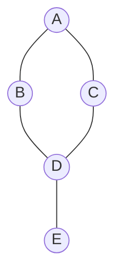

Graphs model relationships. Whether you're mapping social networks, designing recommendation systems, parsing dependency trees, or building deep neural networks (which are literally computational graphs), understanding graph algorithms is essential. In ML engineering, graph representations form the backbone of Graph Neural Networks (GNNs), knowledge graphs, and complex data modeling pipelines where relational inductive biases are crucial.

## 1. Graph Basics

A graph $G = (V, E)$ consists of Vertices (nodes) and Edges (connections).

*   **Directed vs Undirected:** Edges have a direction (A $\rightarrow$ B) vs bidirectional (A -- B).
*   **Weighted vs Unweighted:** Edges have a cost/weight associated with them.
*   **Adjacency List vs Matrix:** How we store graphs in memory. Lists are better for sparse graphs ($|E| \ll |V|^2$), matrices for dense graphs.
*   **Density:** Ratio of edges to maximum possible edges. Most real-world graphs (like social networks) are sparse.



## 2. Graph Representation in Python

For ML interviews, 99% of the time you'll use an **Adjacency List** implemented as a `collections.defaultdict(list)`.

```python
import collections

# 1. Adjacency List (dict of lists) - BEST FOR INTERVIEWS
# Space: O(V + E)
graph_list = collections.defaultdict(list)
edges = [[0, 1], [0, 2], [1, 2], [2, 0], [2, 3], [3, 3]]

for u, v in edges:
    graph_list[u].append(v)
    # If undirected, also add: graph_list[v].append(u)

print("Adjacency List:", dict(graph_list))
# Output: {0: [1, 2], 1: [2], 2: [0, 3], 3: [3]}

# 2. Adjacency Matrix (2D list)
# Space: O(V^2) - use only if V is very small (e.g., < 1000)
n_vertices = 4
graph_matrix = [[0] * n_vertices for _ in range(n_vertices)]

for u, v in edges:
    graph_matrix[u][v] = 1 # or weight

print("Adjacency Matrix:")
for row in graph_matrix:
    print(row)
# Output:
# [0, 1, 1, 0]
# [0, 0, 1, 0]
# [1, 0, 0, 1]
# [0, 0, 0, 1]
```

> 🎯 **Interview Tip:** Always clarify if the graph is directed/undirected and what the maximum number of vertices is to choose the right representation.

## 3. BFS (Breadth-First Search)

BFS explores the graph layer by layer, moving outward from the starting node. It's the go-to algorithm for **shortest path in unweighted graphs**.

```python
from collections import deque

def bfs_traversal(graph, start_node):
    """
    Time Complexity: O(V + E)
    Space Complexity: O(V)
    """
    visited = set([start_node])
    queue = deque([start_node])
    result = []
    
    while queue:
        node = queue.popleft()
        result.append(node)
        
        for neighbor in graph[node]:
            if neighbor not in visited:
                visited.add(neighbor)
                queue.append(neighbor)
                
    return result

# Example Usage
graph = {
    'A': ['B', 'C'],
    'B': ['A', 'D', 'E'],
    'C': ['A', 'F'],
    'D': ['B'],
    'E': ['B', 'F'],
    'F': ['C', 'E']
}
print(f"BFS Traversal: {bfs_traversal(graph, 'A')}")
# Output: BFS Traversal: ['A', 'B', 'C', 'D', 'E', 'F']
```

### Shortest Path / Level Order (e.g., Rotten Oranges)
When you need distance, process level-by-level using `for _ in range(len(queue)):`.

```python
def shortest_path_unweighted(graph, start, target):
    queue = deque([(start, 0)]) # (node, distance)
    visited = {start}
    
    while queue:
        node, dist = queue.popleft()
        
        if node == target:
            return dist
            
        for neighbor in graph[node]:
            if neighbor not in visited:
                visited.add(neighbor)
                queue.append((neighbor, dist + 1))
                
    return -1
```

## 4. DFS (Depth-First Search)

DFS dives deep into a path before backtracking. Excellent for path finding, topological sort, and cycle detection.

```python
def dfs_recursive(graph, node, visited, result):
    """
    Time: O(V + E), Space: O(V) for call stack
    """
    if node in visited:
        return
        
    visited.add(node)
    result.append(node)
    
    for neighbor in graph[node]:
        dfs_recursive(graph, neighbor, visited, result)

# Wrapper
visited_dfs = set()
result_dfs = []
dfs_recursive(graph, 'A', visited_dfs, result_dfs)
print(f"DFS Recursive: {result_dfs}")
# Output: DFS Recursive: ['A', 'B', 'D', 'E', 'F', 'C']

def dfs_iterative(graph, start):
    visited = set()
    stack = [start]
    result = []
    
    while stack:
        node = stack.pop() # LIFO
        if node not in visited:
            visited.add(node)
            result.append(node)
            # Add neighbors reversed to match recursive order
            for neighbor in reversed(graph[node]): 
                if neighbor not in visited:
                    stack.append(neighbor)
                    
    return result
```

### Cycle Detection
*   **Undirected Graph:** Keep track of the `parent` node. If you visit a node that is already visited AND is not the parent, there's a cycle.
*   **Directed Graph:** Keep track of the `path` (or nodes in current recursion stack). If you visit a node currently in the path, cycle exists!

## 5. Topological Sort

Used for ordering dependencies (e.g., compiling code, scheduling courses, creating computational graphs in ML frameworks like PyTorch).
Only works on **Directed Acyclic Graphs (DAGs)**.

### Kahn's Algorithm (BFS based)
Uses in-degrees (number of incoming edges).

```python
def topological_sort_kahn(num_nodes, edges):
    """
    Time: O(V + E), Space: O(V + E)
    """
    adj = collections.defaultdict(list)
    indegree = {i: 0 for i in range(num_nodes)}
    
    for u, v in edges: # u -> v
        adj[u].append(v)
        indegree[v] += 1
        
    # Queue starts with nodes having 0 dependencies
    queue = deque([node for node in indegree if indegree[node] == 0])
    topo_order = []
    
    while queue:
        node = queue.popleft()
        topo_order.append(node)
        
        for neighbor in adj[node]:
            indegree[neighbor] -= 1
            if indegree[neighbor] == 0:
                queue.append(neighbor)
                
    # If topological sort contains all nodes, it's a DAG. Else, there's a cycle.
    if len(topo_order) == num_nodes:
        return topo_order
    return [] # Cycle detected

print(f"Topo Sort: {topological_sort_kahn(4, [[1,0],[2,0],[3,1],[3,2]])}")
# Output: Topo Sort: [3, 1, 2, 0]
```

## 6. Shortest Path Algorithms

### Dijkstra's Algorithm
Finds shortest path from one node to all others in a **weighted graph with non-negative weights**.

```python
import heapq

def dijkstra(n, edges, start):
    """
    Time: O((V + E) log V), Space: O(V + E)
    edges: list of (u, v, weight)
    """
    graph = collections.defaultdict(list)
    for u, v, w in edges:
        graph[u].append((v, w))
        
    # Min-heap stores (distance, node)
    min_heap = [(0, start)]
    distances = {i: float('inf') for i in range(n)}
    distances[start] = 0
    
    while min_heap:
        current_dist, u = heapq.heappop(min_heap)
        
        # Optimization: ignore stale pairs in heap
        if current_dist > distances[u]:
            continue
            
        for v, weight in graph[u]:
            distance = current_dist + weight
            
            # Relaxation step
            if distance < distances[v]:
                distances[v] = distance
                heapq.heappush(min_heap, (distance, v))
                
    return distances

# Example
edges = [(0, 1, 4), (0, 2, 1), (2, 1, 2), (1, 3, 1), (2, 3, 5)]
print(f"Dijkstra shortest paths from 0: {dijkstra(4, edges, 0)}")
# Output: {0: 0, 1: 3, 2: 1, 3: 4}
```

> 🤖 **ML Connection:** Dijkstra is fundamental. Variations of shortest path are used in manifold learning algorithms like Isomap, which builds a neighborhood graph and computes shortest paths to estimate geodesic distances on a manifold.

## 7. Union-Find (Disjoint Set Union)

Incredibly elegant data structure for tracking connected components in undirected graphs. Essential for Kruskal's MST and cycle detection.
Always implement with **Path Compression** and **Union by Rank**.

```python
class UnionFind:
    def __init__(self, size):
        self.root = [i for i in range(size)]
        # Use rank to keep tree flat
        self.rank = [1] * size
        
    def find(self, x):
        """Finds root of x with Path Compression. Time: ~O(1)"""
        if x == self.root[x]:
            return x
        # Path compression: attach node directly to root
        self.root[x] = self.find(self.root[x])
        return self.root[x]
        
    def union(self, x, y):
        """Unites sets containing x and y. Returns False if already connected. Time: ~O(1)"""
        rootX = self.find(x)
        rootY = self.find(y)
        
        if rootX != rootY:
            if self.rank[rootX] > self.rank[rootY]:
                self.root[rootY] = rootX
            elif self.rank[rootX] < self.rank[rootY]:
                self.root[rootX] = rootY
            else:
                self.root[rootY] = rootX
                self.rank[rootX] += 1
            return True
        return False # Cycle detected if union called on edges of same component!

# Example: finding redundant connection (cycle)
uf = UnionFind(4)
edges = [[0, 1], [1, 2], [2, 3], [3, 0]]
for u, v in edges:
    if not uf.union(u, v):
        print(f"Cycle created by edge: {u}-{v}")
# Output: Cycle created by edge: 3-0
```

## 8. Common Interview Problems

Here's how to map standard problems to the core algorithms:

*   **Number of Islands (Grid BFS/DFS):** Treat grid cells as vertices, adjacent cells as edges. Find connected components.
*   **Course Schedule (I & II):** Classic Topological Sort on a DAG. Detect cycle vs return sorted order.
*   **Clone Graph:** Graph traversal (BFS/DFS) using a hash map to track `OriginalNode -> ClonedNode` to handle cycles.
*   **Network Delay Time:** Exactly Dijkstra's algorithm. Find max time to reach all nodes from start.
*   **Word Ladder:** Shortest path in unweighted graph = BFS.
*   **Graph Valid Tree:** An undirected graph is a valid tree if it has $N-1$ edges AND all nodes are fully connected (or no cycles). Use Union-Find or DFS.

## 9. Graphs in ML

Graphs are fundamental in modern Machine Learning:

1.  **Graph Neural Networks (GNNs):** Standard NNs treat inputs as independent. GNNs operate on graph structure (like molecular data or social networks). They update node embeddings by aggregating features from neighbors (essentially a differentiable BFS!).
2.  **Knowledge Graphs:** Massive graphs representing facts (Node A "is a" Node B). Used in RAG systems, recommendation engines, and LLM reasoning frameworks.
3.  **Computational Graphs:** Deep learning frameworks like PyTorch and TensorFlow build dynamic or static directed acyclic graphs representing mathematical operations to perform automatic differentiation (backprop).

---

## Practice Problems

1. LeetCode 200: Number of Islands
2. LeetCode 207: Course Schedule
3. LeetCode 133: Clone Graph
4. LeetCode 417: Pacific Atlantic Water Flow
5. LeetCode 127: Word Ladder
6. LeetCode 130: Surrounded Regions
7. LeetCode 261: Graph Valid Tree
8. LeetCode 743: Network Delay Time
9. LeetCode 684: Redundant Connection (Union Find)
10. LeetCode 323: Number of Connected Components in an Undirected Graph

Related Notes: `[[DSA Trees]]`, `[[DSA Hashing]]`, `[[DSA Recursion and Backtracking]]`
