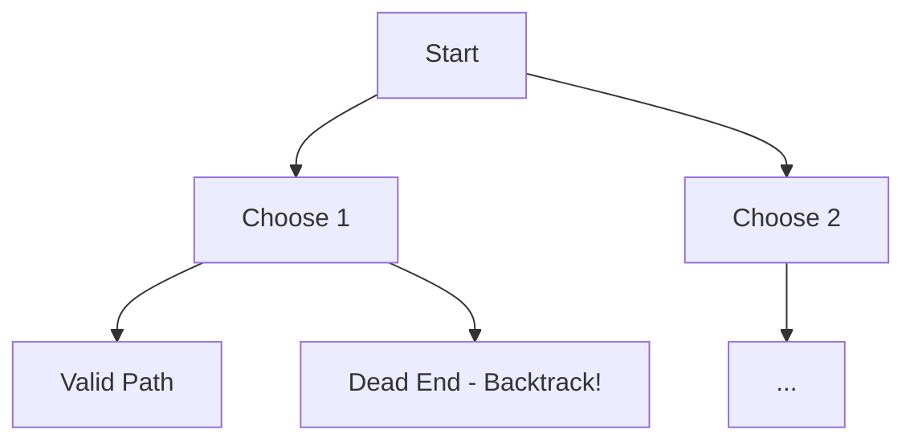

Recursion and backtracking are fundamental for understanding trees, graphs, dynamic programming, and complex search spaces. In machine learning engineering, many algorithms (like decision tree induction, parsing syntactical structures for NLP, or exploring hyperparameters) are inherently recursive. Mastering the call stack and how to prune search spaces efficiently is crucial for writing optimal code.

## 1. Recursion Mastery

Recursion is simply a function calling itself. To understand recursion, you must trust the **recursive leap of faith**: assume the recursive call works for smaller inputs, and use it to build the solution for the current input. 

Every recursive function needs:
1. **Base Case**: When to stop (prevents stack overflow).
2. **Recursive Step**: Calling the function with a smaller/simpler input.

🤖 **ML Connection**: Many hierarchical clustering and decision tree algorithms are naturally implemented using recursion.

```python
def explain_recursion(n):
    # 1. Base Case
    if n <= 0:
        print("Base case reached!")
        return
    
    # 2. Pre-recursion work (Top-down)
    print(f"Entering level {n}")
    
    # 3. Recursive Call
    explain_recursion(n - 1)
    
    # 4. Post-recursion work (Bottom-up, unraveling the stack)
    print(f"Exiting level {n}")

# Output:
# Entering level 3
# Entering level 2
# Entering level 1
# Base case reached!
# Exiting level 1
# Exiting level 2
# Exiting level 3
explain_recursion(3)
```

## 2. Recursion Patterns

Here are essential patterns you must recognize.

### Factorial and Fibonacci

```python
def factorial(n):
    if n == 0 or n == 1:
        return 1
    return n * factorial(n - 1)

def fibonacci(n):
    if n <= 1:
        return n
    return fibonacci(n - 1) + fibonacci(n - 2)

print(factorial(5))  # Output: 120
print(fibonacci(6))  # Output: 8
```

### Power Function

Optimized power using divide and conquer ($O(\log N)$).

```python
def my_pow(x, n):
    if n == 0:
        return 1
    if n < 0:
        return 1 / my_pow(x, -n)
    
    half = my_pow(x, n // 2)
    if n % 2 == 0:
        return half * half
    else:
        return half * half * x

print(my_pow(2, 10))  # Output: 1024
```

### Print 1 to N and N to 1

Notice how placing the `print` before or after the recursive call changes the order!

```python
def print_1_to_n(n):
    if n == 0: return
    print_1_to_n(n - 1)
    print(n, end=" ")

def print_n_to_1(n):
    if n == 0: return
    print(n, end=" ")
    print_n_to_1(n - 1)

print_1_to_n(3) # Output: 1 2 3 
print("")
print_n_to_1(3) # Output: 3 2 1
```

### Sum of Digits, Reverse String, Palindrome

```python
def sum_of_digits(n):
    if n == 0: return 0
    return (n % 10) + sum_of_digits(n // 10)

def reverse_string(s):
    if len(s) <= 1: return s
    return reverse_string(s[1:]) + s[0]

def is_palindrome(s):
    if len(s) <= 1: return True
    if s[0] != s[-1]: return False
    return is_palindrome(s[1:-1])

print(sum_of_digits(123))    # Output: 6
print(reverse_string("ml"))  # Output: lm
print(is_palindrome("racecar")) # Output: True
```

## 3. Memoization

Recursion can lead to overlapping subproblems (e.g., calculating `fibonacci(3)` multiple times). **Memoization** stores results to avoid redundant work, serving as a gateway to Dynamic Programming.

🎯 **Interview Tip**: In Python, you can use `@functools.lru_cache` or `@functools.cache` (Python 3.9+) to instantly memoize any recursive function.

```python
from functools import lru_cache

# Without cache, fib(40) would take noticeable time.
@lru_cache(maxsize=None)
def fib_memo(n):
    if n <= 1:
        return n
    return fib_memo(n - 1) + fib_memo(n - 2)

print(fib_memo(50)) # Output: 12586269025

# Manual memoization pattern:
def fib_manual(n, memo=None):
    if memo is None:
        memo = {}
    if n in memo:
        return memo[n]
    if n <= 1:
        return n
    memo[n] = fib_manual(n - 1, memo) + fib_manual(n - 2, memo)
    return memo[n]
```

## 4. Divide and Conquer

Divide a large problem into smaller independent subproblems, solve recursively, and combine.

### Merge Sort
```python
def merge_sort(arr):
    if len(arr) <= 1: return arr
    
    mid = len(arr) // 2
    left = merge_sort(arr[:mid])
    right = merge_sort(arr[mid:])
    
    return merge(left, right)

def merge(left, right):
    res = []
    i = j = 0
    while i < len(left) and j < len(right):
        if left[i] < right[j]:
            res.append(left[i])
            i += 1
        else:
            res.append(right[j])
            j += 1
    res.extend(left[i:])
    res.extend(right[j:])
    return res

print(merge_sort([3, 1, 4, 1, 5, 9])) # Output: [1, 1, 3, 4, 5, 9]
```

### Quick Sort
```python
def quick_sort(arr):
    if len(arr) <= 1: return arr
    pivot = arr[len(arr) // 2]
    left = [x for x in arr if x < pivot]
    middle = [x for x in arr if x == pivot]
    right = [x for x in arr if x > pivot]
    return quick_sort(left) + middle + quick_sort(right)
```

### Binary Search (Recursive)
```python
def binary_search(arr, target, low, high):
    if low > high:
        return -1
    mid = (low + high) // 2
    if arr[mid] == target:
        return mid
    elif arr[mid] > target:
        return binary_search(arr, target, low, mid - 1)
    else:
        return binary_search(arr, target, mid + 1, high)
```

## 5. Backtracking Concept

Backtracking is a systematic way to iterate through all possible configurations of a search space. We build solutions incrementally and abandon (prune) a path as soon as we realize it cannot lead to a valid solution.

### State Space Tree
A tree representing all possible states. Backtracking explores this tree using Depth-First Search (DFS).



## 6. Backtracking Problems

### Generate All Subsets (Power Set)
Generate all subsets of an array. Each element has two choices: include it or exclude it.

```python
def subsets(nums):
    res = []
    
    def backtrack(i, path):
        if i == len(nums):
            res.append(path[:]) # append a copy
            return
        
        # Include nums[i]
        path.append(nums[i])
        backtrack(i + 1, path)
        path.pop() # Backtrack
        
        # Exclude nums[i]
        backtrack(i + 1, path)
        
    backtrack(0, [])
    return res

print(subsets([1, 2])) 
# Output: [[1, 2], [1], [2], []]
```

### Generate All Permutations
```python
def permute(nums):
    res = []
    def backtrack(path, remaining):
        if not remaining:
            res.append(path[:])
            return
        
        for i in range(len(remaining)):
            path.append(remaining[i])
            # Pass remaining without current element
            backtrack(path, remaining[:i] + remaining[i+1:])
            path.pop()
            
    backtrack([], nums)
    return res

print(permute([1,2,3]))
```

### Combination Sum

```python
def combination_sum(candidates, target):
    res = []
    
    def backtrack(i, current_sum, path):
        if current_sum == target:
            res.append(path[:])
            return
        if i >= len(candidates) or current_sum > target:
            return
        
        # Include candidates[i] (can reuse, so don't increment i)
        path.append(candidates[i])
        backtrack(i, current_sum + candidates[i], path)
        path.pop()
        
        # Skip candidates[i]
        backtrack(i + 1, current_sum, path)
        
    backtrack(0, 0, [])
    return res
```

### N-Queens Problem
Place N queens on an NxN chessboard so that no two attack each other.

```python
def solveNQueens(n):
    col = set()
    posDiag = set() # (r + c)
    negDiag = set() # (r - c)
    res = []
    board = [["."] * n for _ in range(n)]
    
    def backtrack(r):
        if r == n:
            res.append(["".join(row) for row in board])
            return
        
        for c in range(n):
            if c in col or (r + c) in posDiag or (r - c) in negDiag:
                continue
                
            col.add(c)
            posDiag.add(r + c)
            negDiag.add(r - c)
            board[r][c] = "Q"
            
            backtrack(r + 1)
            
            col.remove(c)
            posDiag.remove(r + c)
            negDiag.remove(r - c)
            board[r][c] = "."
            
    backtrack(0)
    return res
```

### Word Search

```python
def exist(board, word):
    ROWS, COLS = len(board), len(board[0])
    path = set()
    
    def dfs(r, c, i):
        if i == len(word):
            return True
        if (r < 0 or c < 0 or r >= ROWS or c >= COLS or 
            word[i] != board[r][c] or (r, c) in path):
            return False
            
        path.add((r, c))
        res = (dfs(r+1, c, i+1) or
               dfs(r-1, c, i+1) or
               dfs(r, c+1, i+1) or
               dfs(r, c-1, i+1))
        path.remove((r, c))
        return res
        
    for r in range(ROWS):
        for c in range(COLS):
            if dfs(r, c, 0): return True
    return False
```

### Letter Combinations of a Phone Number
```python
def letterCombinations(digits):
    if not digits: return []
    phone = {"2":"abc", "3":"def", "4":"ghi", "5":"jkl", 
             "6":"mno", "7":"pqrs", "8":"tuv", "9":"wxyz"}
    res = []
    
    def backtrack(i, curStr):
        if len(curStr) == len(digits):
            res.append(curStr)
            return
        for c in phone[digits[i]]:
            backtrack(i + 1, curStr + c)
            
    backtrack(0, "")
    return res
```

## 7. Backtracking Template

🎯 **Interview Tip**: Memorize this structure. 90% of backtracking problems fall into this template.

```python
def solve(params):
    res = []
    
    def backtrack(state, choices):
        if is_goal_state(state):
            res.append(state[:]) # Store copy of valid state
            return
        
        for choice in choices:
            if is_valid(choice):
                make_choice(state, choice)
                backtrack(state, new_choices)
                undo_choice(state, choice) # BACKTRACK
                
    backtrack(initial_state, initial_choices)
    return res
```

## 8. Recursion vs Iteration

| Feature | Recursion | Iteration |
| :--- | :--- | :--- |
| **Simplicity** | Clean, declarative, easier for trees/graphs. | Often requires manual stack for complex problems. |
| **Memory** | $O(N)$ stack memory overhead. | $O(1)$ memory usually. |
| **Speed** | Function call overhead. | Generally faster. |
| **When to use?** | DP (Top-down), Trees, DFS, Backtracking. | Simple loops, arrays, pointers, BFS. |

Any recursive solution can be converted to iterative using an explicit `Stack`. 

## 9. Practice Problems

1. Fibonacci Number (Iterative, Recursive, Memoized)
2. Pow(x, n)
3. Subsets II (Handling duplicates)
4. Permutations II
5. Combinations
6. Combination Sum II & III
7. Sudoku Solver
8. Palindrome Partitioning
9. Rat in a Maze (GfG)
10. Generate Parentheses

## Related Notes
- [[DSA Dynamic Programming]]
- [[DSA Sorting and Searching]]
- [[Python Functions Advanced]]
