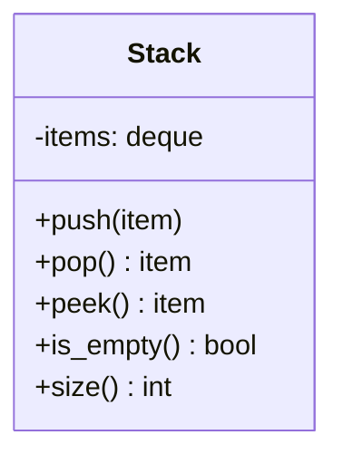
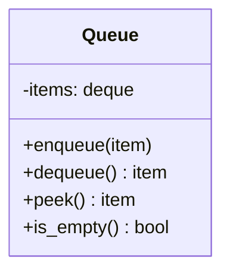

Stacks and Queues are fundamental linear data structures used extensively in algorithm design and machine learning systems. In ML engineering, stacks are critical for parsing computational graphs, evaluating mathematical expressions, and executing depth-first searches (DFS) in graph algorithms. Queues are essential for buffering data streams, task scheduling, level-order traversal (BFS), and managing inference requests in production endpoints. Mastering both generic implementations and specialized variants like Monotonic Stacks and Priority Queues will give you powerful tools for technical interviews and system building.

## 1. Stack Fundamentals
A Stack follows the **LIFO (Last-In, First-Out)** principle. Think of a stack of plates—you can only add or remove from the top.

In Python, you can use a built-in `list` as a stack because `append()` and `pop()` operations on the end of the list are $O(1)$. However, a better alternative is often `collections.deque`, which is optimized for fast appends and pops from both ends.

```python
from collections import deque

# Using a list as a stack
stack_list = []
stack_list.append('A')  # Push
stack_list.append('B')
print(stack_list.pop()) # Pop -> 'B'
# Output: B

# Using collections.deque (Preferred)
stack_deque = deque()
stack_deque.append(10)  # Push
stack_deque.append(20)
print(stack_deque[-1])  # Peek top element -> 20
print(stack_deque.pop()) # Pop -> 20
# Output: 20
# Output: 20
```

> 🎯 **Interview Tip:** Always mention `collections.deque` when asked about stacks in Python interviews. While lists work, deque proves you know Python's internal memory management (deque is a doubly-linked list of blocks, preventing $O(n)$ memory reallocation spikes).

## 2. Stack Implementation
Let's build a clean, object-oriented Stack class.



```python
from collections import deque

class Stack:
    def __init__(self):
        self.items = deque()
        
    def push(self, item):
        """O(1) - Add item to top."""
        self.items.append(item)
        
    def pop(self):
        """O(1) - Remove and return top item."""
        if self.is_empty():
            raise IndexError("pop from empty stack")
        return self.items.pop()
        
    def peek(self):
        """O(1) - Return top item without removing."""
        if self.is_empty():
            raise IndexError("peek from empty stack")
        return self.items[-1]
        
    def is_empty(self):
        """O(1) - Check if stack is empty."""
        return len(self.items) == 0
        
    def size(self):
        """O(1) - Get number of items."""
        return len(self.items)

# Usage
s = Stack()
s.push(1)
s.push(2)
print(f"Top is: {s.peek()}, Size is: {s.size()}")
print(f"Popped: {s.pop()}")
# Output: Top is: 2, Size is: 2
# Output: Popped: 2
```

## 3. Stack Applications

### Balanced Parentheses
A classic stack use case. Push opening brackets, and when encountering a closing bracket, verify it matches the top of the stack.

```python
def is_balanced(s: str) -> bool:
    stack = []
    mapping = {")": "(", "}": "{", "]": "["}
    
    for char in s:
        if char in mapping.values():
            stack.append(char)
        elif char in mapping.keys():
            if not stack or stack.pop() != mapping[char]:
                return False
    return len(stack) == 0

print(is_balanced("{[()]}"))  # Output: True
print(is_balanced("{[(])}"))  # Output: False
```

### Evaluate Postfix Expression
Also known as Reverse Polish Notation (RPN).

```python
def eval_rpn(tokens: list[str]) -> int:
    stack = []
    for token in tokens:
        if token in "+-*/":
            b = stack.pop()
            a = stack.pop()
            if token == "+": stack.append(a + b)
            elif token == "-": stack.append(a - b)
            elif token == "*": stack.append(a * b)
            elif token == "/": stack.append(int(a / b))  # Truncate toward zero
        else:
            stack.append(int(token))
    return stack[0]

print(eval_rpn(["2", "1", "+", "3", "*"])) # (2+1)*3 = 9
# Output: 9
```

### Infix to Postfix Conversion (Shunting Yard)
```python
def infix_to_postfix(expression: str) -> str:
    precedence = {'+': 1, '-': 1, '*': 2, '/': 2, '^': 3}
    stack = []
    output = []
    
    for char in expression:
        if char.isalnum():
            output.append(char)
        elif char == '(':
            stack.append(char)
        elif char == ')':
            while stack and stack[-1] != '(':
                output.append(stack.pop())
            stack.pop() # Remove '('
        else:
            while stack and stack[-1] != '(' and precedence.get(stack[-1], 0) >= precedence.get(char, 0):
                output.append(stack.pop())
            stack.append(char)
            
    while stack:
        output.append(stack.pop())
        
    return "".join(output)

print(infix_to_postfix("A+B*C"))
# Output: ABC*+
```

### Min Stack ($O(1)$ getMin)
Design a stack that supports push, pop, top, and retrieving the minimum element in constant time.

```python
class MinStack:
    def __init__(self):
        self.stack = []
        self.min_stack = [] # Tracks the minimums

    def push(self, val: int) -> None:
        self.stack.append(val)
        # Push to min_stack if it's empty or val is <= current min
        if not self.min_stack or val <= self.min_stack[-1]:
            self.min_stack.append(val)

    def pop(self) -> None:
        if self.stack:
            val = self.stack.pop()
            # If popped value is the current min, pop it from min_stack too
            if val == self.min_stack[-1]:
                self.min_stack.pop()

    def top(self) -> int:
        return self.stack[-1]

    def getMin(self) -> int:
        return self.min_stack[-1]

ms = MinStack()
ms.push(-2)
ms.push(0)
ms.push(-3)
print(ms.getMin()) # Output: -3
ms.pop()
print(ms.getMin()) # Output: -2
```

## 4. Monotonic Stack
A **Monotonic Stack** maintains its elements in either strictly increasing or strictly decreasing order. It's a powerful technique for $O(N)$ solutions to problems involving "next greater/smaller element".

> 🤖 **ML Connection:** Monotonic stacks are useful in time-series analysis (e.g., finding the next stock market peak, processing sensor peaks) where sequential order and relative magnitudes matter.

### Next Greater Element (NGE)
Find the first element to the right that is strictly greater.

```python
def next_greater_elements(nums: list[int]) -> list[int]:
    n = len(nums)
    res = [-1] * n
    stack = [] # Monotonic decreasing stack (stores indices)
    
    for i in range(n):
        # While current element is greater than element at stack top
        while stack and nums[i] > nums[stack[-1]]:
            idx = stack.pop()
            res[idx] = nums[i]
        stack.append(i)
        
    return res

print(next_greater_elements([2, 1, 2, 4, 3])) 
# Output: [4, 2, 4, -1, -1]
```

### Next Smaller Element
Similar logic, but using a monotonically increasing stack.

```python
def next_smaller_elements(nums: list[int]) -> list[int]:
    res = [-1] * len(nums)
    stack = [] # Monotonic increasing stack (indices)
    
    for i in range(len(nums)):
        while stack and nums[i] < nums[stack[-1]]:
            idx = stack.pop()
            res[idx] = nums[i]
        stack.append(i)
    return res
```

### Daily Temperatures
Given an array of daily temperatures, return an array such that answer[i] is the number of days you have to wait after the ith day to get a warmer temperature.

```python
def dailyTemperatures(temperatures: list[int]) -> list[int]:
    n = len(temperatures)
    res = [0] * n
    stack = [] # Stores indices
    
    for i in range(n):
        while stack and temperatures[i] > temperatures[stack[-1]]:
            idx = stack.pop()
            res[idx] = i - idx
        stack.append(i)
        
    return res

print(dailyTemperatures([73, 74, 75, 71, 69, 72, 76, 73]))
# Output: [1, 1, 4, 2, 1, 1, 0, 0]
```

### Largest Rectangle in Histogram
A classic hard problem solved efficiently ($O(N)$) using a monotonic increasing stack.

```python
def largestRectangleArea(heights: list[int]) -> int:
    max_area = 0
    stack = [] # Pairs of (index, height)
    
    for i, h in enumerate(heights):
        start = i
        # If current height is less than stack top, we can't extend the previous rect
        while stack and stack[-1][1] > h:
            index, height = stack.pop()
            max_area = max(max_area, height * (i - index))
            start = index # Extend backwards
        stack.append((start, h))
        
    # Process remaining elements in stack
    for i, h in stack:
        max_area = max(max_area, h * (len(heights) - i))
        
    return max_area

print(largestRectangleArea([2,1,5,6,2,3])) # Output: 10
```

## 5. Queue Fundamentals
A Queue follows **FIFO (First-In, First-Out)**. Think of a line at a grocery store.

**Why not use a list?**
Popping from the front of a Python list (`list.pop(0)`) is $O(N)$ because all other elements must shift left. Always use `collections.deque` for queues!

```python
from collections import deque

q = deque()
q.append('First')
q.append('Second')
print(q.popleft()) # Output: First (O(1) operation)
```

## 6. Queue Implementation



```python
class Queue:
    def __init__(self):
        self.items = deque()
        
    def enqueue(self, item):
        self.items.append(item)
        
    def dequeue(self):
        if self.is_empty():
            raise IndexError("dequeue from empty queue")
        return self.items.popleft()
        
    def peek(self):
        if self.is_empty():
            raise IndexError("peek from empty queue")
        return self.items[0]
        
    def is_empty(self):
        return len(self.items) == 0
```

### Design Circular Queue (Array-based)
Often asked in interviews. Reuses array space efficiently.

```python
class MyCircularQueue:
    def __init__(self, k: int):
        self.q = [0] * k
        self.max_size = k
        self.size = 0
        self.head = 0
        self.tail = -1

    def enQueue(self, value: int) -> bool:
        if self.isFull(): return False
        self.tail = (self.tail + 1) % self.max_size
        self.q[self.tail] = value
        self.size += 1
        return True

    def deQueue(self) -> bool:
        if self.isEmpty(): return False
        self.head = (self.head + 1) % self.max_size
        self.size -= 1
        return True

    def Front(self) -> int:
        return -1 if self.isEmpty() else self.q[self.head]

    def Rear(self) -> int:
        return -1 if self.isEmpty() else self.q[self.tail]

    def isEmpty(self) -> bool:
        return self.size == 0

    def isFull(self) -> bool:
        return self.size == self.max_size
```

## 7. Priority Queue / Heap
A priority queue removes the highest priority item first, regardless of arrival order. In Python, this is implemented using a Min Heap via the `heapq` module.

```python
import heapq

# Min Heap (Default in Python)
min_heap = []
heapq.heappush(min_heap, 5)
heapq.heappush(min_heap, 1)
heapq.heappush(min_heap, 3)

print(heapq.heappop(min_heap)) # Output: 1 (Smallest first)
print(heapq.heappop(min_heap)) # Output: 3

# Max Heap trick: Negate the values!
max_heap = []
heapq.heappush(max_heap, -5)
heapq.heappush(max_heap, -1)
heapq.heappush(max_heap, -3)

print(-heapq.heappop(max_heap)) # Output: 5 (Largest first)

# Custom Priority Queue with tuples (priority, value)
pq = []
heapq.heappush(pq, (2, "Task B"))
heapq.heappush(pq, (1, "Task A"))
print(heapq.heappop(pq)[1]) # Output: Task A
```

## 8. Deque (Double-Ended Queue)
Supports fast $O(1)$ appends and pops from BOTH ends.

```python
from collections import deque

d = deque([1, 2, 3])
d.appendleft(0) # [0, 1, 2, 3]
d.append(4)     # [0, 1, 2, 3, 4]
d.popleft()     # Returns 0, deque is [1, 2, 3, 4]
d.pop()         # Returns 4, deque is [1, 2, 3]
```

## 9. Common Interview Problems

### Implement Queue using Stacks
Amortized $O(1)$ operations using two stacks.

```python
class MyQueue:
    def __init__(self):
        self.s1 = [] # For enqueuing
        self.s2 = [] # For dequeuing

    def push(self, x: int) -> None:
        self.s1.append(x)

    def pop(self) -> int:
        self.peek() # Move items to s2 if needed
        return self.s2.pop()

    def peek(self) -> int:
        if not self.s2:
            while self.s1:
                self.s2.append(self.s1.pop())
        return self.s2[-1]

    def empty(self) -> bool:
        return not self.s1 and not self.s2
```

### Sliding Window Maximum
Using a Deque to store indices of potential maximums. O(N) time.

```python
from collections import deque

def maxSlidingWindow(nums: list[int], k: int) -> list[int]:
    res = []
    q = deque() # Stores indices
    
    for i, num in enumerate(nums):
        # Remove elements outside the window
        while q and q[0] < i - k + 1:
            q.popleft()
            
        # Remove elements smaller than current (they can never be max)
        while q and nums[q[-1]] < num:
            q.pop()
            
        q.append(i)
        
        # Add to result if window size is reached
        if i >= k - 1:
            res.append(nums[q[0]])
            
    return res

print(maxSlidingWindow([1,3,-1,-3,5,3,6,7], 3))
# Output: [3, 3, 5, 5, 6, 7]
```

### Asteroid Collision
Stack collision logic.

```python
def asteroidCollision(asteroids: list[int]) -> list[int]:
    stack = []
    for a in asteroids:
        while stack and a < 0 < stack[-1]:
            if stack[-1] < -a:
                stack.pop()
                continue
            elif stack[-1] == -a:
                stack.pop()
            break # Breaks out of while loop, skipping the else block
        else:
            # Executes if the loop didn't break (asteroid survived)
            stack.append(a)
    return stack
```

### Trapping Rain Water (Stack Approach)
Using a monotonic decreasing stack to compute horizontal bounded water.

```python
def trap(height: list[int]) -> int:
    ans = 0
    stack = [] # Monotonic decreasing stack (indices)
    
    for i, h in enumerate(height):
        while stack and h > height[stack[-1]]:
            top = stack.pop()
            if not stack: break # No left boundary
            
            distance = i - stack[-1] - 1
            bounded_height = min(h, height[stack[-1]]) - height[top]
            ans += distance * bounded_height
            
        stack.append(i)
    return ans

print(trap([0,1,0,2,1,0,1,3,2,1,2,1])) # Output: 6
```

## Practice Problems
1. Implement Stack using Queues (LeetCode 225)
2. Simplify Path (LeetCode 71)
3. Online Stock Span (LeetCode 901)
4. Valid Parentheses (LeetCode 20)
5. Remove All Adjacent Duplicates in String (LeetCode 1047)
6. Minimum Add to Make Parentheses Valid (LeetCode 921)
7. Car Fleet (LeetCode 853)
8. Task Scheduler (LeetCode 621) - Use Priority Queue

**Related Notes:** `[[DSA Linked Lists]]`, `[[DSA Arrays and Strings]]`, `[[Python Data Structures Builtins]]`
