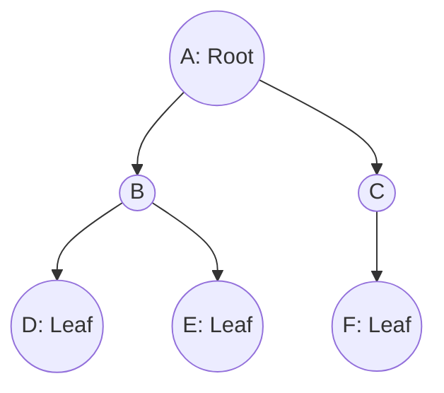
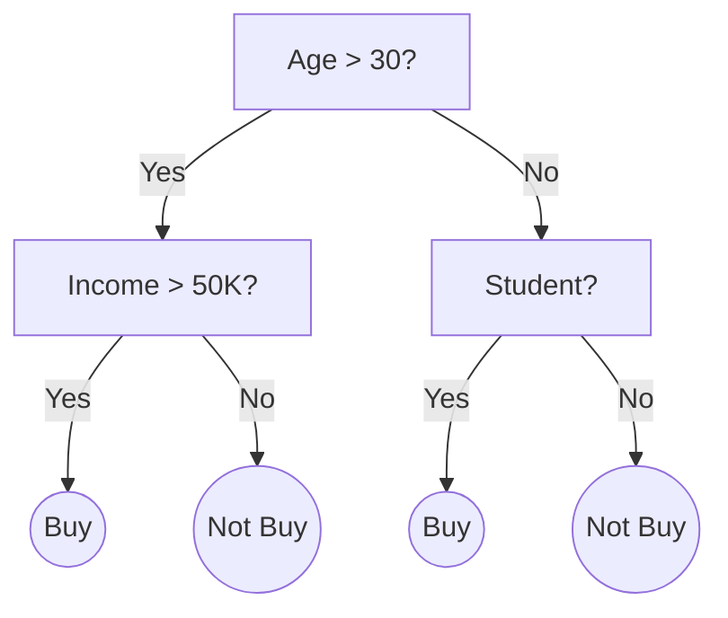

Trees are ubiquitous in ML and computer science. Unlike arrays or linked lists, trees provide a hierarchical structure. For an ML engineer, mastering trees is non-negotiable — they are the backbone of decision trees, random forests, XGBoost, expression trees in symbolic AI, and even routing in hierarchical softmax. Understanding tree properties, traversals, and algorithms is essential for implementing efficient models and acing system design or coding interviews.

## 1. Tree Basics

A **Tree** is a non-linear data structure that simulates a hierarchical tree structure, with a root value and subtrees of children with a parent node. 
* **Root**: The topmost node.
* **Leaf**: A node with no children.
* **Height**: The number of edges on the longest path from the node to a leaf.
* **Depth**: The number of edges from the tree's root node to the node.
* **Level**: 1 + number of connections between the node and the root.
* **Subtree**: A tree consisting of a node and its descendants.
* **Tree vs Graph**: A tree is a special type of undirected graph that is connected and acyclic (no cycles).



> 🤖 **ML Connection**: The hierarchical structure directly translates to decision rules in a Decision Tree model. Each internal node is a split condition, and each leaf is an output prediction.

## 2. Binary Tree

A **Binary Tree** is a tree data structure in which each node has at most two children, referred to as the left child and the right child.

### Node Class and Building a Tree

```python
class TreeNode:
    def __init__(self, val=0, left=None, right=None):
        self.val = val
        self.left = left
        self.right = right

# Building a simple binary tree
#       1
#      / \
#     2   3
#    / \
#   4   5
root = TreeNode(1)
root.left = TreeNode(2)
root.right = TreeNode(3)
root.left.left = TreeNode(4)
root.left.right = TreeNode(5)
```

**Types of Binary Trees:**
* **Full**: Every node has 0 or 2 children.
* **Complete**: Every level, except possibly the last, is completely filled, and all nodes are as far left as possible.
* **Perfect**: All internal nodes have two children and all leaves are at the same level.
* **Balanced**: The left and right subtrees of every node differ in height by no more than 1.
* **Degenerate**: Every internal node has one child (behaves like a linked list).

## 3. Tree Traversals

Traversing means visiting every node in the tree exactly once.

### DFS (Depth First Search) Traversals
DFS goes deep to the leaves before backtracking.

#### Inorder (Left, Root, Right)
```python
# Recursive Inorder
def inorder_recursive(root):
    res = []
    def dfs(node):
        if not node: return
        dfs(node.left)
        res.append(node.val)
        dfs(node.right)
    dfs(root)
    return res

# Iterative Inorder
def inorder_iterative(root):
    res, stack = [], []
    curr = root
    while curr or stack:
        while curr:
            stack.append(curr)
            curr = curr.left
        curr = stack.pop()
        res.append(curr.val)
        curr = curr.right
    return res

print("Inorder:", inorder_iterative(root))
# Output: Inorder: [4, 2, 5, 1, 3]
```

#### Preorder (Root, Left, Right)
```python
# Recursive Preorder
def preorder_recursive(root):
    res = []
    def dfs(node):
        if not node: return
        res.append(node.val)
        dfs(node.left)
        dfs(node.right)
    dfs(root)
    return res

# Iterative Preorder
def preorder_iterative(root):
    if not root: return []
    res, stack = [], [root]
    while stack:
        node = stack.pop()
        res.append(node.val)
        if node.right: stack.append(node.right) # Push right first so left is popped first
        if node.left: stack.append(node.left)
    return res

print("Preorder:", preorder_iterative(root))
# Output: Preorder: [1, 2, 4, 5, 3]
```

#### Postorder (Left, Right, Root)
```python
# Recursive Postorder
def postorder_recursive(root):
    res = []
    def dfs(node):
        if not node: return
        dfs(node.left)
        dfs(node.right)
        res.append(node.val)
    dfs(root)
    return res

# Iterative Postorder
def postorder_iterative(root):
    if not root: return []
    res, stack = [], [root]
    while stack:
        node = stack.pop()
        res.append(node.val)
        if node.left: stack.append(node.left)
        if node.right: stack.append(node.right)
    return res[::-1] # Reverse the result

print("Postorder:", postorder_iterative(root))
# Output: Postorder: [4, 5, 2, 3, 1]
```

> 🎯 **Interview Tip**: Notice that iterative postorder is just preorder (Root, Right, Left) reversed. This is a very common trick to simplify iterative postorder.

### BFS (Breadth First Search) Traversals

#### Level Order
```python
from collections import deque

def level_order(root):
    if not root: return []
    res = []
    queue = deque([root])
    
    while queue:
        level = []
        for _ in range(len(queue)):
            node = queue.popleft()
            level.append(node.val)
            if node.left: queue.append(node.left)
            if node.right: queue.append(node.right)
        res.append(level)
    return res

print("Level Order:", level_order(root))
# Output: Level Order: [[1], [2, 3], [4, 5]]
```

#### Zigzag Level Order
```python
def zigzag_level_order(root):
    if not root: return []
    res = []
    queue = deque([root])
    left_to_right = True
    
    while queue:
        level_size = len(queue)
        level = deque()
        for _ in range(level_size):
            node = queue.popleft()
            if left_to_right:
                level.append(node.val)
            else:
                level.appendleft(node.val)
            
            if node.left: queue.append(node.left)
            if node.right: queue.append(node.right)
            
        res.append(list(level))
        left_to_right = not left_to_right
        
    return res
```

#### Vertical Order
```python
from collections import defaultdict

def vertical_order(root):
    if not root: return []
    
    column_table = defaultdict(list)
    queue = deque([(root, 0)]) # (node, column)
    
    while queue:
        node, column = queue.popleft()
        if node:
            column_table[column].append(node.val)
            queue.append((node.left, column - 1))
            queue.append((node.right, column + 1))
            
    return [column_table[x] for x in sorted(column_table.keys())]
```

## 4. Binary Search Tree (BST)

A BST is a binary tree where the left child contains only nodes with values less than the parent node, and the right child contains only nodes with values greater than the parent node.

> 🎯 **Interview Tip**: Inorder traversal of a BST yields a sorted array. Always exploit this property!

### Insert, Search, Delete
```python
class BSTNode:
    def __init__(self, val=0, left=None, right=None):
        self.val = val
        self.left = left
        self.right = right

def insert(root, val):
    if not root: return BSTNode(val)
    if val < root.val:
        root.left = insert(root.left, val)
    else:
        root.right = insert(root.right, val)
    return root

def search(root, val):
    if not root or root.val == val:
        return root
    if val < root.val:
        return search(root.left, val)
    return search(root.right, val)

def delete(root, key):
    if not root: return root
    if key < root.val:
        root.left = delete(root.left, key)
    elif key > root.val:
        root.right = delete(root.right, key)
    else:
        # Case 1 & 2: No child or 1 child
        if not root.left: return root.right
        elif not root.right: return root.left
        # Case 3: 2 children. Get inorder successor (smallest in right subtree)
        temp = root.right
        while temp.left:
            temp = temp.left
        root.val = temp.val
        root.right = delete(root.right, root.val)
    return root
```

### Validate BST
```python
def is_valid_bst(root):
    def validate(node, low=-float('inf'), high=float('inf')):
        if not node: return True
        if node.val <= low or node.val >= high: return False
        return (validate(node.left, low, node.val) and 
                validate(node.right, node.val, high))
    return validate(root)
```

### Inorder Successor
```python
def inorder_successor(root, p):
    successor = None
    while root:
        if p.val >= root.val:
            root = root.right
        else:
            successor = root
            root = root.left
    return successor
```

### Kth Smallest Element
```python
def kth_smallest(root, k):
    stack = []
    while root or stack:
        while root:
            stack.append(root)
            root = root.left
        root = stack.pop()
        k -= 1
        if k == 0:
            return root.val
        root = root.right
```

### Convert Sorted Array to BST
```python
def sorted_array_to_bst(nums):
    if not nums: return None
    mid = len(nums) // 2
    root = TreeNode(nums[mid])
    root.left = sorted_array_to_bst(nums[:mid])
    root.right = sorted_array_to_bst(nums[mid+1:])
    return root
```

## 5. Tree Properties

```python
def max_depth(root):
    if not root: return 0
    return 1 + max(max_depth(root.left), max_depth(root.right))

def diameter(root):
    res = [0]
    def dfs(node):
        if not node: return 0
        left = dfs(node.left)
        right = dfs(node.right)
        res[0] = max(res[0], left + right)
        return 1 + max(left, right)
    dfs(root)
    return res[0]

def is_balanced(root):
    def dfs(node):
        if not node: return 0
        left = dfs(node.left)
        right = dfs(node.right)
        if left == -1 or right == -1 or abs(left - right) > 1:
            return -1
        return 1 + max(left, right)
    return dfs(root) != -1

def is_symmetric(root):
    def is_mirror(t1, t2):
        if not t1 and not t2: return True
        if not t1 or not t2: return False
        return (t1.val == t2.val) and is_mirror(t1.right, t2.left) and is_mirror(t1.left, t2.right)
    return is_mirror(root, root)
```

## 6. Common Interview Problems

### Lowest Common Ancestor (LCA)
```python
def lca(root, p, q):
    if not root or root == p or root == q: return root
    left = lca(root.left, p, q)
    right = lca(root.right, p, q)
    if left and right: return root
    return left if left else right
```

### Serialize and Deserialize Binary Tree
```python
class Codec:
    def serialize(self, root):
        res = []
        def dfs(node):
            if not node:
                res.append("N")
                return
            res.append(str(node.val))
            dfs(node.left)
            dfs(node.right)
        dfs(root)
        return ",".join(res)

    def deserialize(self, data):
        vals = data.split(",")
        self.i = 0
        def dfs():
            if vals[self.i] == "N":
                self.i += 1
                return None
            node = TreeNode(int(vals[self.i]))
            self.i += 1
            node.left = dfs()
            node.right = dfs()
            return node
        return dfs()
```

### Right Side View
```python
def right_side_view(root):
    if not root: return []
    res = []
    queue = deque([root])
    while queue:
        res.append(queue[-1].val) # Get last element of current level
        for _ in range(len(queue)):
            node = queue.popleft()
            if node.left: queue.append(node.left)
            if node.right: queue.append(node.right)
    return res
```

### Flatten Binary Tree to Linked List
```python
def flatten(root):
    curr = root
    while curr:
        if curr.left:
            # Find rightmost node of left subtree
            runner = curr.left
            while runner.right:
                runner = runner.right
            # Connect rightmost node to right child
            runner.right = curr.right
            curr.right = curr.left
            curr.left = None
        curr = curr.right
```

### Binary Tree Maximum Path Sum
```python
def max_path_sum(root):
    res = [float('-inf')]
    def dfs(node):
        if not node: return 0
        left_max = max(dfs(node.left), 0)
        right_max = max(dfs(node.right), 0)
        
        # Compute max sum passing through this node
        res[0] = max(res[0], node.val + left_max + right_max)
        
        return node.val + max(left_max, right_max)
    dfs(root)
    return res[0]
```

### Invert Binary Tree
```python
def invert_tree(root):
    if not root: return None
    # Swap children
    root.left, root.right = root.right, root.left
    invert_tree(root.left)
    invert_tree(root.right)
    return root
```

## 7. Trie (Prefix Tree)

A Trie is an efficient information reTrieval data structure, perfect for strings.

```python
class TrieNode:
    def __init__(self):
        self.children = {}
        self.is_end_of_word = False

class Trie:
    def __init__(self):
        self.root = TrieNode()

    def insert(self, word: str) -> None:
        curr = self.root
        for char in word:
            if char not in curr.children:
                curr.children[char] = TrieNode()
            curr = curr.children[char]
        curr.is_end_of_word = True

    def search(self, word: str) -> bool:
        curr = self.root
        for char in word:
            if char not in curr.children: return False
            curr = curr.children[char]
        return curr.is_end_of_word

    def startsWith(self, prefix: str) -> bool:
        curr = self.root
        for char in prefix:
            if char not in curr.children: return False
            curr = curr.children[char]
        return True
```

> 🤖 **ML Connection**: Tries are fundamental in Natural Language Processing (NLP) for building fast auto-complete engines, spell-checkers, and efficient tokenization dictionaries (like Byte Pair Encoding implementations).

## 8. Heap (Binary Heap)

A Heap is a special Tree-based data structure that satisfies the heap property:
* **Max-Heap**: Parent key is >= children keys.
* **Min-Heap**: Parent key is <= children keys.
Usually implemented with an array, where `parent = (i-1)//2`, `left = 2i+1`, `right = 2i+2`.

```python
import heapq

# Min-Heap
nums = [3, 1, 4, 1, 5, 9, 2, 6]
heapq.heapify(nums) # In-place min-heapify in O(N)
print(nums) # [1, 1, 2, 6, 5, 9, 4, 3]

# Push and Pop
heapq.heappush(nums, 0)
print(heapq.heappop(nums)) # Output: 0

# Max-Heap (Invert values)
max_heap = [-x for x in nums]
heapq.heapify(max_heap)
print(-heapq.heappop(max_heap)) # Output: 9
```

> 🤖 **ML Connection**: Priority queues (Heaps) are heavily used in beam search for sequence generation (like in Transformers/LLMs) to keep track of the top-K most likely hypotheses.

## 9. Trees in ML

Trees in ML are predominantly Decision Trees (CART: Classification and Regression Trees).
* Each internal node represents a "test" on an attribute (e.g., `age > 30`).
* Each branch represents the outcome of the test.
* Each leaf node represents a class label (decision taken after computing all attributes).



Random Forests are ensembles of multiple decision trees, trained on different subsets of data (bagging), reducing variance and overfitting. Gradient Boosted Trees (XGBoost, LightGBM) build trees sequentially, each correcting the errors of the previous one.

## Practice Problems

1. Implement an iterative inorder traversal.
2. Given a binary tree, find its maximum depth.
3. Validate if a given binary tree is a valid BST.
4. Serialize and deserialize a binary tree.
5. Find the lowest common ancestor of two nodes in a BST.
6. Implement a Trie with insert, search, and startsWith methods.
7. Merge two binary trees.
8. Construct a binary tree from preorder and inorder traversal arrays.
9. Implement a Max-Heap from scratch using an array.
10. Find the Kth largest element in an array using a min-heap.
