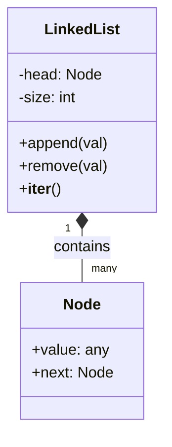
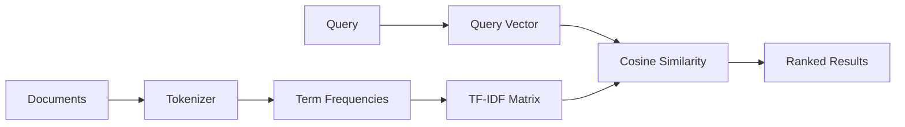
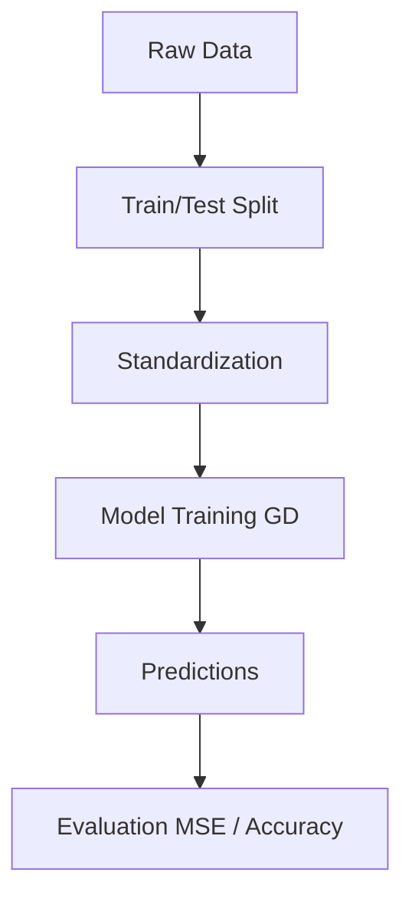
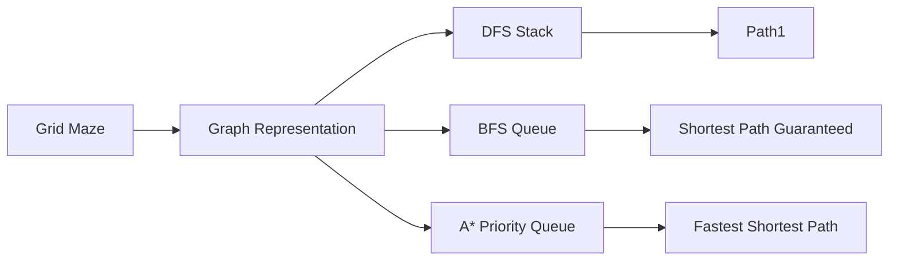

This note provides five comprehensive, hands-on projects that bridge the gap between core Python, Data Structures & Algorithms, and Machine Learning engineering. These projects are designed to demonstrate a deep understanding of low-level implementation details, which is highly sought after in ML engineering interviews. Building things from scratch proves you aren't just a framework consumer, but a true engineer who understands what happens under the hood.

## Project 1: Custom Data Structures Library

### Problem Description
Build a complete data structures library from scratch in Python, implementing core structures like Linked Lists, Stacks, Queues, Binary Search Trees, MinHeaps, and Hash Maps. 

**Learning Objectives:** Master Python OOP, dunder methods (`__iter__`, `__len__`, `__str__`), memory management (pointers), and core DSA concepts required for technical interviews.

### Architecture Overview



### Complete Implementation

```python
import unittest
from typing import Any, Optional, Iterator, List

class ListNode:
    """A basic node for a singly linked list."""
    def __init__(self, value: Any):
        self.value = value
        self.next: Optional['ListNode'] = None

class LinkedList:
    """A custom singly linked list implementation."""
    def __init__(self):
        self.head: Optional[ListNode] = None
        self._size = 0
        
    def append(self, value: Any) -> None:
        """Appends a value to the end of the list."""
        if not self.head:
            self.head = ListNode(value)
        else:
            current = self.head
            while current.next:
                current = current.next
            current.next = ListNode(value)
        self._size += 1
        
    def __len__(self) -> int:
        return self._size
        
    def __iter__(self) -> Iterator[Any]:
        """Allows iteration over the list (e.g., `for item in ll:`)."""
        current = self.head
        while current:
            yield current.value
            current = current.next
            
    def __str__(self) -> str:
        return " -> ".join(str(val) for val in self)

class Stack:
    """Stack implemented using a Python list (array-based)."""
    def __init__(self):
        self._items = []
        
    def push(self, item: Any) -> None:
        self._items.append(item)
        
    def pop(self) -> Any:
        if self.is_empty():
            raise IndexError("pop from empty stack")
        return self._items.pop()
        
    def peek(self) -> Any:
        if self.is_empty():
            raise IndexError("peek from empty stack")
        return self._items[-1]
        
    def is_empty(self) -> bool:
        return len(self._items) == 0

class BSTNode:
    def __init__(self, key: int):
        self.key = key
        self.left: Optional['BSTNode'] = None
        self.right: Optional['BSTNode'] = None

class BinarySearchTree:
    """A simple Binary Search Tree implementation."""
    def __init__(self):
        self.root: Optional[BSTNode] = None
        
    def insert(self, key: int) -> None:
        if self.root is None:
            self.root = BSTNode(key)
        else:
            self._insert_recursive(self.root, key)
            
    def _insert_recursive(self, node: BSTNode, key: int) -> None:
        if key < node.key:
            if node.left is None:
                node.left = BSTNode(key)
            else:
                self._insert_recursive(node.left, key)
        elif key > node.key:
            if node.right is None:
                node.right = BSTNode(key)
            else:
                self._insert_recursive(node.right, key)
                
    def inorder_traversal(self) -> List[int]:
        """Returns the sorted keys."""
        result = []
        self._inorder(self.root, result)
        return result
        
    def _inorder(self, node: Optional[BSTNode], result: List[int]) -> None:
        if node:
            self._inorder(node.left, result)
            result.append(node.key)
            self._inorder(node.right, result)

# 🎯 Interview Tip: Writing your own unit tests during an interview shows immense seniority.
class TestDataStructures(unittest.TestCase):
    def test_linked_list(self):
        ll = LinkedList()
        ll.append(1)
        ll.append(2)
        self.assertEqual(len(ll), 2)
        self.assertEqual(list(ll), [1, 2])
        
    def test_stack(self):
        s = Stack()
        s.push(10)
        s.push(20)
        self.assertEqual(s.pop(), 20)
        
    def test_bst(self):
        bst = BinarySearchTree()
        for val in [5, 3, 7, 2, 4]:
            bst.insert(val)
        self.assertEqual(bst.inorder_traversal(), [2, 3, 4, 5, 7])

if __name__ == '__main__':
    # Run tests to prove it works
    unittest.main(argv=[''], exit=False)
```

**Reinforced Concepts**: OOP, Dunder Methods, Pointers, Test-Driven Development (TDD).
**Extension**: Add deletion to BST, implement an LRU Cache using a Doubly Linked List and Hash Map.

---

## Project 2: Search Engine (TF-IDF from Scratch)

### Problem Description
Implement a mini document search engine using Term Frequency-Inverse Document Frequency (TF-IDF) from scratch. 
**Learning Objectives**: String manipulation, Hash Maps (Inverted Index), sparse vectors, and Cosine Similarity (Linear Algebra).

### Architecture Overview


### Complete Implementation

```python
import math
from collections import defaultdict, Counter
import re

class TFIDFSearchEngine:
    def __init__(self):
        self.documents = []
        self.vocab = set()
        self.idf = {}
        self.tf_idf_matrix = []
        self.doc_magnitudes = []
        
    def preprocess(self, text: str) -> list[str]:
        """Tokenizes text, lowers it, and removes basic punctuation."""
        # simple regex for words
        text = text.lower()
        return re.findall(r'\b[a-z]+\b', text)
        
    def fit(self, documents: list[str]):
        """Builds the TF-IDF index for a corpus."""
        self.documents = documents
        num_docs = len(documents)
        doc_term_freqs = []
        doc_freqs = defaultdict(int)
        
        # 1. Calculate TF and Document Frequencies
        for doc in documents:
            tokens = self.preprocess(doc)
            self.vocab.update(tokens)
            tf = Counter(tokens)
            doc_term_freqs.append(tf)
            
            # Count which documents contain each term
            for term in set(tokens):
                doc_freqs[term] += 1
                
        # 2. Calculate IDF (Inverse Document Frequency)
        for term, df in doc_freqs.items():
            # Add 1 smoothing to prevent division by zero
            self.idf[term] = math.log((1 + num_docs) / (1 + df)) + 1
            
        # 3. Calculate TF-IDF matrix and pre-compute magnitudes for cosine similarity
        for tf in doc_term_freqs:
            doc_vector = {}
            magnitude_sq = 0.0
            for term, count in tf.items():
                tfidf_score = count * self.idf[term]
                doc_vector[term] = tfidf_score
                magnitude_sq += tfidf_score ** 2
            
            self.tf_idf_matrix.append(doc_vector)
            self.doc_magnitudes.append(math.sqrt(magnitude_sq))
            
    def search(self, query: str) -> list[tuple[int, float, str]]:
        """Searches the index and returns ranked documents."""
        query_tokens = self.preprocess(query)
        query_tf = Counter(query_tokens)
        
        # Build query vector
        query_vector = {}
        query_mag_sq = 0.0
        for term, count in query_tf.items():
            if term in self.idf:
                tfidf_score = count * self.idf[term]
                query_vector[term] = tfidf_score
                query_mag_sq += tfidf_score ** 2
                
        query_magnitude = math.sqrt(query_mag_sq)
        if query_magnitude == 0:
            return [] # No matching words
            
        # Calculate Cosine Similarity
        results = []
        for i, doc_vector in enumerate(self.tf_idf_matrix):
            dot_product = sum(query_vector.get(term, 0) * doc_score 
                              for term, doc_score in doc_vector.items())
            
            if dot_product > 0:
                similarity = dot_product / (query_magnitude * self.doc_magnitudes[i])
                results.append((i, similarity, self.documents[i]))
                
        # Sort by similarity descending
        return sorted(results, key=lambda x: x[1], reverse=True)

# Usage Example
docs = [
    "Machine learning is fascinating.",
    "Python is a great programming language for machine learning.",
    "Data structures and algorithms are core software engineering topics.",
    "I love building software systems with Python."
]

engine = TFIDFSearchEngine()
engine.fit(docs)
print("Search for 'Python machine learning':")
for i, score, text in engine.search("Python machine learning"):
    print(f"[{score:.4f}] Doc {i}: {text}")
```
**🤖 ML Connection**: This is the fundamental algorithm behind classical NLP and information retrieval. It teaches you vector space models, the precursor to dense embeddings!
**Extension**: Add BM25 scoring, or implement an inverted index mapping words to document IDs for faster lookup on huge datasets.

---

## Project 3: ML Pipeline from Scratch

### Problem Description
Implement an end-to-end Machine Learning pipeline using purely NumPy (Linear Regression via Gradient Descent and KNN Classifier).
**Learning Objectives**: NumPy vectorization, loss functions, optimization (Gradient Descent), and object-oriented ML model design (scikit-learn API style).

### Architecture Overview


### Complete Implementation

```python
import numpy as np
import matplotlib.pyplot as plt

class LinearRegressionNumPy:
    """Multiple Linear Regression using Gradient Descent."""
    def __init__(self, learning_rate=0.01, n_iterations=1000):
        self.learning_rate = learning_rate
        self.n_iterations = n_iterations
        self.weights = None
        self.bias = None
        self.losses = []
        
    def fit(self, X: np.ndarray, y: np.ndarray):
        n_samples, n_features = X.shape
        self.weights = np.zeros(n_features)
        self.bias = 0
        
        for _ in range(self.n_iterations):
            # Forward pass: y_pred = X*W + b
            y_pred = np.dot(X, self.weights) + self.bias
            
            # Compute gradients
            dw = (1 / n_samples) * np.dot(X.T, (y_pred - y))
            db = (1 / n_samples) * np.sum(y_pred - y)
            
            # Update parameters
            self.weights -= self.learning_rate * dw
            self.bias -= self.learning_rate * db
            
            # Record loss (MSE)
            mse = np.mean((y_pred - y) ** 2)
            self.losses.append(mse)
            
    def predict(self, X: np.ndarray) -> np.ndarray:
        return np.dot(X, self.weights) + self.bias

class KNNClassifier:
    """K-Nearest Neighbors classifier."""
    def __init__(self, k=3):
        self.k = k
        self.X_train = None
        self.y_train = None
        
    def fit(self, X, y):
        self.X_train = X
        self.y_train = y
        
    def predict(self, X):
        predictions = [self._predict(x) for x in X]
        return np.array(predictions)
        
    def _predict(self, x):
        # Compute L2 distances
        distances = np.sqrt(np.sum((self.X_train - x) ** 2, axis=1))
        # Get k nearest indices
        k_indices = np.argsort(distances)[:self.k]
        # Get labels
        k_nearest_labels = [self.y_train[i] for i in k_indices]
        # Return most common class label
        most_common = np.bincount(k_nearest_labels).argmax()
        return most_common

# Pipeline Execution
print("--- Linear Regression Pipeline ---")
# Generate synthetic data
np.random.seed(42)
X_lr = 2 * np.random.rand(100, 1)
y_lr = 4 + 3 * X_lr + np.random.randn(100, 1) * 0.5
y_lr = y_lr.flatten() # Make 1D

# Train-test split (80-20)
indices = np.random.permutation(len(X_lr))
train_idx, test_idx = indices[:80], indices[80:]
X_train, X_test = X_lr[train_idx], X_lr[test_idx]
y_train, y_test = y_lr[train_idx], y_lr[test_idx]

# Train
model = LinearRegressionNumPy(learning_rate=0.1, n_iterations=100)
model.fit(X_train, y_train)

# Evaluate
preds = model.predict(X_test)
test_mse = np.mean((preds - y_test) ** 2)
print(f"Learned Weights: {model.weights[0]:.2f}, Bias: {model.bias:.2f}")
print(f"Test MSE: {test_mse:.4f}")
```
**Reinforced Concepts**: Linear Algebra, Calculus (Gradients), NumPy broadcasting, class design.
**Extension**: Add Stochastic Gradient Descent (SGD) and Ridge/Lasso Regularization terms.

---

## Project 4: Maze Solver with Multiple Algorithms

### Problem Description
Implement a grid-based maze solver using DFS, BFS, and A* pathfinding. 
**Learning Objectives**: Graph traversal, heuristic functions, Priority Queues (Heaps), Recursion vs Iteration.

### Architecture Overview


### Complete Implementation

```python
from collections import deque
import heapq

class MazeSolver:
    def __init__(self, maze):
        self.maze = maze # 0 is path, 1 is wall
        self.rows = len(maze)
        self.cols = len(maze[0])
        self.directions = [(0, 1), (1, 0), (0, -1), (-1, 0)] # R, D, L, U
        
    def is_valid(self, r, c):
        return 0 <= r < self.rows and 0 <= c < self.cols and self.maze[r][c] == 0
        
    def bfs(self, start, end):
        """Finds the shortest path using Breadth-First Search."""
        queue = deque([(start, [start])])
        visited = set([start])
        
        while queue:
            (curr_r, curr_c), path = queue.popleft()
            
            if (curr_r, curr_c) == end:
                return path
                
            for dr, dc in self.directions:
                nr, nc = curr_r + dr, curr_c + dc
                if self.is_valid(nr, nc) and (nr, nc) not in visited:
                    visited.add((nr, nc))
                    queue.append(((nr, nc), path + [(nr, nc)]))
        return None

    def astar(self, start, end):
        """Finds the shortest path efficiently using A* Search."""
        def heuristic(p1, p2):
            return abs(p1[0] - p2[0]) + abs(p1[1] - p2[1]) # Manhattan distance
            
        # Priority queue stores (f_score, (r, c), path)
        # f_score = g_score (dist from start) + h_score (heuristic to end)
        pq = [(heuristic(start, end), 0, start, [start])]
        visited = {start: 0} # Stores best g_score for a node
        
        while pq:
            f, g, (curr_r, curr_c), path = heapq.heappop(pq)
            
            if (curr_r, curr_c) == end:
                return path
                
            for dr, dc in self.directions:
                nr, nc = curr_r + dr, curr_c + dc
                new_g = g + 1
                
                if self.is_valid(nr, nc):
                    if (nr, nc) not in visited or new_g < visited[(nr, nc)]:
                        visited[(nr, nc)] = new_g
                        f_score = new_g + heuristic((nr, nc), end)
                        heapq.heappush(pq, (f_score, new_g, (nr, nc), path + [(nr, nc)]))
        return None

# Test the maze
maze = [
    [0, 0, 0, 1, 0],
    [1, 1, 0, 1, 0],
    [0, 0, 0, 0, 0],
    [0, 1, 1, 1, 1],
    [0, 0, 0, 0, 0]
]
solver = MazeSolver(maze)
start_pos = (0, 0)
end_pos = (4, 4)

bfs_path = solver.bfs(start_pos, end_pos)
astar_path = solver.astar(start_pos, end_pos)
print(f"BFS Path Length: {len(bfs_path) if bfs_path else 'No Path'}")
print(f"A* Path Length: {len(astar_path) if astar_path else 'No Path'}")
```
**🤖 ML Connection**: A* is foundational to search-based AI (like autonomous agents and robotics). Reinforcement Learning also builds heavily upon Markov Decision Processes traversing grid states!

---

## Project 5: Real-time Data Dashboard (Financial Analyzer)

### Problem Description
Build a financial data processing pipeline using Pandas to calculate moving averages and the Relative Strength Index (RSI). 
**Learning Objectives**: Pandas DataFrame operations, rolling windows, time-series analysis, vectorized data manipulation.

### Complete Implementation

```python
import pandas as pd
import numpy as np

class StockAnalyzer:
    def __init__(self, data_dict):
        # Simulate loading from CSV
        self.df = pd.DataFrame(data_dict)
        self.df['Date'] = pd.to_datetime(self.df['Date'])
        self.df.set_index('Date', inplace=True)
        self.df.sort_index(inplace=True)
        
    def add_moving_average(self, window=3):
        """Calculates Simple Moving Average."""
        col_name = f'SMA_{window}'
        self.df[col_name] = self.df['Close'].rolling(window=window).mean()
        
    def add_rsi(self, periods=3):
        """Calculates Relative Strength Index."""
        # 1. Calculate price differences
        delta = self.df['Close'].diff()
        
        # 2. Separate gains and losses
        gain = (delta.where(delta > 0, 0)).fillna(0)
        loss = (-delta.where(delta < 0, 0)).fillna(0)
        
        # 3. Calculate rolling averages
        avg_gain = gain.rolling(window=periods, min_periods=1).mean()
        avg_loss = loss.rolling(window=periods, min_periods=1).mean()
        
        # 4. Calculate RS and RSI
        rs = avg_gain / avg_loss
        self.df['RSI'] = 100 - (100 / (1 + rs))
        # Handle divide by zero
        self.df['RSI'] = self.df['RSI'].fillna(100) 
        
    def generate_report(self):
        print("\n--- Financial Technical Analysis Report ---")
        print(self.df.round(2).tail())
        
# Sample Data
mock_data = {
    'Date': ['2026-07-01', '2026-07-02', '2026-07-03', '2026-07-04', '2026-07-05', '2026-07-06'],
    'Close': [150.0, 152.5, 151.0, 155.0, 158.0, 157.0],
    'Volume': [1000, 1200, 1100, 1500, 2000, 1800]
}

analyzer = StockAnalyzer(mock_data)
analyzer.add_moving_average(window=3)
analyzer.add_rsi(periods=3)
analyzer.generate_report()
```
**Reinforced Concepts**: Pandas series operations, `rolling()`, `where()`, Handling `NaN` values, Time-Series index.
**Extension**: Hook this up to `yfinance` to fetch real data and use `matplotlib` to plot candlestick charts.

---

### Related Notes
- [[Python OOP Mastery]]
- [[Python NumPy Essentials]]
- [[Python Pandas Essentials]]
- [[DSA Trees]]
- [[DSA Graphs]]
