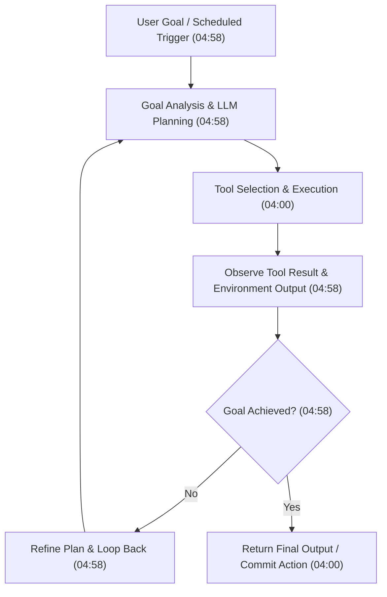
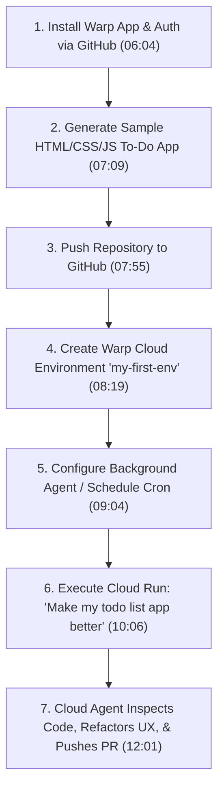

# Detailed Study Notes — 2026 will be the Year of Multi-agent AIs - Here's why!

## 1. Executive Summary & Video Metadata

- **Video Title**: 2026 will be the Year of Multi-agent AIs - Here's why!
- **Presenter / Creator**: [[CodeWithHarry]]
- **Publication Date**: 2026-02-25
- **Watch URL**: [YouTube Video Link](https://www.youtube.com/watch?v=s4dLwoanLm0)
- **Source Artifact**: `[[01_RAW/SOURCE/2026 will be the Year of Multi-agent AIs - Here's why!.md]]`
- **Core Subject Matter**: Technological transition from standalone Large Language Models (LLMs) and interactive copilots to autonomous, invisible background AI agents; practical hands-on demonstration of cloud agent orchestration using Oz by Warp; technical breakdown of AI agent architecture (`Agent = LLM + Memory + Tools + Loop`); risk analysis of multi-agent cascading failure rates; and strategic advice for software engineers becoming "Automation Architects."

---

## 2. Historical Evolution of the AI Landscape (2023–2026) (00:00 - 00:54, 19:56 - 20:25)

The progress of Artificial Intelligence over the four-year period from 2023 to 2026 reflects a fundamental transformation in software interaction paradigms—transitioning from text-based conversational interfaces to autonomous background execution engines.

| Year | AI Industry Paradigm / Era | Core Technical Focus & User Interaction Model | Operational Capability & Status | Timestamp Citation |
| :--- | :--- | :--- | :--- | :--- |
| **2023** | **ChatGPT & UI Era** | Basic consumer chat interfaces, prompt-driven single-turn text generation, foundational model boom. | Manual chat interaction on web screens; high initial novelty. | (19:56) |
| **2024** | **LLM API Era** | Programmatic access via model APIs, product integrations, early custom tool calling integrations. | Embedding LLM completion capabilities into third-party web and mobile software applications. | (20:00) |
| **2025** | **Copilot & Agent Demo Era** | Interactive copilots, human-in-the-loop pair programmers, early proof-of-concept AI agent demos (LangChain, n8n). | Experimental agentic flows; fragile execution susceptible to LLM hallucinations. | (00:16, 20:08) |
| **2026** | **Background Agentic AI Era** | Invisible autonomous multi-agent systems, cloud-orchestrated task loops, agent-optimized foundation models. | Production-grade background agents executing scheduled and proactive tasks autonomously. | (00:00, 20:12) |

---

## 3. AI Impact on Developer Employment & Career Progression (00:54 - 01:43, 19:05 - 20:00)

### 3.1 The "Dumb Developer" Paradigm vs. Creative Engineering
- **Job Displacement Dynamics (01:03)**: AI will directly displace developers performing routine, low-creativity, repetitive tasks (e.g., passive data entry from papers into forms, naive code copying without structural understanding).
- **Human Oversight Imperative (01:29)**: AI cannot replace human creativity, high-level system architectural design, complex problem decomposition, and critical domain judgment.
- **Corporate Hiring Reality (01:29)**: Frontier AI firms—including OpenAI, Anthropic, xAI, and Google—continue actively hiring skilled software engineers throughout the year to design, scale, and maintain foundation models and agent infrastructure.

### 3.2 Evolution to "Automation Architects" (20:25)
- **Role Transformation**: Developers who learn to design, configure, schedule, and govern multi-agent workflows today will transition into the role of **Automation Architects** tomorrow.
- **Productivity Amplification (19:26)**: Where building full-stack applications previously required hiring dedicated front-end and back-end engineering teams, single developers can now leverage prompt-driven agent tools to rapidly generate robust codebases while focusing on core product architecture, ideation, and user experience.

---

## 4. Architectural Deep Dive: LLMs vs. AI Agents (01:43 - 05:26)

### 4.1 Mechanics and Limitations of Pure LLMs (01:43 - 03:40)
- **Core Mechanism (01:43)**: An LLM is fundamentally an ultra-high-accuracy next-token prediction machine. Given a prompt (e.g., `"Python is a"`), it calculates conditional probabilities to generate sequentially probable tokens (`"programming"`, `"language"`).
- **Illusion of Intelligence (02:24)**: Despite generating highly coherent text, scripts, and code, LLMs do not possess conscious thought, real-world physical experience, or intrinsic reasoning capabilities.
- **Key Technical Limitations (02:41 - 03:11)**:
  1. **Lack of Proactivity**: Models strictly react to input prompts; they never initiate actions independently.
  2. **No Execution Capability**: Models output text strings; they cannot run terminal commands or manipulate databases directly.
  3. **Context Window Constraint**: Information retention is restricted to the active context window length.
  4. **Absence of Incremental Lifetime Learning**: Unlike biological brains (human or animal) that continuously update mental models through environmental interaction, LLMs remain static post-training.

### 4.2 The AI Agent Formula & Execution Loop (03:40 - 05:19)
An AI Agent transforms a passive language model into an active, goal-driven computational engine:

$$\text{AI Agent} = \text{LLM} + \text{Memory} + \text{Tools} + \text{Autonomous Loop}$$

### 4.3 E-Commerce Multi-Step Reasoning Example (04:06 - 04:58)
- **Standard LLM Interaction (04:06)**: User asks for laptops under ₹1,00,000; LLM returns a text list based on training data.
- **Agentic Multi-Step Workflow (04:32 - 04:58)**:
  1. **Web Search & Scraping**: Agent queries live search engines for modern laptops under ₹1,00,000.
  2. **Specification Filtering**: Parses technical data to verify high-speed SSDs and fast RAM specifications.
  3. **Price Comparison**: Queries live pricing across multiple platforms (Flipkart and Amazon).
  4. **Data Aggregation**: Compiles normalized specifications and pricing into a structured spreadsheet.
  5. **Action Recommendation**: Delivers a direct link to the optimal vendor offer.

### 4.4 Agent Development Frameworks (05:09 - 05:19)
The video notes several prominent agent libraries and SDKs:
- OpenAI SDK / Agents Framework
- Vercel AI SDK
- Claude Agent SDK
- OpenClout

---

## 5. Technical Demonstration: Cloud Agent Orchestration with Oz by Warp (05:26 - 12:38)

### 5.1 Overview of Oz by Warp (05:35 - 06:04)
- **Definition**: A cloud-native AI agent development and orchestration platform built by Warp.
- **Core Functionality**: Allows developers to spin up unlimited parallel cloud-hosted AI agents that run on background schedules or trigger events.
- **Sponsor Offer**: Includes 1,000 free Oz cloud credits via the promoter link (`https://oz.dev/harryyt`).

### 5.2 Step-by-Step Hands-On Workflow (06:04 - 12:22)

1. **Installation & Authentication (06:04 - 06:42)**: Downloaded Warp desktop application for Windows; authenticated via GitHub (`vp.dev`).
2. **Local Repository Creation (07:09 - 07:55)**: Prompted Warp to build a basic HTML/CSS/JavaScript To-Do List application. Created GitHub repository `todo-basic-app` and committed source code.
3. **Environment Setup (08:19 - 08:44)**: Created `my-first-env` inside the Oz orchestration dashboard, linked to the GitHub repository, and granted repository review permissions.
4. **Agent Configuration & Scheduling (09:04 - 10:06)**:
   - **Documentation Update Agent**: Configured to run on a recurring schedule every morning at 9:00 AM.
   - **GitHub Bug Report Triage Agent**: Configured to inspect incoming GitHub issues and request missing diagnostic details from users.
   - **Ad-Hoc UX Refactoring Run**: Prompted agent: `"Make my todo list app better by evaluating its frontend"`.
5. **Execution & Cloud Output (10:42 - 12:01)**: The background agent autonomously inspected the codebase, added filter tabs, added a task counter, implemented inline edit functionality, and pushed committed changes to a new Git branch (`enhance-frontend-ux`).

### 5.3 Operational Safeguards & Cost Management (11:37 - 11:50)
- **Sandboxing Recommendation (11:50)**: Developers must test background agents on isolated sample repositories before connecting them to production codebases to prevent unintended commits.
- **Compute & API Costs (11:37)**: Running background agents requires continuous cloud LLM inference, which incurs ongoing API token and compute costs once initial credits expire.

---

## 6. Practical Use Cases for Invisible Background Agents (12:38 - 15:32)

### 6.1 Shift from Screen Interaction to Background Operations (12:38 - 13:38)
Foundation model creators are actively shifting optimization targets from human chat interactions to programmatic tool calling, extended context windows, and autonomous background monitoring.

### 6.2 Real-World Application Scenarios

| Domain | Traditional Paradigm | Background Agentic Paradigm | Timestamp Citation |
| :--- | :--- | :--- | :--- |
| **Email Management** | User manually checks inbox every hour; reads all promotional and routine messages. | Background agent continuously scans incoming emails; silences casual messages ("Hey, how are you?") and alerts the user only for critical deadline notifications ("Software delivery due today"). | (14:08) |
| **Personal Logistics & E-Commerce** | User opens app daily, manually selects items (e.g., milk/snacks on Blinkit), adds to cart, and checks out. | Agent proactively queries user at standard time ("Re-order daily milk and snacks?"), requiring only a single confirmation click ("Yes") to execute purchase. | (14:43 - 15:07) |
| **Code Maintenance** | Engineers manually review bug reports, write documentation updates, and clean dependencies. | Scheduled agents run background cron jobs to update docs, triage GitHub issues, and submit refactoring Pull Requests. | (09:04 - 09:48) |

---

## 7. Hype vs. Reality: Engineering Risks & Architectural Best Practices (15:32 - 19:05)

### 7.1 Debunking AI Hype Myths (15:32 - 16:53)
- **Myth 1: Physical Human Replacement / Sci-Fi Distopias (15:50)**: Speculation that AI agents will roam streets, demand rights, cook street food (frying jalebis/peanuts), or physically interact like humans is unrealistic hype for 2026 (and unlikely for at least 10+ years). Agents remain software programs executing under human software guardrails.
- **Myth 2: Universal AI Integration (16:53)**: Forcing AI agents into tasks that are inherently deterministic (e.g., basic financial balance calculations, strict logic rules) is an anti-pattern. Pure algorithms and standard `if-else` code must be used for deterministic logic.

### 7.2 The Mathematics of Multi-Agent Cascading Failure (17:46 - 18:07)

When chaining multiple probabilistic AI agents in a sequential workflow, the overall system reliability degrades exponentially with each added agent stage:

$$\text{System Reliability} = P(\text{Agent}_1) \times P(\text{Agent}_2) \times \dots \times P(\text{Agent}_n)$$

Assuming each individual AI agent operates at a standard **70% reliability rate (0.70)**:

| Number of Chained AI Agents | Calculation | Overall Workflow System Reliability | Failure Risk | Timestamp Citation |
| :---: | :---: | :---: | :---: | :---: |
| **1 Agent** | $0.70^1$ | **70.0%** | 30.0% | (17:46) |
| **2 Agents** | $0.70^2$ | **49.0%** | 51.0% | (17:46) |
| **3 Agents** | $0.70^3$ | **34.3%** | 65.7% | (17:46) |
| **5 Agents** | $0.70^5$ | **16.8%** | 83.2% | (17:46) |

> [!WARNING]
> Adding more AI decision-making nodes to a pipeline drastically increases hallucination rates and workflow failure. Developers must minimize the number of non-deterministic AI nodes in production workflows.

### 7.3 Domain Exclusion Criteria & Golden Rule (18:07 - 19:07)

#### Strict Exclusion Domains (Where AI Agents Must NOT Operate Autonomously) (18:38)
1. **100% Predictable Output Requirements**: Exact data formatting and strict financial ledgers.
2. **Strict Legal & Regulatory Compliance**: Heavily audited legal or tax data flows.
3. **Safety-Critical & Medical Risk Systems**: Determining medical patient dosage or injection safety.
4. **Latency-Critical & High Cost-Sensitivity Pipelines**: High-frequency trading or ultra-low-latency real-time routing.

#### The Golden Rule of AI Deployment (19:07)
> **"Use AI as a Copilot, not a Pilot."** (19:07)
> Deploy AI agents for non-critical, supportive, or post-processing tasks (e.g., log summarization, draft generation) where a failure or hallucination will not break the primary operational workflow.

---

## 8. Referenced URLs & Resources (Description Index)

- **Featured Tool (Sponsor)**: [Oz by Warp Cloud Agent Platform](https://oz.dev/harryyt) (1000 bonus credits)
- **JetBrains Event**: [Python Unplugged Online Conference](https://lp.jetbrains.com/python-unplugged/)
- **CodeWithHarry Notes & Courses**:
  - Notes & CheatSheets: [CodeWithHarry Notes](https://www.codewithharry.com/notes/)
  - Udemy Python Course: [goharry.in/python](https://goharry.in/python)
  - Data Science Course: [Ultimate Job Ready Data Science Course](https://www.codewithharry.com/courses/the-ultimate-job-ready-data-science-course)
  - Free 10-Hour Python Course: [YouTube Link](https://www.youtube.com/watch?v=UrsmFxEIp5k)
  - Free Web Development Course (Sigma): [YouTube Playlist](https://www.youtube.com/playlist?list=PLu0W_9lII9agq5TrH9XLIKQvv0iaF2X3w)
  - Free DSA Course: [YouTube Playlist](https://www.youtube.com/playlist?list=PLu0W_9lII9ahIappRPN0MCAgtOu3lQjQi)
- **Infrastructure**: [DigitalOcean $200 Credits](https://m.do.co/c/2f2aa100b7ee)
