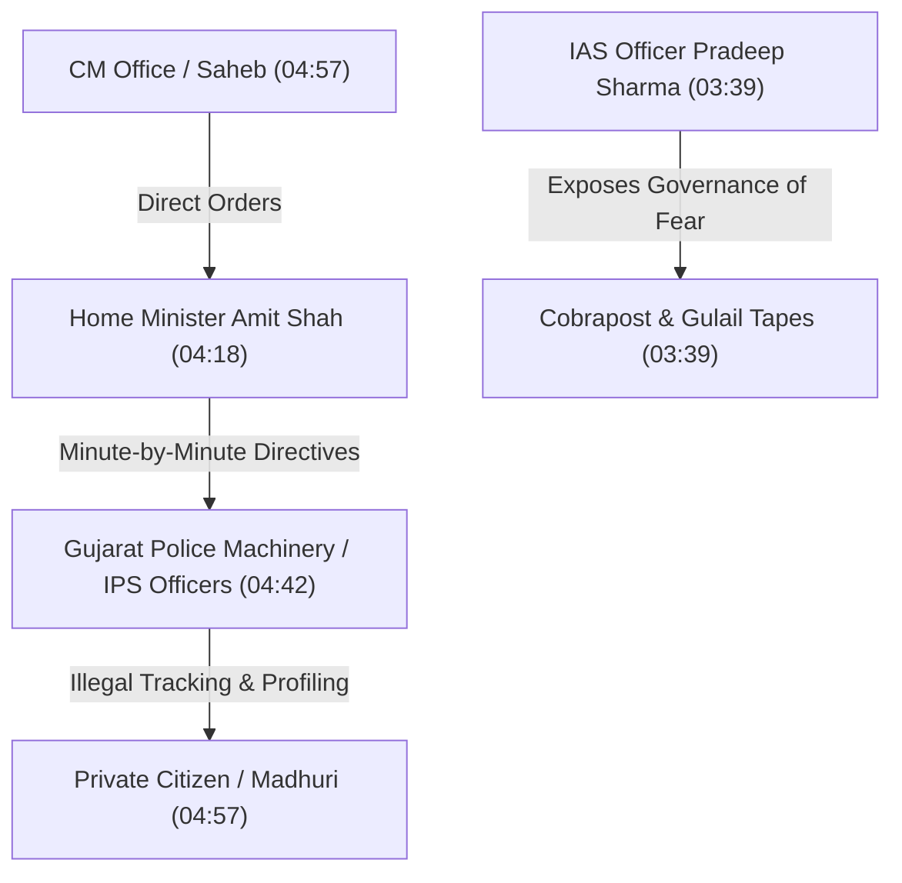
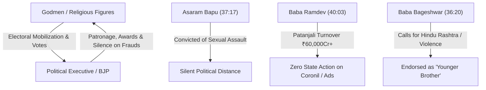

# Detailed Study Notes — 75 TOP FAILS of Modiji (part 1)

## 📖 Ingestion Overview

This master study note represents a complete, high-fidelity distillation of the political documentary/satire video titled **"75 TOP FAILS of Modiji (part 1)"** by creator **Official PeeingHuman** (Ramit Verma). The video constitutes Part 1 of a 3-part series documenting 75 major political controversies, policy reversals, slips of the tongue, and structural missteps across Prime Minister Narendra Modi's political career.

- **Source URL**: [https://www.youtube.com/watch?v=Lr8sh3_sKA0](https://www.youtube.com/watch?v=Lr8sh3_sKA0)
- **Creator**: Official PeeingHuman (Ramit Verma)
- **Publication Date**: 2025-10-02
- **Total Duration**: ~51:48
- **Consolidation**: Complete merged document (Part 01 + Part 02, covering all 35 Goldmine moments of Part 1).

---

## ⚖️ Section 0: Disclaimer & Constitutional Mandate (00:00 - 00:37)

### 1. Freedom of Speech and Purpose of Video (00:00 - 00:37)
- **Core Claim (00:00)**: Under the Constitution of India, every citizen possesses the fundamental right to freedom of speech and expression. If viewers object to critical discourse, they are advised to use earphones, turn off television sets, and stay hydrated.
- **Constitutional Basis (00:00)**: Cites **Article 51A(h)** of the Constitution of India, which mandates every Indian citizen to develop a **scientific temper, humanism, and the spirit of inquiry and reform**.
- **Copyright & Fair Use (00:00)**: Material is utilized under Section 52 of the Indian Copyright Act, 1957, and Section 107 of the US Copyright Act, 1976, covering fair use for criticism, news reporting, and review.
- **Background & Occasion (00:16)**: Produced on the occasion of PM Narendra Modi's 75th birthday, marking the longest documentary project undertaken by the channel over its 10-year history.

---

## 🎯 Section 1: Introduction & The Opposition Deficit (00:38 - 02:20)

### 1. Fulfilling the Role of Political Opposition (00:38 - 01:08)
- **Context (00:38)**: Responding to PM Modi's public remark that the single greatest deficiency in his life is the lack of a constructive political opposition, the creator elected to act as an adversarial opposition by compiling a comprehensive critique of Modi's speech and policy track record.
- **Satirical Framing (01:09)**: PM Modi has frequently claimed in private and public statements that criticism is a "goldmine" and a valuable treasure for his personal development. Consequently, this compilation presents "75 Goldmine Moments" highlighting key missteps.
- **Media Ecosystem Context (01:36 - 02:05)**: Over 11 years of controlled mainstream media reporting, a carefully curated public image of PM Modi has been constructed. Unmasking political realities is framed as a civic responsibility.

---

## 🍃 Section 2: Public Slips of the Tongue & Rhetorical Blunders (02:21 - 03:38)

### 1. Topic #1: "Weed Energy" Pronunciation Error (02:21 - 03:02)
- **Event Context (02:21)**: During a 2015 official address in Canada regarding renewable energy initiatives (nuclear, solar, and wind energy), PM Modi mispronounced "wind energy" as **"weed energy"**.
- **Historical Significance (02:37)**: This 16-second clip became the first political satire video edited and published by creator Ramit Verma, initiating his long-term channel focus on political commentary.

> *"We need to create an energy revolution in India: nuclear energy, solar energy, weed energy."* (02:37) — *PM Narendra Modi (Canada Speech, 2015)*

### 2. Topic #2: "Beti Patao" & "Investigating in Girls" (03:03 - 03:38)
- **Beti Patao Slip (03:03)**: While promoting the flagship scheme *Beti Bachao, Beti Padhao* (Save the Girl Child, Educate the Girl Child), PM Modi misspoke, stating *"Beti Bachao, Beti Patao"* (Save the Girl Child, Seduce/Woo the Girl Child).
- **Investigating in a Girl Child (03:31)**: In an English speech addressing gender empowerment, PM Modi stated: *"I believe that investigating in a girl child lifts up the entire family"* (substituting "investigating" for "investing").

---

## 🕵️ Section 3: Topic #3 — The Snoopgate Surveillance Scandal (03:39 - 06:39)

### 1. Investigative Revelations & Audio Tapes (03:39 - 04:41)
- **Investigative Exposé (03:39)**: Investigative news platforms *Cobrapost* and *Gulail.com* leaked recorded telephone conversations revealing that the Gujarat state machinery was deployed to conduct illegal surveillance on a young private female architect ("Madhuri").
- **State Power Deployment (04:18 - 04:57)**: Secretly recorded audio tapes featured then-Gujarat Home Minister Amit Shah issuing explicit operational orders to senior police officers (such as IPS officer G.L. Singhal). The surveillance monitored her location, private meetings, social contacts, and personal engagement plans.
- **The "Saheb" Directives (04:57)**: Throughout the taped phone calls, Amit Shah repeatedly cited orders from a high-ranking authority referred to exclusively as **"Saheb"** (Boss/Master).

### 2. Official Denials and Administrative Environment (05:27 - 06:39)
- **Refusal of Media Scrutiny (05:27)**: When pressed in interviews regarding the authenticity of the audio tapes, Amit Shah refused to answer, demanding journalists approach the Supreme Court rather than raise questions on television.
- **Father's Defense Statement (05:54)**: The young woman's father released a public statement asserting he had orally requested CM Modi to provide security oversight for his daughter without any formal written application.
- **Governance of Fear (06:22)**: Senior IAS Officer Pradeep Sharma (former District Magistrate of Kutch) testified that Gujarat under Modi's administration operated under a "governance of fear" rather than good governance.

---

## 🩸 Section 4: Topic #4 — Gujarat 2002 Violence & Judicial Clean Chit (06:40 - 09:19)

### 1. 2002 Violence Overview & Legal Outcome (06:40 - 07:09)
- **Empirical Context (06:40)**: During three days of communal violence in Gujarat in 2002, between 1,000 and 2,000 Indian Muslims were killed. Senior police officers (Sanjiv Bhatt, R.B. Sreekumar) and former minister Haren Pandya alleged direct state executive involvement.
- **Supreme Court SIT Verdict (06:40)**: In 2022, the Supreme Court of India upheld the Special Investigation Team (SIT) clean chit for Narendra Modi, ruling that clear actionable evidence of direct conspiracy was lacking.

### 2. Tehelka Sting Operation Statements (07:10 - 08:05)
- **On-Camera Confessions (07:10)**: Members of the Sangh Parivar (VHP, Bajrang Dal, BJP), including Babu Bajrangi, were recorded on undercover sting cameras asserting that CM Modi provided a 3-day operational window for violence and personally facilitated their legal release from prison by transferring judges.

> *"What Narendra Bhai did in Gujarat, no one else could ever do... He gave a three-day window to do whatever was needed... When we were jailed, Narendra Bhai arranged for our release by replacing judges."* (07:27 - 08:06) — *Babu Bajrangi (Tehelka Sting Recording)*

### 3. Response to Remorse & Public Accountability (08:28 - 09:19)
- **Rejection of Remorse (08:28)**: When asked by journalists if he felt a need to apologize or repent for the 2002 events, Modi dismissed the question, characterizing criticism as a Congress-driven "Muslim vote bank" agenda and foreign-funded media propaganda.
- **Contrasting Rhetoric on Punishment (08:52 - 09:13)**: In another public address, PM Modi asserted that if he were ever found guilty of any wrongdoing or mistake, he should receive Saudi-style public execution.

> *"If a mistake or crime is proven against Modi, do not forgive him. Modi should be hanged publicly at a crossroads."* (08:52 - 09:13) — *PM Narendra Modi*

---

## 💸 Section 5: Topic #5 — Demonetisation & Narrative Shifting (09:20 - 11:57)

### 1. The 50-Day Crossroads Pledge (09:20 - 09:55)
- **Policy Announcement (09:20)**: On 8 November 2016, PM Modi announced the immediate demonetisation of high-value ₹500 and ₹1,000 banknotes, wiping out 86% of circulating currency overnight.
- **Public Ultimatum (09:37)**: PM Modi requested 50 days (until 30 December 2016) from the public, promising that if the objective failed or ill intent was proven, he would submit to any punishment at a public crossroads.

### 2. Reserve Bank of India (RBI) Data & Narrative Pivot (10:12 - 11:57)
- **Reserve Bank of India (RBI) Data (10:29)**: Official RBI data revealed that **99.3%** of all demonetised currency was deposited back into the banking system. The policy succeeded in wiping out at most **0.7%** of estimated illicit cash.
- **Speech Focus Pivot (10:53 - 11:19)**: Statistical content analysis of PM Modi's addresses demonstrates a major pivot in justification:
  - **8 November 2016 Address**: 78% of speech focus was placed on combating "Black Money" and 22% on counterfeit notes.
  - **28 November 2016 Address (20 days later)**: 73% of speech focus shifted to promoting "Cashless Digital Payments" and private apps (e.g., Paytm).

---

## 🏛️ Section 6: Topic #6 — Unfulfilled Black Money & ₹15 Lakh Promise (11:58 - 13:59)

### 1. 2014 Campaign Promises vs Parliament Disclaimers (11:58 - 13:44)
- **2014 Election Campaign Claims (11:58 - 12:42)**: During the 2014 Lok Sabha campaign, PM Modi pledged to form a specialized task force within 100 days of taking office to repatriate all illegal wealth stashed in Swiss and foreign banks.
- **The ₹15-20 Lakh Promise (12:42 - 13:00)**: Modi publicly claimed that the volume of foreign black money was so immense that once recovered, every poor citizen could receive ₹15 to ₹20 lakh deposited directly into their bank account for free.
- **Parliamentary Admission (13:21)**: Post-election, the government officially stated in Parliament that it possessed **no concrete official estimate** of total black money deposited in foreign bank accounts.

---

## 👑 Section 7: Topic #7 — Non-Biological Divine Origin & "Bhagwan Modi 2047" (14:00 - 16:16)

### 1. Corporate Endorsement & 2047 Vision (14:00 - 14:28)
- **Mukesh Ambani's Address (14:05)**: On PM Modi's 75th birthday, industrialist Mukesh Ambani publicly expressed his wish that PM Modi remain in office until India celebrates its centenary of independence in 2047 (at which point Modi would be 97 years old).

### 2. Declaration of Non-Biological Origin (14:52 - 15:09)
- **Interview Statement (14:52)**: In a pre-election 2024 television interview with anchor Rubika Liyaquat, PM Modi formally declared that he is convinced he was not born biologically.

> *"Until my mother was alive, I believed I was born biologically. After her passing, combining all my experiences, I am convinced that God (Parmatma) has sent me. This energy is not derived from a biological body."* (14:52 - 15:09) — *PM Narendra Modi*

### 3. Deification by Media and Followers (15:40 - 16:16)
- **Cult of Personality (15:40)**: Mainstream anchors and political supporters were documented declaring PM Modi to be a "living God", an avatar of Lord Ram or Lord Krishna sent directly to rule India.

---

## 🎤 Section 8: Topics #8 & #9 — Media Sycophancy & The "Scolding" Masterstroke (16:17 - 18:50)

### 1. Topic #8: Sycophantic 2024 Election Interviews (16:17 - 17:32)
- **Question Framing (16:17)**: During the 2024 Lok Sabha campaign, television anchors abstained from policy interrogation, framing questions around campaign slogans (*"Abki Baar 400 Paar"*), asking if elections were a mere formality, and reciting rhyming couplets about snacks and beverages.

### 2. Topic #9: Modi Scolding Sycophantic Anchors (17:33 - 18:50)
- **On-Camera Reprimand (17:33)**: When an anchor attempted to compliment Modi by claiming they had asked the "toughest possible questions", Modi interrupted and scolded the anchors on air, accusing them of being cowardly (*buzdil*) and operating under the control of an opposition "ecosystem".

> *"You people are living under immense pressure and fear of an ecosystem. You ask questions dictated by their agenda rather than asking what the country actually needs."* (17:58 - 18:14) — *PM Narendra Modi*

---

## 📺 Section 9: Topics #10 - #13 — Media Control, NaMo TV, & Zero Press Conferences (18:51 - 24:19)

### 1. Topic #10: Post-2002 Media Management Strategy (18:51 - 20:26)
- **2002 Admission (18:51)**: In a historical post-2002 interview, Modi acknowledged that his weakest operational area during the 2002 riots was "handling the media".
- **Post-2014 Transformation (20:10)**: Following 2014, critical independent reporting was systematically curtailed. When the BBC released its 2023 documentary *India: The Modi Question*, mainstream television channels aggressively campaigned for BBC to be expelled from India (*"BBC Quit India"*).

### 2. Topic #11: The Scripted Poet Telecast Blunder (20:27 - 21:27)
- **Scripted Poetry Telecast (20:27)**: During an interview, PM Modi requested a paper file to recite a poem he claimed to have written personally in irregular handwriting.
- **HD Camera Exposure (21:05)**: High-definition camera zoom revealed that the page was not handwritten notes, but a computer-printed sheet containing printed question numbers, questions, and full pre-scripted answers.

### 3. Topic #12: The NaMo TV Propaganda Channel (21:28 - 22:44)
- **Unprecedented Broadcast (21:28)**: Prior to the 2019 General Elections, a proprietary channel named **NaMo TV** was launched across all major DTH platforms simultaneously under both News and Entertainment categories.
- **Feigned Ignorance (21:54)**: In subsequent interviews, Modi feigned ignorance about the channel's ownership, despite having personally promoted its launch on Twitter and through the Narendra Modi App ecosystem. The channel vanished immediately after election day without regulatory audit.

### 4. Topic #13: Zero Press Conferences in 11 Years (22:45 - 24:19)
- **Historical Anomaly (22:45)**: Narendra Modi remains the only Prime Minister in independent Indian history who has failed to hold a single unscripted press conference over an 11-year tenure (2014–present).
- **The May 2019 Press Conference (23:00)**: In May 2019, Modi appeared at a press conference table alongside Amit Shah but refused to take any questions, redirecting all media queries to Shah.

---

## 🤝 Section 10: Topics #14 - #16 — Corporate Cronyism & The Nehru Obsession (24:20 - 27:25)

### 1. Topic #14: The Adani BFF Relationship (24:20 - 25:41)
- **Wealth Surge (24:20)**: Parliamentary opposition figures highlighted that industrialist Gautam Adani's net worth expanded from **$8 billion in 2014** to **$140 billion in 2022**.
- **Historical & Policy Favors (24:43 - 25:37)**: Documented ties date back to 2008 (Adani attending Modi's RSS book launch). Critics cite systemic allocation of land at rock-bottom valuations, modification of airport operational regulations, and Adani securing major international infrastructure concessions immediately following state visits by PM Modi.

### 2. Topic #15: Ambani Family Events & Blaming Nehru (25:42 - 26:29)
- **Corporate Presence (25:42)**: PM Modi frequently attends private Ambani family functions and infrastructure inaugurations. When questioned regarding potential conflict of interest, Modi deflects by claiming that past accusations against Jawaharlal Nehru (regarding Tata and Birla) are unfairly recycled against him.

### 3. Topic #16: Copying Nehru's Titles & Style (26:30 - 27:25)
- **Nehru Outerwear & Titles (26:30)**: Satirical analysis notes that while criticizing Nehru, Modi rebranded the traditional "Nehru Jacket" as the "Modi Jacket".
- **Pradhan Sevak Title (27:00)**: Modi adopted the title **"Pradhan Sevak"** (Prime Servant), directly copying Jawaharlal Nehru's historic declaration that he preferred to be called the "First Servant of India".

---

## 🧒 Section 11: Topics #17 & #18 — Physical Interactions & Pseudo-Scientific Claims (27:25 - 29:14)

### 1. Topic #17: Physical Behavior with Children (27:25 - 27:52)
- **Context & Contrast (27:25)**: While attempting to construct a public image similar to Jawaharlal Nehru's affection for children ("Chacha Nehru"), PM Modi's public interactions with children frequently feature uncomfortable physical gestures, such as pulling ears, pinching, or tapping faces on camera.

### 2. Topic #18: Pseudo-Scientific Temper & Mythology as Science (27:53 - 29:14)
- **Plastic Surgery & Genetics Claims (28:06 - 28:37)**: At the 2014 inauguration of a Reliance Hospital in Mumbai, PM Modi publicly asserted that ancient India possessed advanced genetic science and plastic surgery, citing mythological figures:
  - Claimed Karna was not born from a mother's womb, proving genetic science existed in ancient times.
  - Claimed Lord Ganesha's elephant head grafted onto a human body marked the inception of plastic surgery.
- **Anti-Evolution Rhetoric by Union Minister (28:37 - 29:02)**: Inspired by such claims, former Union Minister Satya Pal Singh publicly rejected Charles Darwin's Theory of Evolution, asserting that no ancestor recorded seeing a monkey turn into a human, and claiming Indians are direct non-biological offspring of ancient sages (*Rishis*).

> *"Mahabharata says Karna was not born from his mother's womb. This means genetic science existed at that time... We worship Lord Ganesha; there must have been a plastic surgeon who grafted an elephant's head onto a human body."* (28:06 - 28:37) — *PM Narendra Modi*

---

## 🎓 Section 12: Topics #19 & #20 — Educational Qualification & Media Camera Framing (29:15 - 31:39)

### 1. Topic #19: Degree Controversy & "Photogenic" Reading (29:15 - 30:35)
- **"M.A. in Entire Political Science" (29:15)**: Following opposition allegations that PM Modi's academic degrees were unverified, Union Minister Amit Shah held a press conference displaying open university marksheets.
- **Delhi High Court Blocking Release (29:15)**: The Delhi High Court subsequently set aside a Central Information Commission (CIC) directive, ruling that the university need not disclose PM Modi's degree details as it constitutes personal information.
- **Photogenic Per-Page Reading Speed (30:13)**: In an interview, Modi claimed a unique reading capability, stating he does not read pages line-by-line but absorbs entire pages instantaneously in a single glance ("photogenic memory").

### 2. Topic #20: Camera Awareness & SPG Reprimands (30:36 - 31:39)
- **Reprimanding SPG Commandos (30:55)**: Archival footage demonstrates PM Modi scolding Special Protection Group (SPG) security personnel on camera when they briefly blocked camera view while Arun Jaitley presented him a flower bouquet.
- **Frame Positioning Discipline (31:11)**: Following the incident, security protocol was altered so personnel jump out of camera sight lines. Additional clips show Modi withholding public waves until he steps precisely into designated camera frame boundaries.

---

## 🏆 Section 13: Topics #21 - #23 — Influencer Ecosystem & The "Kare Toh Kare Kya" Outro (31:40 - 34:23)

### 1. Topic #21: National Creator Awards 2024 (31:40 - 32:54)
- **Pre-Election Outreach (31:40)**: Ahead of the 2024 General Elections, the Prime Minister's Office instituted the inaugural **National Creator Awards**.
- **Coordinated Influencer Content (32:19 - 32:53)**: Awards were predominantly conferred upon pro-government content creators (e.g., Ranveer Allahabadia), who subsequently released coordinated promotional videos praising PM Modi's "intense, other-worldly energy".

### 2. Topic #22 & #23: Non-Biological Energy & Origin of Channel Outro (32:55 - 34:23)
- **Non-Biological Energy Narrative (32:55)**: Mainstream television anchors repeatedly questioned Modi regarding his source of stamina ("Why don't you get tired?", "What tonic do you consume?").
- **London Townhall Origin (33:30)**: At a public event in London, a young audience member asked PM Modi the same scripted energy question.
- **Discovery of Channel Outro (33:52)**: Investigation revealed that the young interviewer's father was a BJP spokesperson. In separate media footage, this spokesperson uttered the iconic line: *"Kare toh kare kya? Bole toh bole kya?"* (What should we do? What should we say?), which creator Ramit Verma adopted as the signature satirical outro for hundreds of channel videos.

---

## 🏛️ Section 14: Topics #24 - #27 — Speech Strategy & Support for Controversial Godmen (34:24 - 40:02)

### 1. Topic #24: SRCC 2013 Speech & "Mouse Charmers" (34:24 - 36:19)
- **SRCC Keynote Address (34:24)**: Modi's 2013 speech at Shri Ram College of Commerce (SRCC) was broadcast live across news channels, establishing his campaign narrative of converting national pessimism into optimism.
- **Glass Half-Full Analogy (35:10)**: Modi redefined the glass analogy, arguing that a glass is never half-empty—it is 100% full (half water, half air).
- **From Snake Charmers to Mouse Charmers (35:42)**: Modi recounted a story told to a Taiwanese engineer, asserting India has evolved from a land of "snake charmers" to "mouse charmers" driving global technology via computer mice.

### 2. Topic #25: Baba Bageshwar / Dhirendra Krishna Shastri (36:20 - 37:16)
- **State Patronage (36:20)**: PM Modi publicly addressed self-styled godman Baba Bageshwar as his "younger brother".
- **Superstition & Vigilantism (36:38 - 37:06)**: Baba Bageshwar claims supernatural powers of reading past/future details on paper slips, performs exorcisms, and openly calls for armed vigilante violence to establish a *Hindu Rashtra*.

### 3. Topic #26: Asaram Bapu (37:17 - 38:37)
- **Electoral & Political Alliance (37:17)**: During the 1990s and 2000s, top BJP leaders and CM Modi actively sought blessings from Asaram Bapu. Modi stated on camera that he had received Asaram's personal affection since before entering public office.
- **Post-Conviction Disassociation (38:20)**: Following Asaram's conviction for sexual assault of a minor, Modi disassociated without public comment, while Asaram defended himself by alleging foreign conspiracy against Indian saints.

### 4. Topic #27: Satya Sai Baba (38:38 - 40:02)
- **Sleight-of-Hand Exploits (38:38)**: Godman Satya Sai Baba accumulated vast wealth by performing sleight-of-hand tricks (producing holy ash, gold chains, and eggs from thin air), presented as divine miracles.
- **Defense Against Abuse Allegations (38:58)**: When American and Australian victims raised allegations of child abuse, former PM Atal Bihari Vajpayee signed an official defense letter dismissing allegations as foreign propaganda.
- **Continued Eulogies (39:40)**: A decade after Satya Sai Baba's death, PM Modi continues to praise his legacy to secure devotee support.

---

## 🧴 Section 15: Topic #28 — Baba Ramdev & Coronil Commercial Empire (40:03 - 42:11)

### 1. Campaign Partnership to Commercial Expansion (40:03 - 40:56)
- **2014 Campaign Support (40:03)**: Baba Ramdev campaigned extensively for Modi in 2014, promising black money return and eradication of corruption.
- **Revenue Growth (40:39)**: Under Modi's tenure, Patanjali's business revenue expanded from **₹2,000 crore in 2014 to over ₹60,000 crore**. Ramdev subsequently bestowed the title *Rashtra Rishi* on PM Modi.

### 2. Coronil Misleading Claims & Supreme Court Censure (41:16 - 42:11)
- **Unverified COVID Remedy (41:16)**: During the COVID-19 pandemic, Ramdev marketed "Coronil" as an absolute cure and preventive vaccine for COVID-19.
- **Supreme Court Rebukes (41:34)**: The Supreme Court of India censured Ramdev and Patanjali for misleading advertisements and false attacks on modern medicine. The Central Government took zero regulatory action against Patanjali.

---

## 📉 Section 16: Topics #29 - #33 — Economic Hypocrisy, Unemployment, & Housing Demolitions (42:12 - 47:26)

### 1. Topic #29: Rupee Exchange Rate Hypocrisy (42:12 - 42:47)
- **2014 Rhetoric vs Present Record (42:12)**: In 2014, Modi claimed the falling Rupee was in the "ICU between life and death" due to government corruption. Under his own tenure, the Rupee depreciated to historical lows against the USD without government accountability.

### 2. Topic #30: Unemployment & "Pakoda" Economics (42:48 - 44:29)
- **Unemployment Crisis (42:48)**: CSDS survey data indicates that **83% of India's unemployed population consists of youth**, with over 60% of citizens rating unemployment and inflation as top national concerns.
- **Pakoda Employment Defense (43:28)**: In a television interview, Modi defended his employment creation record by arguing that a person selling *pakodas* (fritters) outside a news studio earning ₹200 a day must be counted as gainfully employed.

### 3. Topic #31: Open Defecation Free (ODF) Falsehood (44:30 - 45:19)
- **2019 ODF Declaration (44:30)**: PM Modi declared rural India 100% Open Defecation Free in 2019.
- **WHO & UNICEF Findings (44:49)**: Joint WHO/UNICEF monitoring reports published 3 years later revealed that **17% of India's rural population still practiced open defecation**, and **25% lacked basic sanitation facilities**.

### 4. Topic #32 & #33: Farmers' Income, Pucca Makaan, & Bulldozer Demolitions (45:20 - 47:26)
- **Farmers' Income Failure (45:20)**: Pledged to double farmers' income by 2022. Reality: Farmer incomes stagnated, and an average of **30 farmers die by suicide daily in India**.
- **Housing Promise vs Bulldozer Politics (46:02)**: Promised a *pucca* house for every Indian family by 2022. In practice, municipal and state authorities executed overnight 3:00 AM bulldozer demolitions of poor residents' housing prior to court hearings.
- **K-Shaped Economic Inequality (47:06)**: When questioned on international economist reports highlighting K-shaped economic divergence (rich growing richer, poor growing poorer), Modi offered a sarcastic response: *"So should everyone be made poor?"*

---

## 🧎 Section 17: Topics #34 & #35 — Contradictory Alms Claims & Hidden Marriage Disclosure (47:27 - 50:59)

### 1. Topic #34: Conflicting Mendicant ("Bhiksha") Claims (47:27 - 48:29)
- **Mathematical Inconsistency (47:27)**: Modi has made conflicting public claims regarding his years spent as a wandering mendicant (*fakir*) begging for alms:
  - Claimed in one address he begged for alms for **35 years**.
  - Claimed in another address he begged for alms for **40 years**.
- **Timeline Verification (48:10)**: Modi left home at age 17 in 1967 and became Chief Minister of Gujarat in 2001 (a total span of 34 years), rendering both the 35-year and 40-year claims mathematically impossible.

### 2. Topic #35: Concealed Marriage in Election Affidavits (48:30 - 50:59)
- **Affidavit Omissions (48:30)**: For four consecutive Gujarat Assembly elections, Modi left the spouse column blank in official nomination papers.
- **2014 Disclosure (48:45)**: In his 2014 Lok Sabha nomination affidavit, Modi formally acknowledged for the first time that he was married to Jashodaben, stating they married 45 years prior (in 1968, when he was 18).
- **Ground Reality in Marital Village (49:42 - 50:31)**: Field reporting from Modi's marital village revealed a complete absence of paved roads and basic development, contradicting claims that the "Gujarat Model" delivered paved roads to 99% of villages.

---

## 🎬 Section 18: Series Structure & Creator Workflow (51:00 - 51:48)

### 1. Video Division & Channel Workflow (51:00 - 51:48)
- **Part Division (51:00)**: Creator Ramit Verma notes that Part 1 covers 35 moments, while the remaining 40 moments will be presented in Part 2.
- **Solo Creator Workflow (51:30)**: Explains the extensive effort required for solo production (writing, directing, researching, editing, producing), appealing for subscriber engagement under fair use principles.

---

## 📊 Comprehensive Master Table: All 35 Topics & Verified Empirical Outcomes

| Topic & Timestamp | Topic Category & Claim | Verified Empirical Reality / Impact |
| :--- | :--- | :--- |
| **1. Weed Energy (02:21)** | Slips of Tongue: Renewable Energy | Mispronounced "wind energy" as "weed energy" in 2015 Canada speech |
| **2. Beti Patao / Investigating (03:03)** | Slips of Tongue: Female Welfare | Said "Beti Patao" & "investigating in a girl child" in official addresses |
| **3. Snoopgate Scandal (03:39)** | Illegal State Surveillance | Police deployed by Home Minister Shah under "Saheb" orders to track private female citizen |
| **4. Gujarat 2002 Violence (06:40)** | Executive Accountability | SC SIT clean chit in 2022; Tehelka sting exposed Sangh members boasting of judge transfers |
| **5. Demonetisation (09:20)** | Anti-Black Money Policy | **99.3% currency returned**; 0.7% black money wiped; speech focus shifted **73%** to digital cash |
| **6. Black Money Task Force (11:58)** | Foreign Cash & ₹15 Lakh | Govt admitted in Parliament zero estimate of foreign black money; shifted focus to 2047 |
| **7. Divine Origin / Bhagwan (14:00)** | Non-Biological Divine Origin | Modi claimed non-biological origin sent by God; Ambani wished tenure till 2047 (age 97) |
| **8. Sycophantic Interviews (16:17)** | 2024 Election Media Coverage | Anchors asked lobbed questions, recited rhyming slogans (*"400 Paar"*) & poetry |
| **9. Scolding Anchors (17:33)** | Controlling Media Framing | Modi reprimanded anchors on air, calling them cowardly (*buzdil*) under ecosystem fear |
| **10. 2002 Media Control (18:51)** | Managing Media & Suppression | Modi admitted 2002 weak area was media handling; TV anchors later demanded BBC ban |
| **11. Scripted Poet (20:27)** | Spontaneous Poetry Reading | HD camera revealed computer printout of pre-printed questions & answers on paper file |
| **12. NaMo TV (21:28)** | Proprietary Channel Promotion | Broadcast across DTH under news/entertainment; vanished post-2019 election without audit |
| **13. Zero Press Conferences (22:45)** | Media Accountability | **0 unscripted press conferences** held in 11 years (2014–present); zero questions taken at 2019 conference |
| **14. Adani Relationship (24:20)** | Corporate Cronyism | Adani net worth expanded from **$8B (2014)** to **$140B (2022)** amid rule changes & foreign visit contracts |
| **15. Ambani Events & Nehru (25:42)** | Corporate Ties Deflection | Attended Ambani functions; deflected conflict of interest questions by blaming Nehru |
| **16. Nehru Title & Style (26:30)** | Image Rebranding | Rebranded Nehru Jacket as Modi Jacket; adopted Nehru's "First Servant" title as "Pradhan Sevak" |
| **17. Physical Interactions (27:25)** | Image Building with Children | Public interactions featured awkward face pinching and ear pulling on camera |
| **18. Pseudoscience & Myths (27:53)** | Ancient Science Claims | Claimed ancient plastic surgery (Ganesha) & genetics (Karna); Minister denied Darwinian evolution |
| **19. Entire Political Science (29:15)** | Educational Qualifications | Delhi High Court blocked CIC degree disclosure order citing personal privacy |
| **20. SPG Camera Reprimand (30:36)** | Extreme Camera Awareness | Scolded SPG on camera for blocking view; holds waves until stepping into camera frame bounds |
| **21. Creator Awards (31:40)** | Influencer Electoral Strategy | Instituted National Creator Awards 2024; awardees released reciprocal promotional praise videos |
| **22. Non-Biological Energy (32:55)** | Media Stamina Discussions | Media anchors repeatedly questioned Modi on his stamina ("What tonic do you take?") |
| **23. Kare Toh Kare Kya (33:30)** | London Question & Outro | Scripted energy question by BJP spokesperson's son led to channel's signature outro meme |
| **24. SRCC 2013 Speech (34:24)** | Rhetorical Narrative Strategy | Glass half-full analogy; claimed India evolved from "snake charmers" to "mouse charmers" |
| **25. Baba Bageshwar (36:20)** | Religious Extremism Patronage | Endorsed Bageshwar as "younger brother"; Bageshwar calls for vigilante violence & *Hindu Rashtra* |
| **26. Asaram Bapu (37:17)** | Political Alignment & Silence | Modi sought blessings from Asaram for years; stayed silent post-conviction for child sexual assault |
| **27. Satya Sai Baba (38:38)** | Sleight-of-Hand Godmen | Vajpayee defended Sai Baba against foreign abuse claims; Modi continues to eulogize legacy |
| **28. Baba Ramdev (40:03)** | Commercial Growth & Coronil | Patanjali turnover grew from ₹2,000Cr to ₹60,000Cr+; SC censured false Coronil COVID cure ads |
| **29. Rupee Hypocrisy (42:12)** | Economic Exchange Rate | Claimed Rupee in ICU in 2014; Rupee hit historical record lows under Modi's own tenure |
| **30. Pakoda Employment (42:48)** | Job Creation Record | Defined selling pakodas as employment; **83% of unemployed are youth** (CSDS survey) |
| **31. ODF Lie (44:30)** | Rural Sanitation Claims | Declared 100% ODF in 2019; WHO/UNICEF report found **17% rural open defecation** 3 years later |
| **32. Farmer Income Bogus (45:20)** | Agrarian Economy Promises | Pledged to double farmer income by 2022; average of **30 farmer suicides daily** |
| **33. Pucca Makaan & Bulldozers (46:02)** | Housing & Income Inequality | Promised pucca houses for all; executed 3:00 AM bulldozer demolitions; mocked K-shaped growth |
| **34. Bhiksha Contradiction (47:27)** | Mendicant Phase Claims | Conflicting claims of begging for 35 or 40 years; mathematically impossible (34 years total) |
| **35. Concealed Marriage (48:30)** | Electoral Affidavit Disclosures | Concealed marriage in 4 election affidavits; disclosed Jashodaben in 2014; marital village unpaved |

---

## 📌 Master Key Takeaways & Direct Quotes

> *"Until my mother was alive, I believed I was born biologically. After her passing, combining all my experiences, I am convinced that God has sent me. This energy is not derived from a biological body."* (14:52) — **PM Narendra Modi**

> *"You people are living under immense pressure and fear of an ecosystem. You ask questions dictated by their agenda rather than asking what the country actually needs."* (17:58) — **PM Narendra Modi (scolding television anchors)**

> *"If a mistake or crime is proven against Modi, do not forgive him. Modi should be hanged publicly at a crossroads."* (08:52) — **PM Narendra Modi**

> *"Mahabharata says Karna was not born from his mother's womb. This means genetic science existed at that time... We worship Lord Ganesha; there must have been a plastic surgeon who grafted an elephant's head onto a human body."* (28:06) — **PM Narendra Modi**

> *"If a person sells pakodas outside a TV studio and earns ₹200 a day, should that not be considered employment?"* (43:28) — **PM Narendra Modi**

---

## 🔗 Related & Source Metadata

- **Source Captured File**: `[[01_RAW/CAPTURE/75 TOP FAILS of Modiji (part 1).md]]`
- **Part 01 Working Draft**: `[[01_RAW/PROCESS/75-top-fails-of-modiji-part-1-part-01.md]]`
- **Part 02 Working Draft**: `[[01_RAW/PROCESS/75-top-fails-of-modiji-part-1-part-02.md]]`
- **Final Merged Master File**: `[[01_RAW/PROCESS/75-top-fails-of-modiji-part-1-final.md]]`
- **Primary MOC**: `[[03_MOC/yt-moc|YouTube MOC]]`
