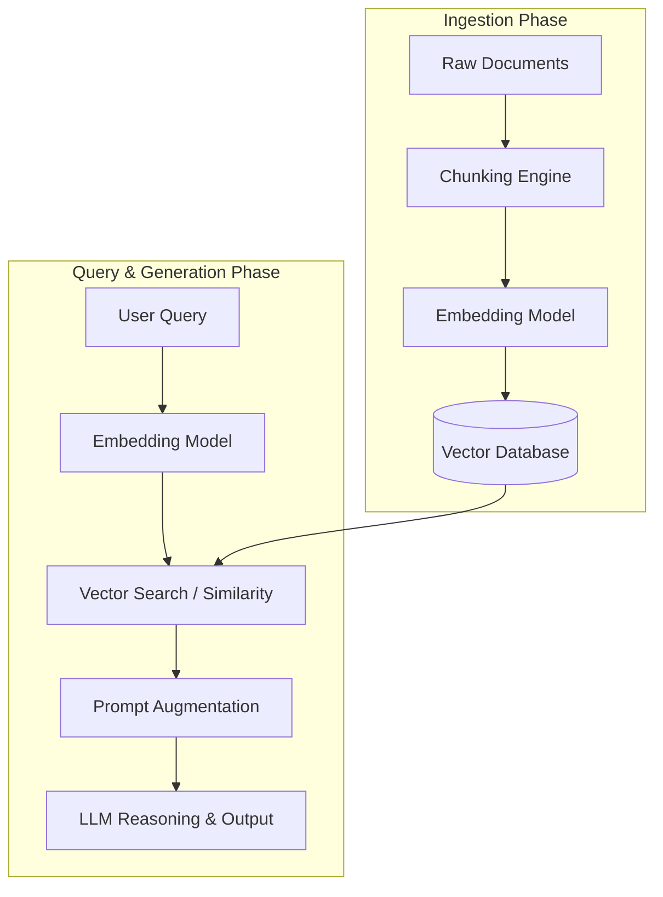

# What is RAG? Retrieval Augmented Generation

This literature note synthesizes the core principles, pipeline architecture, failure modes, and advanced patterns of **Retrieval Augmented Generation (RAG)** based on the technical breakdown by MLTut (Hadel Zafar).

---

## 📌 Executive Summary

Large Language Models (LLMs) excel at language reasoning but fail as reliable databases due to static knowledge cutoffs, context window limits, and hallucinations. **Retrieval Augmented Generation (RAG)** decouples reasoning from memory by fetching relevant text passages from external databases at query time and injecting them into the LLM prompt.

---

## 🧠 Core LLM Bottlenecks Addressed by RAG

1. **Static Knowledge Cutoff**: Pre-trained LLM weights are frozen after training and cannot answer questions regarding real-time or updated data.
2. **Hallucination**: LLMs predict probable next tokens rather than verifying facts against structured data.
3. **Context Window Limitations & Costs**: Passing full document libraries into a single prompt is computationally expensive, increases latency, and risks token neglect ("Lost in the Middle").

---

## 🛠️ The 9-Step RAG Pipeline

### Ingestion & Indexing Phase
1. **Document Ingestion**: Gather raw text (PDFs, docs, web pages, code).
2. **Document Chunking**: Divide documents into smaller, manageable passages.
3. **Embedding Generation**: Convert text chunks into high-dimensional vector representations.
4. **Vector DB Storage**: Index vectors in a vector database (Pinecone, Qdrant, Weaviate, PGVector, Chroma).

### Query & Generation Phase
5. **Query Submission**: Receive the user's question.
6. **Query Embedding**: Convert query into the vector space using the matching embedding model.
7. **Semantic Search**: Perform similarity search (e.g., Cosine/Euclidean distance) to fetch top-K relevant chunks.
8. **Prompt Augmentation**: Construct an augmented prompt containing retrieved passages and query.
9. **Grounded Generation**: LLM reads passages and generates a factual response.

---

## ✂️ Chunking Strategies

| Strategy | Description | Best For | Trade-off |
|---|---|---|---|
| **Fixed-Size** | Splits at fixed token intervals (e.g., 500 tokens) | Simple baseline | May slice across sentences |
| **Sentence-Based** | Splits at sentence boundaries | Short Q&A | Lacks broader topic context |
| **Paragraph-Based** | Splits at double newlines | Articles, documentation | Variable chunk sizes |
| **Semantic Chunking** | Uses AI to detect topic shift boundaries | High precision text | Computationally expensive |
| **Sliding Window Overlap** | Overlaps adjacent chunks (e.g., 10-20%) | General production RAG | Prevents boundary context loss |

---

## ⚠️ 5 Common RAG Failure Modes & Remedies

1. **Bad Retrieval**: Weak embeddings or poor chunking return irrelevant chunks. *Fix: Reranking & domain-tuned embeddings.*
2. **Missing Information**: Query asks for data missing from knowledge base. *Fix: System prompt instructing LLM to say "I don't know".*
3. **Context Overload**: Too many chunks dilute focus. *Fix: Strict top-K filtering with re-rankers.*
4. **Stale Index**: Source documents changed but vector DB wasn't updated. *Fix: Automated event-driven indexing pipelines.*
5. **Exact Match Failure**: Technical terms or model numbers missed by semantic search. *Fix: Hybrid search (BM25 + Vector Search).*

---

## 🚀 Advanced RAG Architecture Patterns

- **[[Reranking in RAG]]**: Secondary cross-encoder model scoring candidate chunks for precise answer relevance.
- **Query Expansion**: Generating multiple query rephrasings to broaden candidate retrieval.
- **[[Contextual Retrieval]]**: Appending document-level context summaries to individual chunks before embedding.
- **[[Hypothetical Document Embedding]] (HyDE)**: Embedding an AI-generated hypothetical answer to align with document answer formatting.
- **[[Agentic RAG]]**: Equipping LLMs with tool-calling capabilities to dynamically decide search steps and query refinement.
- **[[GraphRAG]]**: Constructing knowledge graphs to capture complex inter-document relationship topologies.

---

## ⚖️ RAG vs Long Context Windows

| Dimension | Long Context Windows (1M+ Tokens) | RAG Pipeline |
|---|---|---|
| **API Cost** | High (linear scaling per request token) | Low (sends only relevant top-K tokens) |
| **Response Latency** | High | Low (sub-second retrieval + generation) |
| **Data Freshness** | Requires uploading full corpus per query | Re-indexes updated passages incrementally |
| **Attention Accuracy** | Subject to "Lost in the Middle" errors | Precise targeted context injection |

---

## 🔗 Related Vault Concept Nodes
- [[Retrieval Augmented Generation]]
- [[RAG Pipeline Architecture]]
- [[RAG Chunking Strategies]]
- [[RAG Failure Modes]]
- [[Reranking in RAG]]
- [[Contextual Retrieval]]
- [[Hypothetical Document Embedding]]
- [[Agentic RAG]]
- [[GraphRAG]]
- [[RAG vs Long Context Windows]]
