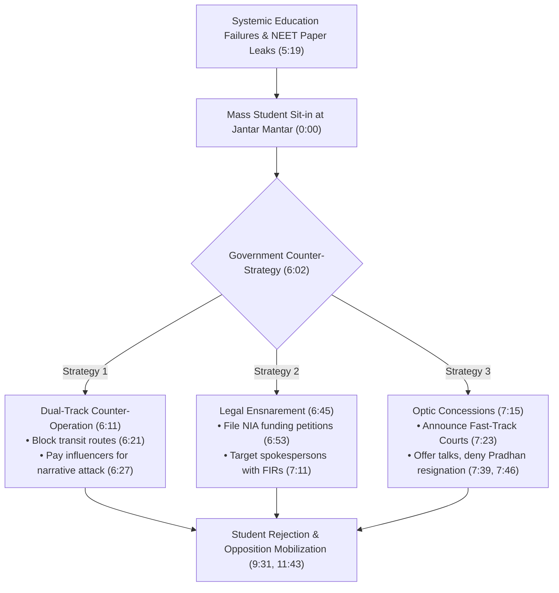
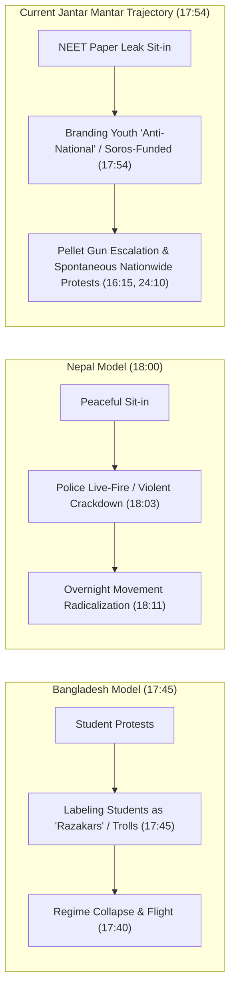

# Detailed Study Notes — Arnab Warns Youth From Being Misled By The CJP's Violent Narrative

## 📖 Ingestion Overview

This note represents a comprehensive, high-fidelity distillation of the political commentary and investigative video titled **"Arnab Warns Youth From Being Misled By The CJP's Violent Narrative"** hosted by **Akash Banerjee** on the independent digital news channel **The Deshbhakt**, published on July 24, 2026. The video provides a detailed critical breakdown of state response tactics, information warfare strategies, judicial reform announcements, and ground realities surrounding the ongoing student sit-in protests led by the Cockroach Janata Party (CJP) at Jantar Mantar, New Delhi, following national examination paper leak controversies (NEET).

- **Video Title**: Arnab Warns Youth From Being Misled By The CJP's Violent Narrative
- **Channel / Creator**: Akash Banerjee / [[The Deshbhakt]]
- **Watch Link**: [YouTube Watch Link](https://www.youtube.com/watch?v=VjJLrsUbyaM)
- **Primary Subject**: Student protests at Jantar Mantar, Union Education Minister Dharmendra Pradhan resignation demand, state counter-strategies (telecom blackouts, false-flag framing, influencer monetization), evaluation of fast-track court announcements, non-lethal weapon deployment (pellet guns), regional political comparisons (Bangladesh and Nepal), and public narrative protection blueprints.

---

## 📽️ Section 1: State Force, Vigilante Counter-Mobilization & Blackout Tactics (0:00 - 4:33)

### 1. Rapid Action Force Deployment & Vigilante Counter-Mobilization (0:00 - 2:09)
- **State Security Escalation (0:00 - 0:10)**: Following weeks of student-led sit-in demonstrations at Jantar Mantar demanding the resignation of Union Education Minister Dharmendra Pradhan, state authorities deployed heavy contingents of Delhi Police and the Rapid Action Force (RAF).
- **Vigilante Infiltration (0:10 - 0:41)**: Counter-protesters and self-identified vigilantes ("shakha goons") entered Central Delhi targeting CJP student protesters. These groups publicly declared intentions to "crush the cockroaches," openly boasting of roaming the capital with ₹500 polycarbonate batons to blockade (*gherao*) Delhi in alignment with police actions (0:18, 0:37).
- **Philosophical & Religious Critiques (0:41 - 1:01)**: The commentary highlights the contradiction between adopting vigilante violence and invoking Sanatan Dharma, noting that resorting to street violence and crude physical intimidation violates foundational Vedic and Upanishadic principles.
- **Police Recruitment & Discipline Breakdown (1:01 - 1:46)**: Questions raised regarding law enforcement standards, as self-proclaimed vigilantes armed with batons created social media Reels, issued public threats, and requested an official one-day administration mandate to execute vigilante actions against protesters (1:14, 1:32).
- **Infiltration Strategy (1:46 - 2:09)**: Rather than deploying standard crowd management techniques (such as brief lathi warnings), non-uniformed counter-protesters were permitted access to Jantar Mantar to deliberately provoke clashes and undermine peaceful sit-ins.

### 2. False-Flag Framing, Area Blackouts & Infrastructure Closures (2:09 - 4:33)
- **Provocative Discrediting Strategy (2:09 - 2:45)**: The state counter-strategy aims to provoke physical skirmishes inside Jantar Mantar so that media narratives can reframe Gandhian peaceful sit-ins as violent public safety threats or riots.
- **Staged Evidence & Unexplained Logistics (2:47 - 3:30)**:
  - *Stone Truck Incident (July 20, 2:47 - 3:09)*: A truck loaded with pelting stones was discovered inside the high-security Jantar Mantar zone. Despite ubiquitous CCTV surveillance and AI tracking in Central Delhi, Delhi Police provided no explanation regarding how the vehicle breached security perimeter.
  - *Abandoned Battered Car (July 23, 2:00 AM, 3:14 - 3:30)*: A severely damaged car was dumped at the protest site, which CJP leadership alleged was planted to manufacture evidence of vandalism and stone-pelting against student demonstrators.
- **Urban & Infrastructure Shutdowns (3:30 - 4:04)**:
  - *Metro Network Disturbance (3:30 - 3:49)*: Metro station closures surrounding Jantar Mantar expanded from 16 to 17 stations, including the Supreme Court station, causing public disruption that prompted Chief Justice of India (CJI) commentary regarding potential judicial intervention.
  - *Commercial Curtailment (3:56 - 4:04)*: Delhi Police instructed commercial establishments in Connaught Place to shut down early by 6:30 PM.
- **Weakened Security Checkpoints (4:04 - 4:33)**: Police crowd control and bag-checking measures at Jantar Mantar were progressively relaxed, creating vulnerabilities for outside agent provocateurs to enter and spark unrest, establishing pretexts for forcible clearance by police and RAF under "law and order" justifications.

| Tactical Category | Incident / Measure | Details & Impact | Context (MM:SS) |
| :--- | :--- | :--- | :--- |
| **Vigilante Mobilization** | Polycarbonate Baton Squads | Non-uniformed counter-protesters roaming Central Delhi with ₹500 batons | Threatening protesters & requesting 1-day police mandate (0:18, 1:32) |
| **Evidence Framing** | Stone-Loaded Truck | Heavy truck loaded with pelting stones delivered to Jantar Mantar | Unresolved breach of high-security zone (2:47, 3:01) |
| **Vandalism Pretext** | Dumped Battered Car | Damaged vehicle left at Jantar Mantar at 2:00 AM on July 23 | Alleged setup to charge CJP with violent vandalism (3:14, 3:20) |
| **Infrastructure Lockout**| Metro & CP Closures | 17 metro stations closed; Connaught Place shops shut at 6:30 PM | Disrupting public transit & Supreme Court access (3:30, 3:56) |
| **Telecom Interdiction**| Mobile Tower Blackout | Orders issued to cell providers to cut tower signals around Jantar Mantar | Imposing total communication blackout (15:27, 15:33) |

---

## 📉 Section 2: Shifting Youth Demographics & State Counter-Strategies (4:33 - 8:23)

### 1. Democratic Optics & Evolving Youth Political Consciousness (4:33 - 6:11)
- **The "Mother of Democracy" Dilemma (4:33 - 5:04)**: The administration faces a conflict between maintaining its international democratic image ("Mother of Democracy") and suppressing domestic dissent. Direct physical crushing of protests is avoided in favor of discrediting movement demands (similar to PR strategies used during the Shaheen Bagh and Farmers' Agitations).
- **Shift in Youth Political Engagement (5:04 - 5:42)**: Youth demographics have shifted from passive media consumption to active scrutiny of governance, political accountability, and educational policy. Key student inquiries highlighted include:
  - Unchecked operations of paper leak syndicates over multiple years (5:19).
  - Severe structural decay in national educational infrastructure (5:23).
  - Absence of any Indian university within top global 500 academic rankings (5:26).
  - Low national Research & Development (R&D) expenditure, capped at **0.6% of GDP** (5:30).
  - Institutional arrogance despite weak academic performance metrics (5:34).

### 2. The Three-Pronged Government Counter-Strategy (6:11 - 8:23)
To counter growing student mobilization and protect administrative standing, the government executed a three-part operational strategy:

1. **Strategy One: Dual-Track Counter-Operation (6:11 - 6:45)**:
   - *Physical Attrition*: Intercepting youth arriving in auto-rickshaws and blocking access routes to decrease physical turnout at Jantar Mantar.
   - *Paid Disinformation*: Offering substantial monetary compensation to social media influencers to portray the student movement as an externally funded agenda (e.g., funded by foreign actors/US agencies).
2. **Strategy Two: Legal & Investigatory Ensnarement ("Hit Spray") (6:45 - 7:15)**:
   - *Financial Scrutiny*: Filing petitions requesting National Investigation Agency (NIA) investigations into CJP funding sources (scrutinizing procurement of tarpaulins and drinking water).
   - *Targeted FIRs*: Preparing legal filings and First Information Reports against prominent movement spokespersons such as Saurav Das.
3. **Strategy Three: Strategic Damage Control & Optic Concessions (7:15 - 8:23)**:
   - *Fast-Track Announcement*: Prime Minister Narendra Modi publicly acknowledged handling oversights regarding NEET exams and announced the establishment of **fast-track courts** to try and punish paper leak offenders.
   - *Conditional Outreach*: Expressing willingness to hold official talks with CJP representatives while maintaining an unyielding refusal regarding the resignation of Education Minister Dharmendra Pradhan.

---

## 🎯 Section 3: Judicial Reform Evaluation, Opposition Consensus & Severe State Violence (8:23 - 18:48)

### 1. Fast-Track Court Announcement & Universal Opposition Rejection (8:23 - 12:46)
- **Official Amplification (8:23 - 9:31)**: High-level cabinet members—including Home Minister Amit Shah, Finance Minister Nirmala Sitharaman, and Union Minister Dr. Jitendra Singh—amplified PM Modi's fast-track court announcement as a decisive historic masterstroke, indicating readiness for dialogue with student representatives.
- **Student & Movement Rejection (9:31 - 9:56)**: Protesting students rejected the announcement. Movement distrust stemmed from an incident on July 20th, when BJP President J.P. Nadda summoned CJP spokespersons for talks while law enforcement dismantled the primary protest stage at Jantar Mantar in their absence.
- **Political Opposition Counter-Arguments (9:56 - 11:58)**:
  - *Supriya Shrinate (Congress Social Media Head, 10:03 - 10:24)*: Highlighted **152 paper leak cases over the past 10 years** with zero convictions on standard judicial tracks, calling fast-track announcements empty rhetoric.
  - *Rahul Gandhi (Leader of Opposition, 10:24 - 10:58)*: Accused the Prime Minister of enabling systemic institutional capture of education, reiterating student demands for Dharmendra Pradhan's immediate resignation, an official apology, and prosecution of police officers involved in assaulting students.
  - *Ashutosh Ranka (CJP Representative, 10:58 - 11:17)*: Asserted that post-facto punishment mechanisms fail to address root administrative causes and systemic corruption that enable paper leaks.
  - *M.K. Stalin (Former Tamil Nadu Chief Minister, 11:17 - 11:26)*: Demanded the complete abolition of national NEET exams and the restoration of state-level educational authority.
  - *Anna Hazare (Social Activist, 11:26 - 11:43)*: Urged direct presidential/executive action while noting ministerial resignations would not crash the central government.
- **Parliamentary Deadlock (11:43 - 12:11)**: Opposition parties formed a unified coalition refusing parliamentary discussions prior to Union Education Minister Dharmendra Pradhan's resignation, resulting in house adjournments.
- **NEET Mastermind Bail Contradiction (12:11 - 12:46)**: On the identical day PM Modi announced fast-track courts, **Sanjeev Mukhiya**—the primary mastermind of the 2024 NEET paper leak—was granted judicial bail because the Central Bureau of Investigation (CBI) failed to submit a timely, comprehensive chargesheet.

| Speaker / Entity | Position / Demand | Key Data Point or Metric | Context (MM:SS) |
| :--- | :--- | :--- | :--- |
| **PM Narendra Modi** | Fast-Track Court setup & zero-tolerance policy | Fast-track trial mechanism for paper leak culprits | Unilateral executive announcement (7:23, 8:55) |
| **Supriya Shrinate** | Rejection of fast-track announcement | **152 paper leaks in 10 years**; 0 convictions on slow track | Calling out hollow promises (10:03, 10:11) |
| **Rahul Gandhi** | Demand for resignation, apology & police prosecution | Systematic destruction & capture of national education | Demanding Pradhan's removal (10:24, 10:47) |
| **M.K. Stalin** | Abolition of central NEET examinations | Return full entrance examination control to states | Advocating state autonomy (11:17, 11:22) |
| **Sanjeev Mukhiya (CBI Case)**| Granted judicial bail due to incomplete CBI chargesheet | Primary mastermind of 2024 NEET paper leak | Released same day fast-track courts announced (12:17, 12:27) |

### 2. Historical Track Record & Structural Deficits of Fast-Track Courts (12:46 - 15:42)
- **Historical Recurrence of Announcements (12:46 - 14:06)**: Fast-track courts represent a recurring policy announcement rather than a novel judicial solution:
  - *2000–2001*: First introduced under Prime Minister Atal Bihari Vajpayee’s NDA administration to clear mounting court backlogs (12:49).
  - *2013*: Promoted by Gujarat Chief Minister Narendra Modi for state judicial clearance (13:01).
  - *2014*: Promised during national campaigns to create special courts for corrupt MPs and MLAs (13:11).
  - *2019*: Established specifically for cases under the Protection of Children from Sexual Offences (POCSO) Act (13:44).
  - *2024*: Announced for Serious Crimes Against Women (SCRAW) (13:50).
- **Structural Inefficiencies (14:06 - 14:53)**: Judicial experts note fast-track designations fail to resolve core systemic bottlenecks, including chronic judicial staff shortages, procedural delays, and missing courtroom infrastructure, leaving ~150 paper leak cases over a decade with virtually zero convictions.
- **Tactical Contradictions During Talks (15:06 - 15:42)**: While publicly proposing talks with protesters, the administration simultaneously issued directives via Reuters to telecommunications providers to shut down all mobile towers around Jantar Mantar, executing a complete communication blackout.

### 3. Non-Lethal Weapon Escalation & Regional Conflict Analogies (15:42 - 18:48)
- **Pellet Gun Deployment at Jantar Mantar (15:42 - 17:21)**:
  - *Investigative Revelations*: *The Hindu* reported that security forces deployed pellet guns against student protesters on July 20th.
  - *Victim Impact*: A 19-year-old male student suffered severe ocular trauma resulting in full vision loss in one eye (16:15).
  - *Jurisdictional Responsibility*: While Delhi Police formally denied owning pellet guns, the Rapid Action Force (RAF)—which operates under Delhi Police operational command—possesses and deploys pellet weaponry (16:37 - 16:41).
  - *Judicial Silence*: Public frustration heightened due to Supreme Court reluctance to urgently hear petitions regarding non-lethal weapon deployment against student protesters (17:07, 17:15).
- **Regional Comparative Case Studies (17:26 - 18:48)**:

- **Warning on De-escalation (18:26 - 18:48)**: Aggressive state rhetoric, deliberate police provocations, and ignoring student demands risk converting peaceful sit-ins into chaotic national unrest.

---

## 📌 Section 4: Information Warfare, Ground Mobilization & Digital Action Plan (18:48 - 25:47)

### 1. Disinformation Campaigns & Paid Influencer Monetization (18:48 - 20:46)
- **Staged Disinformation & Outdated Media (18:48 - 19:22)**:
  - Infiltrators were deployed to disrupt peaceful sit-ins (18:55).
  - Outdated and fabricated media clips were circulated online by ruling party figures, including false claims that Bihar students pelted stones at a hydrogen train in Patna (19:14).
- **Media Externalization Tactics (19:22 - 19:56)**: Mainstream outlets (e.g., Republic Media / Arnab Goswami) attributed student unrest to foreign intervention from the US, China, Pakistan, and Bangladesh, while labeling Nihang Sikh peace-keeping volunteers at Jantar Mantar as "Khalistanis" (19:22, 19:43).
- **Monetized Influencer Campaigns (19:56 - 20:26)**: Content creators and digital influencers revealed receiving unsolicited financial offers (**up to ₹15 lakh**) from political handlers to produce pro-government promotional content and frame student protests as foreign-funded (20:00, 20:19).
- **Transit Blockades (20:26 - 20:46)**: Transportation interdictions (auto-rickshaw checks, metro station shutdowns) mirror tactics deployed during the Singhu border farmers' protests to isolate demonstrators and erode public empathy.

### 2. Digital Resistance Blueprint & Ground Resilience (20:46 - 25:47)
- **Citizen Digital Action Blueprint (20:46 - 22:18)**:
  - *Narrative Discipline*: Maintain public focus strictly on systemic education reform and Dharmendra Pradhan's resignation, rejecting partisan distractions (21:19, 21:35).
  - *Visual Documentation*: Capture and upload unedited video evidence of law enforcement misconduct (e.g., documented footage of a Delhi police officer physically slapping a seated female protester, officers operating in plainclothes/earrings) (21:48 - 22:03).
  - *Judicial Cognizance*: The Delhi High Court initiated legal cognizance regarding police lathi-charges and the use of spiked batons against demonstrators (22:18).
- **Ground Mobilization Dynamics (22:18 - 24:05)**:
  - Over **10,000 protesters** occupied Sansad Marg and Tolstoy Road (22:52).
  - Fresh contingents arrived continuously with camping supplies from Bihar, Uttar Pradesh, Maharashtra, and Assam for long-term sit-ins (23:12, 23:18).
  - Protesters proactively cleared loose stones from streets to prevent false-flag framing by agent provocateurs (23:33).
  - Activist Sonam Wangchuk offered to break his hospital hunger strike upon receiving formal government assurances (23:48).
  - Spontaneous sit-in demonstrations emerged nationwide, including citizens physically blocking police detention vans in Mumbai (24:15 - 24:25).
- **Nationwide Protest Call (24:51 - 25:47)**: The CJP announced a nationwide peaceful protest scheduled for **July 24**. Citizens unable to attend physically were urged to actively combat digital disinformation and protect the student movement's core narrative.

---

## 💬 Key Verbatim Quotes with Timestamp Citations

> *"The first question is whether this befits Sanatan Dharma... that a Sanatani would openly call himself a goon? Was this not an insult to the religion, or has this now become our religion?"* (0:46 - 0:53) — **Akash Banerjee**

> *"Young people have started taking an interest in things like politics, incompetent leaders, and accountability... How has the paper leak mafia been having such a good time for so many years? How is the education system crumbling like this? Why has no university in the country reached the top 500? Why is only 0.6% of GDP spent on research?"* (5:08 - 5:30) — **Akash Banerjee**

> *"There have been 152 paper leaks in the last 10 years. Forget about fast-track courts. How many have been convicted on the slow track? Zero."* (10:03 - 10:11) — **Supriya Shrinate** *(Quoted)*

> *"Sheikh Hasina made her biggest mistake by labeling the student protesters as 'Razakars'... Essentially, the worst form of anti-nationals from Bangladesh's perspective. We are doing the same here... calling them anti-national, Soros-funded."* (17:45 - 17:54) — **Akash Banerjee**

> *"Do not let the narrative of lies, religion, fake narratives, money-driven narratives, or the 'Godi' narrative succeed again. Fundamentally, the only issue should be education and Dharmendra Pradhan's resignation."* (21:12 - 21:24) — **Akash Banerjee**

---

## 🔗 Related & Source Metadata

- **Source Captured File**: `[[01_RAW/SOURCE/Arnab Warns Youth From Being Misled By The CJP's Violent Narrative.md]]`
- **Primary MOC**: `[[03_MOC/yt-moc|YouTube MOC]]`
