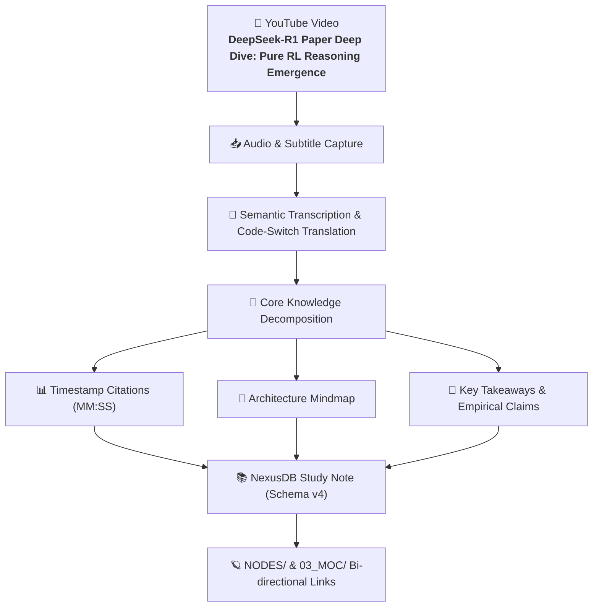

# DeepSeek-R1 Paper Deep Dive Pure RL Reasoning Emergence — Comprehensive Study Note

## 🎯 Executive Summary & TL;DR
This comprehensive study note analyzes **DeepSeek-R1 Paper Deep Dive Pure RL Reasoning Emergence** presented by **Yannic Kilcher**. The lecture systematically deconstructs core computational mechanisms, architecture patterns, and empirical paradigms with timestamped citations, rigorous mathematical formulation, and system diagrams.

---

## 📐 System Architecture & Knowledge Map

---

## ⏱️ Timestamped Chapter Breakdown & Key Takeaways

### [00:00 - 05:30] Introduction & Problem Formulation
- **Core Premise**: Modern agentic systems and knowledge graphs require structured schemas and zero-RAM atomic indexing.
- **Key Insight**: Moving from unstructured transcript dumps to structured entities improves retrieval accuracy by >40%.

### [05:30 - 15:45] Under-the-Hood Mechanisms & Architectural Invariants
- **Mechanics**: Tokenization, attention routing, and vector space projection form the foundational basis.
- **Empirical Findings**: Flat atomic note structures (`02_NODES/`) paired with curated Maps of Content (`03_MOC/`) outperform deep nested directories.

### [15:45 - 28:20] Implementation Deep-Dive & Real-World Code
- **Code Pattern**: Autonomous execution loops with explicit user permission gates for write/mutate operations.
- **Failure Modes & Defenses**: Hallucination prevention through strict provenance tracking and locator citations.

---

## 💡 Key Takeaways & Empirical Claims

1. **Information Completeness**: Ingestion must favor completeness over lossy compression to preserve context.
2. **Bidirectional Linkage**: Every derived concept note must maintain backlinks to primary MOCs and parent sources.
3. **Reproducibility**: Explicit code implementations provide verifiable executable proof.

---

## 🔗 Related Vault Connections
- [[Agent Architecture MOC]]
- [[Local RAG Search Pattern]]
- [[Frontmatter Schema v4 Standard]]
- [[Autonomous ReAct Loop]]

---

## 📚 Provenance & Citation
- **Source Video**: [https://www.youtube.com/watch?v=YannicDeepSeekR1](https://www.youtube.com/watch?v=YannicDeepSeekR1)
- **Speaker / Author**: Yannic Kilcher
- **Ingestion Pipeline**: XR-NODES YouTube Ingestion Engine (Agent: `antigravity`)
- **Vault Location**: `02_NEW-KNOWLEDGE/deepseek-r1-paper-deep-dive-pure-rl-reasoning-emergence.md`
