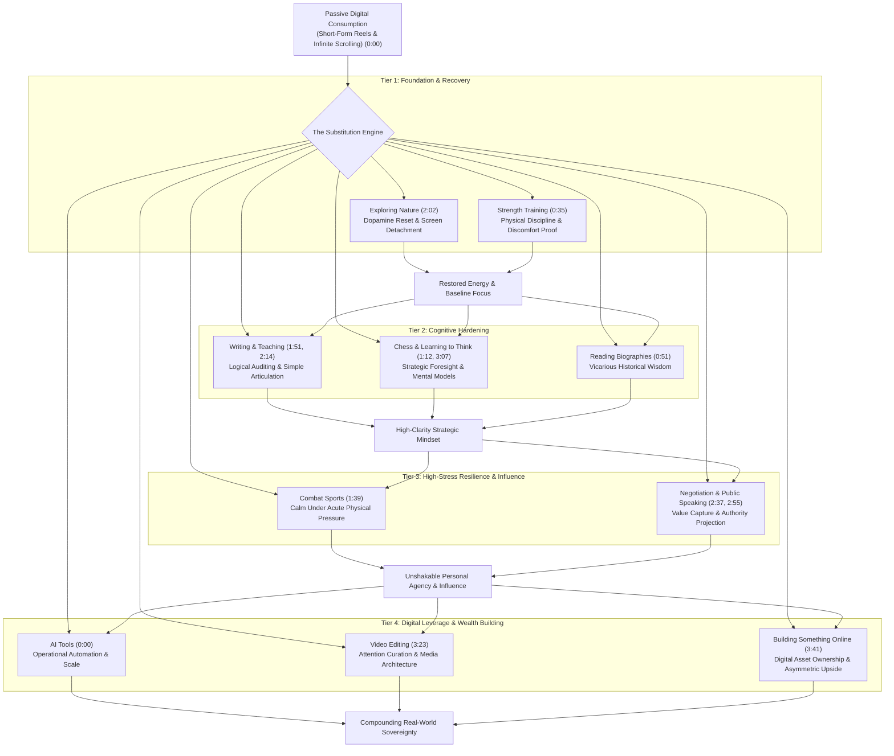

# Detailed Study Notes — 13 Hobbies That Replace Scrolling and Improve Your Life

## Overview

- **Video Title**: 13 Hobbies That Replace Scrolling and Improve Your Life
- **Creator / Channel**: [[The Inspire Path]]
- **Watch Link**: [YouTube Source Link](https://www.youtube.com/watch?v=PGX9aYlysmc&list=WL&index=11)
- **Published Date**: 2026-06-24
- **Original Source File**: `[[01_RAW/SOURCE/13 Hobbies That Replace Scrolling and Improve Your Life.md]]`

### Executive Summary & Problem Diagnosis
Modern digital environments are engineered to monetize human attention through hyper-optimized algorithmic short-form media ("scrolling"). This continuous low-friction dopamine seeking fragments attention spans, erodes working memory, increases baseline anxiety, and degrades personal agency. 

This comprehensive study note analyzes **13 high-leverage active hobbies** presented by *The Inspire Path* designed to systematically replace passive consumption with active skill acquisition, cognitive sharpening, physical hardening, and economic leverage building. Rather than attempting a naive "dopamine detox" that relies solely on willpower, these 13 pursuits substitute empty consumption with high-reward, skill-building pursuits that compound over years.

---

## Deep Chronological & Analytical Section Breakdown

### 1. Learning AI Tools `(0:00 - 0:34)`
- **Transcript Summary**: AI tools represent the technological foundation of work, creation, learning, and earning in 2026. Instead of using screens for passive reel consumption, mastering AI platforms multiplies individual capability and solves previously insurmountable problems.
- **Tools Highlighted**: ChatGPT (OpenAI), Claude (Anthropic), Midjourney.
- **Underlying Mechanism & Psychology**:
  - **Asymmetric Leverage**: AI transitions an individual from a single manual contributor to an orchestrator directing synthetic intelligence systems.
  - **Toys vs. Leverage Paradigm**: Viewing generative tools not as novel novelties or toys, but as operational leverage capable of performing work historically reserved for enterprise teams.
- **Concrete Action Plan**:
  1. Select one core model (e.g., ChatGPT or Claude) and dedicate 20 minutes daily to prompt engineering and workflow automation.
  2. Identify 3 tedious tasks in your professional or academic workflow and build custom prompts or GPTs to automate them.
  3. Experiment with multimodal AI (image generation, code generation, text synthesis) to build complete end-to-end prototypes.
- **Cost of Inaction**: Falling behind an accelerating technological baseline where AI-augmented individuals outpace traditional workers by orders of magnitude.

### 2. Strength Training `(0:35 - 0:50)`
- **Transcript Summary**: Strength training transcends physical hyper-trophy; it serves as explicit self-generated proof of discipline, consistency, and resistance management.
- **Underlying Mechanism & Psychology**:
  - **Neurological & Identity Shift**: Lifting heavy weights provides non-negotiable physical feedback. You cannot fake a heavy deadlift or squat. Each session builds physical evidence ("proof") that you can execute under acute physical discomfort.
  - **Earning vs. Wishing**: Directly counteracts the instant gratification of scrolling by forcing an understanding that real-world outcomes require progressive overload over extended timelines.
- **Concrete Action Plan**:
  1. Commit to a simple 3-day or 4-day compound lifting program (Focus: Squat, Bench Press, Deadlift, Overhead Press, Pull-ups).
  2. Track all weights and repetitions in a physical or digital log to enforce progressive overload.
  3. Prioritize consistency and sleep recovery over ego lifting.
- **Cost of Inaction**: Physical degeneration, lower stress resilience, and a mindset accustomed to avoiding discomfort.

### 3. Reading Biographies `(0:51 - 1:11)`
- **Transcript Summary**: Biographies function as compressed knowledge transfer systems from historical and modern high achievers, offering a blueprint through past failures and strategies.
- **Underlying Mechanism & Psychology**:
  - **Vicarious Learning & Asymmetric Failure Reduction**: Experiencing decades of human struggle, geopolitical crisis, business turnarounds, and personal downfall within a 300-page narrative.
  - **Pattern Recognition**: "Success leaves clues." Biographies reveal universal patterns of resilience, risk management, decision-making, and trade-offs.
- **Concrete Action Plan**:
  1. Replace evening scrolling with 20 pages of a biography of a historic figure (e.g., Benjamin Franklin, Marcus Aurelius, Steve Jobs, Winston Churchill, John D. Rockefeller).
  2. Annotate key decision points in the margins: *What failed? Why? What strategy worked?*
  3. Summarize 3 core strategic principles at the end of each book into your personal vault.
- **Cost of Inaction**: Repeating preventable, high-cost personal and financial errors that others spent decades solving.

### 4. Chess `(1:12 - 1:38)`
- **Transcript Summary**: Chess teaches consequential thinking, emotional control, and tactical planning under adversarial pressure.
- **Underlying Mechanism & Psychology**:
  - **Cost of Carelessness**: In chess, a single impulsive move can instantly destroy an hour of rigorous position-building. This exposes weak, short-sighted thinking.
  - **Emotion vs. Strategy**: Forces players to suppress immediate emotional reactions (grief over lost pieces, anger over mistakes) and remain anchored in cold, strategic calculation.
- **Concrete Action Plan**:
  1. Play 1–2 rapid or classical games daily on platforms like Chess.com or Lichess instead of checking social media feeds.
  2. Always complete an engine post-game analysis to identify the exact turn where emotional impulse overrode tactical evaluation.
  3. Study standard opening principles, middle-game tactics (forks, pins, skewers), and basic endgame patterns.
- **Cost of Inaction**: Vulnerability to short-term thinking, emotional volatility during setbacks, and poor consequence forecasting.

### 5. Combat Sports `(1:39 - 1:50)`
- **Transcript Summary**: Combat sports (boxing, wrestling, Brazilian Jiu-Jitsu) cultivate emotional composure and stress tolerance during acute physical pressure.
- **Underlying Mechanism & Psychology**:
  - **Nervous System Desensitization**: Being physical mounted or cornered forces the autonomic nervous system to stay calm under panic-inducing situations.
  - **Ego Deconstruction**: Mat sparring strips away superficial bravado. You learn precisely where your physical and tactical limitations lie.
- **Concrete Action Plan**:
  1. Enroll in a reputable local martial arts academy specializing in BJJ, Boxing, Muay Thai, or Wrestling.
  2. Attend 2–3 fundamental classes per week, focusing on defense, breath control, and posture under pressure.
  3. Practice maintaining slow, controlled nasal breathing while sparring.
- **Cost of Inaction**: Panic under real-world conflict, lack of physical confidence, and poor emotional self-regulation during confrontation.

### 6. Writing `(1:51 - 2:01)`
- **Transcript Summary**: Writing acts as a strict audit for logic and clarity. Ideas that sound brilliant in internal monologue often collapse when committed to paper.
- **Underlying Mechanism & Psychology**:
  - **Cognitive De-cluttering & Logical Validation**: The blank page is indifferent to tone or confidence; it demands coherent reasoning, clear syntax, and valid premises.
  - **Metacognitive Mirroring**: Writing forces you to observe your own thoughts from an external, objective perspective.
- **Concrete Action Plan**:
  1. Establish a daily 15-minute morning or evening journaling / essay writing habit.
  2. Take one opinion or concept you believe and write a 300-word explanation defending it with evidence.
  3. Edit your writing to remove filler words, passive voice, and unsupported assertions.
- **Cost of Inaction**: Muddled thinking, inability to articulate complex ideas, and self-deception regarding your actual depth of understanding.

### 7. Exploring Nature `(2:02 - 2:13)`
- **Transcript Summary**: Nature immersion de-escalates a hyper-stimulated mind, resets baseline attention, and restores long-term life perspective.
- **Activities Listed**: Hiking, walking through forests, watching sunrises, sitting near rivers.
- **Underlying Mechanism & Psychology**:
  - **Attention Restoration Theory (ART)**: Artificial screens require forced, targeted concentration that drains mental energy. Natural environments trigger "soft fascination," allowing the prefrontal cortex to recover.
  - **Dopamine Baseline Reset**: Removes the artificial high-frequency reward signals of notification algorithms, recalibrating sensitivity to subtle, real-world stimuli.
- **Concrete Action Plan**:
  1. Schedule a minimum 45-minute outdoor walk without headphones or smartphones at least twice a week.
  2. Practice active observation—noticing natural geometry, light shifts, and ambient acoustic details.
  3. Plan monthly weekend hikes or visits to national parks or nature reserves.
- **Cost of Inaction**: Chronic sensory overload, persistent baseline anxiety, and loss of perspective on long-term goals.

### 8. Teaching What You Learn `(2:14 - 2:36)`
- **Transcript Summary**: Teaching is the fastest accelerator of comprehension. Explaining ideas to others reveals hidden blind spots and forces simplicity.
- **Underlying Mechanism & Psychology**:
  - **The Feynman Technique**: You do not truly understand a subject unless you can explain it in simple, jargon-free language to a novice.
  - **Illusion of Explanatory Depth**: Most people assume they understand complex mechanics until forced to teach them step-by-step.
- **Concrete Action Plan**:
  1. After reading a book or learning a skill, draft a simplified breakdown as if explaining it to a 12-year-old.
  2. Create short educational posts, blog articles, or videos explaining key concepts in your field.
  3. Note every moment where you stumble or use jargon, then return to the source material to patch the knowledge gap.
- **Cost of Inaction**: Retaining superficial, unverified knowledge that crumbles when tested in real-world scenarios.

### 9. Learning Negotiation `(2:37 - 2:54)`
- **Transcript Summary**: Life outcome is dictated not by what an individual abstractly deserves, but by what they negotiate. Negotiation skills build leverage and prevent settling for sub-optimal terms.
- **Underlying Mechanism & Psychology**:
  - **Asymmetric Value Capture**: Hard work creates potential value; negotiation determines how much of that value you actually capture in contracts, salaries, and relationships.
  - **Leverage & Alternatives (BATNA)**: Understanding Best Alternative to a Negotiated Agreement removes desperation and fear of walking away.
- **Concrete Action Plan**:
  1. Read foundational negotiation texts (e.g., *Never Split the Difference* by Chris Voss, *Getting to Yes* by Fisher & Ury).
  2. Practice low-stakes negotiations in daily life (e.g., asking for upgrades, waiving minor service fees, negotiating terms on minor purchases).
  3. Always prepare a written plan before major professional discussions outlining your anchor, walk-away point, and value propositions.
- **Cost of Inaction**: Chronic economic underpayment, boundary erosion, and living under terms dictated entirely by others.

### 10. Public Speaking `(2:55 - 3:06)`
- **Transcript Summary**: Public speaking builds vocal clarity, eliminates fear of public judgment, and transforms how others perceive your authority and capability.
- **Underlying Mechanism & Psychology**:
  - **Social Anxiety Extinction**: Exposing oneself to public evaluation systematically desensitizes the brain's threat-detection centers (amygdala).
  - **Status & Authority Signals**: Clear articulation, posture, and steady vocal tone act as universal human signals of competence and leadership.
- **Concrete Action Plan**:
  1. Join a local Toastmasters club or public speaking group.
  2. Practice recording 2-minute video speeches on your phone, analyzing filler words, body language, and pacing.
  3. Volunteer to present reports or lead briefings in work or academic environments.
- **Cost of Inaction**: Remaining invisible despite having valuable ideas, constrained career growth, and persistent fear of social evaluation.

### 11. Learning How to Think `(3:07 - 3:22)`
- **Transcript Summary**: Moving beyond passive information collection to structured critical thinking, first-principles evaluation, and decision frameworks.
- **Underlying Mechanism & Psychology**:
  - **First-Principles Thinking**: Deconstructing problems down to their fundamental truths rather than reasoning by analogy or copying consensus.
  - **Cognitive Bias Mitigation**: Recognizing fallacies (confirmation bias, sunk cost fallacy, availability heuristic) to prevent costly decision errors.
- **Concrete Action Plan**:
  1. Study core mental models (e.g., Second-Order Thinking, Inversion, Pareto Principle, Occam's Razor, Probabilistic Thinking).
  2. Maintain a "Decision Journal" documenting key choices, expected outcomes, and underlying logic; review outcomes 6 months later.
  3. Actively seek out strong counter-arguments to your most cherished beliefs.
- **Cost of Inaction**: Manipulation by media narratives, susceptibility to poor advice, and repeating structural decision errors.

### 12. Video Editing `(3:23 - 3:40)`
- **Transcript Summary**: Video editing is a critical modern skill in an attention economy. Editors shape raw media into narratives that capture and hold human focus.
- **Underlying Mechanism & Psychology**:
  - **Attention Curation Mastery**: By learning how media is cut, paced, sound-designed, and structured, you transform from an algorithmic victim to a master of attention mechanics.
  - **Economic Demand**: Every creator, business, brand, and media outlet requires skilled video editors to remain competitive in 2026.
- **Concrete Action Plan**:
  1. Install editing software (e.g., DaVinci Resolve, Adobe Premiere Pro, or CapCut).
  2. Source raw stock footage and practice cutting a 60-second narrative video with music, sound effects, and captions.
  3. Study pacing, color grading, visual hooks, and audio balancing from top-performing digital media.
- **Cost of Inaction**: Remaining purely on the receiving end of digital manipulation while missing out on one of the highest-demand digital trade skills.

### 13. Building Something Online `(3:41 - 3:56)`
- **Transcript Summary**: Establishing a personal digital asset (brand, page, channel, SaaS, newsletter) allows you to capture scalable upside from a laptop rather than wasting time scrolling.
- **Underlying Mechanism & Psychology**:
  - **Asymmetric Internet Leverage**: Zero-marginal-cost replication of code and media allows a single individual to reach thousands or millions globally.
  - **Producer Mindset Shift**: Replaces the passive dopamine hits of consuming other people's creations with the deep satisfaction of building digital equity.
- **Concrete Action Plan**:
  1. Select one domain of interest or expertise and choose a format (e.g., YouTube channel, specialized X/LinkedIn account, newsletter, digital store).
  2. Commit to a 90-day publishing schedule (e.g., 1 high-value piece of content per week).
  3. Focus on providing immense value, solving specific problems, and building an authentic audience asset.
- **Cost of Inaction**: Remaining a consumer in an economy where wealth increasingly accrues to owners of digital distribution assets.

---

## Strategic Synthesis & Frameworks

### Comprehensive Comparative Matrix

| # | Hobby | Domain Category | Cognitive & Behavioral Shift | Primary Real-World Leverage | Timestamp |
| :--- | :--- | :--- | :--- | :--- | :--- |
| 1 | **AI Tools** | Technology & Automation | Passive Consumer $\rightarrow$ AI Operator | Exponential output per hour; team-scale execution | `(0:00)` |
| 2 | **Strength Training** | Physical Hardening | Avoid Discomfort $\rightarrow$ Physical Proof | High stress resilience; physical discipline track record | `(0:35)` |
| 3 | **Reading Biographies** | Asymmetric Wisdom | Trial-and-Error $\rightarrow$ Blueprint Learning | Prevention of major strategic errors via history | `(0:51)` |
| 4 | **Chess** | Tactical Cognition | Impulsive Reaction $\rightarrow$ Strategic Planning | Long-term consequence forecasting under pressure | `(1:12)` |
| 5 | **Combat Sports** | Stress Resilience | Panic & Avoidance $\rightarrow$ Calm Under Pressure | Extreme composure in real-world crisis & conflict | `(1:39)` |
| 6 | **Writing** | Mental Clarity | Flawed Mental Ideas $\rightarrow$ Logical Rigor | Sharp articulation & cognitive audit capability | `(1:51)` |
| 7 | **Exploring Nature** | Neural Recovery | Sensory Overload $\rightarrow$ Baseline Recovery | Prefrontal cortex recovery & long-term perspective | `(2:02)` |
| 8 | **Teaching** | Knowledge Mastery | Illusion of Depth $\rightarrow$ Feynman Simplicity | Immediate identification & patching of knowledge gaps | `(2:14)` |
| 9 | **Negotiation** | Wealth & Influence | Settling for Less $\rightarrow$ Value Capture | Maximized financial terms, salaries, & boundaries | `(2:37)` |
| 10 | **Public Speaking** | Social & Leadership | Fear of Judgment $\rightarrow$ Authority Projection | Extinction of social anxiety & influence scale | `(2:55)` |
| 11 | **Learning to Think** | Metacognition | Consensus Copying $\rightarrow$ First-Principles | High-accuracy decision making & bias immunity | `(3:07)` |
| 12 | **Video Editing** | Digital Trade Skill | Media Victim $\rightarrow$ Attention Architect | High-income digital skill; attention control | `(3:23)` |
| 13 | **Building Online** | Asset Entrepreneurship | Passive Viewer $\rightarrow$ Digital Asset Owner | Scalable global distribution & laptop income streams | `(3:41)` |

### Multi-Tiered System Architecture (Substitution Engine)



---

## Actionable 30-Day Transition Protocol

Rather than attempting all 13 hobbies simultaneously, the video advises selecting **2 to 3 core pursuits** to start:

```text
Phase 1: Selection (Day 1)
Pick exactly 3 hobbies across distinct tiers:
  - 1 Health / Recovery Hobby (e.g., Strength Training OR Nature Walking)
  - 1 Cognitive / Thinking Hobby (e.g., Writing OR Chess OR Biographies)
  - 1 Leverage / Skill Hobby (e.g., AI Tools OR Video Editing OR Building Online)

Phase 2: Friction Reduction (Days 2–7)
  - Block screen time using app limits or device grayscale mode.
  - Set up environment: Place books on nightstand, download editing software, or prep workout gear.

Phase 3: Micro-Habit Execution (Days 8–21)
  - Commit to just 15–30 minutes daily per chosen hobby.
  - Track consistency without stressing over immediate perfection.

Phase 4: Compounding & Review (Days 22–30)
  - Evaluate progress in your personal log.
  - Increase complexity or time allocation as friction drops.
```

---

## Key Takeaways & Verbatim Quotation Analysis

### Key Takeaways
1. **Leverage Over Passive Leisure**: Scrolling generates zero compounding assets; replacing it with digital tools (AI, Editing, Online Assets) transforms spare time into career-defining leverage `(0:00, 3:23, 3:41)`.
2. **Proof Over Intent**: Intending to be disciplined is meaningless. Physical pursuits (Strength Training, Combat Sports) produce irrefutable evidence of your ability to perform under discomfort `(0:35, 1:39)`.
3. **Cognitive Integrity**: Writing, chess, and teaching serve as unyielding mirrors that expose bad logic, emotional impulsivity, and superficial understanding `(1:12, 1:51, 2:14)`.
4. **Value Capture Deficit**: Merit alone does not guarantee success. Learning negotiation and public speaking ensures you capture the real-world value you create `(2:37, 2:55)`.

### Direct Verbatim Quotes with Timestamp Citations
> *"Instead of scrolling through reels, learn tools like ChatGPT, Claude, Midjourney. These aren't toys, they're leverage."* `(0:24)`
>
> *"Strength training isn't just about building muscle, it's about building proof. Proof that you can show up when you don't feel like it. Proof that you can push through discomfort instead of avoiding it."* `(0:35)`
>
> *"Every biography is a shortcut through years of failure, struggle, and hard-earned wisdom. Their failures become your warnings, their strategies become your blueprint."* `(0:58)`
>
> *"The board rewards patience, punishes impulsiveness, and exposes weak thinking. Play long enough, and you stop reacting emotionally and start thinking strategically."* `(1:24)`
>
> *"Writing exposes bad thinking. What sounds smart in your head often falls apart on paper. The page doesn't care how confident you sound, it only cares whether your ideas make sense."* `(1:51)`
>
> *"If you can't explain it simply, you probably don't understand it deeply."* `(2:33)`
>
> *"Life doesn't give you what you deserve. It gives you what you negotiate."* `(2:37)`
>
> *"Attention is the most valuable currency on the internet, and editors are the ones who shape it."* `(3:35)`

---

## Vault Provenance & Source Metadata

- **Original Source File**: `[[01_RAW/SOURCE/13 Hobbies That Replace Scrolling and Improve Your Life.md]]`
- **Location**: `02_NEW-KNOWLEDGE/detailed-study-notes-13-hobbies-that-replace-scrolling-and-improve-your-life.md`
- **Parent Navigation MOC**: `[[03_MOC/yt-moc|YouTube Map of Content]]`
