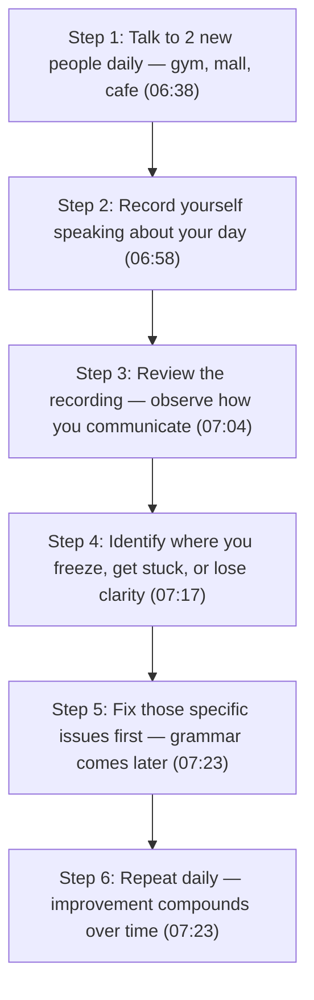
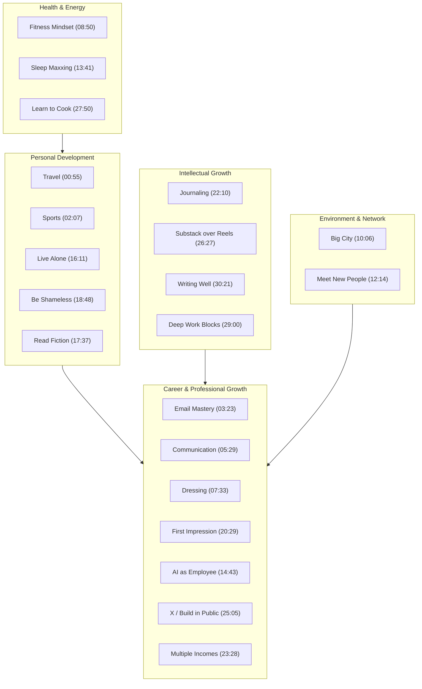

# Detailed Study Notes — 20 Skills That Changed My Life Before 25

| Field | Value |
|---|---|
| **Creator** | [[Ishan Sharma]] |
| **Platform** | YouTube |
| **Watch Link** | [YouTube](https://www.youtube.com/watch?v=hKFiQiHYvK0) |
| **Duration** | ~31 minutes |
| **Published** | 2026-07-13 |
| **Language** | Hindi-English code-switched (Hinglish), translated to English |
| **Source File** | [[01_RAW/SOURCE/20 Skills That Changed My Life Before 25.md]] |

---

## Executive Summary

Ishan Sharma, now 25 years old, reflects on the 20 life-changing habits and skills he developed during his 20s. The video spans personal development, career acceleration, communication, fitness, networking, productivity, AI literacy, financial diversification, and deep work. The advice is aimed at students, young professionals, creators, and freelancers in the early stages of their careers. Throughout, Ishan draws on personal anecdotes from his experiences moving cities, traveling internationally (118 flights in 2025), building content businesses, and using AI agents in daily workflows.

---

## Section Breakdown

### 1. Travel as Much as Possible (00:55 – 02:06)

Ishan took 118 flights in 2025, primarily to the US and UK. He grew up frequently moving between places, and he turned that into a deliberate habit of international and domestic travel in his 20s. (00:55)

**Key claims:**
- Traveling outside your comfort zone introduces you to new cultures, people, and perspectives. (01:30)
- Solo trips are particularly eye-opening for personal growth. (01:30)
- You do not need to travel internationally — there are many enriching destinations within India. (01:30)
- Travel makes you more open-minded, tolerant, empathetic, and compassionate. (01:45)
- It expands your horizon about what is possible and what other people are doing. (01:57)

**Actionable takeaway:** Prioritize travel experiences, even domestic ones, to broaden your worldview and become a more well-rounded person.

---

### 2. Pick Up a Sport (02:07 – 03:22)

Ishan never played sports growing up. He once tried cricket, got hit in the eye with the ball, and started wearing glasses. He was always introverted and preferred reading in the library. (02:16)

> *"Cricket ek bar khela, aankh mein ball chali gayi, chashma lag gaya."* (02:16) — "I played cricket once, got hit in the eye with the ball, and ended up wearing glasses."

Recently, he picked up tennis and fell in love with the experience. He also plays badminton regularly. (02:16)

**Key claims:**
- Playing a sport lets you turn off your "work brain" and achieve a state of flow — complete focus on the activity itself. (02:43)
- Sports improve physical fitness as a side benefit while also being genuinely enjoyable. (02:59)
- They are an amazing way to make new friends and become a more well-rounded person. (03:03)
- Picking up a sport makes you instantly more interesting. (03:05)

> *"Log bolte hain na ki are bhai kya pure din coding karte rehta hai?"* (03:05) — "People say, 'What, do you just code all day?' Pick up a hobby and instantly become more interesting."

**Actionable takeaway:** Choose any sport (tennis, badminton, etc.) and commit to regular practice. It builds flow states, fitness, friendships, and personal identity beyond work.

---

### 3. Email Is Everything (03:23 – 05:28)

In your 20s, you are starting your career for the first time, which means opportunities are flowing in and you are actively reaching out to people for jobs, internships, and collaborations. Email is the communication backbone of all of this. (03:23)

> *"20s mein na aap pehli bar apna career shuru karte ho, which means aapke paas bahut sari opportunities aa rahi hoti hain."* (03:36) — "In your 20s, you are starting your career for the first time, which means you have many opportunities coming your way."

**Key claims:**
- In a world that rewards people who actively seek opportunities, email is the most important platform in your 20s. (03:54)
- You need to learn to organize your email, reach out to the right people, and send more and better emails simultaneously. (03:54)
- Over the past 7 years, all of Ishan's major opportunities came through email — either someone reached out to him and he replied on time, or he reached out first and they responded. (04:25)
- Writing better emails and replying on time is critically important. (04:25)

**Tool mentioned:** Superhuman Mail — a productivity tool that uses AI to handle repetitive email tasks. Features mentioned include:
- "Ask AI" to surface specific details from long email threads instantly. (04:50)
- "Write with Voice" on mobile for composing polished emails by speaking. (04:59)

*(Note: This is a sponsored segment for Superhuman Mail.)*

**Actionable takeaway:** Treat email as a primary career tool. Learn to write concise, professional emails and reply promptly. Consider productivity tools to manage high-volume inboxes.

---

### 4. Improve Your Communication Skills (05:29 – 07:32)

Ishan has noticed dramatic improvement in his own articulation over 5 years of making YouTube videos. He no longer needs scripts or a teleprompter — he uses a few bullet-point notes and speaks with clarity. (05:34)

**Key claims:**
- Communication with clarity sets you ahead of 99% of people. (06:06)
- Even coders benefit enormously from learning to speak well, modulate their tone, and avoid filler words like "ums" and "ahs." (06:06)
- Communication skill improves with daily practice over time. (07:23)

**Step-by-step progression for improving communication:** (06:38 – 07:23)

**Actionable takeaway:** Start with low-stakes conversations with strangers. Record yourself daily. Self-review to identify weak points. Prioritize fluency and clarity over grammar initially.

---

### 5. Dressing Sense (07:33 – 08:49)

People form first impressions quickly and judge based on appearance. This is not about vanity — it is about representing who you are and signaling that you care about yourself. (07:31)

**Key claims:**
- A well-dressed person invites conversation and signals confidence. (07:57)
- Ishan actively approaches well-dressed men to compliment them or start conversations because they feel more approachable and credible. (07:57)
- People who dress poorly at events often wonder why no one talks to them or why they lack confidence — the answer is often in their appearance. (08:25)

**Resource mentioned:** Ishan's podcast with someone named Sindhu on his channel, described as a "masterclass" on dressing, covering:
- How to get started with dressing well. (07:57)
- How to create a simple capsule wardrobe. (08:25)
- How to identify which colors suit you. (08:25)
- How to match colors and look presentable for any occasion. (08:25)

**Actionable takeaway:** Invest in a capsule wardrobe. Learn which colors suit you. Dress appropriately for the occasion to signal competence and self-respect.

---

### 6. Fitness as a Mindset (08:50 – 10:05)

Ishan distinguishes between "hitting the gym" as a checklist activity and adopting fitness as a comprehensive mindset. (08:51)

**Key claims:**
- Most people go to the gym in the morning and then spend the rest of the day sitting at a desk — this negates much of the benefit. (08:51)
- When fitness is a mindset, everything aligns with the goal of staying healthy: standing desks, prioritizing protein, making healthier food choices throughout the day. (09:21)
- Having fitness as a mindset helps you resist late-night cravings for processed snacks. (09:37)
- The key is learning to enjoy occasional indulgences in moderation rather than eliminating them entirely. (09:56)

> *"Aap woh pani puri ya woh samosa chart ya woh 12:00 a.m. craving automatically nahi chahoge."* (09:37) — "You will naturally stop craving that street food or those midnight snacks."

**Actionable takeaway:** Shift from "exercise as checkbox" to "fitness as lifestyle." Integrate standing, protein prioritization, and healthier food choices across your entire day.

---

### 7. Live in a Big City (10:06 – 12:13)

Ishan strongly advocates for relocating to a larger city, especially if you are currently in a tier-2 or tier-3 city. He specifically mentions Bangalore, Delhi, and Mumbai. (09:56)

**Key claims:**
- Living in a big city teaches you how the world operates and forces you out of your comfort zone. (10:28)
- People in bigger cities tend to be more risk-taking, have bigger dreams, and want to achieve more. (10:58)
- Location within the city matters enormously. Examples given: (11:13 – 11:52)
  - **Bangalore**: Being in Indiranagar or Koramangala vs. the outskirts matters for proximity to opportunity.
  - **Mumbai**: Living in Bandra, BKC, Lower Parel, or Worli vs. places like Mira Road or Thane provides dramatically more access to high-value networking.
- In Bandra West, you can walk 10 minutes and meet someone "insane" at a cafe — that proximity to high-value connections is transformative. (11:52)

**Actionable takeaway:** Move to a tier-1 city (or at least to a well-connected locality within your current city). Try it for 6 months and evaluate the impact. The proximity to opportunities and ambitious people is the key benefit.

---

### 8. Meet New People (12:14 – 13:40)

This is not about dating apps. Ishan emphasizes proactive outreach through Instagram DMs, LinkedIn, and Twitter to meet interesting people doing impressive work. (12:12)

**Key claims:**
- Meeting new people builds a better friend group, creates potential collaboration opportunities, and improves communication skills. (12:28)
- Most things in life are unlocked through connections. (12:58)
- Resourceful people — those who "have a guy for everything" — built that network by meeting enough people over time. (12:58)
- Wealth is not just about money; it is about the connections you have. (13:30)

**Outreach channels recommended:**
- Instagram DMs to interesting people
- LinkedIn DMs to potential mentors or collaborators
- Twitter DMs to people doing amazing work, hosting masterclasses, workshops, meetups, or run clubs

**Actionable takeaway:** DM people you admire on social platforms. Attend meetups, workshops, and run clubs. Build a network of resourceful people. Connections compound over time.

---

### 9. Sleep Maxxing (13:41 – 14:42)

Ishan emphasizes managing energy levels over managing productivity. (13:50)

**Key claims:**
- Being energetic lets you accomplish far more throughout the day than any productivity system. (13:55)
- The foundation is 7–8 hours of quality sleep where you fully recover. (13:55)
- **Book recommendation**: *Why We Sleep* by Matthew Walker — described as an "absolute game-changer." (14:26)
  - Topics covered: How caffeine affects sleep, how eating late at night affects sleep, how alcohol affects sleep.
  - Also covers ways to improve sleep quality.
- Aim to wake up by 7:00–8:00 AM to "own the day." (14:26)

**Actionable takeaway:** Prioritize 7–8 hours of quality sleep. Read *Why We Sleep* by Matthew Walker. Understand how caffeine, late eating, and alcohol impact sleep quality.

---

### 10. Use AI as an Employee (14:43 – 16:10)

Most people use AI as a simple chatbot (asking about the weather). Ishan advocates for using AI as a personal employee that automates routine tasks. (14:53)

**Key claims:**
- Sign up for the paid version of Claude, download the app, and start automating boring daily tasks. (14:53)
- Use cases: team meeting preparation, dashboard creation, content creation support, finance/investing analysis, sales work assistance. (14:53)
- The real unlock: delegating tasks to Claude so it completes work on your behalf daily without you asking each time. (15:22)

**Ishan's personal AI agent setup:** (15:34 – 15:47)
- 3–4 AI agents running daily
- Agent 1: Identifies the best reel to make that day
- Agent 2: Creates thumbnails
- Agent 3: Creates reel covers
- Agent 4: Generates podcast interview questions

**Actionable takeaway:** Move beyond using AI as a chatbot. Build AI agents that automate repetitive tasks (content ideas, thumbnails, research, meeting prep) to free up time for creative work.

---

### 11. Learn to Live Alone (16:11 – 17:36)

Ishan considers this uncomfortable to discuss publicly but believes it is a critical cheat code for your 20s. (16:11)

**Key claims:**
- Living on your own in college (hostel) taught Ishan responsibility: managing health, food, laundry, hygiene — all without anyone prompting him. (16:25)
- He now lives alone in Bangalore without his parents, and has learned self-sufficiency. (16:52)
- People living at home with parents often have many responsibilities handled for them, which feels convenient but creates a skills gap. (16:52)
- That skills gap becomes painfully apparent when you move out, get married, or live with a partner — and realize you cannot do basic things independently. (17:20)

**Actionable takeaway:** Move out and learn to take care of yourself — health, food, laundry, hygiene, daily logistics. This responsibility-building is essential before major life transitions (marriage, partnerships, etc.).

---

### 12. Read Fiction Books (17:37 – 18:47)

Ishan grew up reading fiction and holds a strong opinion that it was formative. (17:37)

**Books mentioned:**
- Diary of a Wimpy Kid
- Goosebumps
- Percy Jackson
- Heroes of Olympus
- Game of Thrones
- Harry Potter

**Key claims:**
- Reading fiction about unreal worlds lets you think about things that never existed — Ishan would dream of being inside these fictional worlds. (17:45)
- Studies show that reading fiction that has nothing to do with reality improves creative thinking and expands your mental world. (18:06)
- Most self-help books are essentially the same, but the "real unlock" comes from reading fictional novels. (18:06)
- Fiction reveals that life is "more magical than what we make it to be." (18:33)

**Actionable takeaway:** Replace some self-help reading with fiction novels and series. Fiction builds creative thinking, imagination, and a broader sense of possibility.

---

### 13. Be Shameless in Asking (18:48 – 20:28)

This is the habit Ishan credits most for his opportunities. (18:33)

**Core principle:** "If you don't ask, you never get. A full stomach never gets fed." (19:03)

**Key claims:**
- Every major opportunity Ishan has won came because he reached out first and was shameless enough to follow up multiple times. (19:03)
- Examples: sponsorship from an international airline for a US trip, partnerships with major tech companies for tech events, large brand deals in the AI space. (19:03)
- Most people hesitate and miss opportunities that were "just one email away" or "just one DM away." (19:27)
- The "I can't hang" mentality turns people into miserable individuals who never seize the opportunities they deserved. (19:55)

**Actionable takeaway:** Ask for what you want — jobs, partnerships, dates, collaborations. Follow up multiple times. The worst outcome is a "no," but you'll be surprised how many people say "yes."

---

### 14. Learn to Ace the First Impression (20:29 – 22:09)

Most people have a bland, rambling introduction that signals a lack of confidence. (20:36)

**Key claims:**
- You meet hundreds of people every year. Your introduction should be deliberate and practiced. (20:36)
- A poor introduction — going on about where you were born, what college you dropped out of — shows a lack of confidence and turns people off permanently. (21:16)
- You need a personal "pitch" — just like startups have an elevator pitch, you need one for yourself. (21:16)
- A great first impression should make people want to connect again, ask more questions, and feel curious about you. (21:44)

**Attributes of a strong first impression:** (21:44)
- Makes people laugh
- Creates curiosity (generates "100 questions")
- Short enough that people don't lose interest
- Practiced and refined daily

**Actionable takeaway:** Craft a deliberate personal pitch. Keep it short, curious, and memorable. Practice it daily and refine it based on real interactions.

---

### 15. Write and Journal Your Thoughts (22:10 – 23:27)

Ishan believes that in a world of short-term gratification and reels, the most valuable thing you can do is disconnect and go deeper by writing with pen and paper. (22:12)

**Key claims:**
- Most people cannot remember the last time they wrote something with a physical pen. (22:37)
- Handwriting forces active thinking. Your brain remembers what you write because you are actively processing it — unlike passively scrolling reels. (22:40)
- You cannot recall the last reel you scrolled, but you do remember what you write daily because it is a "lived experience." (22:40)
- Writing with pen and paper has never been a more powerful competitive advantage than in 2026. (23:08)
- Journaling also develops effective writing skills as a side benefit. (23:08)

**Actionable takeaway:** Start journaling daily with pen and paper. It improves memory, clarity of thought, and writing skills. The competitive advantage of this practice is at its highest in the age of short-form content.

---

### 16. Multiple Sources of Income (23:28 – 25:04)

Most people focus on saving money. Ishan argues the better approach is to actively increase income through side gigs. (23:35)

**Key claims:**
- On weekends, you can take up part-time gig work (design, code, sales, etc.) for other people. (23:35)
- Earning an extra ₹10,000–₹20,000 per month is very achievable for most people today. (23:35)
- Reach out to busy people who want to outsource work — influencer marketing, brand deals, sales, and other services. (23:56)
- Extra ₹20,000–₹40,000 monthly can fund investments, SIPs, learning, travel, better living, or rent in a more expensive location. (24:12)
- Example: On a Sunday morning, you could do photo shoots for people and charge ₹2,000–₹3,000 per hour. (24:33)
- Access to these gig opportunities improves when you live in a bigger city (reinforces Habit 7). (24:33)

**Actionable takeaway:** Start part-time freelance or gig work on weekends in your existing skill area. ₹10,000–₹40,000 per month in side income is achievable and compounds over time.

---

### 17. Use "X" (Twitter) Every Day and Build/Learn in Public (25:05 – 26:26)

Ishan considers Twitter/X the biggest leverage platform available today. (25:03)

**Key claims:**
- X shortens the distance between you (in India) and people in global tech hubs like San Francisco. (25:33)
- You can instantly connect with top 0.1% talent who will reply to you if you have something interesting to offer. (25:33)
- Most people use X for politics, drama, and low-quality content. The opportunity is in professional networking and learning in public. (25:33)
- Learning in public example: If you want to learn AI agents, start building a few and showcase your progress on X. This attracts people who want to learn with you, learn from you, or hire you as a freelancer, contractor, or employee. (26:02)

**Actionable takeaway:** Use X daily for professional networking and learning in public. Share your work, projects, and learning journey to attract opportunities, collaborators, and employers.

---

### 18. Replace Reels with Substack (26:27 – 27:49)

Ishan positions reading long-form content (Substack, Medium) as the key to becoming the most interesting person in any room. (26:22)

**Key claims:**
- Substack and Medium host long articles and newsletters with far more depth than short-form content. (26:39)
- If your attention span is short, feed the article to Claude or ChatGPT and ask it to read it while you listen. (26:39)
- Deep reading makes you a more interesting person at parties, events, and one-on-one conversations. (27:00)
- When you can have a deep conversation on a particular topic, you "win them as a friend for life." (27:00)
- Previously, this required reading 300-page books. Now a single Substack newsletter provides similar depth. (27:39)
- Ishan credits this habit with making his perspectives more nuanced — he can debate both for and against positions on many topics. (27:29)

**Actionable takeaway:** Replace daily reel-scrolling time with reading long-form content on Substack and Medium. Use AI tools to assist if attention span is a barrier. Deep reading builds conversational depth.

---

### 19. Learn to Cook (27:50 – 28:59)

Ishan has picked up cooking as a weekend hobby, treating it like a new sport. (27:39)

**Key claims:**
- Cooking is one of the most fun and important life skills alongside swimming and driving. (28:06)
- Ishan's weekly routine: Every Sunday, he picks a protein-focused dish he saw on social media and cooks it at home. (28:06)
- Ordering from delivery apps (Zomato) is more expensive, provides ultra-processed food, and removes the enjoyment of the cooking process. (28:29)
- Cooking grows on you like a hobby — over time, you increasingly prefer home-cooked food. (28:29)

**Actionable takeaway:** Start cooking one dish per week as a hobby. It saves money, provides healthier food, and becomes an enjoyable weekend ritual.

---

### 20. Do Deep Work Blocks (29:00 – 30:18)

Protecting your focus is critically important in 2026 given the volume of distractions. (29:00)

> *"Itne saare distractions hain aaj ki duniya mein, but if you can just protect yourself from all the notifications, from all the distractions, create do-do ghante ke focus blocks."* (29:00) — "There are so many distractions in today's world, but if you can protect yourself from all notifications and distractions and create two-hour focus blocks..."

**Key claims:**
- Deep work means focusing on one task for 2-hour blocks without notifications, messages, or context-switching. (29:00)
- Real work — thinking through problems, evolving thoughts, documenting on paper — requires long hours of focused attention. (29:19)
- Context-switching is extremely costly: working for 1 hour then scrolling for 20 minutes makes it very hard to regain focus. (29:49)
- You will be "surprised the amount of work you can do" in a few focused days compared to an entire unfocused week or month. (29:49)

**Actionable takeaway:** Create 2-hour deep work blocks. Turn off all notifications. Avoid scrolling between work sessions. The productivity gains are exponential compared to fragmented work.

---

### 21. Learn to Write Well (30:21 – 31:29)

The final habit challenges the assumption that AI makes writing skills obsolete. (30:19)

**Key claims:**
- AI can write, but that does not remove the need for you to think through ideas and articulate them yourself. (30:25)
- Most people given a writing task will simply go to ChatGPT, copy the output, and send it — becoming "simply a prompter" with no real skill. (30:25)
- The "art of explaining things by simply writing things down without asking AI for help" is being lost. (30:57)
- People who write well without AI have developed their own voice and style through seeing enough good writing to develop their own approach. (30:57)
- This is "the most important thing you can learn today." (30:57)

**Actionable takeaway:** Practice writing without AI assistance. Develop your own voice and explanatory style. The ability to think through and articulate ideas in writing is a durable competitive advantage, especially in the AI age.

---

## Complete Skills Overview

| # | Skill | Core Benefit | Timestamp |
|---|---|---|---|
| 1 | Travel as much as possible | Broader worldview, empathy, open-mindedness | 00:55 |
| 2 | Pick up a sport | Flow states, fitness, friendships, identity | 02:07 |
| 3 | Email is everything | Career opportunities, professional communication | 03:23 |
| 4 | Improve communication skills | Clarity, confidence, career advancement | 05:29 |
| 5 | Dressing sense | First impressions, confidence, approachability | 07:33 |
| 6 | Fitness as a mindset | Holistic health, energy, discipline | 08:50 |
| 7 | Live in a big city | Access to opportunities, ambitious peer network | 10:06 |
| 8 | Meet new people | Connections, resourcefulness, collaboration | 12:14 |
| 9 | Sleep maxxing | Energy management, recovery, daily performance | 13:41 |
| 10 | Use AI as an employee | Automation, time savings, creative leverage | 14:43 |
| 11 | Learn to live alone | Self-sufficiency, responsibility, independence | 16:11 |
| 12 | Read fiction books | Creativity, imagination, broader perspective | 17:37 |
| 13 | Be shameless in asking | Opportunity creation, follow-up persistence | 18:48 |
| 14 | Ace the first impression | Memorable personal pitch, curiosity-building | 20:29 |
| 15 | Write and journal daily | Memory, clarity, writing skill, competitive edge | 22:10 |
| 16 | Multiple income sources | Financial growth, investment capacity | 23:28 |
| 17 | Use X / build in public | Global networking, attracting opportunities | 25:05 |
| 18 | Replace reels with Substack | Depth of knowledge, conversational ability | 26:27 |
| 19 | Learn to cook | Health, savings, enjoyable life skill | 27:50 |
| 20 | Do deep work blocks | Focus, meaningful output, exponential productivity | 29:00 |
| 21* | Learn to write well | Independent thinking, personal voice, AI-era skill | 30:21 |

*\*The video title says "20 Skills" but the transcript contains 21 distinct habits (including "Learn to write well" as a separate final section).*

---

## Thematic Clusters

---

## Key Quotes

> "If you don't ask, you never get. A full stomach never gets fed." (19:03)

> "Most people will always hesitate and they will never get the best opportunities that were just one email away." (19:27)

> "You'll be surprised the amount of work you can do when you stop scrolling and just start putting all of your time into focus blocks." (29:49)

> "We've honestly forgotten the art of explaining things by simply writing things down without asking AI for help." (30:57)

---

## Entities Mentioned

| Entity | Type | Context |
|---|---|---|
| Ishan Sharma | Person | Speaker / Creator |
| Sindhu | Person | Guest on Ishan's dressing podcast |
| Matthew Walker | Person | Author of *Why We Sleep* |
| Superhuman Mail | Product | Email productivity tool (sponsored) |
| Claude | Product | AI assistant recommended for automation |
| ChatGPT | Product | AI assistant mentioned for reading assistance |
| Zomato | Company | Food delivery platform (India) |
| Twitter / X | Platform | Professional networking and learning in public |
| Substack | Platform | Long-form newsletter platform |
| Medium | Platform | Long-form article platform |
| Instagram | Platform | Used for outreach and networking |
| LinkedIn | Platform | Used for professional outreach |

---

## Books Recommended

| Book | Author | Context |
|---|---|---|
| *Why We Sleep* | Matthew Walker | Understanding sleep science, caffeine/alcohol impact (14:26) |
| *Psychology of Money* | Morgan Housel | Listed in video description |
| *Subtle Art of Not Giving a F\*ck* | Mark Manson | Listed in video description |
| *Rework* | Jason Fried & DHH | Listed in video description |

---

## Glossary

| Term | Definition (as used in video) | First Appearance |
|---|---|---|
| Sleep Maxxing | Optimizing sleep quality and duration (7–8 hours) for maximum daily energy | 13:41 |
| Deep Work Blocks | 2-hour focused work sessions without notifications or distractions | 29:00 |
| Capsule Wardrobe | A minimal, versatile collection of clothing that can be mixed and matched | 08:25 |
| Flow State | Complete mental immersion in an activity, losing awareness of other thoughts | 02:43 |
| Learning in Public | Sharing your learning journey and project progress on public platforms | 25:05 |
| Gig Work | Part-time freelance tasks done for others, usually on weekends | 23:35 |
| Context Switching | The cognitive cost of shifting between tasks or between work and leisure | 29:49 |

---

## Vault Provenance & Source Metadata

- **Original Source File**: `[[01_RAW/SOURCE/20 Skills That Changed My Life Before 25.md]]`
- **Location**: `02_NEW-KNOWLEDGE/detailed-study-notes-20-skills-that-changed-my-life-before-25.md`
- **Parent Navigation MOC**: `[[03_MOC/yt-moc|YouTube Map of Content]]`
