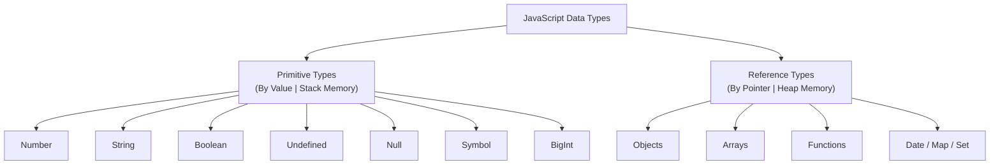
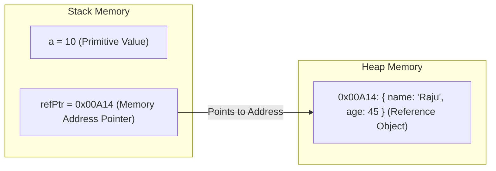
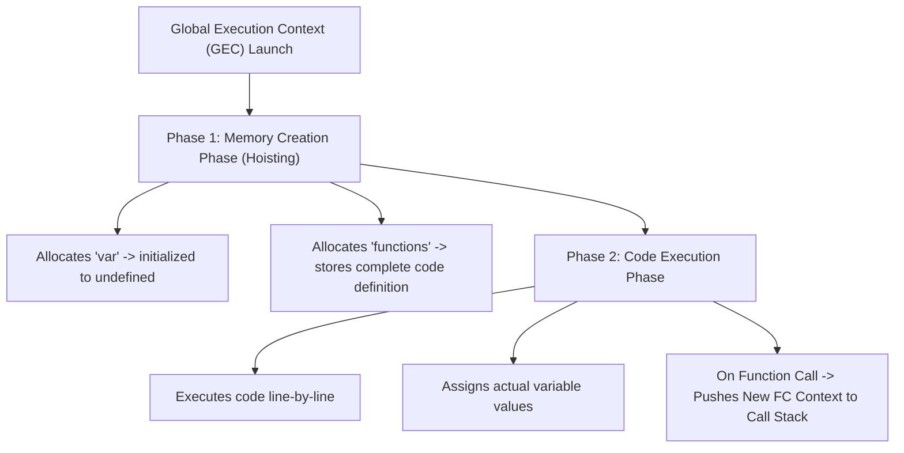
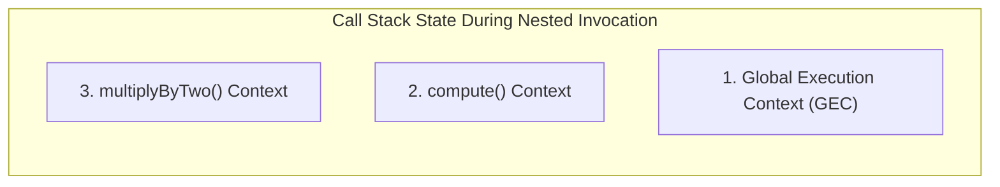

---
id: a7f8b912-3456-4c89-b012-999988887777
title: "[ 2026 ] 12+ Hours Complete JS Tutorial for Beginners - Part 02: Primitive vs. Reference Types, Heap vs. Stack Memory, Execution Context & Call Stack"
type: literature-note
status: learning
domain: engineering
source_type: youtube
created: 2026-08-09
updated: 2026-08-19
review: 2026-08-30
confidence: 95
version: 1
aliases:
  - "Complete JS Tutorial 2026 - Part 02"
  - "JavaScript Memory Management, Execution Context & Call Stack Mechanics"
tags:
  - yt
  - engineering
  - beginner
  - tools
  - implementation
owner_moc: Study MOC
sources:
  - "[[01_RAW/SOURCE/2026   12+ Hours Complete JS Tutorial for Beginners.md]]"
  - "https://www.youtube.com/watch?v=h2aHoOO2kxA&t=24s"
related: []
schema_version: 4
---

# [ 2026 ] 12+ Hours Complete JS Tutorial for Beginners — Part 02: Primitive vs. Reference Types, Heap vs. Stack Memory, Execution Context & Call Stack

> **Source Link**: [YouTube Video](https://www.youtube.com/watch?v=h2aHoOO2kxA&t=24s)  
> **Original Capture File**: [[01_RAW/CAPTURE/2026   12+ Hours Complete JS Tutorial for Beginners.md]]  
> **Channel / Creator**: [[Not Your College]] (Host: NYC Team, Instructor: Devendra)  
> **Segment Covered**: Part 02 (01:26:38 - 02:34:21) — Primitive Data Types, Reference Data Types, Stack vs. Heap Memory Allocation, Function Execution Mechanics, Global Execution Context (GEC) Creation & Execution Phases, Call Stack LIFO Lifecycle.

---

## 1. Executive Summary (01:26:38 - 02:34:21)

Part 02 delivers a deep architectural analysis of JavaScript's data taxonomy and runtime memory execution model. Instructor Devendra categorizes all data values in JavaScript into two fundamental types: **Primitive Data Types** (stored directly by value in Stack Memory) and **Reference Data Types** (stored by reference pointers in Heap Memory).

The lesson exposes language-level quirks, such as the historical `typeof null === "object"` bug from 1995, and demonstrates the uniqueness guarantees of ES6 `Symbol`. It then introduces structured reference types: **Arrays** (ordered, zero-indexed heterogeneous lists) and **Objects** (unordered key-value collections).

The core technical highlight of Part 02 is the internal mechanics of JavaScript execution. It breaks down how the engine instantiates a **Global Execution Context (GEC)** upon script load, dissecting its two distinct phases: Phase 1 (**Memory Creation Phase**) and Phase 2 (**Code Execution Phase**). Finally, it traces how function calls push new execution contexts onto the **Call Stack** and how stack frames are popped in Last-In, First-Out (LIFO) order upon returning values.

---

## 2. Chronological Section Breakdown

### 2.1 Primitive Data Types & Language Quirks (01:26:38 - 01:40:14)

JavaScript features 7 **Primitive Data Types**: `number`, `string`, `boolean`, `null`, `undefined`, `symbol`, and `bigint`.



#### 1. The `null` Type & Historical `typeof null` Bug (01:36:28)
- `null` represents an **intentional absence of any object value**.
- **Historical Quirks**: Running `typeof null` returns `"object"`.
- **Historical Cause**: In the 1995 initial JavaScript implementation, values were represented using a type tag alongside the value. The type tag for objects was `000`. `null` was represented as the NULL pointer (`0x00`), which resulted in `typeof null` evaluating to `"object"`.

```javascript
let emptyVal = null;
console.log(emptyVal);        // Output: null
console.log(typeof emptyVal); // Output: "object" (Language historical behavior)
```

#### 2. The `Symbol` Data Type (01:37:18)
- Introduced in ES6, `Symbol` produces an immutable, globally unique identifier guaranteed never to collide with any other symbol.

```javascript
const id1 = Symbol("userId");
const id2 = Symbol("userId");

console.log(id1 === id2); // Output: false (Every Symbol is 100% unique!)
console.log(typeof id1);  // Output: "symbol"
```

---

### 2.2 Stack vs. Heap Memory Allocation Mechanics (01:40:14 - 01:44:06)

JavaScript utilizes two distinct memory structures inside RAM during runtime:



#### 1. Stack Memory (Static Allocation)
- Stores **Primitive Values** and **Reference Pointers**.
- Fixed size, extremely fast access speed, managed directly by CPU stack pointer.
- Operations copy **actual primitive values**. Modifying a copied primitive variable has **zero effect** on the original variable.

```javascript
// Stack Allocation (Primitives copied by value)
let x = 10;
let y = x; // Copy of value 10 is pushed onto Stack
y = 20;

console.log(x); // Output: 10 (Original unchanged!)
console.log(y); // Output: 20
```

#### 2. Heap Memory (Dynamic Allocation)
- Stores **Reference Objects, Arrays, and Functions**.
- Unstructured memory pool for dynamic data structures that can expand in size.
- Operations copy **memory pointers (addresses)**. Modifying properties on a copied reference mutates the underlying heap object shared by both variables!

```javascript
// Heap Allocation (References copied by memory address pointer)
let obj1 = { name: "Devendra" };
let obj2 = obj1; // Copies pointer address 0x00A14 to obj2

obj2.name = "NYC Team"; // Mutates shared Heap object!

console.log(obj1.name); // Output: "NYC Team" (Original mutated!)
console.log(obj2.name); // Output: "NYC Team"
```

---

### 2.3 Reference Structures: Arrays & Objects (01:44:06 - 01:53:53)

#### 1. Heterogeneous JavaScript Arrays
- Ordered, zero-indexed collections that can store mixed data types simultaneously due to JavaScript's dynamic type system.

```javascript
// Heterogeneous Array Construction
const mixedArr = [
  100,                        // Number
  "Hello",                    // String
  true,                       // Boolean
  null,                       // Null
  { role: "Admin" },          // Nested Object
  [1, 2, 3]                   // Nested Array
];

console.log(mixedArr[0]);     // Output: 100
console.log(mixedArr[4].role);// Output: "Admin"
```

#### 2. JavaScript Objects (Key-Value Collections)
- Unordered key-value pairs used to model entity state and properties.

```javascript
// Object Literal Signature
const userProfile = {
  name: "Raju",
  age: 45,
  address: "Saket",
  isVerified: true
};

// Access Methods: Dot Notation vs. Bracket Notation
console.log(userProfile.name);       // Dot Notation: "Raju"
console.log(userProfile["address"]);// Bracket Notation: "Saket"
```

---

### 2.4 Functions & Execution Context Mechanics (01:53:53 - 02:15:00)

#### 1. Function Definition & Parameter Mechanics
A **Function** is a reusable block of code designed to perform a specific calculation or procedure.

- **Parameters**: Variable identifiers declared in the function definition signature.
- **Arguments**: Actual dynamic values passed into the function parameters during call invocation.

```javascript
// Function Declaration
function calculateTotal(price, taxRate) { // Parameters: price, taxRate
  let tax = price * taxRate;
  return price + tax;                     // Return keyword outputs value and terminates execution
}

// Function Invocation
let finalPrice = calculateTotal(100, 0.18); // Arguments: 100, 0.18
console.log(finalPrice);                   // Output: 118
```

---

### 2.5 Global Execution Context (GEC) & Call Stack Lifecycle (02:15:00 - 02:34:21)

Every JavaScript execution takes place inside an **Execution Context**. Upon runtime launch, the engine instantiates the **Global Execution Context (GEC)**.

#### The Two Phases of Execution Context Creation



#### 1. Phase 1: Memory Creation Phase (Hoisting Phase)
- The engine scans the entire script file.
- Memory space is allocated for all variables and functions.
- Variables declared with `var` are assigned `undefined`.
- Variables declared with `let` / `const` are placed in the **Temporal Dead Zone (TDZ)** uninitialized.
- Function declarations are stored in memory in their **entirety** (allowing functions to be safely invoked before their line of definition).

#### 2. Phase 2: Code Execution Phase
- Code is executed sequentially, line-by-line.
- Variable assignments evaluate and replace `undefined` with actual runtime values.
- When a function call is encountered, a brand new **Function Execution Context (FEC)** is created and pushed onto the top of the **Call Stack**.

---

### 2.6 Call Stack (LIFO) Lifecycle Trace

The **Call Stack** operates strictly on a **Last-In, First-Out (LIFO)** data structure principle.



```javascript
function multiplyByTwo(num) {
  return num * 2;
}

function compute(val) {
  let result = multiplyByTwo(val); // Pushes multiplyByTwo to Call Stack
  return result + 5;
}

let output = compute(10); // Pushes compute to Call Stack
console.log(output);       // Output: 25
```

#### Step-by-Step Call Stack Trace Matrix

| Step | Action | Stack Top Frame | Active Context State |
|---|---|---|---|
| **Step 1** | Script starts | `GEC` | Global Context initialized |
| **Step 2** | `compute(10)` invoked | `compute()` | `compute` context pushed onto stack |
| **Step 3** | `multiplyByTwo(10)` invoked | `multiplyByTwo()` | `multiplyByTwo` context pushed onto stack |
| **Step 4** | `multiplyByTwo` returns `20` | `compute()` | `multiplyByTwo` popped off stack |
| **Step 5** | `compute` returns `25` | `GEC` | `compute` popped off stack |
| **Step 6** | Execution finishes | Empty | `GEC` popped off stack |

---

## 3. Comparative Technical Reference Tables

### Table 1: Primitive vs. Reference Types Comparison (01:40:14 - 01:44:06)

| Feature | Primitive Data Types | Reference Data Types |
|---|---|---|
| **Types Included** | `number`, `string`, `boolean`, `null`, `undefined`, `symbol`, `bigint` | `object`, `array`, `function`, `Date`, `Map`, `Set` |
| **Memory Storage** | Stack Memory | Heap Memory (Pointer stored on Stack) |
| **Copy Mechanism** | **By Value** (Independent copy created) | **By Reference** (Shares identical memory address pointer) |
| **Mutability** | Immutable (Value replaced, not altered) | Mutable (Properties altered in-place) |
| **Comparison Behavior** | `10 === 10` is `true` | `{}` === `{}` is `false` (Different pointers!) |

---

## 4. Key Takeaways & Verbatim Quotes

### Notable Technical Quotes
1. **On Reference Types (01:44:06)**:
   > *"Reference types don't store the actual data inside the variable. They store a memory pointer address pointing to the dynamic data inside Heap memory."* (01:44:06) — *Devendra*
2. **On The Memory Creation Phase (02:15:00)**:
   > *"Before a single line of code is executed, JavaScript runs Phase 1: allocating memory for every variable and storing full function definitions in the Global Execution Context."* (02:15:00) — *Devendra*
3. **On Call Stack LIFO Execution (02:30:15)**:
   > *"The Call Stack manages function execution using LIFO: Last-In, First-Out. The last function called is the first frame popped when returning a value."* (02:30:15) — *Devendra*

---

## 5. Technical Glossary & Entity Reference

- **Stack Memory**: A contiguous block of memory managed by the CPU used for storing static data, primitive values, and stack execution frames.
- **Heap Memory**: An unorganized pool of memory used for dynamic allocation of objects, arrays, and functions.
- **Global Execution Context (GEC)**: The default execution context created by the JS engine before executing any code.
- **Call Stack**: A LIFO stack data structure that tracks active execution contexts in a running JavaScript program.
- **LIFO (Last-In, First-Out)**: A order of operations where the item added last is removed first.
- **Heterogeneous Array**: An array capable of holding elements of varying data types.

---
