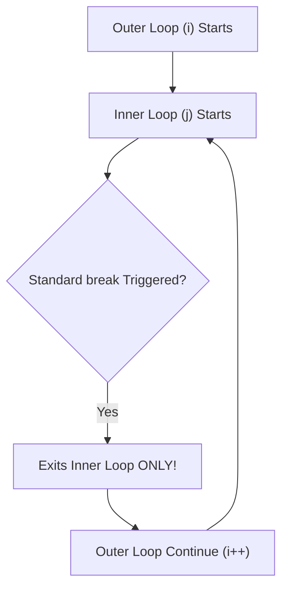

---
id: d1a23456-7890-4e01-c234-333344445555
title: "[ 2026 ] 12+ Hours Complete JS Tutorial for Beginners - Part 05: Loop Labels, Advanced Functions, Default & Rest Parameters, First-Class Functions"
type: literature-note
status: learning
domain: engineering
source_type: youtube
created: 2026-08-09
updated: 2026-08-19
review: 2026-08-30
confidence: 95
version: 1
aliases:
  - "Complete JS Tutorial 2026 - Part 05"
  - "JavaScript Loop Labels, Default Parameters, Rest Operators & First-Class Functions"
tags:
  - yt
  - engineering
  - beginner
  - tools
  - implementation
owner_moc: Study MOC
sources:
  - "[[01_RAW/SOURCE/2026   12+ Hours Complete JS Tutorial for Beginners.md]]"
  - "https://www.youtube.com/watch?v=h2aHoOO2kxA&t=24s"
related: []
schema_version: 4
---

# [ 2026 ] 12+ Hours Complete JS Tutorial for Beginners — Part 05: Loop Labels, Advanced Functions, Default & Rest Parameters, First-Class Functions

> **Source Link**: [YouTube Video](https://www.youtube.com/watch?v=h2aHoOO2kxA&t=24s)  
> **Original Capture File**: [[01_RAW/CAPTURE/2026   12+ Hours Complete JS Tutorial for Beginners.md]]  
> **Channel / Creator**: [[Not Your College]] (Host: NYC Team, Instructor: Devendra)  
> **Segment Covered**: Part 05 (04:46:00 - 06:03:30) — Loop Labels & Multi-Level Break Controls, Default Parameters, Rest Parameters (`...rest`), Spread Operator (`...spread`), First-Class Functions, and 3 Hands-On Problem Solving Exercises.

---

## 1. Executive Summary (04:46:00 - 06:03:30)

Part 05 examines **Loop Labels, Multi-Level Break Directives, Advanced Function Parameters, and First-Class Functions** in JavaScript. Instructor Devendra begins by demonstrating how standard `break` directives inside nested loops break out of only the immediate inner loop, failing to terminate outer parent loops. To solve this, JavaScript provides **Loop Labels** (`labelName:`), allowing inner statements to break out of multi-level outer loops in a single step.

The module also dives into function parameter mechanics, covering **Default Parameters** (`param = defaultValue`) to prevent `undefined` values when arguments are omitted, **Rest Parameters** (`...rest`) to collect unbounded arguments into array instances, and **First-Class Functions**, which allow functions to be assigned to variables, passed as arguments, and returned from other functions.

---

## 2. Chronological Section Breakdown

### 2.1 Nested Loops & The Loop Label Pattern (04:46:00 - 04:54:33)

#### 1. The Nested Loop Scope Limitation
Standard `break` statements executed inside a nested inner loop only terminate that inner loop. Control flow returns directly to the next iteration pass of the outer parent loop.



#### 2. Multi-Level Termination using Loop Labels
A **Loop Label** attaches a statement identifier to an outer loop block (`outerLoopName:`). By passing this label to `break outerLoopName;`, an inner loop can terminate the entire outer loop hierarchy instantly.

```javascript
// Labeling the outer loop block
outerLoop: for (let i = 0; i < 5; i++) {
  for (let j = 0; j < 5; j++) {
    console.log(`i = ${i}, j = ${j}`);

    // Target condition: Break out of ENTIRE multi-level loop structure when i===2 and j===2
    if (i === 2 && j === 2) {
      console.log("[LABEL TRIGGERED]: Breaking outerLoop hierarchy!");
      break outerLoop; // Instantly breaks outer loop!
    }
  }
}
// Execution halts completely when i=2, j=2. i=3 and i=4 never run!
```

---

### 2.2 Advanced Function Parameter Mechanics (04:54:33 - 05:29:32)

#### 1. Default Parameters
Default parameters assign fallback values to parameters if an argument is `undefined` or omitted during function invocation.

```javascript
// Default Parameter Syntax (size defaults to "Medium" if unsupplied)
const orderPizza = (size = "Medium") => {
  console.log(`Preparing pizza of size: ${size}`);
};

orderPizza("Large"); // Output: Preparing pizza of size: Large
orderPizza();        // Output: Preparing pizza of size: Medium (Fallback triggered!)
```

#### 2. Rest Parameters (`...rest`)
Rest parameters collect multiple un-named arguments passed to a function into a single Array.

```javascript
// Rest Parameter collects all incoming price arguments into an Array
const calculateBill = (...prices) => {
  console.log("Prices Array:", prices); // Array of all arguments
  let total = 0;
  for (let i = 0; i < prices.length; i++) {
    total += prices[i];
  }
  return total;
};

console.log("Total Bill:", calculateBill(133, 678, 500, 100)); // Total Bill: 1411
```

#### 3. First-Class Functions
In JavaScript, functions are **First-Class Citizens**:
- Functions can be assigned to variables.
- Functions can be passed as arguments to other functions.
- Functions can be returned from other functions.

```javascript
// Function stored inside a variable as a First-Class Value
const greet = () => {
  console.log("Hello from First-Class Function!");
};

// Functions passed as arguments (Callback pattern preview)
const executeFn = (fn) => {
  fn(); // Invoking passed function reference
};

executeFn(greet); // Logs: "Hello from First-Class Function!"
```

---

### 2.3 Hands-On Problem Solving & Coding Exercises (05:29:32 - 06:03:30)

#### Exercise 1: User Profile Generator with Shorthand Properties
Create a function taking `name`, `age`, and an optional `city` parameter defaulting to `"Bhopal"`. Return a structured profile object using ES6 property shorthand.

```javascript
const createUserProfile = (name, age, city = "Bhopal") => {
  // Property Shorthand: { name: name, age: age, city: city } -> { name, age, city }
  return { name, age, city };
};

console.log(createUserProfile("Vipul", 34)); 
// Output: { name: "Vipul", age: 34, city: "Bhopal" }

console.log(createUserProfile("Aman", 28, "Ahmedabad")); 
// Output: { name: "Aman", age: 28, city: "Ahmedabad" }
```

#### Exercise 2: Dynamic Rest Parameter Bill Accumulator
Create a function accepting any number of numerical dish prices using rest parameters and calculating the total sum.

```javascript
const billCalculator = (...dishPrices) => {
  let sum = 0;
  for (let i = 0; i < dishPrices.length; i++) {
    sum += dishPrices[i];
  }
  return sum;
};

console.log("Total:", billCalculator(100, 200, 400)); // Output: 700
```

#### Exercise 3: Password Strength Classifier
Create a function evaluating password string length (`password.length > 8` returns `"Strong Password"`, otherwise `"Weak Password"`).

```javascript
const checkPasswordStrength = (password) => {
  if (password.length > 8) {
    return "Strong Password";
  }
  return "Weak Password";
};

console.log(checkPasswordStrength("pass123"));      // Output: "Weak Password"
console.log(checkPasswordStrength("SecurePass123"));// Output: "Strong Password"
```

---

## 3. Comparative Technical Reference Tables

### Table 1: Parameter Mechanics Comparison (04:54:33 - 05:29:32)

| Parameter Mechanism | Syntax | Primary Function |
|---|---|---|
| **Default Parameter** | `(param = fallback)` | Assigns fallback value when caller passes `undefined` |
| **Rest Parameter** | `(...rest)` | Gathers unbounded individual arguments into an Array instance |
| **Spread Operator** | `(...array)` | Unpacks array elements into individual function arguments |

---

## 4. Key Takeaways & Verbatim Quotes

### Notable Technical Quotes
1. **On Loop Labels (04:51:34)**:
   > *"Standard break statements inside nested loops only break the immediate inner loop. To break out of the parent loop as well, use a Loop Label."* (04:51:34) — *Devendra*
2. **On Default Parameters (04:59:03)**:
   > *"Default parameters ensure your function handles missing arguments gracefully instead of breaking due to unexpected undefined values."* (04:59:03) — *Devendra*
3. **On First-Class Functions (05:48:29)**:
   > *"In JavaScript, functions are first-class citizens. That means a function is treated like any other variable value: it can be stored, passed around, and returned."* (05:48:29) — *Devendra*

---

## 5. Technical Glossary & Entity Reference

- **Loop Label**: A labeled identifier attached to a loop statement, allowing targeted multi-level `break` or `continue` directives.
- **Default Parameter**: A function signature rule specifying a default fallback value if an argument is omitted during invocation.
- **Rest Parameter**: An ES6 syntax (`...args`) collecting arbitrary trailing arguments into a single Array object.
- **First-Class Functions**: A programming language design where functions are treated as first-class values (assignable to variables, pass-able as arguments, returnable from functions).

---
