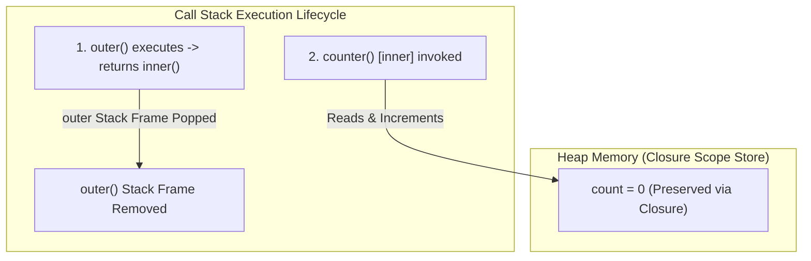
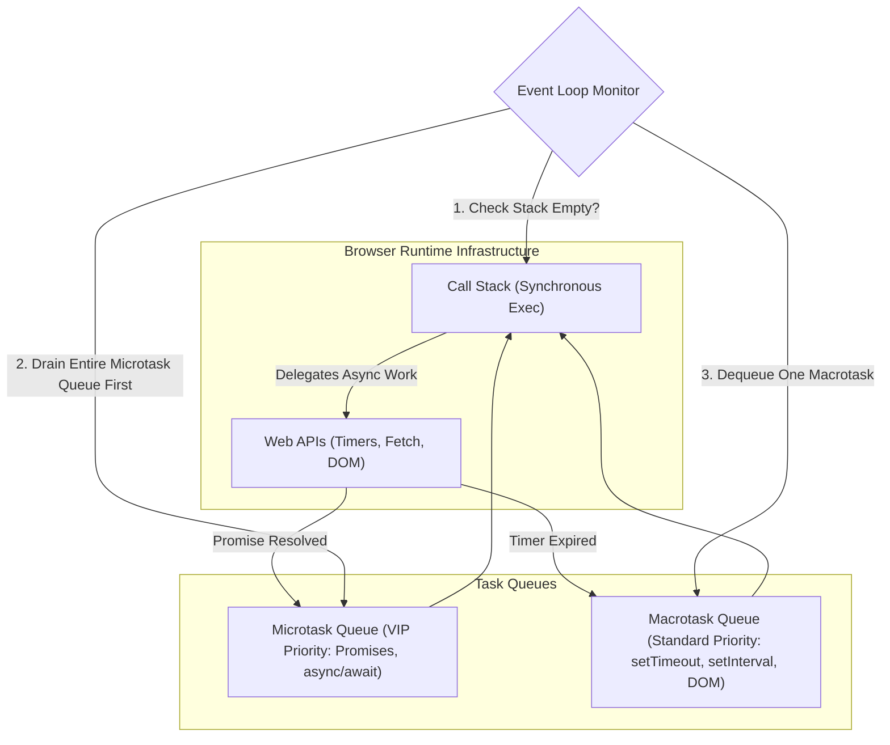

---
id: a7f8b912-3456-4c89-b012-1234567890ab
title: "[ 2026 ] 12+ Hours Complete JS Tutorial for Beginners - Part 07: Currying, Shallow/Deep Copy, Closures, Event Loop & Async/Await"
type: literature-note
status: learning
domain: engineering
source_type: youtube
created: 2026-08-09
updated: 2026-08-19
review: 2026-08-30
confidence: 95
version: 1
aliases:
  - "Complete JS Tutorial 2026 - Part 07"
  - "JavaScript Tutorial Part 07 Master Note"
  - "JS Event Loop Closures and Async Master Guide"
tags:
  - yt
  - engineering
  - advanced
  - tools
  - implementation
owner_moc: Study MOC
sources:
  - "[[01_RAW/SOURCE/2026   12+ Hours Complete JS Tutorial for Beginners.md]]"
  - "https://www.youtube.com/watch?v=h2aHoOO2kxA&t=24s"
related: []
schema_version: 4
---

# [ 2026 ] 12+ Hours Complete JS Tutorial for Beginners — Part 07: Currying, Objects Memory Architecture, Closures, Event Loop & Async/Await

> **Source Link**: [YouTube Video](https://www.youtube.com/watch?v=h2aHoOO2kxA&t=24s)  
> **Original Capture File**: [[01_RAW/CAPTURE/2026   12+ Hours Complete JS Tutorial for Beginners.md]]  
> **Channel / Creator**: [[Not Your College]] (Host: NYC Team, Instructor: Devendra)  
> **Segment Covered**: Part 07 (07:20:16 – End) — Function Currying, Memoization Overview, Advanced Array Iteration (`map`, `forEach`, `filter`), Memory Cloning (Shallow vs Deep Copy), Property Descriptors (`freeze`, `seal`), Lexical Scope & Closures, Data Encapsulation, Timer APIs, Browser Web APIs Engine, Event Loop Architecture (Microtask vs Macrotask Queue), Promises, and Modern `async/await` with `try...catch`.

---

## 1. Executive Summary & Core Mechanics (07:20:16 – End)

Part 07 represents the grand synthesis of JavaScript execution context, memory architecture, functional programming paradigms, and asynchronous browser runtimes. It transitions developers from writing synchronous script logic to orchestrating complex, non-blocking asynchronous applications.

### Key Architectural Pillars Covered:
1. **Functional Currying & Memoization (07:35:42 – 07:37:50)**: Breaking down multi-argument functions into unary sequential function pipelines (`fn(a)(b)(c)`), and establishing state caching patterns.
2. **Array Method Mechanics (`map`, `forEach`, `filter`) (07:38:41 – 07:54:15)**: Immutable array transformations, strict return contract differences between `map` and `forEach`, and array predicate filtering.
3. **Object Memory & Immutability Patterns (08:37:00 – 08:55:19)**: Reference mutation hazards, Shallow Copying (`{ ...obj }`) vs Deep Copying (`JSON.parse(JSON.stringify(obj))`), Property Descriptors, `Object.freeze()`, and `Object.seal()`.
4. **Lexical Scope, Closures & Encapsulation (09:33:45 – 09:52:08)**: How inner functions retain parent stack frame variable bindings post-execution, building private class state (`bank()`), and diagnosing classic async `for` loop `var` vs `let` scope leaks.
5. **Browser Runtime Engine & Web APIs (10:46:59 – 10:58:49)**: How single-threaded JavaScript interfaces with Browser Web APIs (`setTimeout`, DOM, `fetch`) to execute concurrent I/O.
6. **The Event Loop & Dual-Queue Priority System (10:59:57 – 11:06:53)**: Call Stack vs Microtask Queue (Promises, `async/await`) vs Macrotask Queue (`setTimeout`, DOM events), governed by the Event Loop monitor.
7. **Promises & Modern `async/await` Error Handling (11:26:34 – End)**: Synchronous Promise creation vs asynchronous Promise Handlers (`.then()`, `.catch()`), ES6 `async/await` syntax, and bulletproof `try...catch` error boundaries.

---

## 2. Chronological & Deep Technical Breakdown

### 2.1 Function Currying & Partial Application Pipelines (07:35:42 – 07:37:50)

#### 1. Theoretical Definition & Signature Transformation
- **Currying** is a functional transformation that converts a function of arity $N$ into $N$ nested functions of arity $1$.
- Standard Function: $f(a, b, c) \rightarrow R$
- Curried Function: $f(a)(b)(c) \rightarrow R$

#### 2. Sequential Execution Trace: E-Commerce Meal Builder
Instead of requiring all configuration options simultaneously (`orderMeal("Burger", "Fries", "Drink", "Extra")`), currying allows step-by-step partial evaluation across separate execution contexts:

```javascript
// Timestamps: 07:35:42 - 07:36:32
// Unary Nested Curried Function Implementation
const mealOrder = (burger) => (fries) => (drink) => (extra) => {
  return {
    burger: burger,
    fries: fries,
    drink: drink,
    extra: extra,
    status: "Order Confirmed"
  };
};

// Sequential Evaluation across separate steps:
const step1 = mealOrder("Single Patty Burger"); // Returns fries selector function
const step2 = step1("Peri Peri Fries");         // Returns drink selector function
const step3 = step2("Sprite");                  // Returns extra selector function
const finalReceipt = step3("Extra Cheese");     // Evaluates & returns final object

console.log(finalReceipt);
/*
Output:
{
  burger: 'Single Patty Burger',
  fries: 'Peri Peri Fries',
  drink: 'Sprite',
  extra: 'Extra Cheese',
  status: 'Order Confirmed'
}
*/

// Immediate Chained Invocation Signature:
const instantOrder = mealOrder("Double Cheese Burger")("Curly Fries")("Coke")("Bacon");
console.log(instantOrder);
```

#### 3. Memoization Concept Primer (07:36:48 – 07:37:50)
- **Memoization** is an optimization technique that caches the return values of expensive, deterministic pure function calls based on input parameters.
- If $f(x)$ is invoked repeatedly with identical argument $x$, the pre-calculated cached response is returned immediately without recalculation:

```javascript
// High-level Memoization Wrapper Pattern
const memoize = (fn) => {
  const cache = {};
  return (...args) => {
    const key = JSON.stringify(args);
    if (key in cache) {
      console.log(`[CACHE HIT] Returning cached result for key: ${key}`);
      return cache[key];
    } else {
      console.log(`[CACHE MISS] Computing result for key: ${key}`);
      const result = fn(...args);
      cache[key] = result;
      return result;
    }
  };
};

const expensiveAddition = (a, b) => a + b;
const memoizedAdd = memoize(expensiveAddition);

memoizedAdd(50, 50); // [CACHE MISS] Computing -> 100
memoizedAdd(50, 50); // [CACHE HIT] Returning cached result -> 100
```

---

### 2.2 Advanced Array Iteration Methods (`map`, `forEach`, `filter`) (07:38:41 – 07:54:15)

#### 1. `Array.prototype.map` Mechanics
- **Contract**: Iterates over every element of an array, executes a callback, and **returns a brand new array** of identical length containing the returned transformation results.
- **Immutability Guarantee**: The original input array is never mutated.

```javascript
// Timestamps: 07:38:41 - 07:45:06
const names = ["Ayush", "Piyush", "Akash", "Priyal", "Chintu", "Rahul", "Piyush"];

// 1. Basic Mapping: Transforming elements
const uppercaseNames = names.map((val, index) => {
  return `${index + 1}. ${val.toUpperCase()}`;
});
console.log(uppercaseNames);
// Returns: ['1. AYUSH', '2. PIYUSH', '3. AKASH', '4. PRIYAL', '5. CHINTU', '6. RAHUL', '7. PIYUSH']

// 2. Conditional Mapping using Ternary Operator
const targetedReplacement = names.map((val) => {
  return val === "Piyush" ? "MATCHED_PIYUSH" : val;
});
console.log(targetedReplacement);
// Returns: ['Ayush', 'MATCHED_PIYUSH', 'Akash', 'Priyal', 'Chintu', 'Rahul', 'MATCHED_PIYUSH']

// 3. Length Immutability Rule: Length of mapped array ALWAYS equals original length
const booleanMap = names.map((val) => val === "Piyush");
console.log(booleanMap);
// Returns: [false, true, false, false, false, false, true] (Length: 7)
```

#### 2. `Array.prototype.forEach` vs `Array.prototype.map` Diagnostic Comparison
- `map` returns a constructed array containing returned values from the callback.
- `forEach` **always returns `undefined`**, regardless of explicit `return` statements inside its callback. Use `forEach` strictly for side-effects (e.g., logging, DOM mutations).

```javascript
// Timestamps: 07:45:19 - 07:47:04
const arr = [10, 20, 30];

const mapResult = arr.map((num) => num * 2);
const forEachResult = arr.forEach((num) => num * 2);

console.log("mapResult:", mapResult);       // Output: [20, 40, 60]
console.log("forEachResult:", forEachResult); // Output: undefined
```

#### 3. `Array.prototype.filter` Predicate Mechanics
- **Contract**: Evaluates a truthy/falsy predicate callback for every element. Returns a new array containing **only elements where the predicate evaluated to `true`**.
- **Length Reduction**: Output array length can be smaller than or equal to the original array length.

```javascript
// Timestamps: 07:48:17 - 07:54:15
const numbers = [2, 4, 6, 4, 8, 0, 5, 6, 5];

// Predicate: Exclude number 2 (Length reduces from 9 to 7)
const filteredOutTwos = numbers.filter((val) => val !== 2);
console.log(filteredOutTwos); // Output: [4, 6, 4, 8, 0, 5, 6, 5]

// Predicate: Extract only number 5
const onlyFives = numbers.filter((val) => val === 5);
console.log(onlyFives); // Output: [5, 5]

// Predicate based on Index argument: Filter element at index 2
const indexFiltered = numbers.filter((val, index) => index === 2);
console.log(indexFiltered); // Output: [6]
```

---

### 2.3 Object Memory Architecture, Shallow vs Deep Copy, & Property Descriptors (08:37:00 – 08:55:19)

#### 1. Object Reference Mutation Bug (08:39:46 – 08:40:42)
When an object variable is assigned directly to another (`let p2 = p1`), both variables copy and share the **same stack memory pointer to the underlying heap object**. Mutating `p2` mutates `p1`.

#### 2. Shallow Copy (`{ ...obj }`) Limitations (08:40:42 – 08:45:31)
The ES6 Spread operator (`{ ...obj }`) creates a new top-level object memory reference. However, **nested objects/arrays inside it still share reference pointers** to the original memory address!

#### 3. Deep Copy (`JSON.parse(JSON.stringify(obj))`) (08:45:31 – 08:48:33)
Serializing an object into a JSON string and parsing it back breaks all memory references, producing a completely isolated heap clone at all nesting levels:

```javascript
// Timestamps: 08:37:52 - 08:48:33
const product = {
  name: "Chair",
  color: "Red",
  material: "Fiber",
  price: 450,
  category: {
    seating: 2,
    maxWeightKg: 400
  }
};

// --- SHALLOW COPY FAIL DEMO ---
const shallowProduct = { ...product };
shallowProduct.price = 680;                    // Top-level property mutation (ISOLATED)
shallowProduct.category.seating = 1;          // Nested property mutation (LEAKS TO ORIGINAL!)

console.log("Original Product Seating (Corrupted):", product.category.seating); // Output: 1 (Bug!)

// --- DEEP COPY SOLUTION ---
// Reset original seating
product.category.seating = 2;

// Deep Clone via JSON Serialization
const deepProduct = JSON.parse(JSON.stringify(product));
deepProduct.price = 680;
deepProduct.category.seating = 1; // Mutates nested object safely in isolated memory

console.log("Original Product Seating (Protected):", product.category.seating); // Output: 2
console.log("Deep Copy Product Seating (Isolated):", deepProduct.category.seating); // Output: 1
```

#### 4. Object Immutability Guards: `Object.freeze()` vs `Object.seal()` (08:49:20 – 08:53:16)

```javascript
// Timestamps: 08:49:20 - 08:53:16
const user = { name: "Devendra", role: "Instructor" };

// 1. Object.freeze(): Full Lockout (No Additions, No Updates, No Deletions)
Object.freeze(user);
user.name = "Rahul";    // Silently ignored (or throws Error in Strict Mode)
user.age = 25;          // Silently ignored
delete user.role;       // Silently ignored
console.log("Frozen Object:", user); // Output: { name: 'Devendra', role: 'Instructor' }

// 2. Object.seal(): Mutation Only (Updates Allowed; No Additions, No Deletions)
const item = { title: "Laptop", price: 50000 };
Object.seal(item);
item.price = 45000;     // ALLOWED (Update succeeds)
item.brand = "Dell";    // BLOCKED (Addition ignored)
delete item.title;      // BLOCKED (Deletion ignored)
console.log("Sealed Object:", item); // Output: { title: 'Laptop', price: 45000 }
```

#### 5. Property Descriptors (`Object.getOwnPropertyDescriptor`) (08:53:38 – 08:55:19)
Every object key holds an internal descriptor configuration dictating browser reflection behavior:

```javascript
// Timestamps: 08:53:38 - 08:55:19
const car = { brand: "Toyota" };
const descriptor = Object.getOwnPropertyDescriptor(car, "brand");

console.log(descriptor);
/*
Output:
{
  value: 'Toyota',
  writable: true,      // Can value be updated?
  enumerable: true,    // Does key appear in for...in / Object.keys()?
  configurable: true   // Can property descriptor be modified or deleted?
}
*/
```

---

### 2.4 Lexical Scope, Closures & Encapsulation Architecture (09:33:45 – 09:52:08)

#### 1. Formal Definition of Closure (09:33:45 – 09:39:03)
A **Closure** is created when an inner function is defined within an outer function, bundling together the inner function reference along with its surrounding **Lexical Environment**. 

Even after the outer function finishes execution and its Global Execution Context stack frame is popped off the Call Stack, the inner function preserves persistent access to the outer function's variable bindings!



```javascript
// Timestamps: 09:33:45 - 09:38:37
function outer() {
  let count = 0; // Lexical parent variable
  
  return function inner() {
    count++; // Accesses parent lexical scope binding
    console.log(`Current Count: ${count}`);
  };
}

const counter = outer(); // outer() executes and pops off Call Stack
counter(); // Current Count: 1
counter(); // Current Count: 2
counter(); // Current Count: 3
```

#### 2. Encapsulation & Data Privacy Module Pattern (09:39:26 – 09:45:31)
Using closures to engineer private variables that cannot be inspected, accessed, or tampered with from the outer global scope:

```javascript
// Timestamps: 09:39:26 - 09:45:31
function createBankAccount(initialBalance) {
  let balance = initialBalance; // Private Encapsulated Variable

  return {
    deposit: function (amount) {
      if (amount > 0) {
        balance += amount;
        console.log(`Deposited: ₹${amount}`);
      }
    },
    withdraw: function (amount) {
      if (amount <= balance) {
        balance -= amount;
        console.log(`Withdrew: ₹${amount}`);
      } else {
        console.log("Insufficient funds!");
      }
    },
    getBalance: function () {
      return balance;
    }
  };
}

const myAccount = createBankAccount(1000);

myAccount.deposit(500);                        // Deposited: ₹500
myAccount.withdraw(1000);                       // Withdrew: ₹1000
console.log("Balance:", myAccount.getBalance()); // Output: 500

// Direct access verification:
console.log("Direct Balance Access:", myAccount.balance); // Output: undefined (PROTECTED!)
```

#### 3. Closure Pitfalls: The Classic `var` vs `let` Async Loop Leak Bug (09:46:15 – 09:52:08)

```javascript
// Timestamps: 09:46:39 - 09:52:08

// --- THE BUG: Function-Scoped `var` ---
for (var i = 0; i < 5; i++) {
  setTimeout(() => {
    console.log(`var loop i: ${i}`);
  }, 1000);
}
// Output after 1 second:
// var loop i: 5
// var loop i: 5
// var loop i: 5
// var loop i: 5
// var loop i: 5
// Diagnostic: 'var' is globally/functionally scoped. By the time the 1000ms timer callback executes, 
// the synchronous loop has already completed and mutated 'i' to 5 in global memory.

// --- THE FIX: Block-Scoped `let` ---
for (let j = 0; j < 5; j++) {
  setTimeout(() => {
    console.log(`let loop j: ${j}`);
  }, 1000);
}
// Output after 1 second:
// let loop j: 0
// let loop j: 1
// let loop j: 2
// let loop j: 3
// let loop j: 4
// Diagnostic: 'let' creates a new block-scoped lexical binding for 'j' on EVERY single loop iteration.
```

---

### 2.5 Asynchronous Runtimes, Browser Web APIs, & Event Loop Priority (10:46:59 – 11:06:53)

#### 1. Invariant Priority Rule of JavaScript
**Synchronous code execution ALWAYS takes precedence over ANY asynchronous callback execution.**
Even if an asynchronous timer is scheduled with a delay of `0ms` (`setTimeout(..., 0)`), it must wait until the main Call Stack is completely empty of synchronous code frames.

```javascript
// Timestamps: 10:50:20 - 10:53:50
console.log("1. Synchronous Start");

setTimeout(() => {
  console.log("2. Async Timeout Callback (0ms delay)");
}, 0);

console.log("3. Synchronous End");

/*
Execution Output Sequence:
1. Synchronous Start
3. Synchronous End
2. Async Timeout Callback (0ms delay)
*/
```

#### 2. Architecture of Browser Runtime vs Core JS Engine (10:54:37 – 10:58:20)
Core JavaScript (V8 / SpiderMonkey) is strictly **single-threaded and synchronous**. Asynchronous features are provided by the surrounding **Browser Environment**:

| Component | Responsibility | Examples |
|---|---|---|
| **JS Engine (V8)** | Call Stack execution & Heap memory management | Variables, functions, GEC |
| **Web APIs** | Concurrent background execution outside JS thread | `setTimeout`, `fetch()`, DOM Events |
| **Task Queues** | Staging queues holding callbacks ready for Call Stack | Microtask Queue, Macrotask Queue |
| **Event Loop** | Orchestrates moving queued callbacks onto empty Call Stack | Event Loop Monitor |

#### 3. The Dual Queue System: Microtask Queue vs Macrotask Queue (11:01:13 – 11:06:53)



#### Priority Tier Classification:
1. **Tier 1 (VIP / Immediate)**: Call Stack synchronous execution lines.
2. **Tier 2 (High Priority - Microtask Queue)**: `Promise` resolve/reject handlers (`.then()`, `.catch()`, `.finally()`), `async/await` resume microtasks, `queueMicrotask()`.
3. **Tier 3 (Standard Priority - Macrotask Queue)**: `setTimeout`, `setInterval`, `setImmediate`, I/O tasks, DOM event handlers.

---

### 2.6 Promises, Promise Handlers, & Modern `async/await` (11:26:34 – End)

#### 1. Understanding `Promise` Objects (11:26:34 – 11:32:25)
- A `Promise` is a core JavaScript class representing the eventual completion or failure of an asynchronous operation.
- **Synchronous Constructor Warning**: The executor function passed into `new Promise((resolve, reject) => { ... })` **executes synchronously immediately upon creation**!
- States: `pending` $\rightarrow$ `fulfilled` (via `resolve(data)`) OR `rejected` (via `reject(error)`).

```javascript
// Timestamps: 11:26:34 - 11:32:25
const toggle = true;

// Promise Object Creation
const partyPromise = new Promise((resolve, reject) => {
  console.log("Promise Executor Function Running Synchronously...");
  if (toggle) {
    resolve("Party will happen with full enthusiasm!");
  } else {
    reject("Party cancelled: Insufficient funds!");
  }
});
```

#### 2. ES5 Promise Handlers: `.then()` & `.catch()` (11:32:53 – 11:36:52)
- `.then(callback)` executes when the promise resolves to `fulfilled` state.
- `.catch(callback)` executes when the promise resolves to `rejected` state or throws an uncaught error.

```javascript
// Timestamps: 11:32:53 - 11:36:52
partyPromise
  .then((data) => {
    console.log("[RESOLVE HANDLER]:", data);
  })
  .catch((err) => {
    console.error("[CATCH HANDLER]:", err);
  });
```

#### 3. ES6 Modern `async/await` & `try...catch` Error Boundaries (11:38:40 – End)
- `async` keyword: Decorates a function, turning its return value into a resolved Promise and enabling the use of `await` inside it.
- `await` keyword: Pauses execution of the `async` function until the targeted Promise settles, unwrapping its resolved payload.
- `try...catch` block: Mandated error boundary replacing `.catch()` for catching rejected Promises in `async/await` syntax.

```javascript
// Timestamps: 11:38:40 - 11:45:38
const checkPartyStatus = () => {
  return new Promise((resolve, reject) => {
    const hasMoney = true;
    setTimeout(() => {
      if (hasMoney) {
        resolve("Party confirmed! Music and food ready.");
      } else {
        reject("Error: Out of budget for party.");
      }
    }, 1500);
  });
};

// Modern Async/Await Handler Implementation
async function handlePartyFlow() {
  console.log("Initiating party coordination...");
  try {
    // Execution pauses here asynchronously until checkPartyStatus resolves
    const response = await checkPartyStatus();
    console.log("[SUCCESS]:", response);
  } catch (error) {
    // Catches any rejected Promise or runtime error seamlessly
    console.error("[FAILED]:", error);
  } finally {
    console.log("Party planning process complete.");
  }
}

handlePartyFlow();
```

---

## 3. Comparative Technical Reference Tables

### Table 1: Shallow Copy vs Deep Copy in JavaScript Objects (08:40:42 – 08:48:33)

| Feature | Reference Assignment (`b = a`) | Shallow Copy (`{ ...a }`) | Deep Copy (`JSON.parse(JSON.stringify(a))`) |
|---|---|---|---|
| **Top-Level Property Memory** | Shared Pointer | Independent Memory | Independent Memory |
| **Nested Object Memory** | Shared Pointer | **Shared Pointer (Leak Risk)** | Independent Memory |
| **Performance Overhead** | $O(1)$ Zero Cost | Very Low ($O(N)$ top-level) | Higher ($O(N)$ full traversal) |
| **Functions & Symbols Handling** | Retained | Retained | Stripped / Omitted by JSON |

---

### Table 2: JavaScript Immutability Methods (`freeze` vs `seal`) (08:49:20 – 08:53:16)

| Action / Capability | `Object.freeze(obj)` | `Object.seal(obj)` | Normal Object |
|---|---|---|---|
| **Read Properties** | Allowed | Allowed | Allowed |
| **Update Existing Properties** | **BLOCKED** | **ALLOWED** | Allowed |
| **Add New Properties** | **BLOCKED** | **BLOCKED** | Allowed |
| **Delete Existing Properties** | **BLOCKED** | **BLOCKED** | Allowed |
| **Modify Descriptors** | **BLOCKED** | **BLOCKED** | Allowed |

---

### Table 3: Task Queue Priority Matrix in Browser Event Loop (11:01:13 – 11:06:53)

| Task Tier | Queue Name | Examples / APIs | Event Loop Execution Rule |
|---|---|---|---|
| **Tier 1 (VIP)** | Call Stack | Synchronous functions, loops, initial `new Promise()` executor | Executed immediately line-by-line |
| **Tier 2 (High)** | Microtask Queue | Promise `.then()`, `.catch()`, `await` resumes, `queueMicrotask()` | **Drained COMPLETELY** before any Macrotask |
| **Tier 3 (Standard)** | Macrotask Queue | `setTimeout`, `setInterval`, `requestAnimationFrame`, DOM Events | Executed **one task at a time** per Event Loop tick |

---

## 4. Key Takeaways & Verbatim Quotes

### Notable Instructor Quotes (Devendra)
1. **On Synchronous Code Precedence (10:52:51)**:
   > *"No matter what, no matter how fast an async operation is scheduled—even with a delay of zero milliseconds—synchronous code will ALWAYS execute first."* (10:52:51) — *Devendra*
2. **On Browser Web APIs (10:55:41)**:
   > *"JavaScript by itself is single-threaded and synchronous. It survives in modern web development because the browser provides Web APIs like timers, DOM, fetch, and the Event Loop to handle non-blocking execution."* (10:55:41) — *Devendra*
3. **On Microtasks vs Macrotasks (11:06:14)**:
   > *"Think of synchronous code as VIPs, Microtasks (Promises) as Middle Class with priority access, and Macrotasks (Timers) as standard queue items. The Event Loop empties all Microtasks before serving the next Macrotask."* (11:06:14) — *Devendra*

---

## 5. Comprehensive Technical Glossary

- **Function Currying**: The technique of translating the evaluation of a function that takes multiple arguments into evaluating a sequence of functions, each with a single argument.
- **Memoization**: An optimization technique used primarily to speed up computer programs by storing the results of expensive function calls and returning the cached result when the same inputs occur again.
- **Shallow Copy**: A bitwise copy of an object where top-level primitive values are copied, but references to nested objects are shared between source and copy.
- **Deep Copy**: A recursive copy of an object where all nested objects, arrays, and sub-properties are cloned into completely distinct memory locations.
- **Closure**: The combination of a function bundled together (enclosed) with references to its surrounding state (the lexical environment).
- **Lexical Environment**: The structure that holds local variables and references to outer environments during code execution.
- **Event Loop**: A constantly running process in the browser runtime that monitors the Call Stack and Task Queues, pushing callbacks onto the stack when it becomes empty.
- **Microtask Queue**: A high-priority queue dedicated to handling promise callbacks and microtasks before rendering or processing macrotasks.
- **Promise**: An object representing the eventual completion or failure of an asynchronous operation and its resulting value.
- **Async/Await**: Syntactic sugar built on top of promises, enabling asynchronous, non-blocking code to be written with a synchronous appearance using `try...catch` error handling.

---

